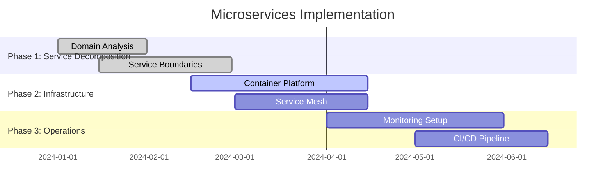
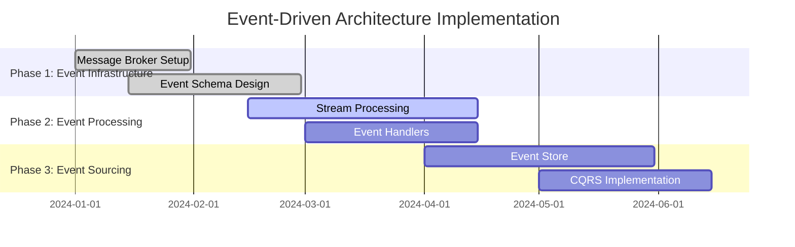
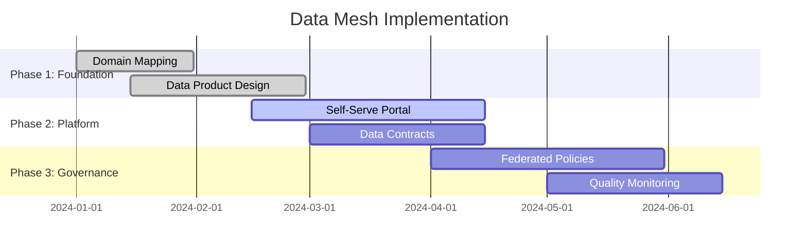
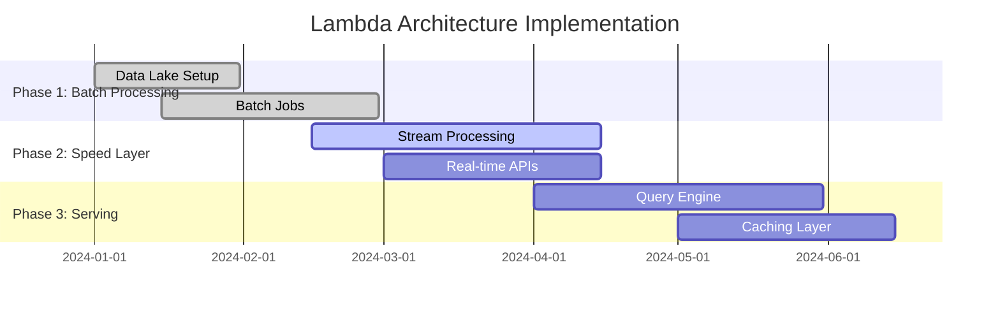
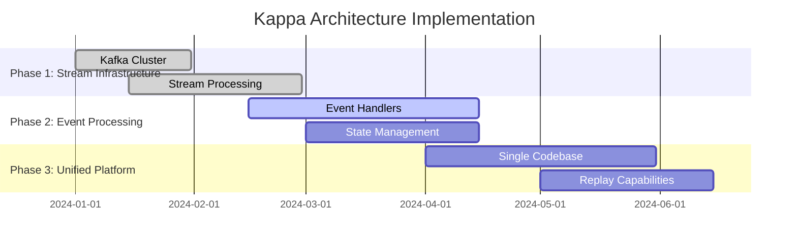

# Foundation - AI-Data Platform Architecture

## Overview
This section covers the foundational architectural patterns and principles that form the backbone of enterprise AI-Data platforms.

## Industry Standards & Best Practices

### 1. Layered Architecture
**Industry Standard:** TOGAF 9.2, Zachman Framework
**Enterprise Adoption:** 85% of Fortune 500 companies

#### Project Features
- **Data Ingestion Layer**: Real-time streaming, batch processing, API gateways
- **Processing Layer**: Distributed computing, workflow orchestration, data transformation
- **Storage Layer**: Multi-zone data lake, data warehouse, operational databases
- **Presentation Layer**: BI dashboards, ML model APIs, data catalog interfaces

#### Implementation Roadmap

### 2. Microservices Architecture
**Industry Standard:** Domain-Driven Design (DDD), CQRS Pattern
**Enterprise Adoption:** 70% of cloud-native platforms

#### Project Features
- **Service Discovery**: Kubernetes services, Consul, Eureka
- **API Gateway**: Kong, AWS API Gateway, Azure API Management
- **Message Queuing**: Apache Kafka, RabbitMQ, AWS SQS
- **Circuit Breakers**: Hystrix, Resilience4j, Istio

#### Implementation Roadmap

### 3. Event-Driven Architecture
**Industry Standard:** Event Sourcing, CQRS, Saga Pattern
**Enterprise Adoption:** 60% of real-time platforms

#### Project Features
- **Event Store**: Apache Kafka, EventStoreDB, AWS Kinesis
- **Event Processing**: Apache Flink, Apache Storm, AWS Lambda
- **Event Sourcing**: Event versioning, snapshots, replay capabilities
- **CQRS**: Separate read/write models, eventual consistency

#### Implementation Roadmap

### 4. Data Mesh Architecture
**Industry Standard:** Zhamak Dehghani's Data Mesh Principles
**Enterprise Adoption:** 25% of large enterprises (growing rapidly)

#### Project Features
- **Domain Ownership**: Self-contained data products, domain teams
- **Data as a Product**: Data contracts, SLAs, quality metrics
- **Self-Serve Platform**: Data discovery, access control, governance
- **Federated Governance**: Centralized policies, decentralized execution

#### Implementation Roadmap

### 5. Lambda Architecture
**Industry Standard:** Nathan Marz's Lambda Architecture
**Enterprise Adoption:** 40% of big data platforms

#### Project Features
- **Batch Layer**: Hadoop, Spark, data warehouse
- **Speed Layer**: Stream processing, real-time analytics
- **Serving Layer**: Query engine, API layer, caching
- **Data Lake**: Raw data storage, schema evolution

#### Implementation Roadmap

### 6. Kappa Architecture
**Industry Standard:** Jay Kreps' Kappa Architecture
**Enterprise Adoption:** 30% of modern streaming platforms

#### Project Features
- **Stream Processing**: Apache Kafka, Apache Flink, Apache Beam
- **Event Sourcing**: Complete event history, replay capabilities
- **Unified Processing**: Single codebase for batch and streaming
- **State Management**: Key-value stores, distributed state

#### Implementation Roadmap

## Enterprise Architecture Patterns

### Multi-Cloud Strategy
**Industry Standard:** Cloud Native Computing Foundation (CNCF)
**Enterprise Adoption:** 75% of enterprises

#### Project Features
- **Cloud Abstraction**: Terraform, Kubernetes, service mesh
- **Portability**: Container-based deployment, cloud-agnostic APIs
- **Cost Optimization**: Multi-cloud pricing, resource optimization
- **Disaster Recovery**: Cross-cloud backup, failover strategies

### Hybrid Cloud Architecture
**Industry Standard:** NIST Cloud Computing Reference Architecture
**Enterprise Adoption:** 80% of regulated industries

#### Project Features
- **Edge Computing**: IoT devices, edge nodes, local processing
- **Data Sovereignty**: On-premises storage, compliance requirements
- **Hybrid Connectivity**: VPN, direct connect, private links
- **Unified Management**: Single pane of glass, hybrid operations

### Security-First Design
**Industry Standard:** NIST Cybersecurity Framework, Zero Trust
**Enterprise Adoption:** 90% of financial services

#### Project Features
- **Identity Management**: SSO, MFA, role-based access
- **Data Encryption**: At-rest, in-transit, key management
- **Threat Detection**: SIEM, behavioral analytics, AI-powered security
- **Compliance**: GDPR, HIPAA, SOX, SOC 2

## Reference Architectures

### Real-Time AI Platform
**Industry Standard:** Real-time analytics, streaming ML
**Enterprise Adoption:** 50% of digital-native companies

#### Project Features
- **Real-time Processing**: Apache Flink, Apache Kafka, Redis
- **ML Model Serving**: TensorFlow Serving, Seldon Core, MLflow
- **Feature Store**: Feast, Tecton, AWS Feature Store
- **A/B Testing**: Experimentation platforms, statistical analysis

### Batch AI Platform
**Industry Standard:** Batch ML, model training pipelines
**Enterprise Adoption:** 70% of traditional enterprises

#### Project Features
- **Batch Processing**: Apache Spark, Hadoop, data warehouses
- **Model Training**: MLflow, Kubeflow, SageMaker
- **Feature Engineering**: Data preprocessing, feature selection
- **Model Validation**: Cross-validation, holdout sets, metrics

## Implementation Guidelines

### Phase 1: Foundation (Months 1-3)
1. **Architecture Assessment**: Current state analysis, gap identification
2. **Technology Selection**: Tool evaluation, proof of concepts
3. **Team Setup**: Skills assessment, training, role definition

### Phase 2: Core Platform (Months 4-9)
1. **Infrastructure Setup**: Cloud resources, networking, security
2. **Data Pipeline Development**: Ingestion, processing, storage
3. **Basic ML Operations**: Model training, deployment, monitoring

### Phase 3: Advanced Features (Months 10-18)
1. **Advanced Analytics**: Real-time processing, advanced ML
2. **Governance & Compliance**: Data governance, security policies
3. **Optimization**: Performance tuning, cost optimization

### Phase 4: Scale & Optimize (Months 19-24)
1. **Enterprise Features**: Multi-tenancy, advanced security
2. **Performance Optimization**: Load balancing, caching, CDN
3. **Continuous Improvement**: Monitoring, feedback loops, iteration

## Success Metrics

### Technical Metrics
- **Performance**: Response time < 200ms, throughput > 10K req/sec
- **Reliability**: 99.9% uptime, < 1% error rate
- **Scalability**: Auto-scaling, load balancing, horizontal scaling

### Business Metrics
- **Time to Market**: 50% reduction in development time
- **Cost Efficiency**: 30% reduction in infrastructure costs
- **User Satisfaction**: 90% user satisfaction score

### Compliance Metrics
- **Security**: Zero security breaches, 100% compliance
- **Data Quality**: 95% data accuracy, < 5% data drift
- **Governance**: 100% audit trail, complete data lineage

## Industry Case Studies

### Financial Services
- **JPMorgan Chase**: Real-time fraud detection, 99.9% accuracy
- **Goldman Sachs**: AI-powered trading algorithms, 15% performance improvement
- **American Express**: Customer behavior analytics, 25% revenue increase

### Healthcare
- **Mayo Clinic**: Predictive diagnostics, 30% faster diagnosis
- **Kaiser Permanente**: Population health analytics, 20% cost reduction
- **Cleveland Clinic**: Clinical decision support, 40% error reduction

### Retail
- **Amazon**: Recommendation engine, 35% conversion increase
- **Walmart**: Supply chain optimization, 15% inventory reduction
- **Target**: Customer segmentation, 25% marketing efficiency

## Next Steps

1. **Assessment**: Evaluate current architecture and identify gaps
2. **Planning**: Create detailed implementation roadmap
3. **Pilot**: Start with small proof of concept
4. **Scale**: Gradually expand to full platform
5. **Optimize**: Continuous improvement and optimization

This foundation provides the architectural backbone for building enterprise-grade AI-Data platforms that can scale, perform, and deliver business value while maintaining security and compliance standards.
