# Foundation & Architecture

## Overview
This section covers the foundational concepts and architectural patterns essential for building enterprise AI-Data platforms.

## 1. **Architecture Patterns**

### 1. **Layered Architecture**
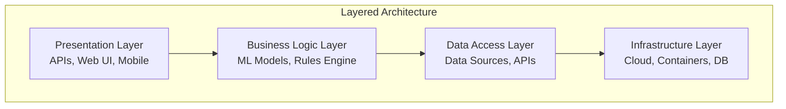

### 2. **Microservices Architecture**
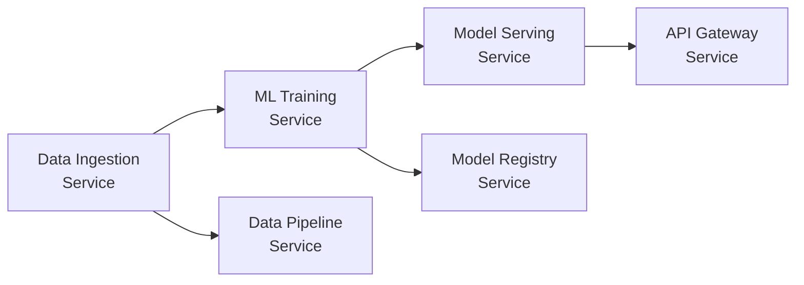

### 3. **Event-Driven Architecture**
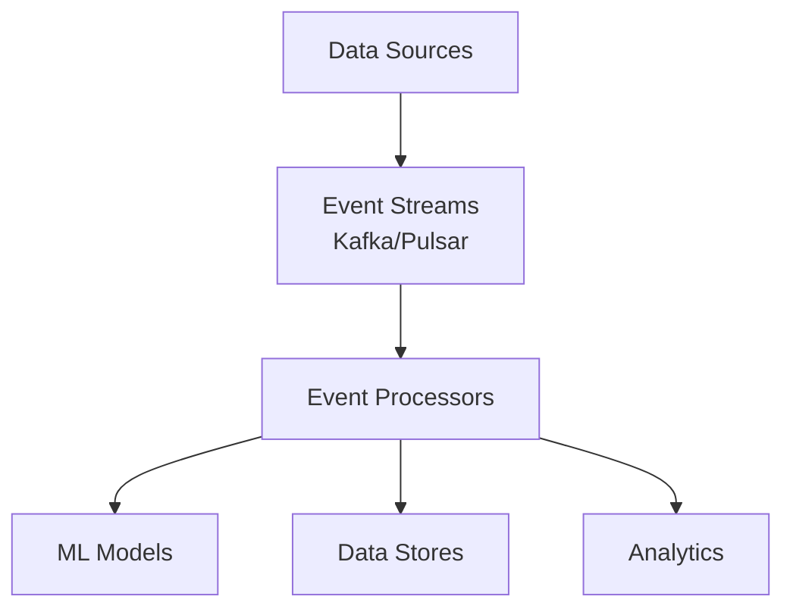

### 4. **Data Mesh Architecture**
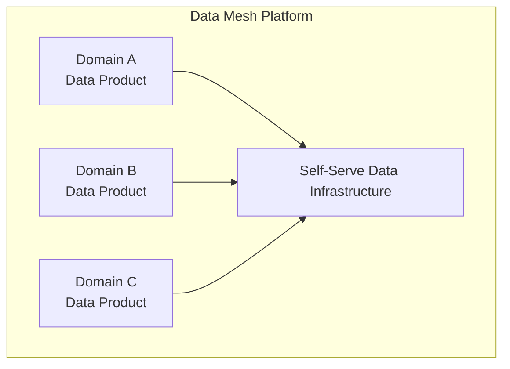

## 2. **Data Platform Design Principles**

### 1. **Data as a Product**
- **Ownership**: Clear data ownership and stewardship
- **Quality**: Data quality standards and monitoring
- **Documentation**: Comprehensive metadata and lineage
- **Access**: Self-service data access patterns

### 2. **Data Lake vs Data Warehouse**
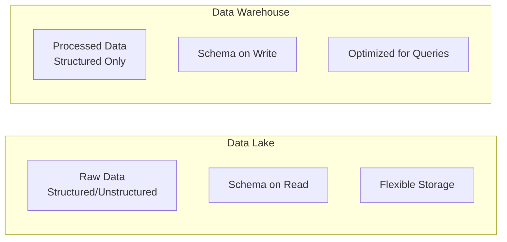

### 3. **ETL vs ELT**
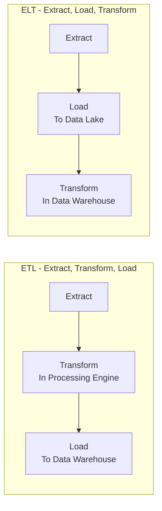

## 3. **Core AI Platform Components**

### 1. **Core Components Architecture**
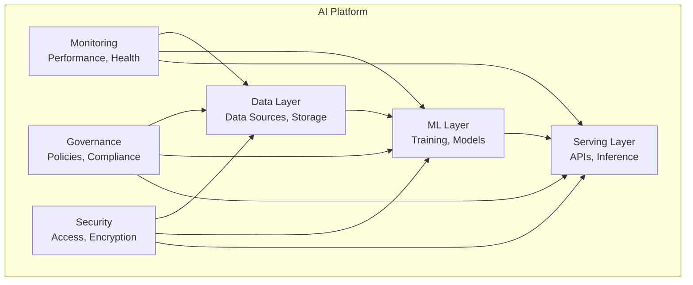

### 2. **AI Platform Layers**
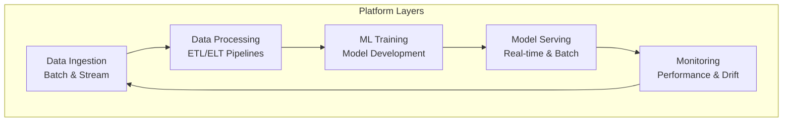

## 4. **Enterprise Architecture Patterns**

### 1. **Multi-Cloud Strategy**
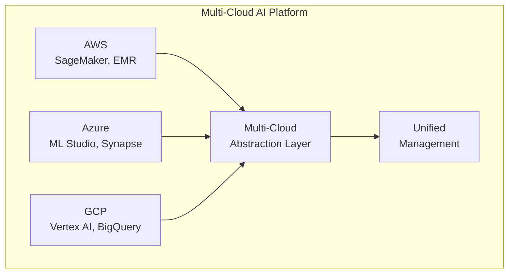

### 2. **Hybrid Cloud Architecture**
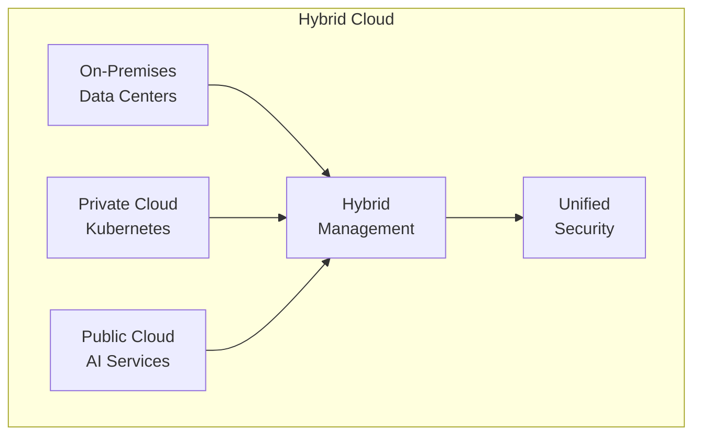

### 3. **Security-First Design**
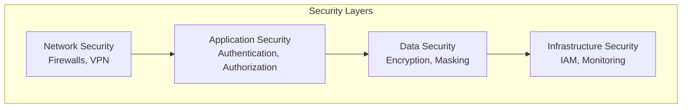

## 5. **Reference Architectures**

### 1. **Real-Time AI Platform**
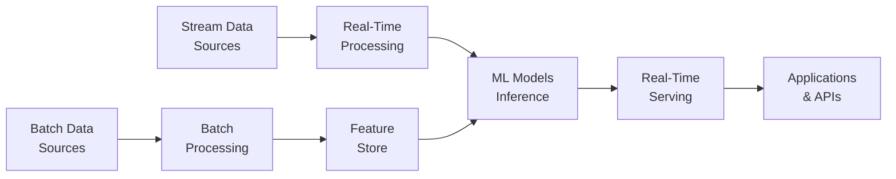

### 2. **Batch AI Platform**
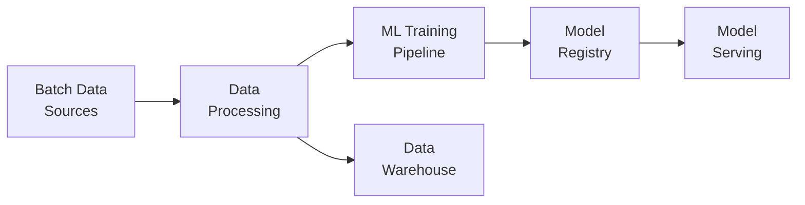

## 6. **Key Design Principles**

### **Scalability**
- **Horizontal Scaling**: Add more instances/nodes
- **Vertical Scaling**: Increase resource capacity
- **Auto-scaling**: Dynamic resource allocation

### **Reliability**
- **Fault Tolerance**: Handle component failures
- **High Availability**: Minimize downtime
- **Data Durability**: Ensure data persistence

### **Security**
- **Defense in Depth**: Multiple security layers
- **Zero Trust**: Verify every request
- **Privacy by Design**: Built-in privacy protection

### **Performance**
- **Latency Optimization**: Minimize response time
- **Throughput Maximization**: Handle high load
- **Resource Efficiency**: Optimal resource usage

## 7. **Architecture Decision Framework**

### **Decision Matrix**
| Factor | Weight | Options | Score |
|--------|--------|---------|-------|
| Scalability | 25% | Horizontal, Vertical, Hybrid | 1-5 |
| Cost | 20% | Low, Medium, High | 1-5 |
| Complexity | 15% | Simple, Moderate, Complex | 1-5 |
| Security | 20% | Basic, Enhanced, Enterprise | 1-5 |
| Maintainability | 20% | Easy, Moderate, Difficult | 1-5 |

### **Selection Criteria**
1. **Business Requirements**: Align with organizational goals
2. **Technical Constraints**: Consider existing infrastructure
3. **Team Expertise**: Match team capabilities
4. **Future Growth**: Plan for scalability
5. **Compliance**: Meet regulatory requirements

## 8. **Next Steps**

### **Implementation Roadmap**
1. **Phase 1**: Foundation setup and basic architecture
2. **Phase 2**: Core components implementation
3. **Phase 3**: Advanced features and optimization
4. **Phase 4**: Production deployment and monitoring

### **Key Considerations**
- **Technology Selection**: Choose appropriate tools and frameworks
- **Team Structure**: Organize teams around capabilities
- **Processes**: Establish development and operational procedures
- **Governance**: Implement data and model governance

---

**Next Section**: [Data Engineering & Management](../02-DataEngineering/README.md)
