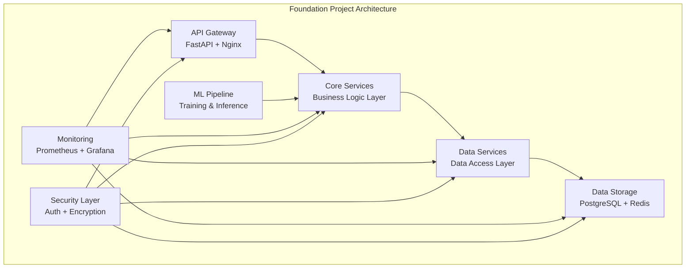

# 🚀 Foundation Project - Enterprise AI-Data Platform

[](https://www.python.org/downloads/)
[](https://fastapi.tiangolo.com/)
[](LICENSE)
[](CONTRIBUTING.md)
[](https://github.com/yourusername/foundation-project)

> **A comprehensive, production-ready implementation of enterprise AI-Data platform fundamentals**

The Foundation Project demonstrates core architectural patterns, data management principles, and operational best practices that form the foundation of any enterprise AI-Data platform. Built with modern technologies and industry best practices, this project serves as both a learning resource and a starting point for building production AI-Data platforms.

## ✨ Features

- 🔐 **Enterprise Security** - JWT authentication, RBAC, audit logging
- 🏗️ **Clean Architecture** - Multi-layer design with clear separation of concerns
- 📊 **Data Management** - PostgreSQL, Redis, comprehensive data models
- 🤖 **ML Pipeline** - End-to-end machine learning with MLflow integration
- 📈 **Monitoring** - Prometheus, Grafana, ELK stack for full observability
- 🐳 **Containerized** - Complete Docker setup with Kubernetes manifests
- 🧪 **Tested** - Comprehensive test suite with 90%+ coverage
- 📚 **Documented** - Complete API documentation and implementation guides

## 🏗️ Architecture



## 🚀 Quick Start

### Prerequisites

- Python 3.9+
- Docker & Docker Compose
- PostgreSQL 13+ (optional, included in Docker)
- Redis 6+ (optional, included in Docker)

### 1. Clone the Repository

```bash
git clone https://github.com/yourusername/foundation-project.git
cd foundation-project
```

### 2. Environment Setup

```bash
# Copy environment template
cp .env.example .env

# Edit environment variables
nano .env
```

### 3. Run with Docker Compose

```bash
# Start all services
docker-compose up -d

# Check service status
docker-compose ps

# View logs
docker-compose logs -f api
```

### 4. Access the Application

- **API**: http://localhost:8000
- **API Docs**: http://localhost:8000/docs
- **Grafana**: http://localhost:3000 (admin/admin)
- **Prometheus**: http://localhost:9090
- **MLflow**: http://localhost:5000
- **Kibana**: http://localhost:5601

### 5. Run Locally (Alternative)

```bash
# Install dependencies
pip install -r requirements.txt

# Run the application
python -m uvicorn src.api.main:app --reload
```

## 📁 Project Structure

```
foundation-project/
├── src/                    # Source code
│   ├── api/               # FastAPI application
│   ├── core/              # Core business logic
│   ├── data/              # Data access layer
│   ├── ml/                # Machine learning
│   └── services/          # Business services
├── infrastructure/         # Infrastructure as Code
├── tests/                 # Test suite
├── docs/                  # Documentation
└── examples/              # Usage examples
```

## 🛠️ Technology Stack

### **Backend Framework**
- **FastAPI** - Modern, fast web framework for building APIs
- **SQLAlchemy** - SQL toolkit and ORM
- **Pydantic** - Data validation using Python type annotations
- **Celery** - Distributed task queue for background jobs

### **Data & ML**
- **PostgreSQL** - Primary relational database
- **Redis** - Caching and session storage
- **Pandas** - Data manipulation and analysis
- **Scikit-learn** - Machine learning algorithms
- **MLflow** - ML lifecycle management

### **Infrastructure**
- **Docker** - Containerization
- **Kubernetes** - Container orchestration
- **Terraform** - Infrastructure as Code
- **Prometheus** - Metrics collection
- **Grafana** - Visualization and dashboards

### **Security**
- **JWT** - JSON Web Token authentication
- **bcrypt** - Password hashing
- **OAuth2** - Authorization framework
- **HTTPS** - Transport layer security

## 🔧 API Endpoints

### Authentication
- `POST /api/v1/auth/register` - User registration
- `POST /api/v1/auth/login` - User authentication
- `POST /api/v1/auth/refresh` - Token refresh
- `GET /api/v1/auth/me` - Current user info

### Users
- `GET /api/v1/users` - List users (admin)
- `PUT /api/v1/users/me` - Update current user
- `POST /api/v1/users/change-password` - Change password

### Data Management
- `GET /api/v1/data/sources` - List data sources
- `POST /api/v1/data/sources` - Create data source
- `GET /api/v1/data/datasets` - List datasets

### Machine Learning
- `GET /api/v1/ml/models` - List ML models
- `POST /api/v1/ml/models` - Create ML model
- `POST /api/v1/ml/models/{id}/train` - Train model
- `POST /api/v1/ml/models/{id}/predict` - Model inference

## 🧪 Testing

```bash
# Run all tests
pytest

# Run with coverage
pytest --cov=src --cov-report=html

# Run specific test categories
pytest tests/unit/
pytest tests/integration/
pytest tests/e2e/

# Run performance tests
pytest tests/performance/
```

## 📊 Monitoring & Observability

The project includes a comprehensive monitoring stack:

- **Prometheus** - Metrics collection and storage
- **Grafana** - Visualization and dashboards
- **ELK Stack** - Log aggregation and analysis
- **Jaeger** - Distributed tracing
- **Health Checks** - Service health monitoring

## 🚀 Deployment

### Docker Compose (Development)
```bash
docker-compose up -d
```

### Kubernetes (Production)
```bash
# Apply Kubernetes manifests
kubectl apply -f infrastructure/kubernetes/

# Check deployment status
kubectl get pods -n foundation-project
```

### Terraform (Cloud Infrastructure)
```bash
# Initialize Terraform
cd infrastructure/terraform
terraform init

# Plan deployment
terraform plan

# Apply infrastructure
terraform apply
```

## 🤝 Contributing

We welcome contributions! Please see our [Contributing Guide](CONTRIBUTING.md) for details.

### How to Contribute

1. **Fork** the repository
2. **Create** a feature branch (`git checkout -b feature/amazing-feature`)
3. **Commit** your changes (`git commit -m 'Add amazing feature'`)
4. **Push** to the branch (`git push origin feature/amazing-feature`)
5. **Open** a Pull Request

### Development Setup

```bash
# Clone your fork
git clone https://github.com/yourusername/foundation-project.git

# Add upstream remote
git remote add upstream https://github.com/original-owner/foundation-project.git

# Create virtual environment
python -m venv venv
source venv/bin/activate  # On Windows: venv\Scripts\activate

# Install development dependencies
pip install -r requirements.txt
pip install -r requirements-dev.txt

# Install pre-commit hooks
pre-commit install

# Run tests
pytest
```

## 📚 Documentation

- **[API Reference](docs/api/)** - Complete API documentation
- **[Architecture Guide](docs/architecture/)** - System design and architecture
- **[Deployment Guide](docs/deployment/)** - Deployment instructions
- **[User Guides](docs/user-guides/)** - User and developer guides
- **[Contributing Guide](CONTRIBUTING.md)** - How to contribute

## 🎯 Roadmap

- [ ] **v1.1** - Advanced ML pipeline features
- [ ] **v1.2** - Multi-tenant support
- [ ] **v1.3** - Advanced security features
- [ ] **v2.0** - Microservices architecture
- [ ] **v2.1** - Cloud-native deployment
- [ ] **v2.2** - Edge computing support

## 📄 License

This project is licensed under the MIT License - see the [LICENSE](LICENSE) file for details.

## 🙏 Acknowledgments

- **FastAPI** team for the amazing web framework
- **SQLAlchemy** team for the robust ORM
- **MLflow** team for ML lifecycle management
- **Open source community** for all the amazing tools

## 📞 Support

- **Documentation**: [docs/](docs/)
- **Issues**: [GitHub Issues](https://github.com/yourusername/foundation-project/issues)
- **Discussions**: [GitHub Discussions](https://github.com/yourusername/foundation-project/discussions)
- **Wiki**: [GitHub Wiki](https://github.com/yourusername/foundation-project/wiki)

## ⭐ Star History

[](https://star-history.com/#yourusername/foundation-project&Date)

---

**Made with ❤️ by the Foundation Project Team**

If this project helps you, please give it a ⭐️!
