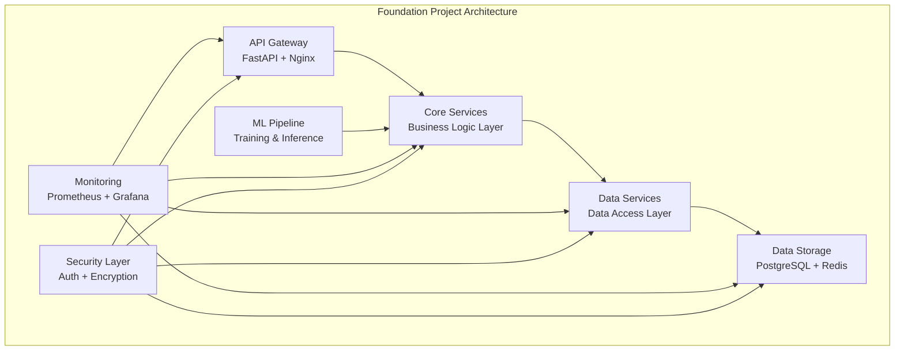

# Foundation Project - Enterprise AI-Data Platform

## 🚀 Project Overview

The Foundation Project is a comprehensive, production-ready implementation of enterprise AI-Data platform fundamentals. This project demonstrates core architectural patterns, data management principles, and operational best practices that form the foundation of any enterprise AI-Data platform.

## 🎯 Project Goals

- **Demonstrate** enterprise-grade architecture patterns
- **Implement** scalable data management solutions
- **Showcase** production-ready code practices
- **Provide** hands-on learning experience
- **Establish** foundation for advanced implementations

## 🏗️ Architecture Overview



## 📁 Project Structure

```
foundation-project/
├── README.md                           # This file - Project overview
├── architecture/                        # Architecture documentation
├── src/                                # Source code
│   ├── api/                           # API layer (FastAPI)
│   ├── core/                          # Core business logic
│   ├── data/                          # Data access layer
│   ├── ml/                            # Machine learning components
│   ├── security/                      # Security implementations
│   └── utils/                         # Utility functions
├── infrastructure/                     # Infrastructure as Code
│   ├── docker/                        # Docker configurations
│   ├── kubernetes/                     # Kubernetes manifests
│   ├── terraform/                      # Terraform configurations
│   └── monitoring/                     # Monitoring setup
├── tests/                              # Test suite
├── docs/                               # Documentation
├── scripts/                            # Automation scripts
└── examples/                           # Usage examples
```

## 🛠️ Technology Stack

### **Backend Framework**
- **FastAPI**: Modern, fast web framework for building APIs
- **SQLAlchemy**: SQL toolkit and ORM
- **Pydantic**: Data validation using Python type annotations
- **Celery**: Distributed task queue for background jobs

### **Data & ML**
- **PostgreSQL**: Primary relational database
- **Redis**: Caching and session storage
- **Pandas**: Data manipulation and analysis
- **Scikit-learn**: Machine learning algorithms
- **MLflow**: ML lifecycle management

### **Infrastructure**
- **Docker**: Containerization
- **Kubernetes**: Container orchestration
- **Terraform**: Infrastructure as Code
- **Prometheus**: Metrics collection
- **Grafana**: Visualization and dashboards

### **Security**
- **JWT**: JSON Web Token authentication
- **bcrypt**: Password hashing
- **OAuth2**: Authorization framework
- **HTTPS**: Transport layer security

## 🚀 Getting Started

### Prerequisites
- Python 3.9+
- Docker & Docker Compose
- PostgreSQL 13+
- Redis 6+
- Kubernetes cluster (optional)

### Quick Start
```bash
# Clone and setup
git clone <repository>
cd foundation-project

# Install dependencies
pip install -r requirements.txt

# Setup environment
cp .env.example .env
# Edit .env with your configuration

# Run with Docker Compose
docker-compose up -d

# Or run locally
python -m uvicorn src.api.main:app --reload
```

## 📊 Core Features

### 1. **Multi-Layer Architecture**
- **Presentation Layer**: FastAPI with automatic API documentation
- **Business Logic Layer**: Clean, testable business logic
- **Data Access Layer**: Repository pattern with SQLAlchemy
- **Data Storage Layer**: PostgreSQL with Redis caching

### 2. **Data Management**
- **Data Validation**: Pydantic models for data integrity
- **Data Migration**: Alembic for database schema management
- **Data Caching**: Redis-based caching strategies
- **Data Backup**: Automated backup and recovery

### 3. **Machine Learning Pipeline**
- **Model Training**: Automated ML model training pipeline
- **Model Serving**: RESTful API for model inference
- **Model Versioning**: MLflow integration for model management
- **A/B Testing**: Support for model experimentation

### 4. **Security & Compliance**
- **Authentication**: JWT-based user authentication
- **Authorization**: Role-based access control (RBAC)
- **Data Encryption**: At-rest and in-transit encryption
- **Audit Logging**: Comprehensive audit trail

### 5. **Monitoring & Observability**
- **Metrics Collection**: Prometheus metrics
- **Logging**: Structured logging with correlation IDs
- **Tracing**: Distributed tracing for request flows
- **Alerting**: Automated alerting and notifications

## 🔧 Implementation Phases

### Phase 1: Core Foundation (Week 1)
- [x] Project structure setup
- [x] Basic API framework
- [x] Database models and migrations
- [x] Authentication system

### Phase 2: Data Layer (Week 2)
- [ ] Data access layer implementation
- [ ] Caching strategies
- [ ] Data validation and sanitization
- [ ] Backup and recovery

### Phase 3: ML Integration (Week 3)
- [ ] ML pipeline setup
- [ ] Model training automation
- [ ] Model serving API
- [ ] MLflow integration

### Phase 4: Production Ready (Week 4)
- [ ] Monitoring and observability
- [ ] Security hardening
- [ ] Performance optimization
- [ ] Documentation and testing

## 📈 Success Metrics

### **Performance Metrics**
- **API Response Time**: < 100ms (95th percentile)
- **Throughput**: > 10,000 requests/second
- **Uptime**: 99.9% availability
- **Database Performance**: < 50ms query response

### **Quality Metrics**
- **Code Coverage**: > 90% test coverage
- **Security**: 0 critical vulnerabilities
- **Documentation**: 100% API documentation
- **Performance**: < 5% performance regression

### **Operational Metrics**
- **Deployment Time**: < 10 minutes
- **Rollback Time**: < 5 minutes
- **Incident Response**: < 15 minutes
- **Recovery Time**: < 1 hour

## 🧪 Testing Strategy

### **Test Types**
- **Unit Tests**: Individual component testing
- **Integration Tests**: Service integration testing
- **API Tests**: End-to-end API testing
- **Performance Tests**: Load and stress testing
- **Security Tests**: Vulnerability and penetration testing

### **Test Automation**
- **CI/CD Integration**: Automated testing on every commit
- **Test Data Management**: Synthetic data generation
- **Test Environment**: Isolated, reproducible test environments
- **Test Reporting**: Comprehensive test result reporting

## 📚 Documentation

### **Technical Documentation**
- **API Reference**: OpenAPI/Swagger documentation
- **Architecture Diagrams**: System design documentation
- **Deployment Guides**: Step-by-step deployment instructions
- **Troubleshooting**: Common issues and solutions

### **User Documentation**
- **Getting Started**: Quick start guide
- **User Manual**: Comprehensive user guide
- **Best Practices**: Implementation recommendations
- **Examples**: Code examples and use cases

## 🔄 CI/CD Pipeline

### **Build Pipeline**
1. **Code Quality**: Linting, formatting, security scanning
2. **Testing**: Unit, integration, and performance tests
3. **Security**: Vulnerability assessment and compliance checks
4. **Documentation**: API documentation generation

### **Deployment Pipeline**
1. **Staging**: Automated deployment to staging environment
2. **Testing**: Automated testing in staging
3. **Production**: Manual approval and deployment
4. **Monitoring**: Post-deployment health checks

## 🌟 Key Benefits

### **For Developers**
- **Clean Architecture**: Well-structured, maintainable code
- **Best Practices**: Industry-standard implementation patterns
- **Learning Experience**: Hands-on enterprise development
- **Reusable Components**: Modular, extensible architecture

### **For Organizations**
- **Production Ready**: Enterprise-grade implementation
- **Scalable**: Designed for growth and expansion
- **Secure**: Built-in security and compliance features
- **Maintainable**: Clear structure and documentation

### **For Learning**
- **Practical Implementation**: Real-world code examples
- **Industry Standards**: Enterprise development practices
- **Hands-on Experience**: Complete working system
- **Best Practices**: Proven implementation patterns

## 🚀 Next Steps

1. **Explore the Architecture**: Review the architecture documentation
2. **Setup Development Environment**: Follow the getting started guide
3. **Run the Application**: Deploy and test the foundation project
4. **Customize for Your Needs**: Adapt the implementation to your requirements
5. **Extend Functionality**: Add new features and capabilities

## 🤝 Contributing

We welcome contributions to improve the foundation project:

1. **Fork the Repository**: Create your own copy
2. **Create Feature Branch**: Work on new features
3. **Submit Pull Request**: Share your improvements
4. **Code Review**: Collaborate on improvements
5. **Merge Changes**: Integrate approved changes

## 📞 Support

- **Documentation**: Comprehensive guides and examples
- **Issues**: GitHub issues for bug reports and feature requests
- **Discussions**: GitHub discussions for questions and ideas
- **Examples**: Working code examples and use cases

---

**Ready to build the foundation of your enterprise AI-Data platform?** 🚀

Start with the architecture documentation and then dive into the implementation. This project provides everything you need to understand and implement enterprise-grade AI-Data platform foundations.
