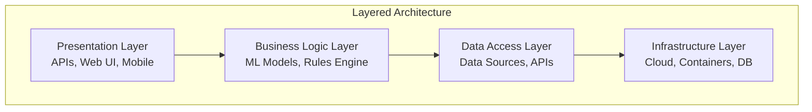

# Layered Architecture Implementation

## Overview
Layered Architecture is a traditional architectural pattern that organizes application components into horizontal layers, each with specific responsibilities.

## Architecture Diagram


## Project Structure
```
layered-architecture/
├── README.md
├── implementation-guide.md
├── code-samples/
│   ├── presentation-layer/
│   ├── business-logic-layer/
│   ├── data-access-layer/
│   └── infrastructure-layer/
├── deployment/
│   ├── docker-compose.yml
│   ├── kubernetes/
│   └── terraform/
├── tests/
├── docs/
└── examples/
```

## Implementation Guide

### Phase 1: Foundation Setup (Weeks 1-2)
1. **Project Initialization**
   - Set up development environment
   - Initialize Git repository
   - Configure CI/CD pipeline

2. **Infrastructure Layer**
   - Set up cloud resources
   - Configure databases
   - Set up monitoring and logging

### Phase 2: Core Development (Weeks 3-6)
1. **Data Access Layer**
   - Implement data repositories
   - Set up data models
   - Configure data access patterns

2. **Business Logic Layer**
   - Implement ML models
   - Create business rules
   - Set up workflow engine

### Phase 3: Presentation & Integration (Weeks 7-8)
1. **Presentation Layer**
   - Develop REST APIs
   - Create web interface
   - Implement mobile app

2. **Integration & Testing**
   - End-to-end testing
   - Performance testing
   - Security testing

## Technology Stack

### Presentation Layer
- **Web Framework**: React, Angular, Vue.js
- **API Framework**: FastAPI, Flask, Django
- **Mobile**: React Native, Flutter

### Business Logic Layer
- **ML Framework**: TensorFlow, PyTorch, Scikit-learn
- **Workflow Engine**: Apache Airflow, Prefect
- **Business Rules**: Drools, Easy Rules

### Data Access Layer
- **ORM**: SQLAlchemy, Hibernate, Entity Framework
- **Database**: PostgreSQL, MySQL, MongoDB
- **Cache**: Redis, Memcached

### Infrastructure Layer
- **Cloud**: AWS, Azure, GCP
- **Containerization**: Docker, Kubernetes
- **Monitoring**: Prometheus, Grafana, ELK Stack

## Code Samples

### Presentation Layer - FastAPI Service
```python
from fastapi import FastAPI, HTTPException
from pydantic import BaseModel
import uvicorn

app = FastAPI(title="AI Platform API")

class PredictionRequest(BaseModel):
    data: list
    model_version: str

@app.post("/predict")
async def predict(request: PredictionRequest):
    try:
        # Call business logic layer
        result = business_logic.predict(request.data, request.model_version)
        return {"prediction": result, "status": "success"}
    except Exception as e:
        raise HTTPException(status_code=500, detail=str(e))

if __name__ == "__main__":
    uvicorn.run(app, host="0.0.0.0", port=8000)
```

### Business Logic Layer - ML Model Service
```python
import joblib
import numpy as np
from typing import List

class MLModelService:
    def __init__(self, model_path: str):
        self.model = joblib.load(model_path)
    
    def predict(self, data: List[float]) -> float:
        """Make prediction using loaded model"""
        try:
            features = np.array(data).reshape(1, -1)
            prediction = self.model.predict(features)
            return float(prediction[0])
        except Exception as e:
            raise Exception(f"Prediction failed: {str(e)}")
    
    def get_model_info(self) -> dict:
        """Get model metadata"""
        return {
            "model_type": type(self.model).__name__,
            "features": self.model.n_features_in_,
            "version": "1.0.0"
        }
```

### Data Access Layer - Repository Pattern
```python
from abc import ABC, abstractmethod
from typing import List, Optional
import sqlite3

class DataRepository(ABC):
    @abstractmethod
    def save(self, data: dict) -> bool:
        pass
    
    @abstractmethod
    def find_by_id(self, id: str) -> Optional[dict]:
        pass
    
    @abstractmethod
    def find_all(self) -> List[dict]:
        pass

class SQLiteRepository(DataRepository):
    def __init__(self, db_path: str):
        self.db_path = db_path
        self.init_db()
    
    def init_db(self):
        with sqlite3.connect(self.db_path) as conn:
            conn.execute("""
                CREATE TABLE IF NOT EXISTS predictions (
                    id TEXT PRIMARY KEY,
                    data TEXT,
                    prediction REAL,
                    timestamp DATETIME DEFAULT CURRENT_TIMESTAMP
                )
            """)
    
    def save(self, data: dict) -> bool:
        try:
            with sqlite3.connect(self.db_path) as conn:
                conn.execute("""
                    INSERT INTO predictions (id, data, prediction)
                    VALUES (?, ?, ?)
                """, (data['id'], str(data['data']), data['prediction']))
                return True
        except Exception as e:
            print(f"Error saving data: {e}")
            return False
    
    def find_by_id(self, id: str) -> Optional[dict]:
        try:
            with sqlite3.connect(self.db_path) as conn:
                cursor = conn.execute("""
                    SELECT * FROM predictions WHERE id = ?
                """, (id,))
                row = cursor.fetchone()
                if row:
                    return {
                        'id': row[0],
                        'data': row[1],
                        'prediction': row[2],
                        'timestamp': row[3]
                    }
                return None
        except Exception as e:
            print(f"Error finding data: {e}")
            return None
    
    def find_all(self) -> List[dict]:
        try:
            with sqlite3.connect(self.db_path) as conn:
                cursor = conn.execute("SELECT * FROM predictions")
                rows = cursor.fetchall()
                return [
                    {
                        'id': row[0],
                        'data': row[1],
                        'prediction': row[2],
                        'timestamp': row[3]
                    }
                    for row in rows
                ]
        except Exception as e:
            print(f"Error finding all data: {e}")
            return []
```

## Deployment

### Docker Compose
```yaml
version: '3.8'

services:
  presentation-layer:
    build: ./presentation-layer
    ports:
      - "8000:8000"
    environment:
      - BUSINESS_LOGIC_URL=http://business-logic:8001
    depends_on:
      - business-logic-layer

  business-logic-layer:
    build: ./business-logic-layer
    ports:
      - "8001:8001"
    environment:
      - DATA_ACCESS_URL=http://data-access:8002
    depends_on:
      - data-access-layer

  data-access-layer:
    build: ./data-access-layer
    ports:
      - "8002:8002"
    environment:
      - DATABASE_URL=postgresql://user:password@db:5432/aiplatform
    depends_on:
      - db

  db:
    image: postgres:13
    environment:
      - POSTGRES_DB=aiplatform
      - POSTGRES_USER=user
      - POSTGRES_PASSWORD=password
    volumes:
      - postgres_data:/var/lib/postgresql/data

volumes:
  postgres_data:
```

### Kubernetes Deployment
```yaml
apiVersion: apps/v1
kind: Deployment
metadata:
  name: layered-architecture
spec:
  replicas: 3
  selector:
    matchLabels:
      app: layered-architecture
  template:
    metadata:
      labels:
        app: layered-architecture
    spec:
      containers:
      - name: presentation-layer
        image: layered-architecture:latest
        ports:
        - containerPort: 8000
        env:
        - name: BUSINESS_LOGIC_URL
          value: "http://business-logic-service:8001"
---
apiVersion: v1
kind: Service
metadata:
  name: layered-architecture-service
spec:
  selector:
    app: layered-architecture
  ports:
  - protocol: TCP
    port: 80
    targetPort: 8000
  type: LoadBalancer
```

## Testing

### Unit Tests
```python
import pytest
from unittest.mock import Mock, patch
from business_logic_layer.ml_service import MLModelService

class TestMLModelService:
    def test_predict_success(self):
        # Mock model
        mock_model = Mock()
        mock_model.predict.return_value = [0.85]
        mock_model.n_features_in_ = 5
        
        with patch('joblib.load', return_value=mock_model):
            service = MLModelService("dummy_path")
            result = service.predict([1.0, 2.0, 3.0, 4.0, 5.0])
            
            assert result == 0.85
            mock_model.predict.assert_called_once()
    
    def test_predict_failure(self):
        mock_model = Mock()
        mock_model.predict.side_effect = Exception("Model error")
        
        with patch('joblib.load', return_value=mock_model):
            service = MLModelService("dummy_path")
            
            with pytest.raises(Exception) as exc_info:
                service.predict([1.0, 2.0, 3.0, 4.0, 5.0])
            
            assert "Model error" in str(exc_info.value)
```

### Integration Tests
```python
import pytest
from fastapi.testclient import TestClient
from presentation_layer.main import app

client = TestClient(app)

def test_predict_endpoint():
    response = client.post(
        "/predict",
        json={
            "data": [1.0, 2.0, 3.0, 4.0, 5.0],
            "model_version": "1.0.0"
        }
    )
    
    assert response.status_code == 200
    data = response.json()
    assert "prediction" in data
    assert "status" in data
    assert data["status"] == "success"

def test_predict_endpoint_invalid_data():
    response = client.post(
        "/predict",
        json={
            "data": "invalid",
            "model_version": "1.0.0"
        }
    )
    
    assert response.status_code == 422
```

## Performance Optimization

### Caching Strategy
```python
import redis
import json
from functools import wraps

redis_client = redis.Redis(host='localhost', port=6379, db=0)

def cache_result(expire_time=3600):
    def decorator(func):
        @wraps(func)
        def wrapper(*args, **kwargs):
            # Create cache key
            cache_key = f"{func.__name__}:{hash(str(args) + str(kwargs))}"
            
            # Try to get from cache
            cached_result = redis_client.get(cache_key)
            if cached_result:
                return json.loads(cached_result)
            
            # Execute function and cache result
            result = func(*args, **kwargs)
            redis_client.setex(cache_key, expire_time, json.dumps(result))
            
            return result
        return wrapper
    return decorator

# Usage
@cache_result(expire_time=1800)
def expensive_prediction(data):
    # Expensive ML prediction
    return {"prediction": 0.85, "confidence": 0.92}
```

### Load Balancing
```python
import random
from typing import List

class LoadBalancer:
    def __init__(self, servers: List[str]):
        self.servers = servers
        self.current_index = 0
    
    def round_robin(self) -> str:
        server = self.servers[self.current_index]
        self.current_index = (self.current_index + 1) % len(self.servers)
        return server
    
    def random(self) -> str:
        return random.choice(self.servers)
    
    def weighted_random(self, weights: List[float]) -> str:
        return random.choices(self.servers, weights=weights)[0]

# Usage
servers = ["server1:8000", "server2:8000", "server3:8000"]
weights = [0.5, 0.3, 0.2]  # 50%, 30%, 20% traffic distribution

lb = LoadBalancer(servers)
selected_server = lb.weighted_random(weights)
```

## Monitoring and Observability

### Health Checks
```python
from fastapi import FastAPI
import psutil
import time

app = FastAPI()

@app.get("/health")
async def health_check():
    return {
        "status": "healthy",
        "timestamp": time.time(),
        "cpu_usage": psutil.cpu_percent(),
        "memory_usage": psutil.virtual_memory().percent,
        "disk_usage": psutil.disk_usage('/').percent
    }

@app.get("/ready")
async def readiness_check():
    # Check database connection
    # Check external services
    # Check ML model availability
    return {"status": "ready"}
```

### Metrics Collection
```python
from prometheus_client import Counter, Histogram, generate_latest
from fastapi import FastAPI, Request
import time

app = FastAPI()

# Metrics
REQUEST_COUNT = Counter('http_requests_total', 'Total HTTP requests', ['method', 'endpoint'])
REQUEST_LATENCY = Histogram('http_request_duration_seconds', 'HTTP request latency')

@app.middleware("http")
async def metrics_middleware(request: Request, call_next):
    start_time = time.time()
    
    response = await call_next(request)
    
    # Record metrics
    REQUEST_COUNT.labels(method=request.method, endpoint=request.url.path).inc()
    REQUEST_LATENCY.observe(time.time() - start_time)
    
    return response

@app.get("/metrics")
async def metrics():
    return generate_latest()
```

## Security Considerations

### Input Validation
```python
from pydantic import BaseModel, validator
from typing import List
import re

class PredictionRequest(BaseModel):
    data: List[float]
    model_version: str
    
    @validator('data')
    def validate_data(cls, v):
        if not v or len(v) == 0:
            raise ValueError('Data cannot be empty')
        
        if len(v) > 1000:
            raise ValueError('Data size exceeds maximum limit')
        
        for value in v:
            if not isinstance(value, (int, float)):
                raise ValueError('All data values must be numeric')
            
            if value < -1e6 or value > 1e6:
                raise ValueError('Data values out of acceptable range')
        
        return v
    
    @validator('model_version')
    def validate_model_version(cls, v):
        if not re.match(r'^\d+\.\d+\.\d+$', v):
            raise ValueError('Invalid model version format')
        return v
```

### Authentication and Authorization
```python
from fastapi import Depends, HTTPException, status
from fastapi.security import HTTPBearer, HTTPAuthorizationCredentials
import jwt
from typing import Optional

security = HTTPBearer()

class AuthService:
    def __init__(self, secret_key: str):
        self.secret_key = secret_key
    
    def verify_token(self, token: str) -> dict:
        try:
            payload = jwt.decode(token, self.secret_key, algorithms=["HS256"])
            return payload
        except jwt.ExpiredSignatureError:
            raise HTTPException(
                status_code=status.HTTP_401_UNAUTHORIZED,
                detail="Token has expired"
            )
        except jwt.JWTError:
            raise HTTPException(
                status_code=status.HTTP_401_UNAUTHORIZED,
                detail="Invalid token"
            )
    
    def check_permission(self, user_roles: List[str], required_role: str) -> bool:
        return required_role in user_roles

# Usage
async def get_current_user(credentials: HTTPAuthorizationCredentials = Depends(security)):
    auth_service = AuthService("your-secret-key")
    payload = auth_service.verify_token(credentials.credentials)
    return payload

@app.post("/predict")
async def predict(
    request: PredictionRequest,
    current_user: dict = Depends(get_current_user)
):
    # Check if user has permission to use ML models
    if "ml_user" not in current_user.get("roles", []):
        raise HTTPException(
            status_code=status.HTTP_403_FORBIDDEN,
            detail="Insufficient permissions"
        )
    
    # Process prediction
    return {"prediction": "result"}
```

## Best Practices

### 1. **Separation of Concerns**
- Keep each layer focused on its specific responsibility
- Avoid mixing business logic with presentation logic
- Use interfaces to define layer contracts

### 2. **Dependency Management**
- Dependencies should flow from top to bottom
- Lower layers should not depend on higher layers
- Use dependency injection for loose coupling

### 3. **Error Handling**
- Implement consistent error handling across all layers
- Use appropriate HTTP status codes
- Log errors for debugging and monitoring

### 4. **Testing Strategy**
- Unit test each layer independently
- Use mocks for external dependencies
- Implement integration tests for layer interactions

### 5. **Performance Optimization**
- Implement caching at appropriate layers
- Use connection pooling for database connections
- Monitor and optimize slow queries

### 6. **Security**
- Validate all inputs at the presentation layer
- Implement authentication and authorization
- Use HTTPS in production
- Sanitize data before processing

## Troubleshooting

### Common Issues

1. **Circular Dependencies**
   - Ensure dependencies flow in one direction
   - Use interfaces to break circular dependencies

2. **Performance Bottlenecks**
   - Profile each layer independently
   - Implement caching strategies
   - Optimize database queries

3. **Testing Complexity**
   - Mock external dependencies
   - Use test containers for integration tests
   - Implement proper test data management

### Debugging Tips

1. **Logging**
   - Implement structured logging
   - Use correlation IDs for request tracking
   - Log at appropriate levels (DEBUG, INFO, WARN, ERROR)

2. **Monitoring**
   - Set up health checks
   - Monitor resource usage
   - Implement alerting for critical issues

3. **Documentation**
   - Document API endpoints
   - Maintain architecture diagrams
   - Keep implementation guides updated

## Next Steps

1. **Review the implementation guide**
2. **Set up the development environment**
3. **Implement the basic structure**
4. **Add your specific business logic**
5. **Test thoroughly**
6. **Deploy to production**

## Resources

- [FastAPI Documentation](https://fastapi.tiangolo.com/)
- [Docker Documentation](https://docs.docker.com/)
- [Kubernetes Documentation](https://kubernetes.io/docs/)
- [Prometheus Documentation](https://prometheus.io/docs/)
- [Pytest Documentation](https://docs.pytest.org/)
