# Data Engineering & Management

## Overview
This section covers data engineering principles, pipeline design, data quality, governance, and storage solutions for enterprise AI platforms.

## 1. **Data Pipeline Design**

### 1. **Lambda Architecture**
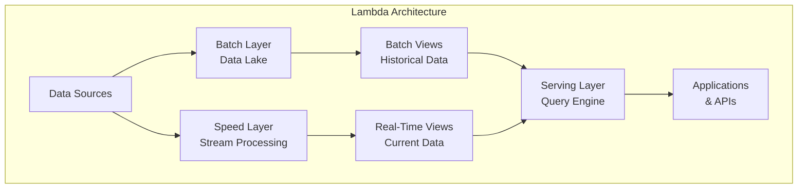

### 2. **Kappa Architecture**
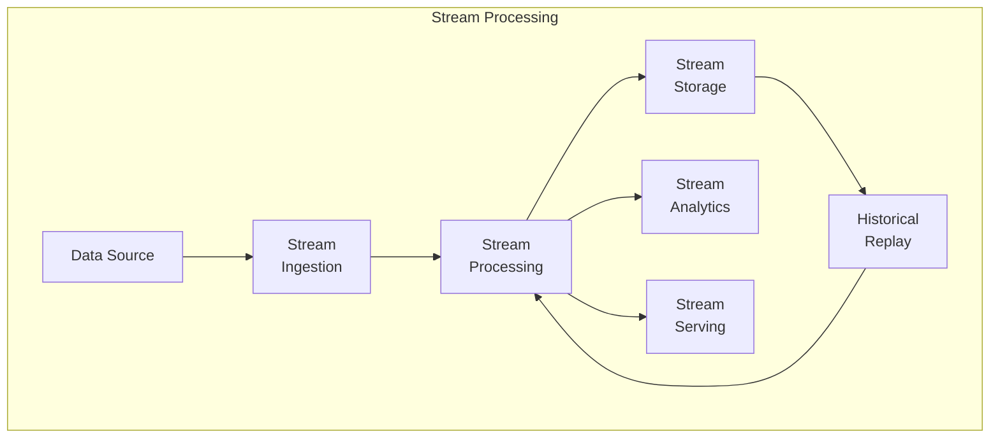

### 3. **ETL vs ELT Comparison**
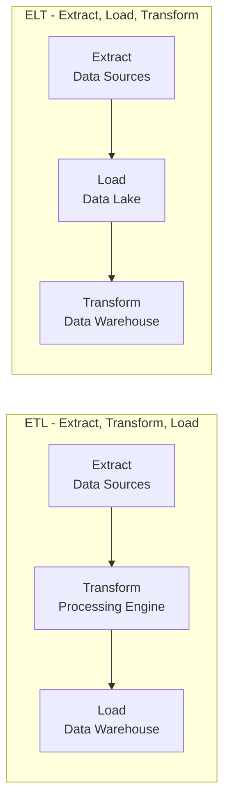

## 2. **Data Pipeline Components**

### 1. **Pipeline Architecture**
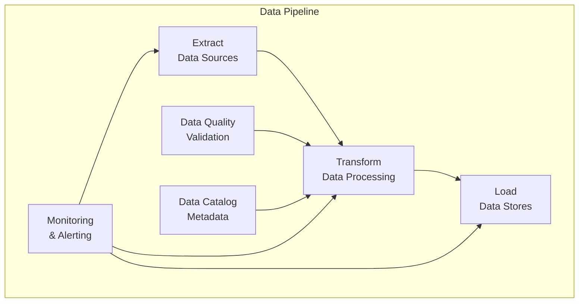

### 2. **Data Processing Zones**
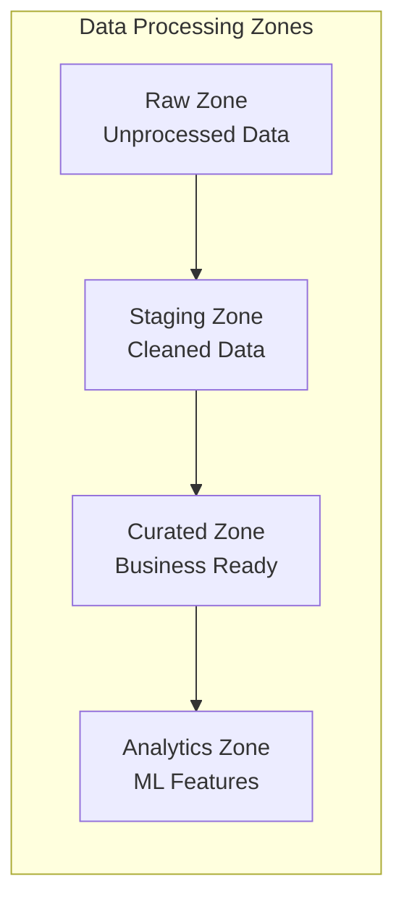

## 3. **Data Quality & Governance**

### 1. **Data Quality Dimensions**
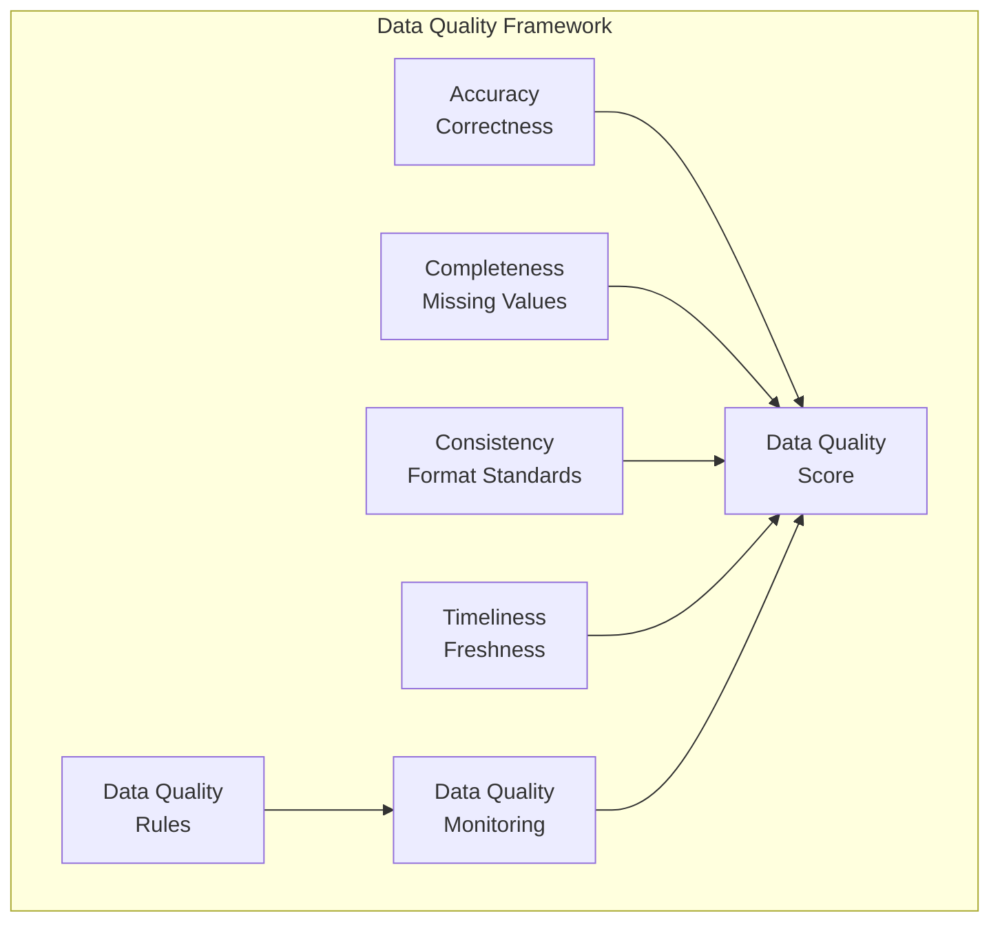

### 2. **Data Governance Pillars**
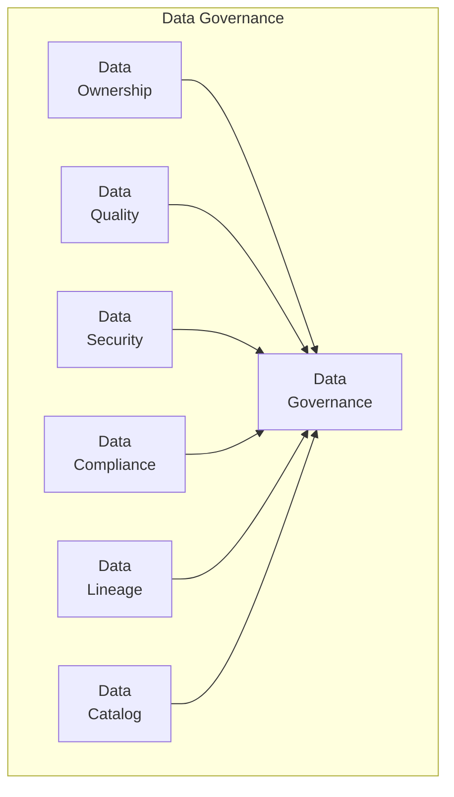

### 3. **Data Catalog Architecture**
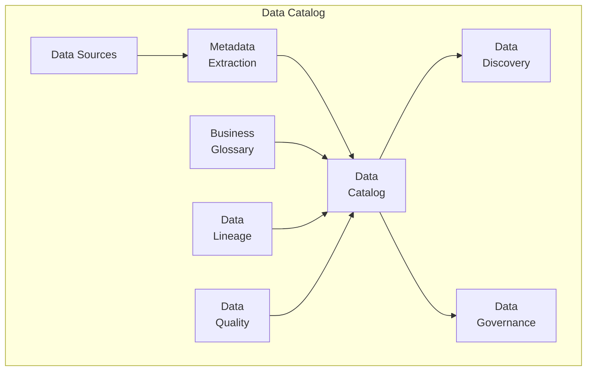

## 4. **Data Storage & Processing**

### 1. **Storage Solutions Comparison**
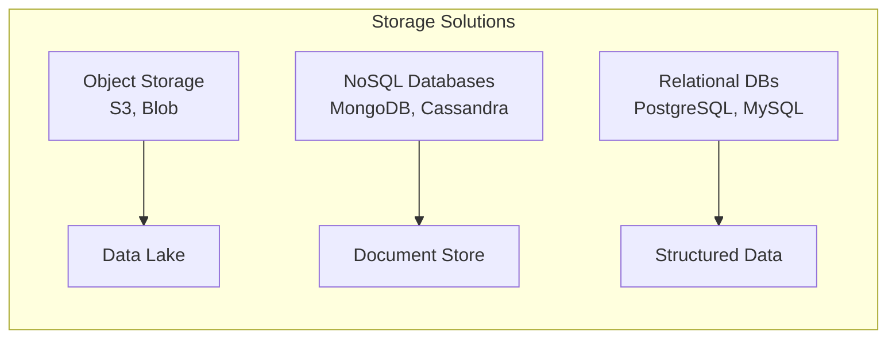

### 2. **Zone-Based Data Lake**
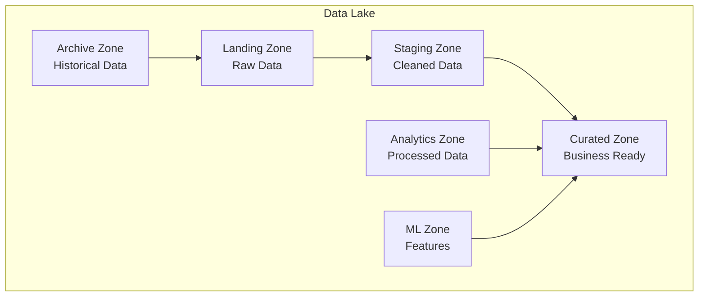

### 3. **Batch vs Stream Processing**
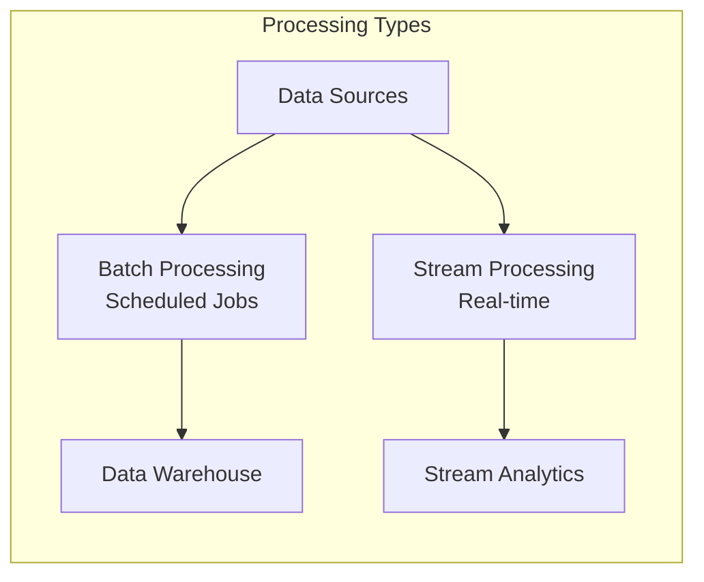

## 5. **Data Pipeline Tools**

### 1. **Apache Airflow DAG**
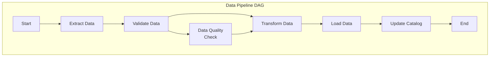

### 2. **Kafka Stream Processing**
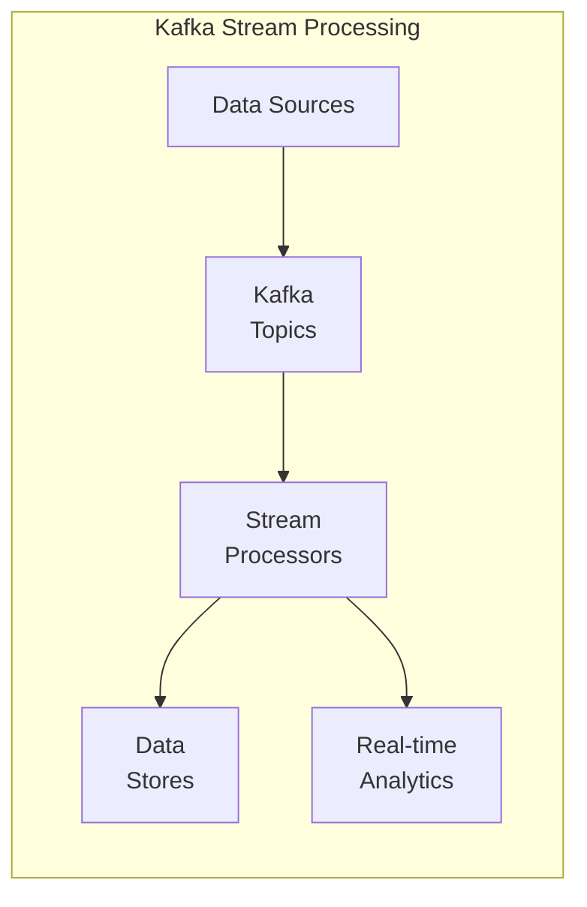

## 6. **Performance Optimization**

### 1. **Data Partitioning Strategy**
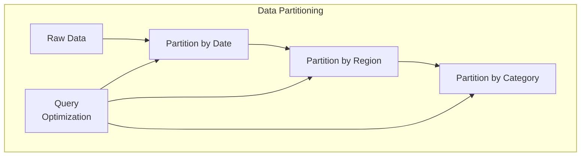

### 2. **Data Caching Layers**
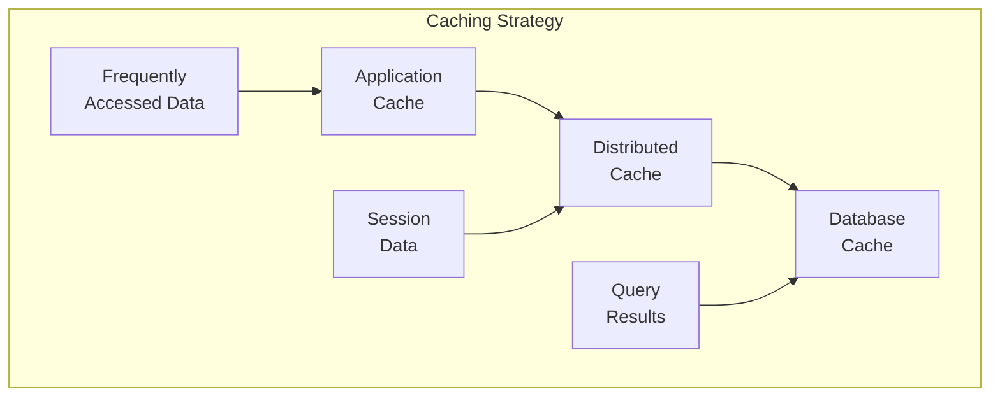

## 7. **Implementation Examples**

### **Data Extraction Class**
```python
class DataExtractor:
    def extract_from_database(self, connection_string, query):
        """Extract data from relational database"""
        pass
    
    def extract_from_api(self, endpoint, headers, params):
        """Extract data from REST API"""
        pass
    
    def extract_from_files(self, file_path, file_type):
        """Extract data from various file formats"""
        pass
```

### **Data Transformation Pipeline**
```python
class DataTransformer:
    def clean_data(self, data):
        """Remove duplicates, handle missing values"""
        pass
    
    def transform_data(self, data, transformation_rules):
        """Apply business logic transformations"""
        pass
    
    def validate_data(self, data, validation_schema):
        """Validate data against schema"""
        pass
```

### **Data Loading Service**
```python
class DataLoader:
    def load_to_warehouse(self, data, target_table):
        """Load data to data warehouse"""
        pass
    
    def load_to_lake(self, data, target_path):
        """Load data to data lake"""
        pass
    
    def update_catalog(self, metadata):
        """Update data catalog with new metadata"""
        pass
```

### **Data Quality Validator**
```python
class DataQualityValidator:
    def check_completeness(self, data):
        """Check for missing values"""
        pass
    
    def check_accuracy(self, data, reference_data):
        """Validate data accuracy"""
        pass
    
    def check_consistency(self, data, business_rules):
        """Ensure data consistency"""
        pass
```

### **Data Catalog Service**
```python
class DataCatalog:
    def register_dataset(self, dataset_info):
        """Register new dataset in catalog"""
        pass
    
    def search_datasets(self, query):
        """Search datasets by criteria"""
        pass
    
    def get_lineage(self, dataset_id):
        """Get data lineage information"""
        pass
```

### **Airflow DAG for Data Pipeline**
```python
from airflow import DAG
from airflow.operators.python_operator import PythonOperator
from datetime import datetime, timedelta

default_args = {
    'owner': 'data_team',
    'depends_on_past': False,
    'start_date': datetime(2024, 1, 1),
    'email_on_failure': True,
    'email_on_retry': False,
    'retries': 1,
    'retry_delay': timedelta(minutes=5),
}

dag = DAG(
    'data_pipeline',
    default_args=default_args,
    description='Daily data processing pipeline',
    schedule_interval=timedelta(days=1),
)

# Define tasks
extract_task = PythonOperator(
    task_id='extract_data',
    python_callable=extract_data_function,
    dag=dag,
)

transform_task = PythonOperator(
    task_id='transform_data',
    python_callable=transform_data_function,
    dag=dag,
)

load_task = PythonOperator(
    task_id='load_data',
    python_callable=load_data_function,
    dag=dag,
)

# Set task dependencies
extract_task >> transform_task >> load_task
```

## 7. **Data Governance & Security**

### **Data Governance Framework**

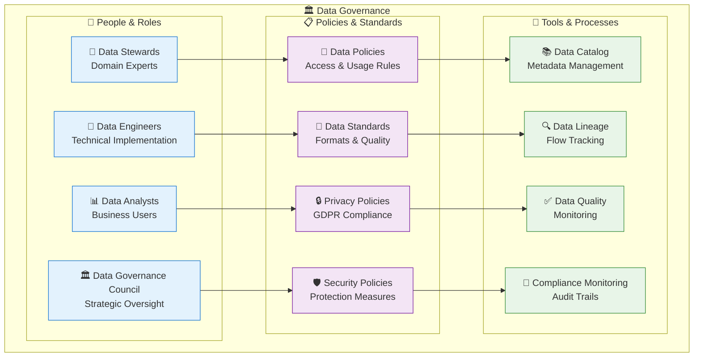

### **Data Security Architecture**

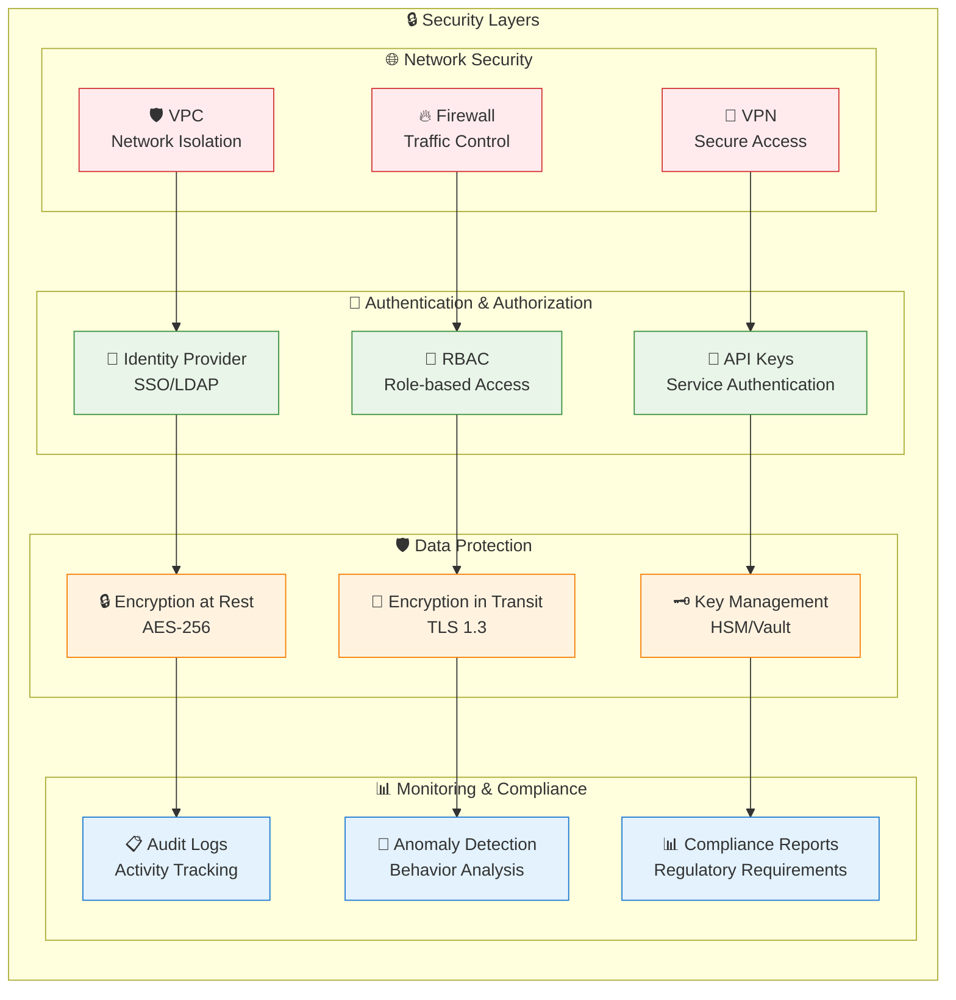

## 8. **Modern Data Engineering Patterns**

### **Event-Driven Data Architecture**

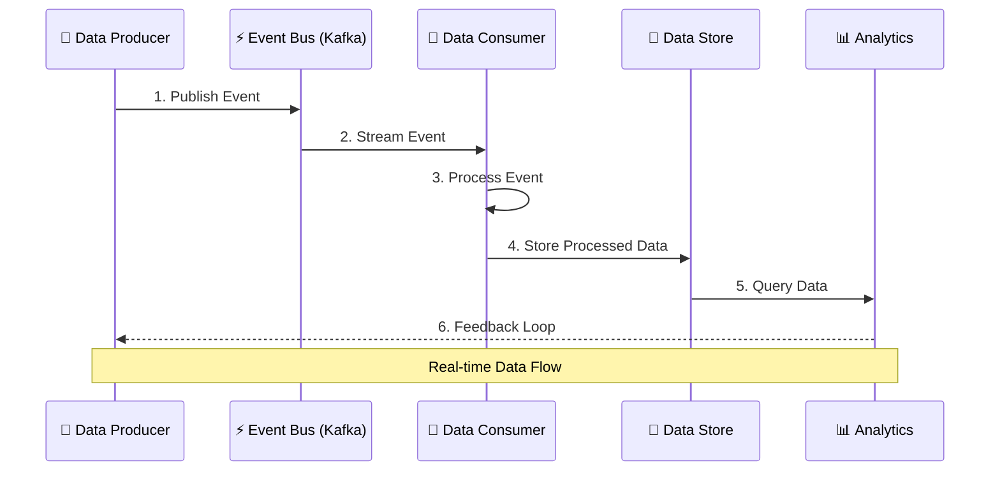

### **Data Mesh Architecture**

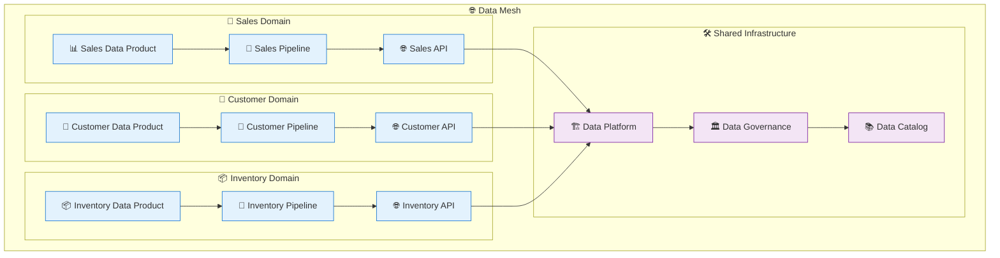

### **DataOps Lifecycle**

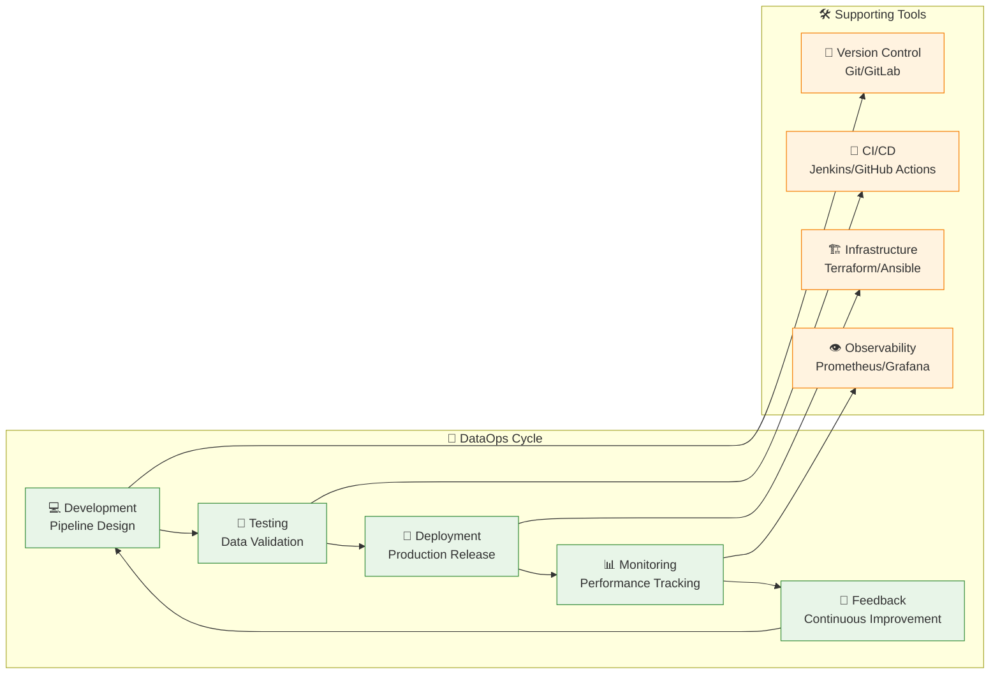

## 9. **Best Practices**

### **Data Pipeline Design Principles**

```mermaid
mindmap
  root((Data Pipeline Best Practices))
    🏗️ Design Principles
      Modularity
      Reusability
      Scalability
      Fault Tolerance
    🔍 Quality Assurance
      Automated Testing
      Data Validation
      Schema Evolution
      Regression Testing
    📊 Monitoring & Observability
      Real-time Metrics
      Alerting Systems
      Log Aggregation
      Performance Tracking
    🔒 Security & Compliance
      Access Controls
      Data Encryption
      Audit Trails
      Privacy Protection
    ⚡ Performance Optimization
      Parallel Processing
      Intelligent Caching
      Resource Management
      Cost Optimization
```

### **Data Quality Framework**

```mermaid
graph TB
    subgraph "✅ Data Quality Dimensions"
        DQ1["🎯 Accuracy<br/>Correctness of Data"]
        DQ2["📊 Completeness<br/>No Missing Values"]
        DQ3["🔄 Consistency<br/>Format Standards"]
        DQ4["⏰ Timeliness<br/>Data Freshness"]
        DQ5["✅ Validity<br/>Business Rules"]
        DQ6["🔗 Integrity<br/>Referential Consistency"]
    end
    
    subgraph "🔧 Quality Tools"
        TOOL1["🧪 Great Expectations<br/>Automated Testing"]
        TOOL2["📊 Data Profiling<br/>Statistical Analysis"]
        TOOL3["🚨 Anomaly Detection<br/>ML-based Monitoring"]
        TOOL4["📋 Quality Dashboards<br/>Real-time Reporting"]
    end
    
    DQ1 --> TOOL1
    DQ2 --> TOOL1
    DQ3 --> TOOL2
    DQ4 --> TOOL3
    DQ5 --> TOOL1
    DQ6 --> TOOL4

    classDef qualityClass fill:#e8f5e8,stroke:#388e3c
    classDef toolClass fill:#e3f2fd,stroke:#1976d2

    class DQ1,DQ2,DQ3,DQ4,DQ5,DQ6 qualityClass
    class TOOL1,TOOL2,TOOL3,TOOL4 toolClass
```

---

**Next Section**: [AI/ML Platform Operations](../03-MLOps/README.md)
