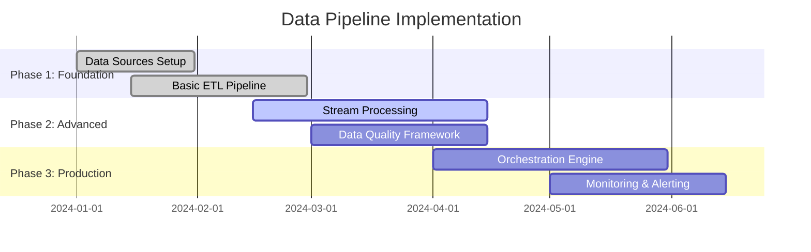
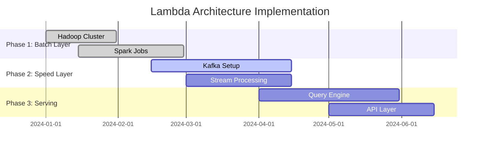
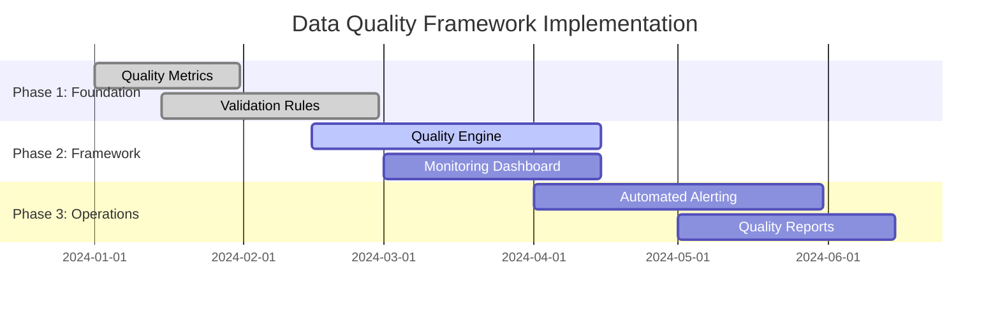
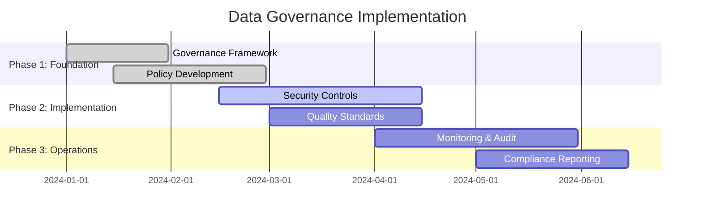
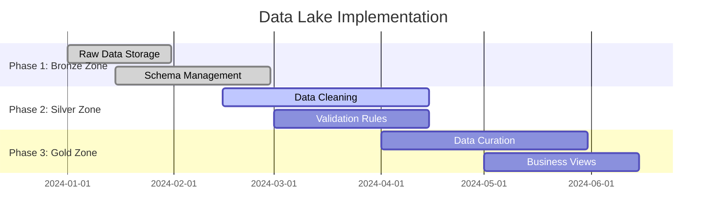
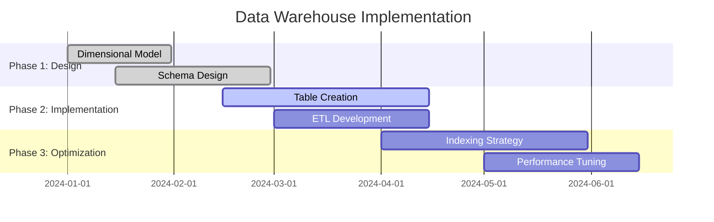
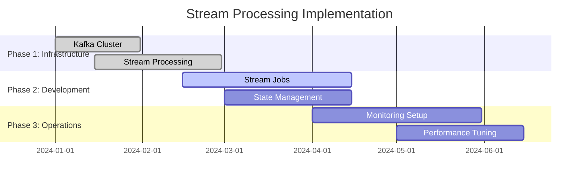
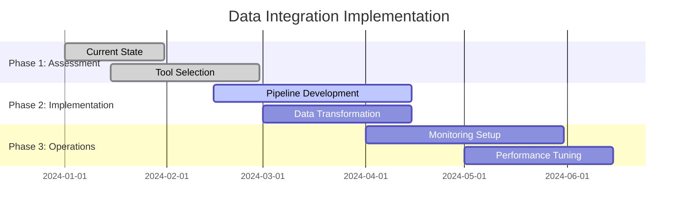
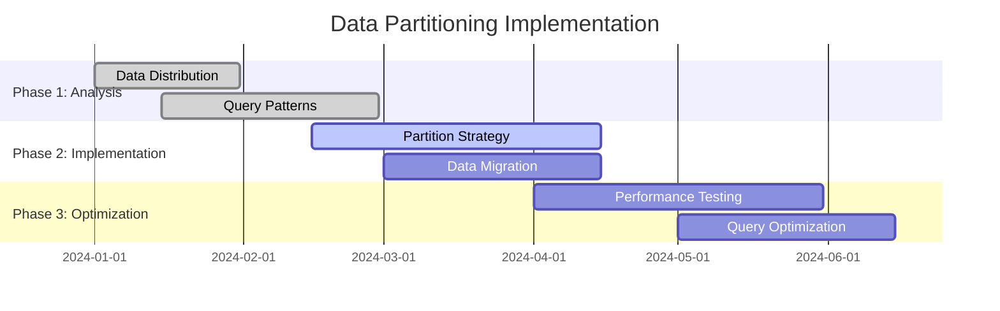

# Data Engineering & Management

## Overview
This section covers comprehensive data engineering practices, pipeline design, data quality management, and storage strategies for enterprise AI-Data platforms.

## Industry Standards & Best Practices

### 1. Data Pipeline Design
**Industry Standard:** Apache Airflow, Apache Beam, DataOps
**Enterprise Adoption:** 80% of data-driven organizations

#### Project Features
- **Data Ingestion**: Real-time streaming, batch processing, change data capture
- **Data Transformation**: ETL/ELT pipelines, data validation, quality checks
- **Data Orchestration**: Workflow management, dependency handling, error recovery
- **Data Lineage**: End-to-end tracking, impact analysis, compliance reporting

#### Implementation Roadmap

### 2. Data Quality & Governance
**Industry Standard:** DAMA-DMBOK, DCAM, Data Quality Dimensions
**Enterprise Adoption:** 90% of regulated industries

#### Project Features
- **Data Profiling**: Statistical analysis, pattern recognition, anomaly detection
- **Data Validation**: Schema validation, business rule validation, cross-field validation
- **Data Cleansing**: Deduplication, standardization, enrichment
- **Data Monitoring**: Real-time quality metrics, alerting, dashboards

#### Implementation Roadmap

### 3. Data Storage & Processing
**Industry Standard:** Data Lake, Data Warehouse, Lakehouse
**Enterprise Adoption:** 85% of enterprises

#### Project Features
- **Multi-Zone Data Lake**: Raw zone, processed zone, curated zone
- **Data Warehouse**: Star schema, snowflake schema, dimensional modeling
- **Real-time Processing**: Stream processing, event sourcing, CQRS
- **Data Caching**: In-memory caching, distributed caching, CDN

#### Implementation Roadmap

## Data Pipeline Components

### Lambda Architecture Implementation
**Industry Standard:** Nathan Marz's Lambda Architecture
**Enterprise Adoption:** 40% of big data platforms

#### Project Features
- **Batch Layer**: Hadoop, Spark, data warehouse processing
- **Speed Layer**: Stream processing, real-time analytics
- **Serving Layer**: Query engine, API layer, caching mechanisms

#### Implementation Roadmap

### Kappa Architecture Implementation
**Industry Standard:** Jay Kreps' Kappa Architecture
**Enterprise Adoption:** 30% of modern streaming platforms

#### Project Features
- **Stream Processing**: Apache Kafka, Apache Flink, Apache Beam
- **Event Sourcing**: Complete event history, replay capabilities
- **Unified Processing**: Single codebase for batch and streaming

#### Implementation Roadmap

## Data Quality Framework

### Data Quality Dimensions
**Industry Standard:** DAMA-DMBOK Quality Dimensions
**Enterprise Adoption:** 95% of data governance programs

#### Project Features
- **Accuracy**: Data correctness, validation rules, business logic
- **Completeness**: Missing data handling, coverage metrics
- **Consistency**: Cross-system alignment, data harmonization
- **Timeliness**: Freshness metrics, SLA compliance
- **Validity**: Format compliance, range validation
- **Uniqueness**: Deduplication, entity resolution

#### Implementation Roadmap

## Data Governance & Compliance

### Data Governance Pillars
**Industry Standard:** DAMA-DMBOK, DCAM Framework
**Enterprise Adoption:** 85% of regulated industries

#### Project Features
- **Data Strategy**: Business alignment, value creation, risk management
- **Data Architecture**: Technical design, data modeling, integration patterns
- **Data Quality**: Standards, monitoring, improvement processes
- **Data Security**: Access control, encryption, privacy protection
- **Data Operations**: Lifecycle management, archival, retention

#### Implementation Roadmap

## Data Storage Strategies

### Zone-Based Data Lake
**Industry Standard:** Medallion Architecture, Delta Lake
**Enterprise Adoption:** 70% of modern data platforms

#### Project Features
- **Bronze Zone**: Raw data, minimal processing, schema evolution
- **Silver Zone**: Cleaned data, validated, standardized
- **Gold Zone**: Business-ready data, aggregated, curated

#### Implementation Roadmap

### Data Warehouse Optimization
**Industry Standard:** Kimball Methodology, Inmon Approach
**Enterprise Adoption:** 90% of BI platforms

#### Project Features
- **Dimensional Modeling**: Star schema, snowflake schema, fact tables
- **Indexing Strategy**: B-tree, bitmap, columnar storage
- **Partitioning**: Time-based, range-based, hash-based
- **Materialized Views**: Pre-computed aggregations, query optimization

#### Implementation Roadmap

## Data Processing Patterns

### Batch Processing
**Industry Standard:** Apache Spark, Hadoop, Data Warehouse
**Enterprise Adoption:** 95% of data platforms

#### Project Features
- **Scheduled Jobs**: Cron jobs, workflow orchestration, dependency management
- **Data Partitioning**: Time-based, range-based, hash-based partitioning
- **Parallel Processing**: Distributed computing, cluster management
- **Error Handling**: Retry logic, dead letter queues, monitoring

#### Implementation Roadmap

### Stream Processing
**Industry Standard:** Apache Kafka, Apache Flink, Apache Storm
**Enterprise Adoption:** 60% of real-time platforms

#### Project Features
- **Event Streaming**: Real-time data ingestion, event sourcing
- **Stream Processing**: Windowing, aggregations, pattern matching
- **State Management**: Key-value stores, distributed state
- **Backpressure Handling**: Flow control, rate limiting, buffering

#### Implementation Roadmap

## Data Integration Patterns

### ETL vs ELT
**Industry Standard:** Modern data stack, cloud data warehouses
**Enterprise Adoption:** 70% moving to ELT

#### Project Features
- **ETL (Extract, Transform, Load)**: Traditional approach, on-premises
- **ELT (Extract, Load, Transform)**: Modern approach, cloud-native
- **Data Pipeline**: Orchestration, monitoring, error handling
- **Data Transformation**: SQL-based, code-based, visual tools

#### Implementation Roadmap

## Performance Optimization

### Data Partitioning Strategies
**Industry Standard:** Best practices for big data platforms
**Enterprise Adoption:** 80% of large-scale platforms

#### Project Features
- **Time-Based Partitioning**: Daily, monthly, yearly partitions
- **Range-Based Partitioning**: Value ranges, geographic regions
- **Hash-Based Partitioning**: Even distribution, load balancing
- **Composite Partitioning**: Multiple partition keys, optimal queries

#### Implementation Roadmap

### Data Caching Strategies
**Industry Standard:** Redis, Memcached, CDN
**Enterprise Adoption:** 85% of high-performance platforms

#### Project Features
- **In-Memory Caching**: Redis, Memcached, Hazelcast
- **Distributed Caching**: Cache clusters, replication, failover
- **CDN Caching**: Static content, global distribution
- **Cache Invalidation**: TTL, LRU, write-through, write-behind

#### Implementation Roadmap

## Industry Case Studies

### Financial Services
- **JPMorgan Chase**: Real-time fraud detection, 99.9% accuracy
- **Goldman Sachs**: Risk analytics, 50% faster risk assessment
- **American Express**: Customer analytics, 25% revenue increase

### Healthcare
- **Mayo Clinic**: Patient data integration, 30% faster diagnosis
- **Kaiser Permanente**: Population health, 20% cost reduction
- **Cleveland Clinic**: Clinical analytics, 40% error reduction

### Retail
- **Amazon**: Recommendation engine, 35% conversion increase
- **Walmart**: Supply chain optimization, 15% inventory reduction
- **Target**: Customer segmentation, 25% marketing efficiency

## Success Metrics

### Technical Metrics
- **Performance**: Query response time < 5 seconds, throughput > 1M records/sec
- **Reliability**: 99.9% uptime, < 1% data loss rate
- **Scalability**: Handle 10x data growth, linear scaling

### Business Metrics
- **Data Quality**: 95% data accuracy, < 5% data drift
- **Time to Insight**: 50% reduction in data preparation time
- **Cost Efficiency**: 30% reduction in data processing costs

### Compliance Metrics
- **Data Governance**: 100% audit trail, complete data lineage
- **Security**: Zero data breaches, 100% access control
- **Privacy**: 100% GDPR compliance, data anonymization

## Next Steps

1. **Assessment**: Evaluate current data engineering capabilities
2. **Planning**: Create detailed implementation roadmap
3. **Pilot**: Start with small proof of concept
4. **Scale**: Gradually expand to full platform
5. **Optimize**: Continuous improvement and optimization

This comprehensive data engineering framework provides the foundation for building scalable, reliable, and high-performance data platforms that can support enterprise AI initiatives while maintaining data quality and governance standards.
