# Data Engineering & Management

## Overview
This section covers data engineering principles, pipeline design, data quality, governance, and storage solutions for enterprise AI platforms.

## 1. **Data Pipeline Design**

### 1. **Lambda Architecture**
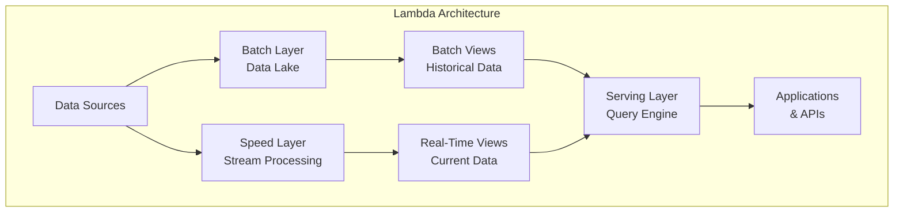

### 2. **Kappa Architecture**
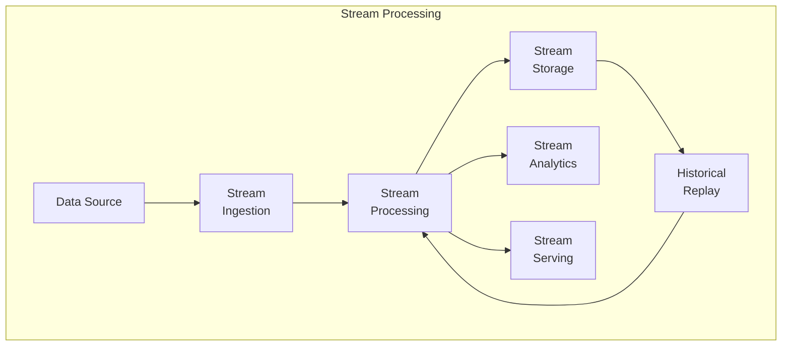

### 3. **ETL vs ELT Comparison**
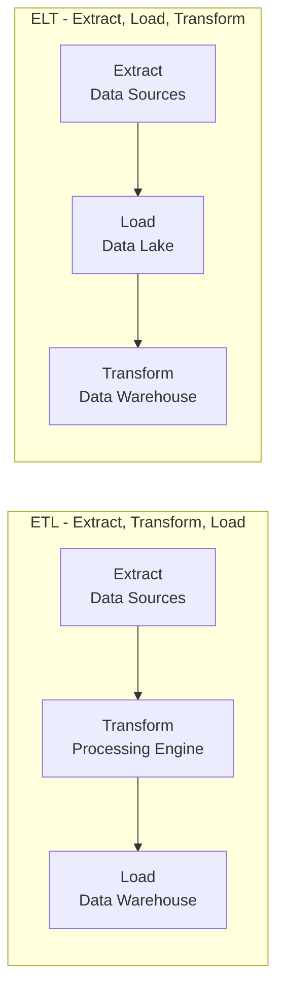

## 2. **Data Pipeline Components**

### 1. **Pipeline Architecture**
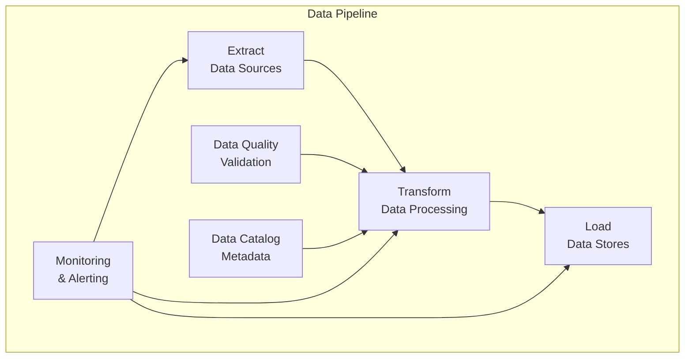

### 2. **Data Processing Zones**
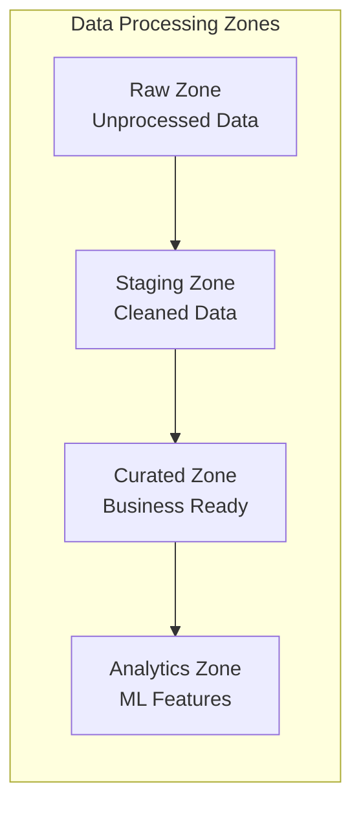

## 3. **Data Quality & Governance**

### 1. **Data Quality Dimensions**
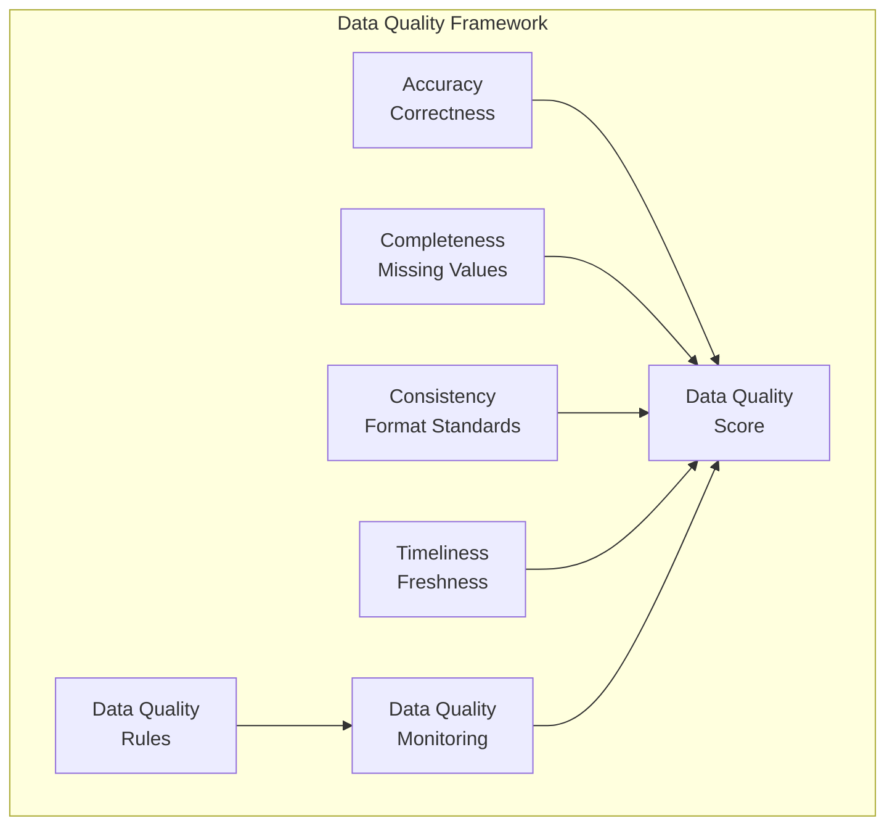

### 2. **Data Governance Pillars**
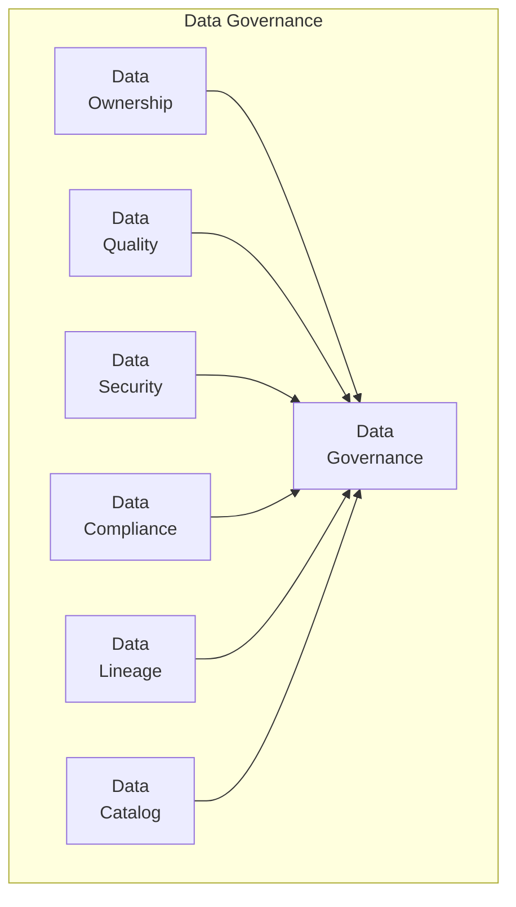

### 3. **Data Catalog Architecture**
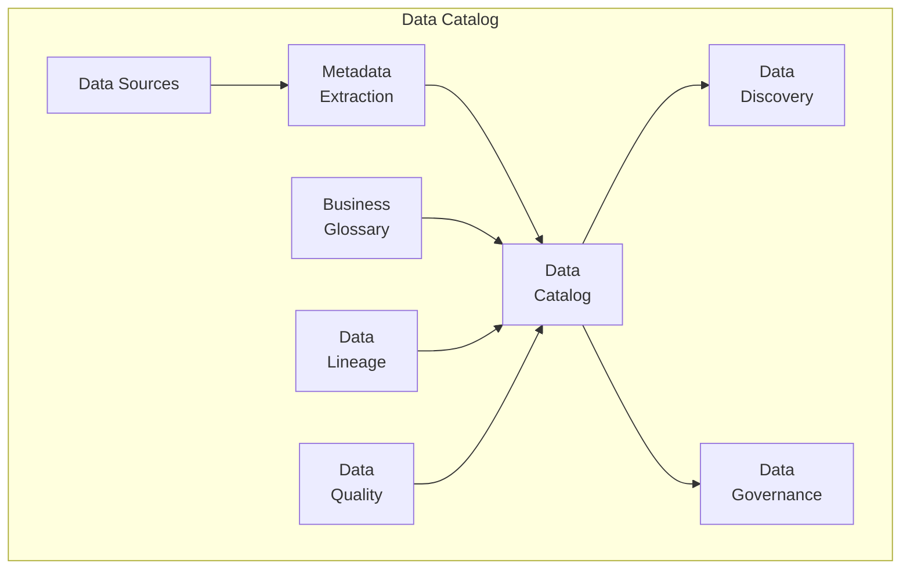

## 4. **Data Storage & Processing**

### 1. **Storage Solutions Comparison**
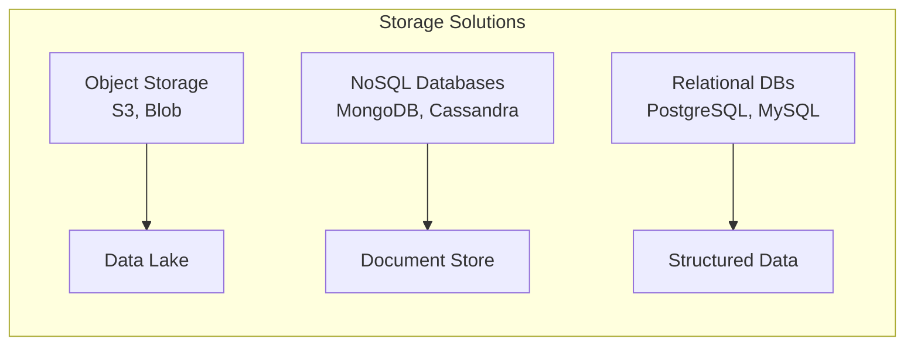

### 2. **Zone-Based Data Lake**
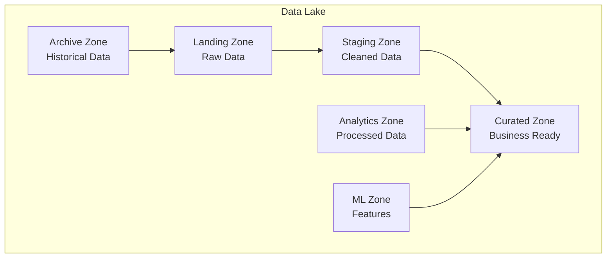

### 3. **Batch vs Stream Processing**
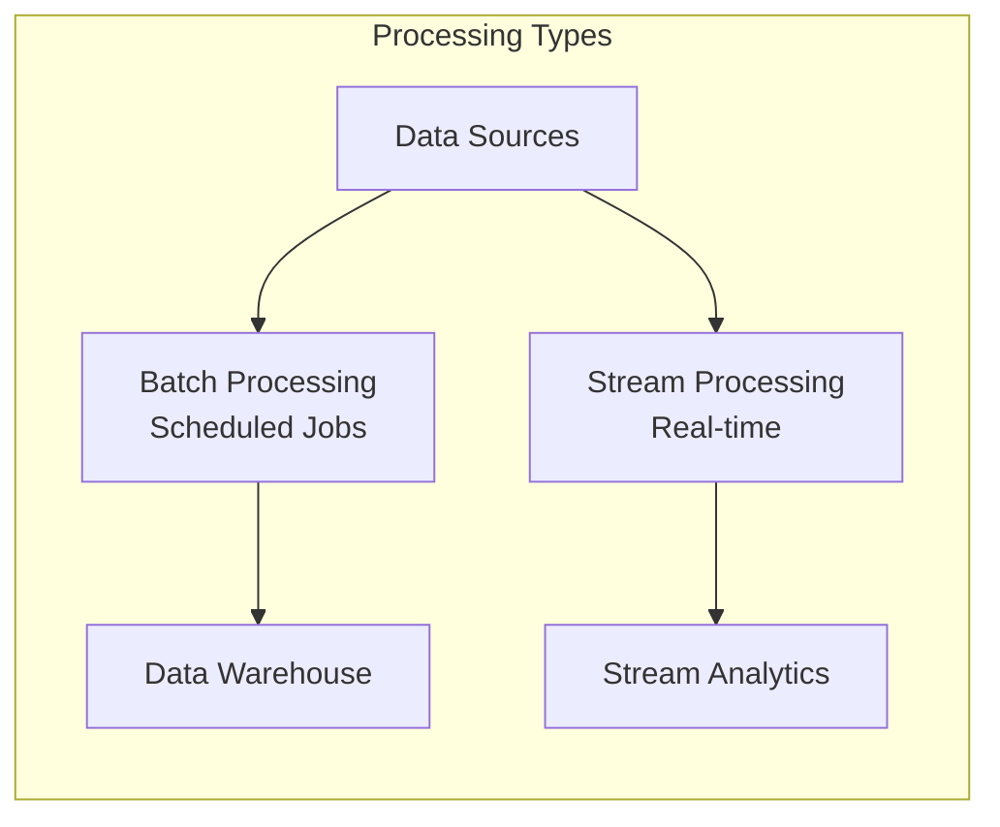

## 5. **Data Pipeline Tools**

### 1. **Apache Airflow DAG**
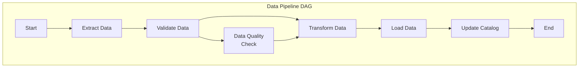

### 2. **Kafka Stream Processing**
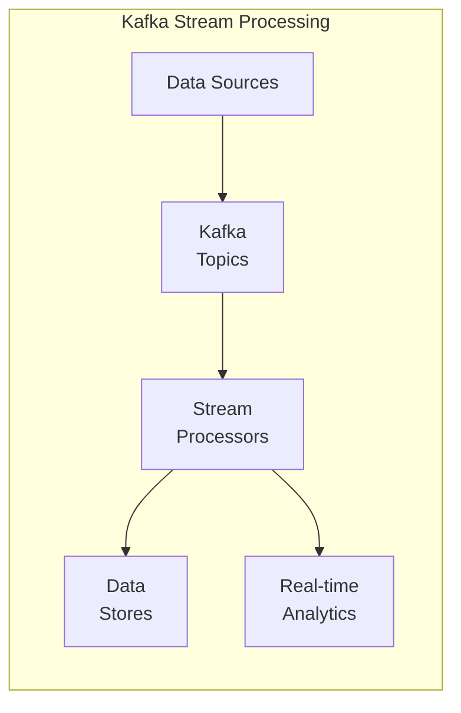

## 6. **Performance Optimization**

### 1. **Data Partitioning Strategy**
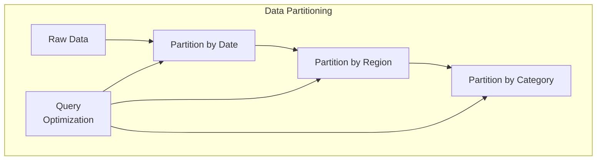

### 2. **Data Caching Layers**
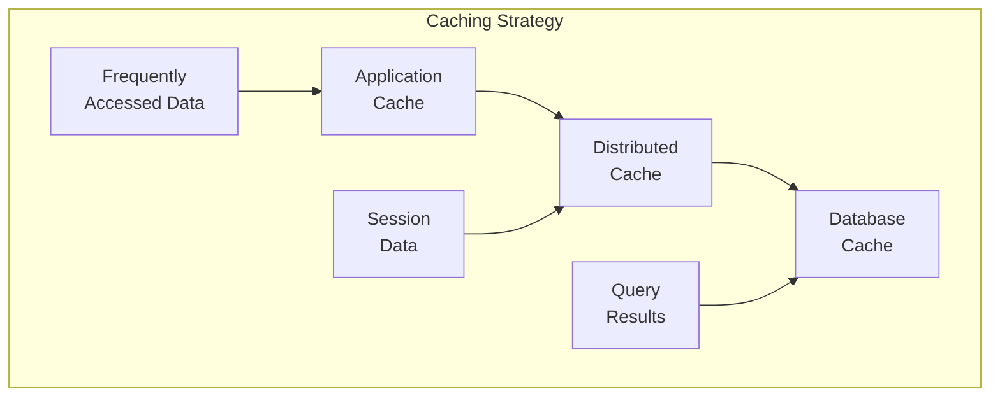

## 7. **Implementation Examples**

### **Data Extraction Class**
```python
class DataExtractor:
    def extract_from_database(self, connection_string, query):
        """Extract data from relational database"""
        pass
    
    def extract_from_api(self, endpoint, headers, params):
        """Extract data from REST API"""
        pass
    
    def extract_from_files(self, file_path, file_type):
        """Extract data from various file formats"""
        pass
```

### **Data Transformation Pipeline**
```python
class DataTransformer:
    def clean_data(self, data):
        """Remove duplicates, handle missing values"""
        pass
    
    def transform_data(self, data, transformation_rules):
        """Apply business logic transformations"""
        pass
    
    def validate_data(self, data, validation_schema):
        """Validate data against schema"""
        pass
```

### **Data Loading Service**
```python
class DataLoader:
    def load_to_warehouse(self, data, target_table):
        """Load data to data warehouse"""
        pass
    
    def load_to_lake(self, data, target_path):
        """Load data to data lake"""
        pass
    
    def update_catalog(self, metadata):
        """Update data catalog with new metadata"""
        pass
```

### **Data Quality Validator**
```python
class DataQualityValidator:
    def check_completeness(self, data):
        """Check for missing values"""
        pass
    
    def check_accuracy(self, data, reference_data):
        """Validate data accuracy"""
        pass
    
    def check_consistency(self, data, business_rules):
        """Ensure data consistency"""
        pass
```

### **Data Catalog Service**
```python
class DataCatalog:
    def register_dataset(self, dataset_info):
        """Register new dataset in catalog"""
        pass
    
    def search_datasets(self, query):
        """Search datasets by criteria"""
        pass
    
    def get_lineage(self, dataset_id):
        """Get data lineage information"""
        pass
```

### **Airflow DAG for Data Pipeline**
```python
from airflow import DAG
from airflow.operators.python_operator import PythonOperator
from datetime import datetime, timedelta

default_args = {
    'owner': 'data_team',
    'depends_on_past': False,
    'start_date': datetime(2024, 1, 1),
    'email_on_failure': True,
    'email_on_retry': False,
    'retries': 1,
    'retry_delay': timedelta(minutes=5),
}

dag = DAG(
    'data_pipeline',
    default_args=default_args,
    description='Daily data processing pipeline',
    schedule_interval=timedelta(days=1),
)

# Define tasks
extract_task = PythonOperator(
    task_id='extract_data',
    python_callable=extract_data_function,
    dag=dag,
)

transform_task = PythonOperator(
    task_id='transform_data',
    python_callable=transform_data_function,
    dag=dag,
)

load_task = PythonOperator(
    task_id='load_data',
    python_callable=load_data_function,
    dag=dag,
)

# Set task dependencies
extract_task >> transform_task >> load_task
```

## 8. **Best Practices**

### **Data Pipeline Design**
1. **Modularity**: Break pipelines into reusable components
2. **Error Handling**: Implement comprehensive error handling
3. **Monitoring**: Add monitoring and alerting at each stage
4. **Testing**: Test pipelines with sample data
5. **Documentation**: Document data lineage and transformations

### **Data Quality Management**
1. **Automated Validation**: Implement automated data quality checks
2. **Data Profiling**: Regular data profiling and monitoring
3. **Business Rules**: Define and enforce business rules
4. **Feedback Loop**: Continuous improvement based on quality metrics

### **Performance Optimization**
1. **Partitioning**: Implement appropriate data partitioning
2. **Caching**: Use caching for frequently accessed data
3. **Parallelization**: Parallelize data processing where possible
4. **Resource Management**: Optimize resource allocation

---

**Next Section**: [AI/ML Platform Operations](../03-MLOps/README.md)
