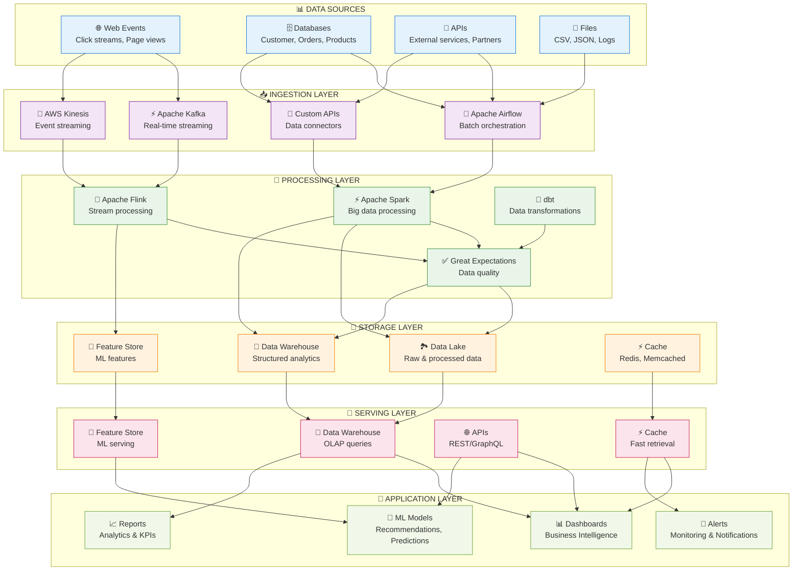
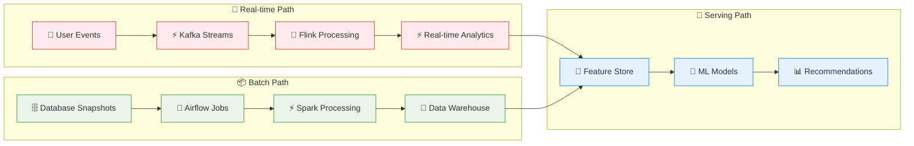

# E-Commerce Data Platform Project

## 🎯 Project Overview

This is a comprehensive **Data Engineering Portfolio Project** that demonstrates building a complete data platform for an e-commerce company. The project covers real-world scenarios including customer behavior analytics, inventory management, sales forecasting, and real-time recommendations.

## 🏢 Business Scenario

**TechMart Inc.** is a growing e-commerce company that needs a modern data platform to:
- Track customer behavior and preferences
- Optimize inventory management
- Generate real-time sales analytics
- Power recommendation engines
- Ensure data quality and governance
- Support business intelligence and ML initiatives

## 🏗️ Architecture Overview

### **Complete E-Commerce Data Platform**



### **Data Processing Flow**



## 📁 Project Structure

```
e-commerce-data-platform/
├── README.md
├── docs/
│   ├── architecture.md
│   ├── setup-guide.md
│   ├── user-guide.md
│   └── troubleshooting.md
├── infrastructure/
│   ├── terraform/
│   ├── docker/
│   └── kubernetes/
├── data-sources/
│   ├── sample-data/
│   ├── data-generators/
│   └── schemas/
├── ingestion/
│   ├── batch-ingestion/
│   ├── stream-ingestion/
│   └── api-connectors/
├── processing/
│   ├── batch-processing/
│   ├── stream-processing/
│   ├── data-quality/
│   └── transformations/
├── storage/
│   ├── data-lake/
│   ├── data-warehouse/
│   └── feature-store/
├── orchestration/
│   ├── airflow-dags/
│   ├── workflows/
│   └── schedules/
├── monitoring/
│   ├── metrics/
│   ├── logging/
│   └── alerting/
├── applications/
│   ├── dashboards/
│   ├── apis/
│   └── ml-models/
├── tests/
│   ├── unit-tests/
│   ├── integration-tests/
│   └── data-quality-tests/
└── scripts/
    ├── setup/
    ├── deployment/
    └── utilities/
```

## 🎓 Learning Objectives

By completing this project, you will learn:

### 1. **Data Engineering Fundamentals**
- Design scalable data architectures
- Implement batch and stream processing
- Build ETL/ELT pipelines
- Manage data quality and governance

### 2. **Technology Stack Mastery**
- **Ingestion**: Apache Kafka, Airflow, Kinesis
- **Processing**: Apache Spark, Flink, dbt
- **Storage**: S3, Snowflake, PostgreSQL, Redis
- **Orchestration**: Apache Airflow, Kubernetes
- **Monitoring**: Prometheus, Grafana, ELK Stack

### 3. **Cloud & Infrastructure**
- Infrastructure as Code (Terraform)
- Container orchestration (Docker, Kubernetes)
- Cloud services (AWS/Azure/GCP)
- CI/CD for data pipelines

### 4. **Data Quality & Governance**
- Data validation frameworks
- Data lineage tracking
- Metadata management
- Compliance and security

### 5. **Real-World Skills**
- Performance optimization
- Error handling and recovery
- Testing strategies
- Documentation and collaboration

## 🚀 Quick Start

### Prerequisites
- Docker & Docker Compose
- Python 3.8+
- Java 11+ (for Spark/Kafka)
- Terraform (optional, for cloud deployment)
- kubectl (optional, for Kubernetes deployment)

### Local Development Setup
```bash
# Clone the project (if not already in the repo)
cd e-commerce-data-platform

# Start the infrastructure
docker-compose up -d

# Install Python dependencies
pip install -r requirements.txt

# Initialize the databases
python scripts/setup/init_databases.py

# Generate sample data
python data-sources/data-generators/generate_sample_data.py

# Start the data pipelines
airflow scheduler &
airflow webserver

# Access the applications
# - Airflow UI: http://localhost:8080
# - Kafka UI: http://localhost:8081
# - Grafana: http://localhost:3000
# - Jupyter: http://localhost:8888
```

## 📊 Data Sources & Scenarios

### 1. **Customer Data**
- User registrations and profiles
- Login/logout events
- Preference updates

### 2. **Product Catalog**
- Product information
- Inventory levels
- Price changes
- Category updates

### 3. **Transaction Data**
- Orders and purchases
- Payment events
- Shipping updates
- Returns and refunds

### 4. **Behavioral Data**
- Website clicks and page views
- Search queries
- Cart additions/removals
- Product reviews and ratings

### 5. **External Data**
- Weather data (for seasonal analysis)
- Economic indicators
- Social media mentions
- Competitor pricing

## 🎯 Use Cases Implemented

### 1. **Real-Time Analytics Dashboard**
- Live sales metrics
- Customer activity monitoring
- Inventory alerts
- Performance KPIs

### 2. **Customer 360 View**
- Unified customer profiles
- Purchase history
- Behavior patterns
- Personalization insights

### 3. **Inventory Optimization**
- Demand forecasting
- Stock level optimization
- Supplier performance
- Seasonal trend analysis

### 4. **Fraud Detection**
- Real-time transaction monitoring
- Anomaly detection
- Risk scoring
- Alert systems

### 5. **Recommendation Engine**
- Collaborative filtering
- Content-based recommendations
- Real-time personalization
- A/B testing framework

## 📈 Success Metrics

### Technical Metrics
- **Data Latency**: < 100ms for real-time, < 5 minutes for batch
- **Data Quality**: > 99% accuracy, < 1% missing values
- **System Availability**: 99.9% uptime
- **Processing Speed**: 1M records/minute batch processing

### Business Metrics
- **Time to Insight**: < 24 hours for new data sources
- **Cost Efficiency**: 40% reduction in data processing costs
- **Data Accessibility**: 100% self-service analytics adoption

## 🔧 Implementation Phases

### Phase 1: Foundation (Week 1)
- [ ] Infrastructure setup (Docker, databases)
- [ ] Sample data generation
- [ ] Basic batch ingestion pipeline
- [ ] Data lake setup

### Phase 2: Core Platform (Weeks 2-3)
- [ ] Stream processing pipeline
- [ ] Data warehouse implementation
- [ ] Airflow DAGs and orchestration
- [ ] Data quality framework

### Phase 3: Advanced Features (Week 4)
- [ ] Real-time analytics
- [ ] ML feature store
- [ ] Monitoring and alerting
- [ ] API development

### Phase 4: Production & Portfolio (Week 5)
- [ ] Performance optimization
- [ ] Documentation completion
- [ ] Demo creation
- [ ] Portfolio presentation

## 🎨 Portfolio Showcase

This project serves as a comprehensive portfolio piece demonstrating:

1. **Technical Proficiency**: Full-stack data engineering skills
2. **Business Acumen**: Real-world problem solving
3. **Best Practices**: Industry-standard tools and methodologies
4. **Documentation**: Professional-grade documentation
5. **Scalability**: Production-ready architecture

## 📚 Additional Resources

- [Architecture Deep Dive](docs/architecture.md)
- [Setup and Installation Guide](docs/setup-guide.md)
- [User Guide and Tutorials](docs/user-guide.md)
- [Troubleshooting Guide](docs/troubleshooting.md)
- [API Documentation](applications/apis/README.md)
- [Testing Strategy](tests/README.md)

## 🤝 Contributing

This project is designed for learning and portfolio development. Feel free to:
- Extend the use cases
- Add new data sources
- Implement additional algorithms
- Improve the documentation
- Share your learnings

## 📄 License

This project is for educational purposes and portfolio development.

---

**Next Steps**: Start with the [Setup Guide](docs/setup-guide.md) to begin your data engineering journey!
