# AI/ML Platform Operations (MLOps)

## Overview
This section covers MLOps lifecycle, model management, deployment strategies, and monitoring for enterprise AI platforms.

## 1. **MLOps Lifecycle**

### 1. **Continuous ML Pipeline**
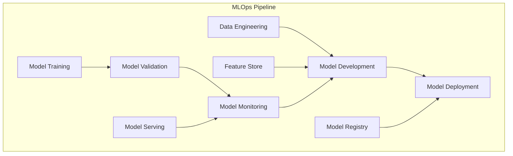

### 2. **MLOps Maturity Levels**
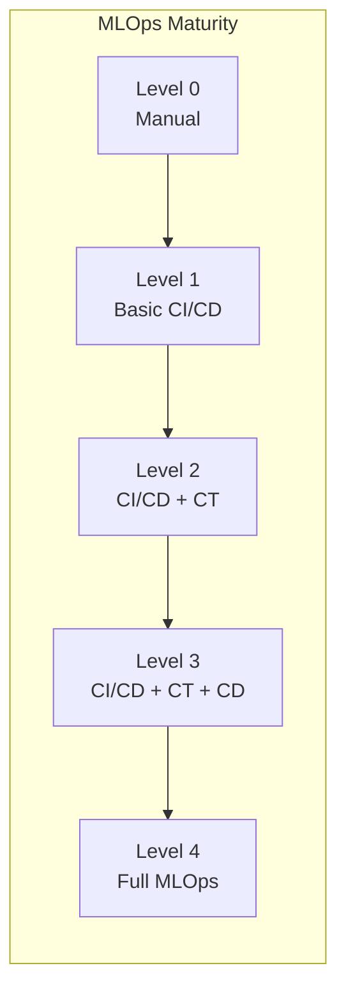

## 2. **Model Lifecycle Management**

### 1. **Model Development Workflow**
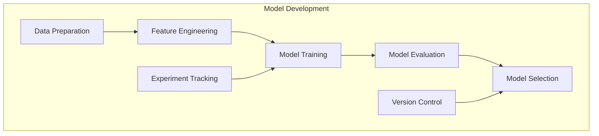

### 2. **Model Versioning Strategy**
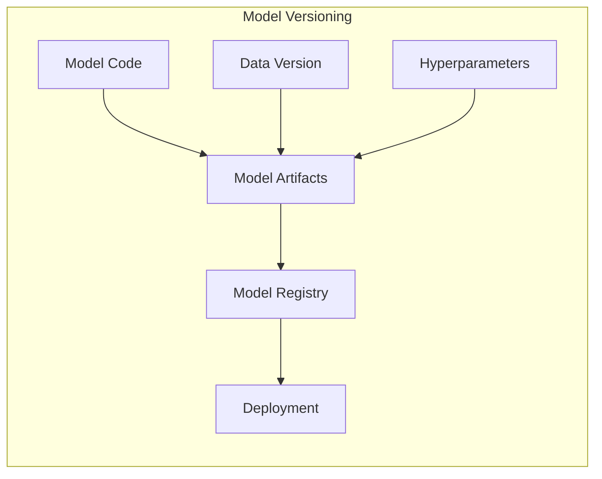

## 3. **Feature Store Implementation**

### 1. **Feature Store Architecture**
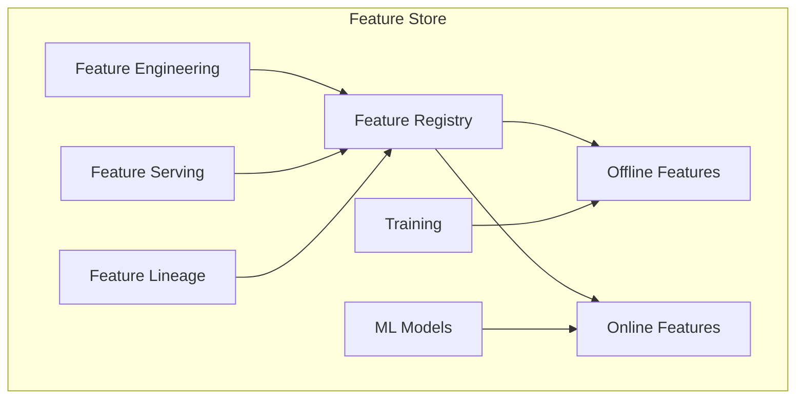

### 2. **Feature Engineering Pipeline**
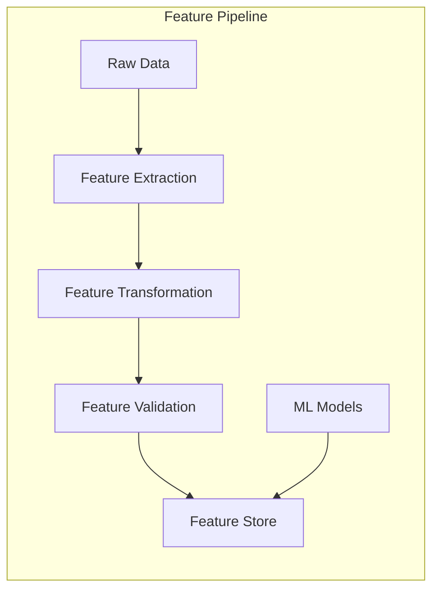

## 4. **Model Deployment & Serving**

### 1. **Model Serving Patterns**
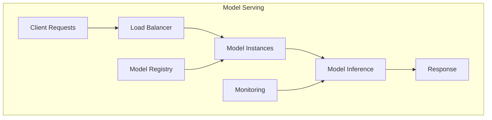

### 2. **Deployment Strategies**
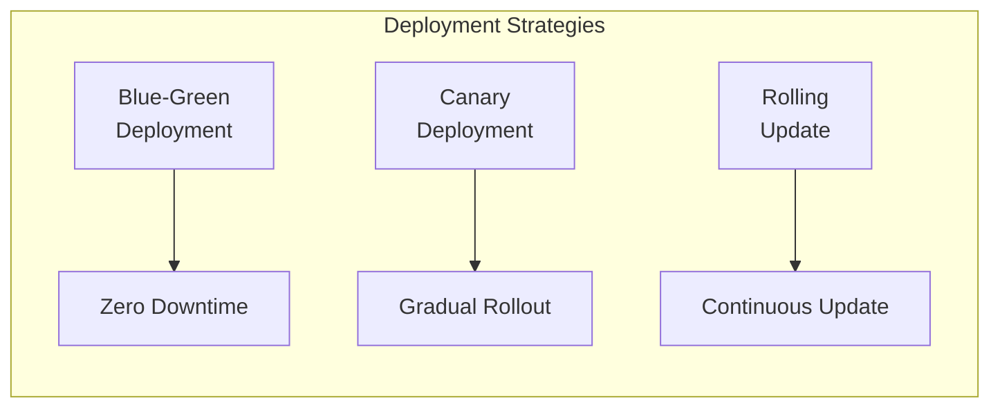

## 5. **Model Monitoring & Observability**

### 1. **Monitoring Architecture**
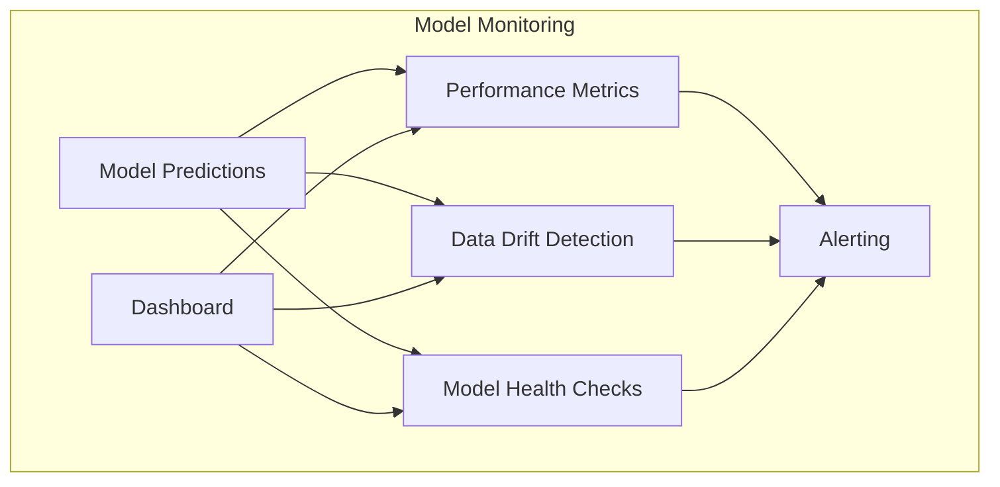

### 2. **Data Drift Detection**
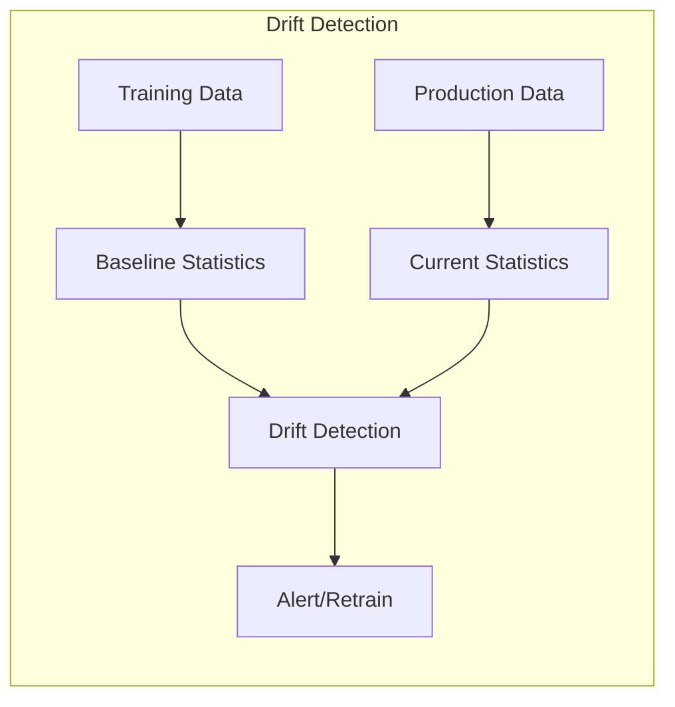

## 6. **MLOps Tools & Infrastructure**

### 1. **MLOps Tool Stack**
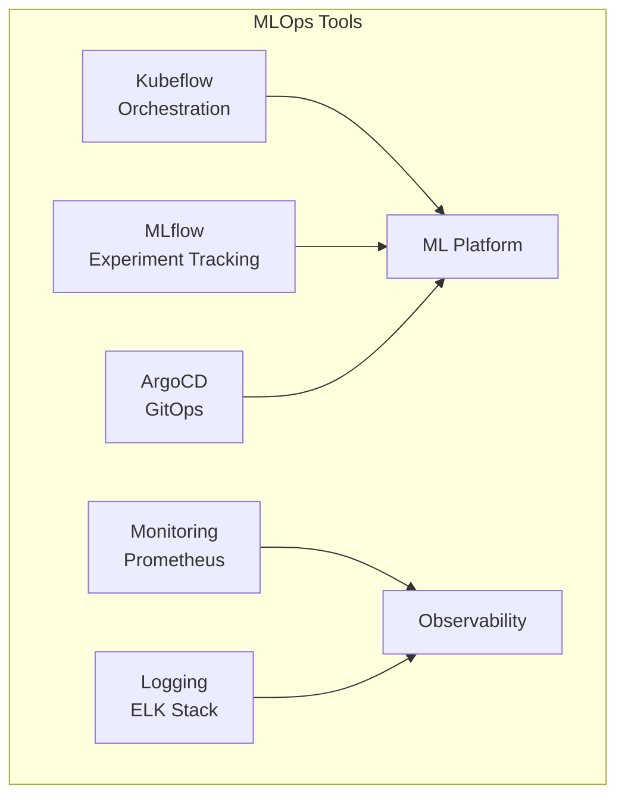

### 2. **Kubernetes MLOps Setup**
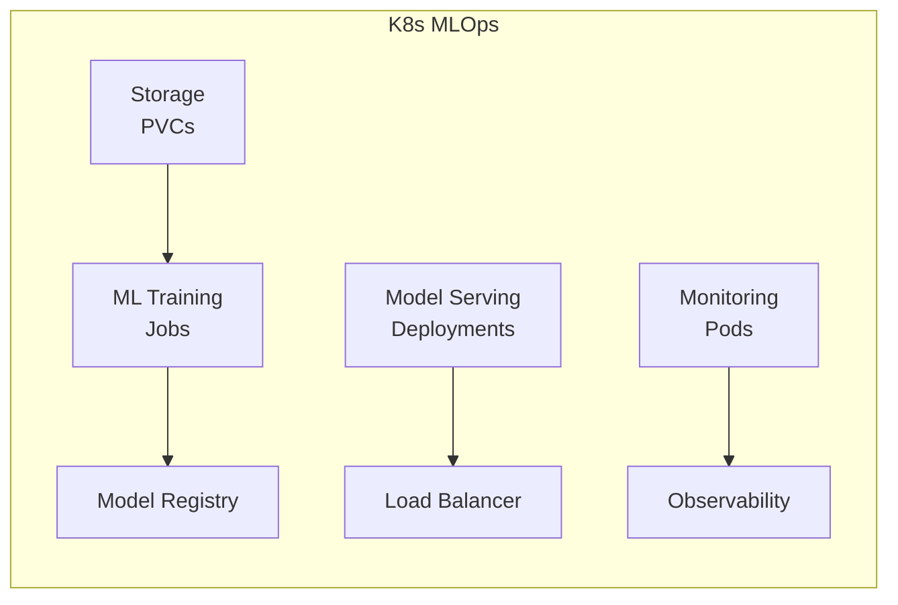

## 7. **Implementation Examples**

### **MLflow Experiment Tracking**
```python
import mlflow
import mlflow.sklearn
from sklearn.ensemble import RandomForestClassifier

class MLExperimentTracker:
    def track_experiment(self, model, X_train, X_test, y_train, y_test, params):
        with mlflow.start_run():
            # Log parameters
            mlflow.log_params(params)
            
            # Train model
            model.fit(X_train, y_train)
            
            # Log metrics
            train_score = model.score(X_train, y_train)
            test_score = model.score(X_test, y_test)
            
            mlflow.log_metric("train_accuracy", train_score)
            mlflow.log_metric("test_accuracy", test_score)
            
            # Log model
            mlflow.sklearn.log_model(model, "random_forest_model")
            
            return mlflow.active_run().info.run_id
```

### **Model Versioning with Semantic Versioning**
```python
class ModelVersioning:
    def __init__(self):
        self.version_pattern = r"^(\d+)\.(\d+)\.(\d+)$"
    
    def create_version(self, major, minor, patch):
        """Create semantic version for model"""
        return f"{major}.{minor}.{patch}"
    
    def increment_version(self, current_version, increment_type):
        """Increment version based on type (major, minor, patch)"""
        major, minor, patch = map(int, current_version.split('.'))
        
        if increment_type == "major":
            return f"{major + 1}.0.0"
        elif increment_type == "minor":
            return f"{major}.{minor + 1}.0"
        elif increment_type == "patch":
            return f"{major}.{minor}.{patch + 1}"
        
        return current_version
```

### **Feature Store Operations**
```python
class FeatureStore:
    def __init__(self, offline_store, online_store):
        self.offline_store = offline_store
        self.online_store = online_store
    
    def store_features(self, feature_set, features, metadata):
        """Store features in both offline and online stores"""
        # Store in offline store for training
        self.offline_store.store(feature_set, features, metadata)
        
        # Store in online store for serving
        self.online_store.store(feature_set, features, metadata)
    
    def get_features(self, feature_set, entity_ids, feature_names):
        """Retrieve features for model serving"""
        return self.online_store.get(feature_set, entity_ids, feature_names)
    
    def get_training_features(self, feature_set, start_date, end_date):
        """Retrieve features for model training"""
        return self.offline_store.get(feature_set, start_date, end_date)
```

### **FastAPI Model Serving**
```python
from fastapi import FastAPI, HTTPException
from pydantic import BaseModel
import joblib
import numpy as np

app = FastAPI(title="ML Model API", version="1.0.0")

class PredictionRequest(BaseModel):
    features: list[float]
    
class PredictionResponse(BaseModel):
    prediction: float
    confidence: float
    model_version: str

# Load model
model = joblib.load("model.pkl")
model_version = "1.0.0"

@app.post("/predict", response_model=PredictionResponse)
async def predict(request: PredictionRequest):
    try:
        features = np.array(request.features).reshape(1, -1)
        prediction = model.predict(features)[0]
        confidence = model.predict_proba(features).max()
        
        return PredictionResponse(
            prediction=float(prediction),
            confidence=float(confidence),
            model_version=model_version
        )
    except Exception as e:
        raise HTTPException(status_code=500, detail=str(e))
```

### **Batch Model Serving**
```python
class BatchModelServing:
    def __init__(self, model_path, batch_size=1000):
        self.model = joblib.load(model_path)
        self.batch_size = batch_size
    
    def predict_batch(self, data):
        """Process predictions in batches"""
        predictions = []
        
        for i in range(0, len(data), self.batch_size):
            batch = data[i:i + self.batch_size]
            batch_predictions = self.model.predict(batch)
            predictions.extend(batch_predictions)
        
        return predictions
    
    def predict_with_metadata(self, data, metadata):
        """Predict with additional metadata"""
        predictions = self.predict_batch(data)
        
        return {
            'predictions': predictions,
            'metadata': metadata,
            'timestamp': datetime.now().isoformat(),
            'batch_size': self.batch_size
        }
```

### **Blue-Green Deployment**
```python
class BlueGreenDeployment:
    def __init__(self, k8s_client):
        self.k8s_client = k8s_client
        self.blue_deployment = "model-blue"
        self.green_deployment = "model-green"
    
    def deploy_green(self, model_version):
        """Deploy new version to green environment"""
        # Update green deployment
        self.k8s_client.update_deployment(
            self.green_deployment,
            image=f"model:{model_version}"
        )
        
        # Wait for green to be ready
        self._wait_for_deployment_ready(self.green_deployment)
        
        return True
    
    def switch_traffic(self):
        """Switch traffic from blue to green"""
        # Update service to point to green
        self.k8s_client.update_service(
            "model-service",
            selector={"app": self.green_deployment}
        )
        
        return True
    
    def rollback_to_blue(self):
        """Rollback to blue deployment if issues occur"""
        self.k8s_client.update_service(
            "model-service",
            selector={"app": self.blue_deployment}
        )
        
        return True
```

### **Canary Deployment**
```python
class CanaryDeployment:
    def __init__(self, k8s_client):
        self.k8s_client = k8s_client
        self.stable_deployment = "model-stable"
        self.canary_deployment = "model-canary"
    
    def deploy_canary(self, model_version, traffic_percentage=10):
        """Deploy canary with specified traffic percentage"""
        # Deploy canary
        self.k8s_client.update_deployment(
            self.canary_deployment,
            image=f"model:{model_version}"
        )
        
        # Update traffic split
        self._update_traffic_split(traffic_percentage)
        
        return True
    
    def increase_canary_traffic(self, percentage):
        """Gradually increase canary traffic"""
        self._update_traffic_split(percentage)
        
        return True
    
    def promote_canary(self):
        """Promote canary to stable"""
        # Update stable deployment
        self.k8s_client.update_deployment(
            self.stable_deployment,
            image=self._get_canary_image()
        )
        
        # Route all traffic to stable
        self._update_traffic_split(100)
        
        return True
```

### **Model Monitoring Service**
```python
class ModelMonitoringService:
    def __init__(self):
        self.metrics = {}
        self.alerts = []
    
    def record_prediction(self, model_id, features, prediction, actual=None):
        """Record prediction for monitoring"""
        timestamp = datetime.now()
        
        if model_id not in self.metrics:
            self.metrics[model_id] = {
                'predictions': [],
                'performance': {},
                'drift_scores': {}
            }
        
        self.metrics[model_id]['predictions'].append({
            'timestamp': timestamp,
            'features': features,
            'prediction': prediction,
            'actual': actual
        })
        
        # Check for data drift
        self._check_data_drift(model_id, features)
        
        # Update performance metrics if actual is provided
        if actual is not None:
            self._update_performance_metrics(model_id, prediction, actual)
    
    def _check_data_dift(self, model_id, features):
        """Check for data drift using statistical tests"""
        # Implementation for drift detection
        pass
    
    def _update_performance_metrics(self, model_id, prediction, actual):
        """Update model performance metrics"""
        # Implementation for performance tracking
        pass
    
    def get_model_health(self, model_id):
        """Get overall health status of model"""
        if model_id not in self.metrics:
            return "unknown"
        
        # Check various health indicators
        health_score = self._calculate_health_score(model_id)
        
        if health_score > 0.8:
            return "healthy"
        elif health_score > 0.6:
            return "warning"
        else:
            return "critical"
```

### **Data Drift Detection**
```python
from scipy import stats
import numpy as np

class DataDriftDetector:
    def __init__(self, baseline_data):
        self.baseline_data = baseline_data
        self.baseline_stats = self._calculate_statistics(baseline_data)
    
    def detect_drift(self, current_data, threshold=0.05):
        """Detect data drift using statistical tests"""
        current_stats = self._calculate_statistics(current_data)
        
        drift_results = {}
        
        for column in self.baseline_stats.keys():
            if column in current_stats:
                # Perform Kolmogorov-Smirnov test
                ks_stat, p_value = stats.ks_2samp(
                    self.baseline_data[column],
                    current_data[column]
                )
                
                drift_results[column] = {
                    'ks_statistic': ks_stat,
                    'p_value': p_value,
                    'drift_detected': p_value < threshold
                }
        
        return drift_results
    
    def _calculate_statistics(self, data):
        """Calculate basic statistics for data"""
        stats = {}
        
        for column in data.columns:
            if data[column].dtype in ['int64', 'float64']:
                stats[column] = {
                    'mean': data[column].mean(),
                    'std': data[column].std(),
                    'min': data[column].min(),
                    'max': data[column].max()
                }
            else:
                stats[column] = {
                    'unique_count': data[column].nunique(),
                    'most_common': data[column].mode().iloc[0] if not data[column].mode().empty else None
                }
        
        return stats
```

### **Model Health Checks**
```python
class ModelHealthChecker:
    def __init__(self, model, health_thresholds):
        self.model = model
        self.thresholds = health_thresholds
        self.health_history = []
    
    def perform_health_check(self):
        """Perform comprehensive model health check"""
        health_status = {
            'timestamp': datetime.now(),
            'overall_status': 'healthy',
            'checks': {}
        }
        
        # Check model loading
        health_status['checks']['model_loading'] = self._check_model_loading()
        
        # Check prediction capability
        health_status['checks']['prediction_capability'] = self._check_prediction_capability()
        
        # Check performance metrics
        health_status['checks']['performance'] = self._check_performance_metrics()
        
        # Check resource usage
        health_status['checks']['resource_usage'] = self._check_resource_usage()
        
        # Determine overall status
        failed_checks = [check for check in health_status['checks'].values() if not check['status']]
        
        if failed_checks:
            health_status['overall_status'] = 'unhealthy'
            health_status['failed_checks'] = failed_checks
        
        # Store health history
        self.health_history.append(health_status)
        
        return health_status
    
    def _check_model_loading(self):
        """Check if model can be loaded and accessed"""
        try:
            # Test model access
            _ = self.model.get_params()
            return {'status': True, 'message': 'Model loaded successfully'}
        except Exception as e:
            return {'status': False, 'message': f'Model loading failed: {str(e)}'}
    
    def _check_prediction_capability(self):
        """Check if model can make predictions"""
        try:
            # Create dummy input for prediction test
            dummy_input = np.zeros((1, self.model.n_features_in_))
            _ = self.model.predict(dummy_input)
            return {'status': True, 'message': 'Prediction capability verified'}
        except Exception as e:
            return {'status': False, 'message': f'Prediction test failed: {str(e)}'}
    
    def _check_performance_metrics(self):
        """Check if performance metrics meet thresholds"""
        # Implementation for performance checking
        return {'status': True, 'message': 'Performance metrics within thresholds'}
    
    def _check_resource_usage(self):
        """Check resource usage and memory consumption"""
        # Implementation for resource checking
        return {'status': True, 'message': 'Resource usage normal'}
```

## 8. **MLOps CI/CD Pipeline**

### **GitHub Actions for MLOps**
```yaml
name: MLOps Pipeline

on:
  push:
    branches: [main, develop]
  pull_request:
    branches: [main]

jobs:
  test:
    runs-on: ubuntu-latest
    steps:
      - uses: actions/checkout@v3
      - name: Set up Python
        uses: actions/setup-python@v4
        with:
          python-version: '3.9'
      
      - name: Install dependencies
        run: |
          pip install -r requirements.txt
          pip install pytest pytest-cov
      
      - name: Run tests
        run: |
          pytest --cov=src --cov-report=xml
      
      - name: Upload coverage
        uses: codecov/codecov-action@v3
        with:
          file: ./coverage.xml

  train:
    needs: test
    runs-on: ubuntu-latest
    if: github.ref == 'refs/heads/main'
    steps:
      - uses: actions/checkout@v3
      - name: Train model
        run: |
          python src/train.py
      
      - name: Log to MLflow
        run: |
          python src/log_model.py

  deploy:
    needs: train
    runs-on: ubuntu-latest
    if: github.ref == 'refs/heads/main'
    steps:
      - uses: actions/checkout@v3
      - name: Deploy to staging
        run: |
          kubectl apply -f k8s/staging/
      
      - name: Run integration tests
        run: |
          python tests/integration_test.py
      
      - name: Deploy to production
        run: |
          kubectl apply -f k8s/production/
```

### **ArgoCD Application for MLOps**
```yaml
apiVersion: argoproj.io/v1alpha1
kind: Application
metadata:
  name: mlops-platform
  namespace: argocd
spec:
  project: default
  source:
    repoURL: https://github.com/your-org/mlops-manifests
    targetRevision: HEAD
    path: k8s
  destination:
    server: https://kubernetes.default.svc
    namespace: mlops
  syncPolicy:
    automated:
      prune: true
      selfHeal: true
    syncOptions:
      - CreateNamespace=true
      - PrunePropagationPolicy=foreground
      - PruneLast=true
```

## 9. **Best Practices**

### **MLOps Implementation**
1. **Automation**: Automate all stages of ML lifecycle
2. **Versioning**: Version code, data, and models
3. **Testing**: Implement comprehensive testing strategy
4. **Monitoring**: Monitor models in production
5. **Governance**: Implement model governance policies

### **Model Deployment**
1. **Gradual Rollout**: Use canary or blue-green deployments
2. **Rollback Strategy**: Plan for quick rollbacks
3. **Performance Monitoring**: Monitor model performance continuously
4. **A/B Testing**: Test new models against production

### **Model Monitoring**
1. **Data Drift Detection**: Monitor for data distribution changes
2. **Performance Tracking**: Track accuracy, latency, and throughput
3. **Alerting**: Set up alerts for model degradation
4. **Retraining Triggers**: Automate model retraining when needed

---

**Next Section**: [Infrastructure & DevOps](../04-Infrastructure/README.md)
