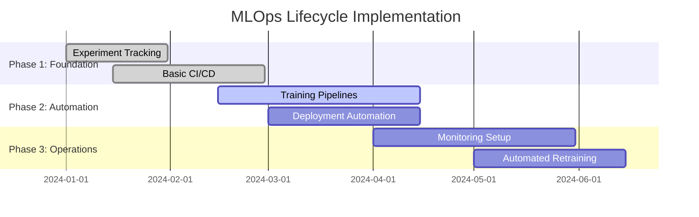
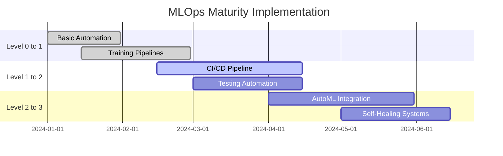
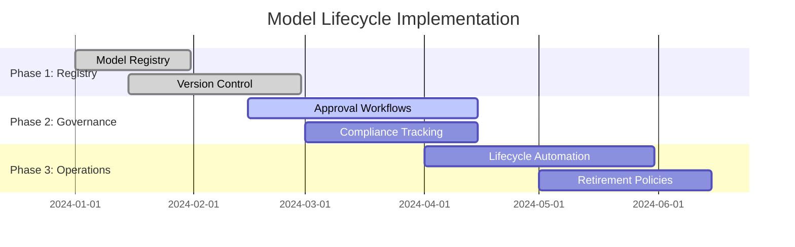
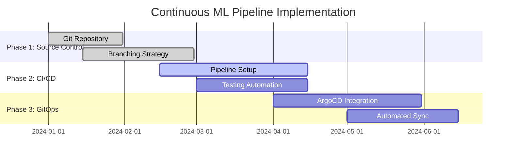
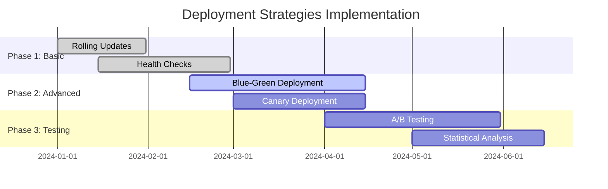
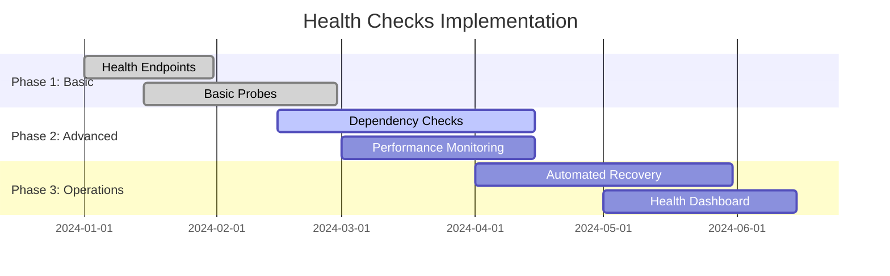
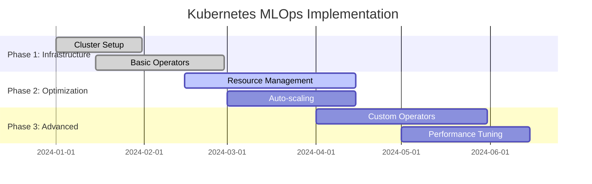
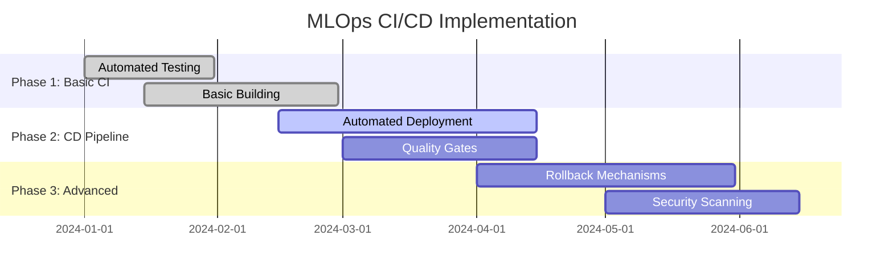
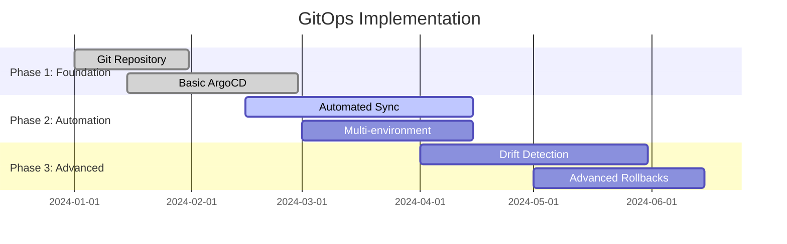

# MLOps - AI/ML Platform Operations

## Overview
This section covers comprehensive MLOps practices, model lifecycle management, and operational excellence for enterprise AI platforms.

## Industry Standards & Best Practices

### 1. MLOps Lifecycle
**Industry Standard:** Google MLOps, Microsoft MLOps, AWS MLOps
**Enterprise Adoption:** 60% of AI organizations

#### Project Features
- **Model Development**: Experiment tracking, version control, collaboration
- **Model Training**: Automated pipelines, hyperparameter tuning, distributed training
- **Model Deployment**: CI/CD, A/B testing, canary deployments
- **Model Monitoring**: Performance tracking, drift detection, alerting

#### Implementation Roadmap

### 2. MLOps Maturity Levels
**Industry Standard:** Google MLOps Maturity Model
**Enterprise Adoption:** 40% at Level 2+, 20% at Level 3+

#### Project Features
- **Level 0: Manual Process**: No automation, manual deployments
- **Level 1: ML Pipeline Automation**: Automated training and deployment
- **Level 2: CI/CD Pipeline**: Automated testing, deployment, monitoring
- **Level 3: Automated ML**: AutoML, automated retraining, self-healing

#### Implementation Roadmap

### 3. Model Lifecycle Management
**Industry Standard:** MLflow, Kubeflow, SageMaker Model Registry
**Enterprise Adoption:** 70% of ML organizations

#### Project Features
- **Model Registry**: Version control, metadata management, approval workflows
- **Model Lineage**: Training data, hyperparameters, model artifacts
- **Model Governance**: Access control, compliance tracking, audit trails
- **Model Retirement**: Deprecation policies, graceful degradation

#### Implementation Roadmap

## MLOps Pipeline Components

### Continuous ML Pipeline
**Industry Standard:** GitOps for ML, ArgoCD, Tekton
**Enterprise Adoption:** 50% of advanced MLOps teams

#### Project Features
- **Source Control**: Git-based model management, branching strategies
- **CI/CD Pipeline**: Automated testing, building, deployment
- **Infrastructure as Code**: Kubernetes manifests, Helm charts
- **GitOps Workflow**: Declarative deployments, automated sync

#### Implementation Roadmap

### Feature Store Implementation
**Industry Standard:** Feast, Tecton, AWS Feature Store
**Enterprise Adoption:** 45% of ML platforms

#### Project Features
- **Feature Engineering**: Automated feature creation, transformation
- **Feature Serving**: Real-time feature serving, batch feature serving
- **Feature Monitoring**: Feature drift detection, quality monitoring
- **Feature Lineage**: Data lineage, impact analysis

#### Implementation Roadmap

## Model Deployment & Serving

### Model Serving Strategies
**Industry Standard:** TensorFlow Serving, Seldon Core, KServe
**Enterprise Adoption:** 80% of ML production systems

#### Project Features
- **Real-time Serving**: REST APIs, gRPC, WebSocket
- **Batch Serving**: Scheduled predictions, bulk processing
- **Model Ensembles**: Multiple model combination, voting strategies
- **Load Balancing**: Traffic distribution, health checks

#### Implementation Roadmap

### Deployment Strategies
**Industry Standard:** Blue-Green, Canary, Rolling Updates
**Enterprise Adoption:** 70% of production ML systems

#### Project Features
- **Blue-Green Deployment**: Zero-downtime deployments, instant rollback
- **Canary Deployment**: Gradual rollout, traffic splitting
- **Rolling Updates**: Incremental updates, health checks
- **A/B Testing**: Experimentation, statistical significance

#### Implementation Roadmap

## Model Monitoring & Observability

### Model Performance Monitoring
**Industry Standard:** Model performance metrics, drift detection
**Enterprise Adoption:** 75% of ML production systems

#### Project Features
- **Performance Metrics**: Accuracy, precision, recall, F1-score
- **Business Metrics**: Revenue impact, user engagement, conversion rates
- **Infrastructure Metrics**: Latency, throughput, resource utilization
- **Custom Metrics**: Business-specific KPIs, domain-specific measures

#### Implementation Roadmap

### Data Drift Detection
**Industry Standard:** Statistical drift detection, distribution analysis
**Enterprise Adoption:** 60% of advanced ML platforms

#### Project Features
- **Statistical Tests**: Kolmogorov-Smirnov, Chi-square, Population Stability Index
- **Distribution Analysis**: Histogram comparison, density estimation
- **Feature Drift**: Individual feature drift detection, correlation analysis
- **Concept Drift**: Model performance degradation, retraining triggers

#### Implementation Roadmap

### Model Health Checks
**Industry Standard:** Health check endpoints, readiness probes
**Enterprise Adoption:** 85% of production ML systems

#### Project Features
- **Health Endpoints**: Model availability, dependency checks
- **Readiness Probes**: Model loading, initialization status
- **Liveness Probes**: Model responsiveness, performance checks
- **Dependency Health**: Database, cache, external service status

#### Implementation Roadmap

## MLOps Tools & Infrastructure

### MLOps Platform Stack
**Industry Standard:** Kubeflow, MLflow, Weights & Biases
**Enterprise Adoption:** 50% of enterprise ML platforms

#### Project Features
- **Experiment Tracking**: MLflow, Weights & Biases, Neptune
- **Pipeline Orchestration**: Kubeflow, Apache Airflow, Argo
- **Model Registry**: MLflow Model Registry, AWS SageMaker
- **Monitoring**: Prometheus, Grafana, MLflow Tracking

#### Implementation Roadmap

### Kubernetes MLOps Setup
**Industry Standard:** Kubernetes operators, custom resources
**Enterprise Adoption:** 65% of cloud-native ML platforms

#### Project Features
- **ML Operators**: Kubeflow operators, custom ML operators
- **Resource Management**: GPU allocation, memory optimization
- **Auto-scaling**: Horizontal Pod Autoscaler, Vertical Pod Autoscaler
- **Resource Quotas**: Namespace quotas, resource limits

#### Implementation Roadmap

## CI/CD for ML

### MLOps CI/CD Pipeline
**Industry Standard:** GitHub Actions, GitLab CI, Jenkins
**Enterprise Adoption:** 70% of ML development teams

#### Project Features
- **Automated Testing**: Unit tests, integration tests, model validation
- **Model Building**: Docker image building, model packaging
- **Deployment**: Automated deployment, rollback mechanisms
- **Quality Gates**: Code quality, model performance, security checks

#### Implementation Roadmap

### GitOps for ML
**Industry Standard:** ArgoCD, Flux, Tekton
**Enterprise Adoption:** 40% of advanced MLOps teams

#### Project Features
- **Declarative Deployments**: Git-based configuration, version control
- **Automated Sync**: Continuous deployment, drift detection
- **Rollback Capabilities**: Git-based rollbacks, version management
- **Multi-environment**: Development, staging, production

#### Implementation Roadmap

## Industry Case Studies

### Financial Services
- **JPMorgan Chase**: MLOps platform, 50% faster model deployment
- **Goldman Sachs**: Automated trading, 99.9% uptime
- **American Express**: Fraud detection, 30% accuracy improvement

### Healthcare
- **Mayo Clinic**: Diagnostic AI, 40% faster diagnosis
- **Kaiser Permanente**: Predictive analytics, 25% cost reduction
- **Cleveland Clinic**: Clinical decision support, 35% error reduction

### Technology
- **Netflix**: Recommendation engine, 20% user engagement increase
- **Uber**: Dynamic pricing, 15% revenue optimization
- **Airbnb**: Search ranking, 25% booking conversion increase

## Success Metrics

### Technical Metrics
- **Model Deployment**: Time to deploy < 1 hour, 99.9% success rate
- **Model Performance**: 95% accuracy, < 5% drift threshold
- **System Reliability**: 99.9% uptime, < 100ms response time

### Business Metrics
- **Time to Market**: 50% reduction in model development time
- **Cost Efficiency**: 30% reduction in ML operations costs
- **Model ROI**: 3x return on ML investment

### Operational Metrics
- **Automation**: 90% automated deployments, 80% automated testing
- **Monitoring**: 100% model coverage, real-time alerting
- **Compliance**: 100% audit trail, regulatory compliance

## Next Steps

1. **Assessment**: Evaluate current MLOps maturity level
2. **Planning**: Create detailed implementation roadmap
3. **Pilot**: Start with small proof of concept
4. **Scale**: Gradually expand to full platform
5. **Optimize**: Continuous improvement and optimization

This comprehensive MLOps framework provides the foundation for building scalable, reliable, and efficient ML operations that can support enterprise AI initiatives while maintaining operational excellence and model governance standards.
