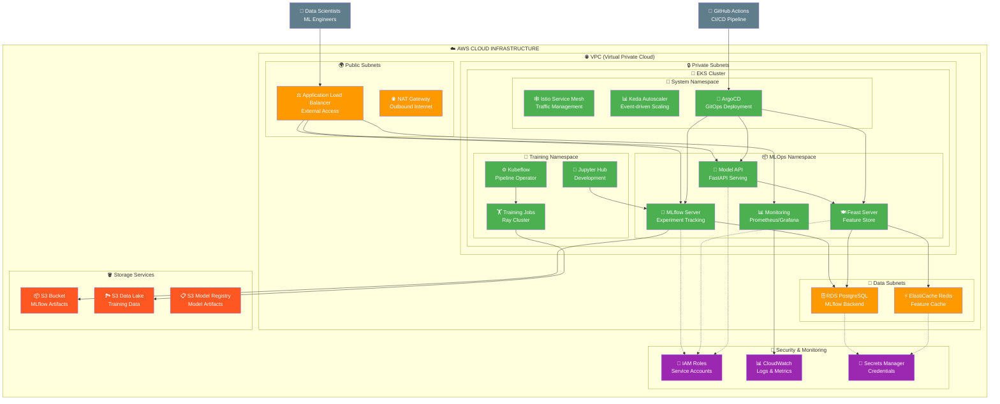
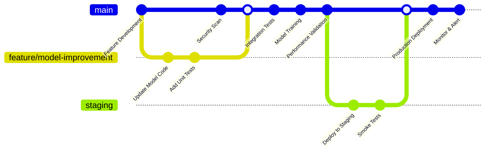
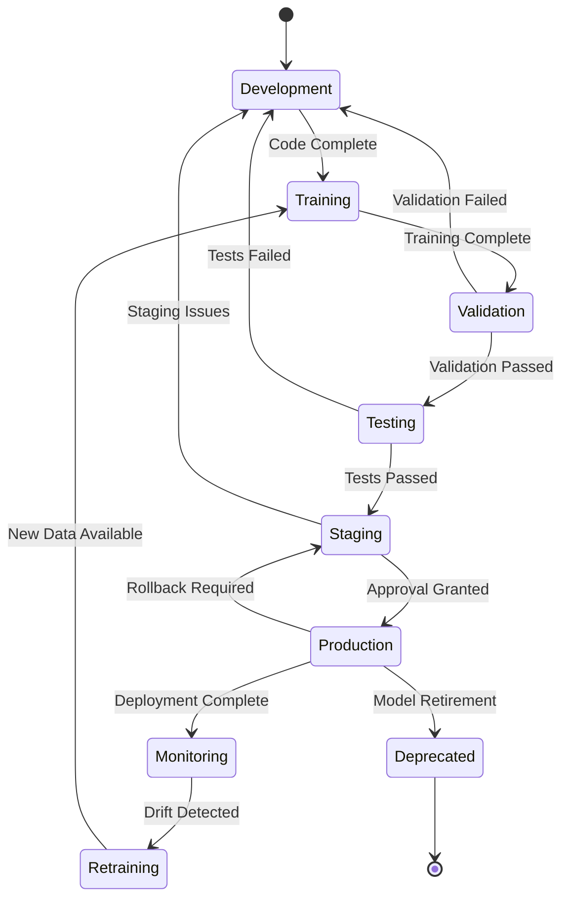

# 🚀 MLOps Lifecycle Management Platform

## 🎯 Project Overview

This is a comprehensive **MLOps Portfolio Project** that demonstrates the complete machine learning lifecycle from experimentation to production deployment and monitoring. The project showcases real-world MLOps practices using modern tools and methodologies for enterprise-scale ML operations.

## 🏢 Business Scenario

**DataTech Solutions** is building an intelligent customer analytics platform that needs:
- **Customer Churn Prediction**: Predict customer churn to enable proactive retention
- **Product Recommendation Engine**: Personalized product recommendations
- **Fraud Detection System**: Real-time fraud detection for transactions
- **Demand Forecasting**: Inventory optimization through demand prediction
- **A/B Testing Framework**: Experimentation platform for feature rollouts

## 🏗️ MLOps Architecture Overview

### **Complete MLOps Lifecycle Platform**

```mermaid
graph TB
    subgraph "🔬 EXPERIMENTATION LAYER"
        A1["🧪 Jupyter<br/>Interactive Development"]
        A2["📊 MLflow<br/>Experiment Tracking"]
        A3["📝 DVC<br/>Data Version Control"]
        A4["🔄 Git<br/>Code Version Control"]
    end

    subgraph "🏗️ TRAINING LAYER"
        B1["🧠 MLflow<br/>Training Orchestration"]
        B2["⚙️ Kubeflow<br/>Pipeline Management"]
        B3["🎯 Optuna<br/>Hyperparameter Optimization"]
        B4["⚡ Ray Train<br/>Distributed Training"]
    end

    subgraph "🚀 DEPLOYMENT LAYER"
        C1["🎯 KServe<br/>Model Serving"]
        C2["🌐 FastAPI<br/>REST APIs"]
        C3["🕸️ Istio<br/>Service Mesh"]
        C4["🔄 ArgoCD<br/>GitOps Deployment"]
    end

    subgraph "🏪 FEATURE LAYER"
        D1["🍽️ Feast<br/>Feature Store"]
        D2["⚡ Redis<br/>Online Features"]
        D3["🗄️ PostgreSQL<br/>Offline Features"]
        D4["📊 Delta Lake<br/>Data Lake"]
    end

    subgraph "📋 REGISTRY LAYER"
        E1["📚 MLflow Registry<br/>Model Versions"]
        E2["🔄 Model Lifecycle<br/>Staging/Production"]
        E3["🧪 A/B Testing<br/>Experiment Framework"]
        E4["🏛️ Governance<br/>Approval Workflows"]
    end

    subgraph "📊 MONITORING LAYER"
        F1["🔍 Evidently<br/>Data & Model Drift"]
        F2["📈 Prometheus<br/>Metrics Collection"]
        F3["📊 Grafana<br/>Visualization"]
        F4["🚨 Alerting<br/>Drift Detection"]
    end

    subgraph "☁️ INFRASTRUCTURE LAYER"
        G1["🎯 Kubernetes<br/>Container Orchestration"]
        G2["🔄 GitHub Actions<br/>CI/CD Pipeline"]
        G3["👁️ Observability<br/>Monitoring Stack"]
    end

    %% Connections
    A1 --> B1
    A2 --> B1
    A3 --> B2
    A4 --> B2
    
    B1 --> C1
    B2 --> C2
    B3 --> C3
    B4 --> C4
    
    D1 --> B1
    D2 --> C1
    D3 --> B2
    D4 --> F1
    
    E1 --> C1
    E2 --> C2
    E3 --> F1
    E4 --> G2
    
    F1 --> G3
    F2 --> G3
    F3 --> G3
    F4 --> B1
    
    G1 --> C1
    G1 --> D2
    G2 --> C4
    G3 --> F2

    %% Styling
    classDef experimentationClass fill:#e1f5fe
    classDef trainingClass fill:#f3e5f5
    classDef deploymentClass fill:#e8f5e8
    classDef featureClass fill:#fff3e0
    classDef registryClass fill:#fce4ec
    classDef monitoringClass fill:#f1f8e9
    classDef infraClass fill:#e3f2fd

    class A1,A2,A3,A4 experimentationClass
    class B1,B2,B3,B4 trainingClass
    class C1,C2,C3,C4 deploymentClass
    class D1,D2,D3,D4 featureClass
    class E1,E2,E3,E4 registryClass
    class F1,F2,F3,F4 monitoringClass
    class G1,G2,G3 infraClass
```



### **MLOps Data Flow Architecture**

```mermaid
flowchart LR
    subgraph "📊 DATA SOURCES"
        DS1["🗂️ Raw Data<br/>Customer Transactions"]
        DS2["📱 Real-time Events<br/>User Interactions"]
        DS3["📈 Business Data<br/>Sales & Inventory"]
    end

    subgraph "🏗️ DATA PROCESSING"
        DP1["🔄 Data Ingestion<br/>Kafka Streams"]
        DP2["🧹 Data Cleaning<br/>Quality Validation"]
        DP3["⚙️ Feature Engineering<br/>Transformation Pipelines"]
    end

    subgraph "🏪 FEATURE STORE"
        FS1["⚡ Online Store<br/>Redis (Real-time)"]
        FS2["🗄️ Offline Store<br/>PostgreSQL (Batch)"]
        FS3["📊 Feature Registry<br/>Metadata & Lineage"]
    end

    subgraph "🧠 ML PIPELINE"
        ML1["🏋️ Model Training<br/>Distributed Learning"]
        ML2["🧪 Experiment Tracking<br/>MLflow"]
        ML3["✅ Model Validation<br/>Performance Testing"]
    end

    subgraph "📋 MODEL REGISTRY"
        MR1["📚 Model Versions<br/>Semantic Versioning"]
        MR2["🏛️ Model Governance<br/>Approval Workflows"]
        MR3["🎯 Model Deployment<br/>Staging & Production"]
    end

    subgraph "🚀 MODEL SERVING"
        MS1["⚡ Real-time Inference<br/>FastAPI + KServe"]
        MS2["📦 Batch Predictions<br/>Scheduled Jobs"]
        MS3["🌐 Edge Deployment<br/>CDN Distribution"]
    end

    subgraph "📊 MONITORING"
        MON1["🔍 Data Drift<br/>Statistical Tests"]
        MON2["📈 Model Performance<br/>Accuracy Tracking"]
        MON3["🚨 Alerting<br/>Automated Responses"]
    end

    %% Data Flow
    DS1 --> DP1
    DS2 --> DP1
    DS3 --> DP1
    
    DP1 --> DP2
    DP2 --> DP3
    
    DP3 --> FS1
    DP3 --> FS2
    DP3 --> FS3
    
    FS2 --> ML1
    ML1 --> ML2
    ML2 --> ML3
    
    ML3 --> MR1
    MR1 --> MR2
    MR2 --> MR3
    
    MR3 --> MS1
    MR3 --> MS2
    MR3 --> MS3
    
    MS1 --> MON1
    MS2 --> MON2
    MS3 --> MON3
    
    MON3 -.-> ML1
    FS1 --> MS1

    %% Styling
    classDef dataClass fill:#e3f2fd
    classDef processClass fill:#f3e5f5
    classDef featureClass fill:#fff3e0
    classDef mlClass fill:#e8f5e8
    classDef registryClass fill:#fce4ec
    classDef servingClass fill:#e1f5fe
    classDef monitorClass fill:#f1f8e9

    class DS1,DS2,DS3 dataClass
    class DP1,DP2,DP3 processClass
    class FS1,FS2,FS3 featureClass
    class ML1,ML2,ML3 mlClass
    class MR1,MR2,MR3 registryClass
    class MS1,MS2,MS3 servingClass
    class MON1,MON2,MON3 monitorClass
```



### **Kubernetes Architecture**



## 📁 Project Structure

```
mlops-lifecycle/
├── README.md                           # This comprehensive overview
├── PORTFOLIO.md                        # 🎯 Portfolio showcase document
├── docs/                              # Comprehensive documentation
│   ├── architecture.md                # Detailed architecture guide
│   ├── setup-guide.md                 # Step-by-step setup instructions
│   ├── mlops-best-practices.md        # MLOps best practices and patterns
│   ├── model-governance.md            # Model governance and compliance
│   └── troubleshooting.md             # Common issues and solutions
├── infrastructure/                     # Infrastructure as Code
│   ├── terraform/                     # Terraform for cloud deployment
│   ├── kubernetes/                    # Kubernetes manifests
│   ├── docker/                        # Docker configurations
│   └── helm-charts/                   # Helm charts for applications
├── ml-models/                         # Machine Learning Models
│   ├── churn-prediction/              # Customer churn prediction model
│   ├── recommendation-engine/         # Product recommendation system
│   ├── fraud-detection/               # Real-time fraud detection
│   └── demand-forecasting/            # Inventory demand forecasting
├── feature-engineering/               # Feature Engineering Pipeline
│   ├── feature-store/                 # Feast feature store configuration
│   ├── transformations/               # Feature transformation pipelines
│   ├── data-quality/                  # Data validation and quality checks
│   └── schemas/                       # Feature and data schemas
├── training/                          # Model Training Infrastructure
│   ├── pipelines/                     # Training pipeline definitions
│   ├── experiments/                   # Experiment tracking setup
│   ├── hyperparameter-optimization/   # HPO configurations
│   └── distributed-training/          # Multi-node training setup
├── serving/                           # Model Serving Infrastructure
│   ├── online-inference/              # Real-time serving (FastAPI, KServe)
│   ├── batch-inference/               # Batch prediction pipelines
│   ├── model-apis/                    # REST/gRPC API implementations
│   └── edge-deployment/               # Edge computing deployments
├── monitoring/                        # Model and System Monitoring
│   ├── model-monitoring/              # Model performance monitoring
│   ├── data-drift/                    # Data drift detection
│   ├── system-monitoring/             # Infrastructure monitoring
│   ├── alerting/                      # Alert rules and notifications
│   └── dashboards/                    # Grafana dashboards
├── governance/                        # Model Governance & Compliance
│   ├── model-registry/                # MLflow model registry setup
│   ├── approval-workflows/            # Model approval and promotion
│   ├── audit-trails/                  # Model lineage and audit logs
│   └── compliance/                    # Regulatory compliance frameworks
├── cicd/                              # CI/CD and Automation
│   ├── github-actions/                # GitHub Actions workflows
│   ├── argocd/                        # GitOps configurations
│   ├── testing/                       # Automated testing frameworks
│   └── deployment/                    # Deployment automation
├── data/                              # Sample Data and Generators
│   ├── datasets/                      # Sample datasets for training
│   ├── generators/                    # Synthetic data generators
│   └── schemas/                       # Data schemas and validation
├── notebooks/                         # Jupyter Notebooks
│   ├── exploration/                   # Data exploration notebooks
│   ├── experiments/                   # Model development experiments
│   ├── tutorials/                     # Learning tutorials
│   └── demos/                         # Portfolio demonstration notebooks
├── tests/                             # Comprehensive Testing Suite
│   ├── unit-tests/                    # Unit tests for components
│   ├── integration-tests/             # Integration testing
│   ├── model-tests/                   # Model validation tests
│   └── performance-tests/             # Performance and load testing
└── scripts/                           # Utility Scripts
    ├── setup/                         # Environment setup scripts
    ├── data-processing/               # Data processing utilities
    ├── model-management/              # Model lifecycle management
    └── deployment/                    # Deployment utilities
```

## 🎓 Learning Objectives

By completing this project, you will master:

### **MLOps Fundamentals**
- End-to-end ML lifecycle management
- Experiment tracking and reproducibility
- Model versioning and registry management
- Feature engineering and feature stores
- Model deployment strategies and patterns

### **Production ML Systems**
- Real-time and batch model serving
- A/B testing and gradual rollouts
- Model monitoring and observability
- Data drift detection and handling
- Automated retraining pipelines

### **MLOps Engineering**
- Infrastructure as Code for ML platforms
- CI/CD pipelines for ML workflows
- Kubernetes-native ML operations
- Model governance and compliance
- Performance optimization and scaling

### **Technology Stack Mastery**
- **MLflow**: Experiment tracking and model registry
- **Kubeflow**: ML workflows and pipelines
- **KServe**: Model serving and inference
- **Feast**: Feature store and feature engineering
- **Evidently**: Model and data monitoring
- **Ray**: Distributed training and hyperparameter optimization

## 🔄 CI/CD Pipeline Architecture



## 📊 Model Lifecycle State Diagram



## 🎯 MLOps Maturity Journey

```mermaid
journey
    title MLOps Maturity Evolution
    section Level 0: Manual
        Manual model training: 1: Data Scientist
        Manual deployment: 1: DevOps
        Manual monitoring: 1: Operations
    section Level 1: DevOps
        Automated testing: 3: Data Scientist, DevOps
        CI/CD pipeline: 4: DevOps
        Basic monitoring: 3: Operations
    section Level 2: Automated ML
        Automated training: 5: MLOps Engineer
        Automated deployment: 5: MLOps Engineer
        Model registry: 4: Data Scientist
    section Level 3: Full MLOps
        Self-healing systems: 5: MLOps Engineer
        Advanced monitoring: 5: MLOps Engineer
        Governance framework: 5: Compliance Team
```

---

**🚀 Ready to Master MLOps?** This comprehensive platform demonstrates production-ready ML operations at enterprise scale. Perfect for building MLOps expertise and showcasing advanced ML engineering skills!
