# 🏗️ MLOps Platform Architecture Documentation

## 📋 Overview

This document provides a comprehensive architectural overview of the MLOps Lifecycle Management Platform, including detailed system design, component interactions, data flows, and deployment patterns.

## 🎯 Architecture Principles

### **Design Philosophy**
- **🔄 Event-Driven**: Reactive, loosely-coupled system components
- **📈 Scalable**: Horizontal and vertical scaling capabilities
- **🛡️ Secure**: Zero-trust security model with encryption everywhere
- **🔍 Observable**: Comprehensive monitoring and logging
- **🏗️ Modular**: Microservices architecture with clear boundaries
- **📦 Cloud-Native**: Kubernetes-native design patterns

## 🏛️ High-Level System Architecture

### **Enterprise MLOps Platform Overview**

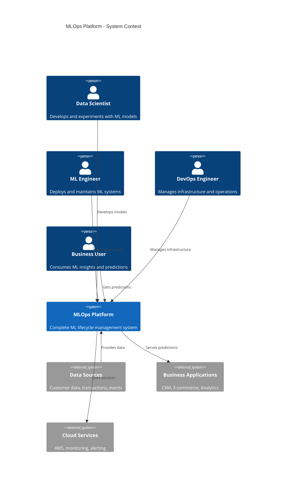

### **Container-Level Architecture**

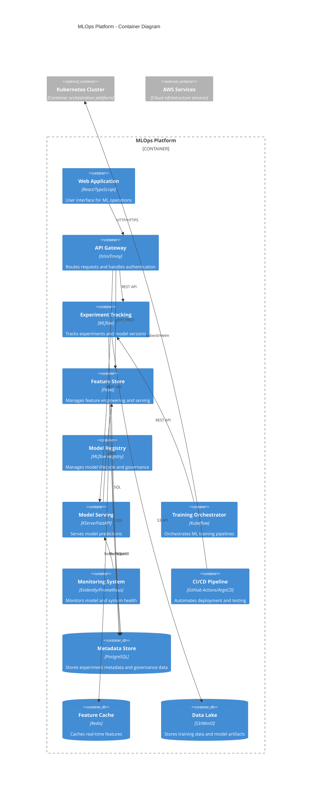

## 🔄 Data Flow Architecture

### **ML Data Pipeline Flow**

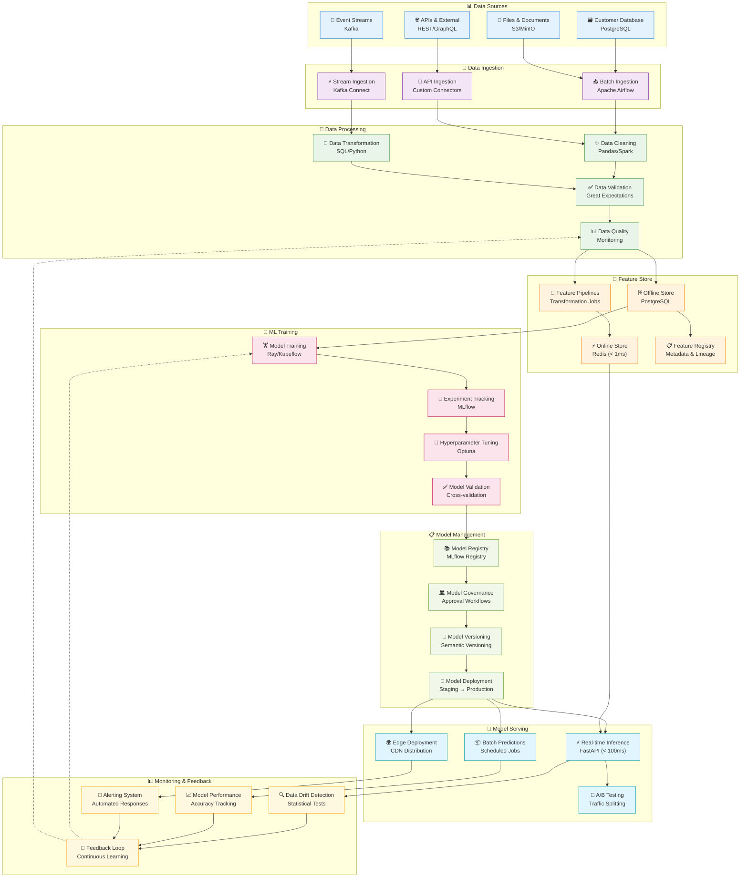

## ☁️ Infrastructure Architecture

### **Kubernetes Deployment Architecture**

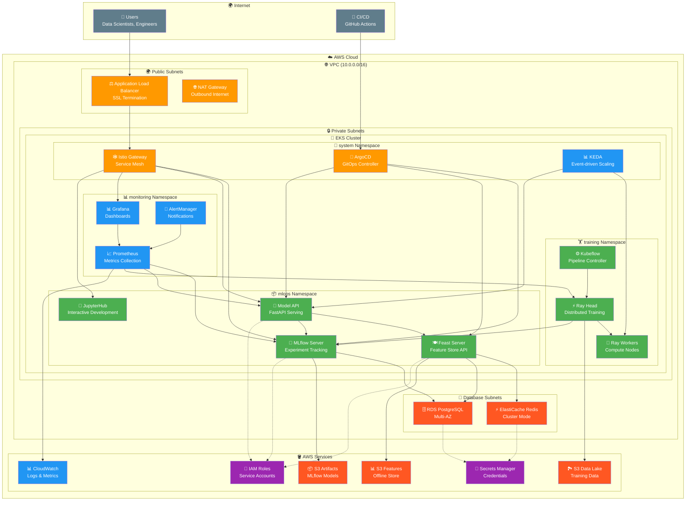

## 🔧 Component Architecture

### **Model Serving Component Details**

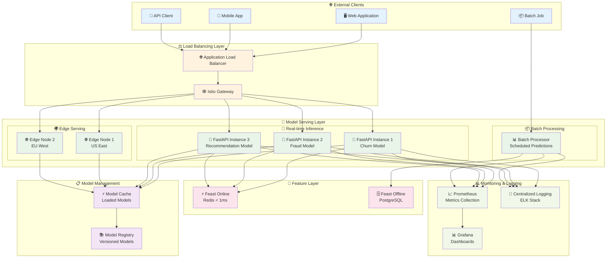

### **Training Pipeline Architecture**

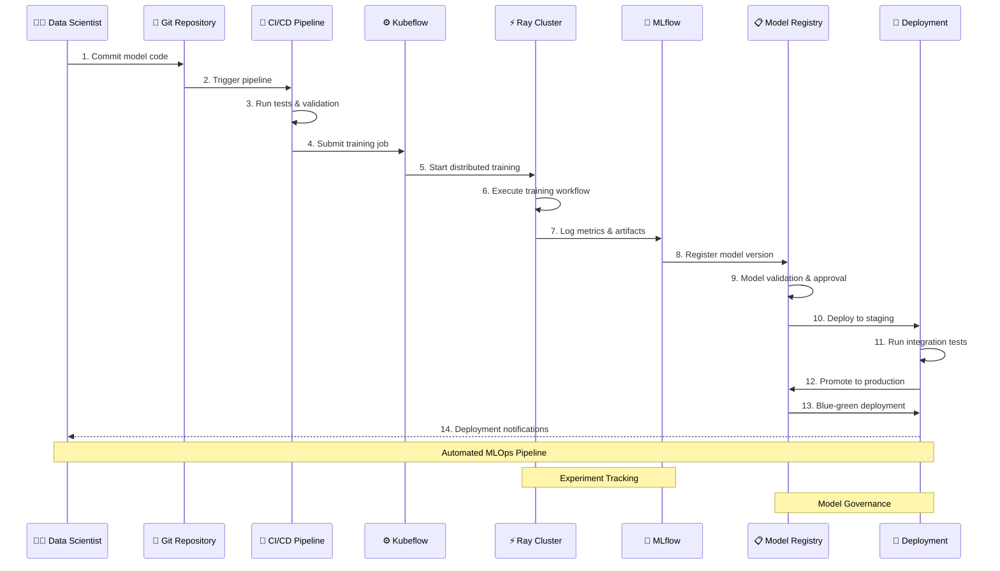

## 🔒 Security Architecture

### **Zero-Trust Security Model**

```mermaid
graph TB
    subgraph "🌍 External Perimeter"
        WAF["🛡️ Web Application Firewall<br/>AWS WAF"]
        DDoS["🛡️ DDoS Protection<br/>AWS Shield"]
    end

    subgraph "🔐 Authentication & Authorization"
        IAM["🎫 AWS IAM<br/>Service Accounts"]
        OIDC["🔑 OIDC Provider<br/>GitHub/Azure AD"]
        RBAC["👥 Kubernetes RBAC<br/>Role-based Access"]
    end

    subgraph "🕸️ Service Mesh Security"
        ISTIO_AUTHZ["🔒 Istio Authorization<br/>Mutual TLS"]
        CERT_MANAGER["📜 Cert Manager<br/>Auto SSL Certs"]
        POLICY["📋 Network Policies<br/>Micro-segmentation"]
    end

    subgraph "🗄️ Data Security"
        ENCRYPT_REST["🔒 Encryption at Rest<br/>AES-256"]
        ENCRYPT_TRANSIT["🔐 Encryption in Transit<br/>TLS 1.3"]
        SECRETS["🔑 Secrets Management<br/>AWS Secrets Manager"]
        KMS["🔐 Key Management<br/>AWS KMS"]
    end

    subgraph "🔍 Monitoring & Compliance"
        AUDIT["📋 Audit Logging<br/>CloudTrail"]
        COMPLIANCE["📊 Compliance Monitoring<br/>AWS Config"]
        SECURITY_SCAN["🔍 Security Scanning<br/>Trivy/Snyk"]
    end

    subgraph "🚨 Incident Response"
        DETECTION["🔍 Threat Detection<br/>GuardDuty"]
        RESPONSE["🚨 Automated Response<br/>Lambda Functions"]
        FORENSICS["🔬 Digital Forensics<br/>AWS Detective"]
    end

    %% Security Flow
    WAF --> DDoS
    DDoS --> OIDC
    OIDC --> IAM
    IAM --> RBAC
    
    RBAC --> ISTIO_AUTHZ
    ISTIO_AUTHZ --> CERT_MANAGER
    CERT_MANAGER --> POLICY
    
    POLICY --> ENCRYPT_REST
    ENCRYPT_REST --> ENCRYPT_TRANSIT
    ENCRYPT_TRANSIT --> SECRETS
    SECRETS --> KMS
    
    KMS --> AUDIT
    AUDIT --> COMPLIANCE
    COMPLIANCE --> SECURITY_SCAN
    
    SECURITY_SCAN --> DETECTION
    DETECTION --> RESPONSE
    RESPONSE --> FORENSICS

    %% Styling
    classDef perimeterClass fill:#f44336,color:#fff
    classDef authClass fill:#ff9800,color:#fff
    classDef meshClass fill:#2196f3,color:#fff
    classDef dataClass fill:#4caf50,color:#fff
    classDef monitorClass fill:#9c27b0,color:#fff
    classDef responseClass fill:#e91e63,color:#fff

    class WAF,DDoS perimeterClass
    class IAM,OIDC,RBAC authClass
    class ISTIO_AUTHZ,CERT_MANAGER,POLICY meshClass
    class ENCRYPT_REST,ENCRYPT_TRANSIT,SECRETS,KMS dataClass
    class AUDIT,COMPLIANCE,SECURITY_SCAN monitorClass
    class DETECTION,RESPONSE,FORENSICS responseClass
```

## 📊 Monitoring & Observability

### **Three Pillars of Observability**

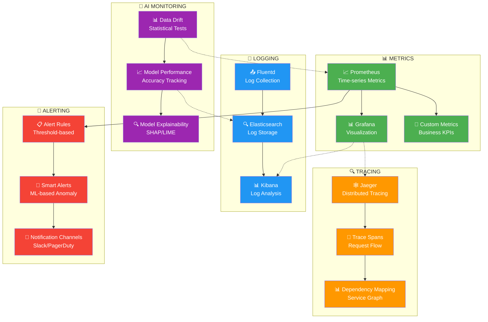

## 🎯 Deployment Patterns

### **Blue-Green Deployment Strategy**

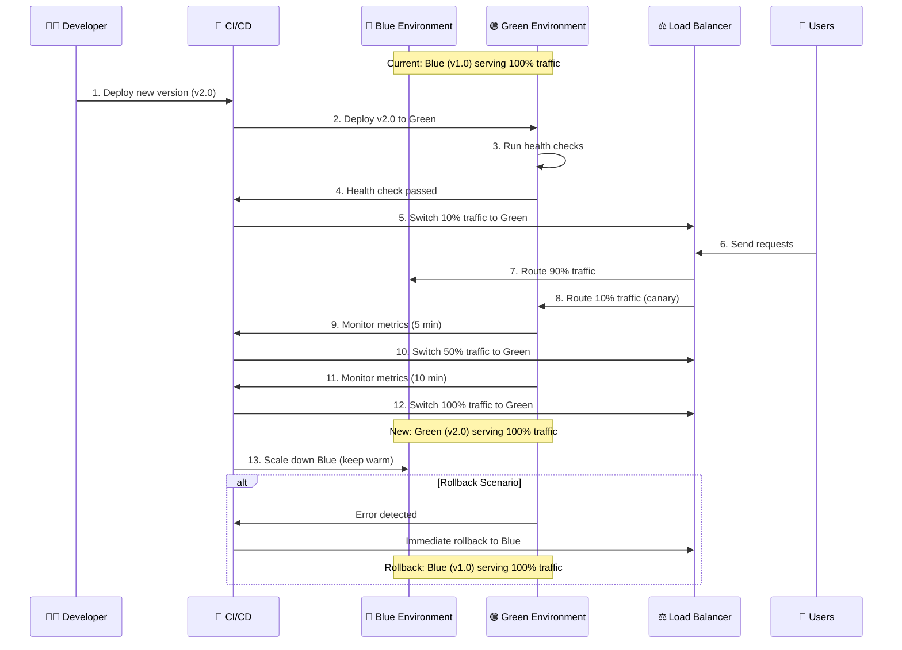

### **Disaster Recovery Architecture**

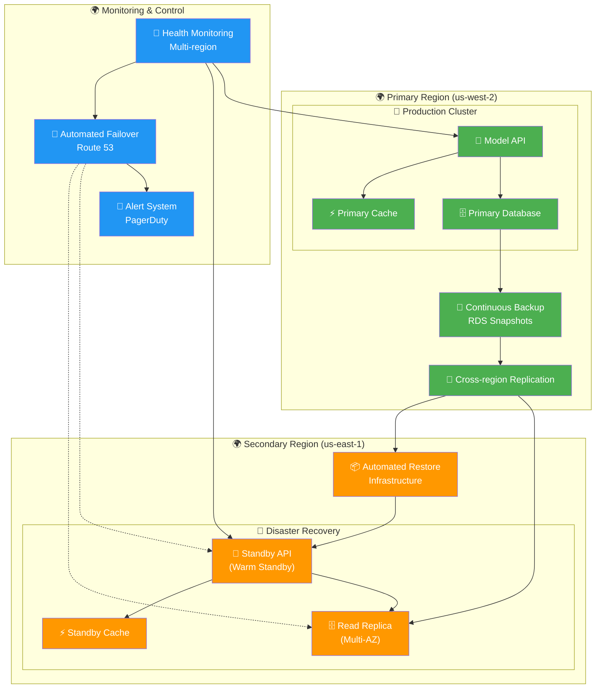

## 📏 Scalability Patterns

### **Auto-scaling Architecture**

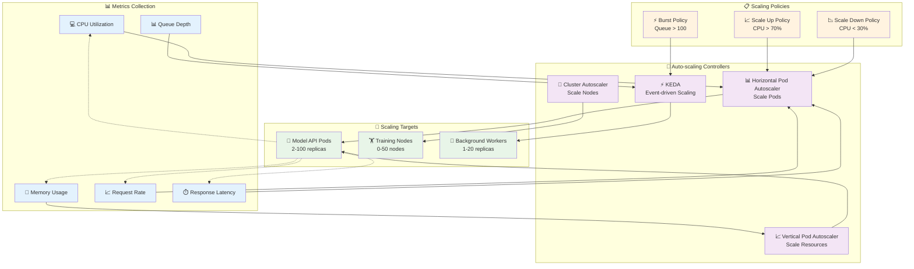

---

## 🎯 Conclusion

This architecture documentation provides a comprehensive view of the MLOps platform's design, emphasizing:

- **🔄 Event-driven architecture** for reactive, scalable systems
- **🛡️ Security-first design** with zero-trust principles
- **📊 Observable systems** with comprehensive monitoring
- **🎯 Production-ready patterns** for high availability and performance
- **📈 Scalable infrastructure** that grows with demand

The platform demonstrates enterprise-grade MLOps capabilities while maintaining simplicity and developer productivity.
