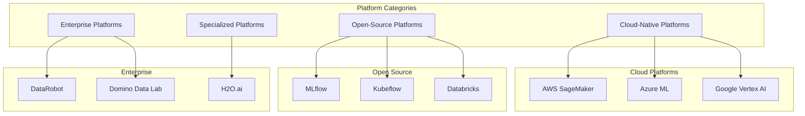
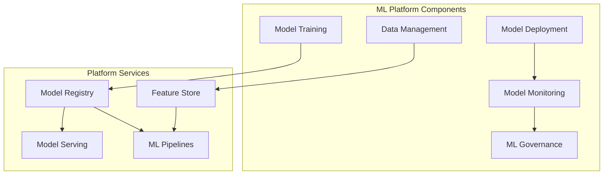
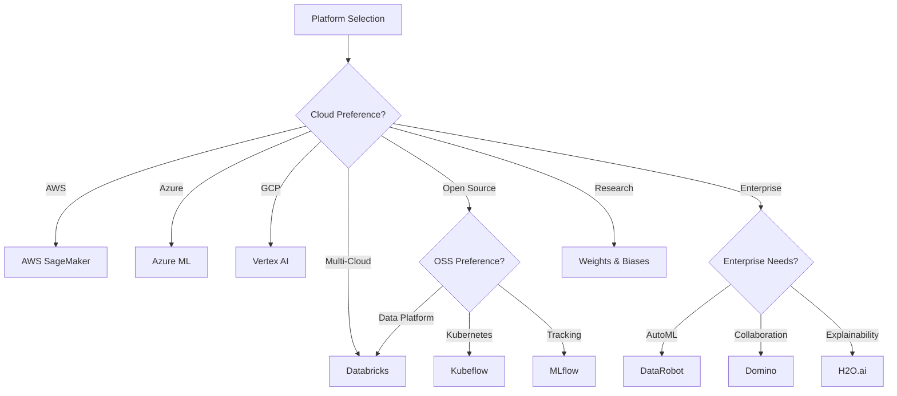

# 🤖 AI/ML Platforms Guide

## 📋 Overview

This comprehensive guide covers major AI/ML platforms available for building, deploying, and managing machine learning workloads. Each platform is documented with use cases, simplified solution architectures, and industry-specific implementations.

## 🎯 Platform Selection Matrix

## 📊 Platform Comparison

| Platform | Type | Best For | Industry Focus |
|----------|------|----------|----------------|
| **AWS SageMaker** | Cloud | End-to-end ML lifecycle | Healthcare, Finance |
| **Azure ML** | Cloud | Enterprise ML workflows | Finance, Manufacturing |
| **Google Vertex AI** | Cloud | AutoML & BigQuery integration | Retail, Media |
| **Databricks** | Cloud/OSS | Data engineering + ML | Manufacturing, Retail |
| **MLflow** | Open Source | Experiment tracking | E-commerce, SaaS |
| **Kubeflow** | Open Source | Kubernetes-native ML | Telecommunications, IoT |
| **DataRobot** | Enterprise | Automated ML | Finance, Insurance |
| **Domino Data Lab** | Enterprise | Data science platform | Pharma, Research |
| **H2O.ai** | Enterprise | AutoML & Explainability | Finance, Healthcare |
| **Weights & Biases** | Specialized | Experiment tracking | Research, Startups |

## 🏗️ Platform Architecture Overview

## 📁 Platform Documentation

### Cloud-Native Platforms

1. **[AWS SageMaker](./aws-sagemaker/)** - Healthcare Industry
   - Medical image analysis
   - Patient risk prediction
   - Drug discovery workflows

2. **[Azure ML](./azure-ml/)** - Finance Industry
   - Fraud detection
   - Credit risk modeling
   - Algorithmic trading

3. **[Google Vertex AI](./google-vertex-ai/)** - Retail Industry
   - Demand forecasting
   - Recommendation systems
   - Customer segmentation

### Open-Source Platforms

4. **[Databricks](./databricks/)** - Manufacturing Industry
   - Predictive maintenance
   - Quality control
   - Supply chain optimization

5. **[MLflow](./mlflow/)** - E-commerce Industry
   - Product recommendations
   - Price optimization
   - Customer lifetime value

6. **[Kubeflow](./kubeflow/)** - Telecommunications Industry
   - Network optimization
   - Customer churn prediction
   - Network anomaly detection

### Enterprise Platforms

7. **[DataRobot](./datarobot/)** - Insurance Industry
   - Claims prediction
   - Underwriting automation
   - Risk assessment

8. **[Domino Data Lab](./domino/)** - Pharmaceutical Industry
   - Drug discovery
   - Clinical trial optimization
   - Research collaboration

9. **[H2O.ai](./h2o-ai/)** - Banking Industry
   - Credit scoring
   - Anti-money laundering
   - Customer analytics

10. **[Weights & Biases](./wandb/)** - Research & Startups
    - Deep learning experiments
    - Hyperparameter optimization
    - Model comparison

## 🎯 Platform Selection Guide

### Decision Framework

### Selection Criteria

| Criteria | Weight | Considerations |
|----------|--------|----------------|
| **Cloud Provider** | High | Existing cloud infrastructure |
| **Cost** | High | Total cost of ownership |
| **Scalability** | High | Ability to handle growth |
| **Ease of Use** | Medium | Developer experience |
| **Features** | Medium | Required capabilities |
| **Vendor Lock-in** | Medium | Portability concerns |
| **Community** | Low | Support and resources |

## 🚀 Quick Start

1. **Identify Requirements**: Determine your ML workload needs
2. **Select Platform**: Use the decision framework above
3. **Review Documentation**: Check platform-specific guides
4. **Implement POC**: Build a proof of concept
5. **Scale**: Expand to production workloads

## 📚 Additional Resources

- [MLOps Best Practices](../README.md)
- [Model Deployment Strategies](../mlops-lifecycle/serving/)
- [Monitoring & Observability](../mlops-lifecycle/monitoring/)

---

**Navigate to specific platform documentation for detailed implementation guides.**

