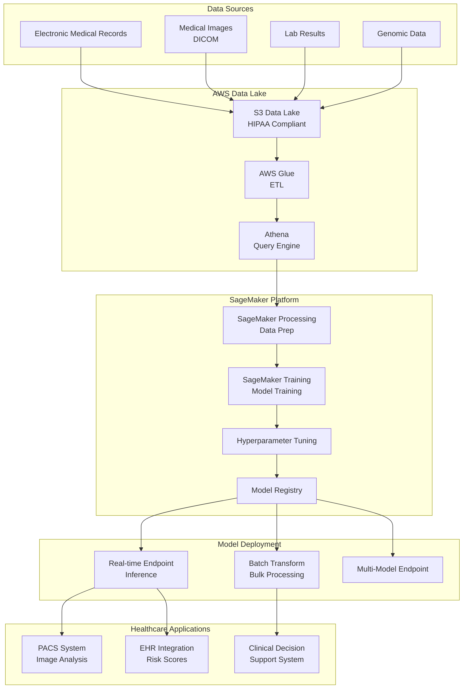
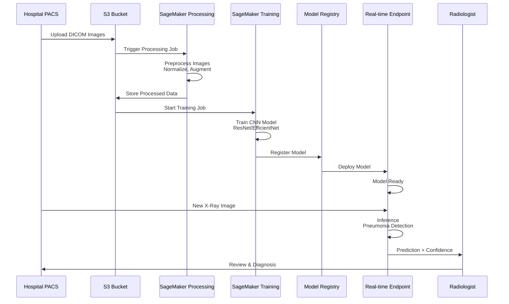
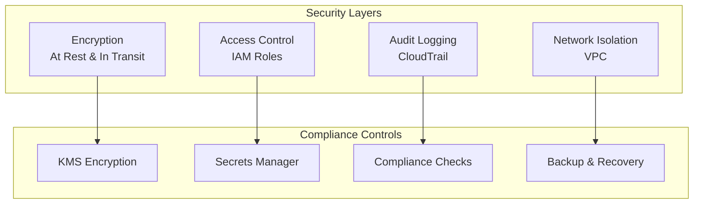
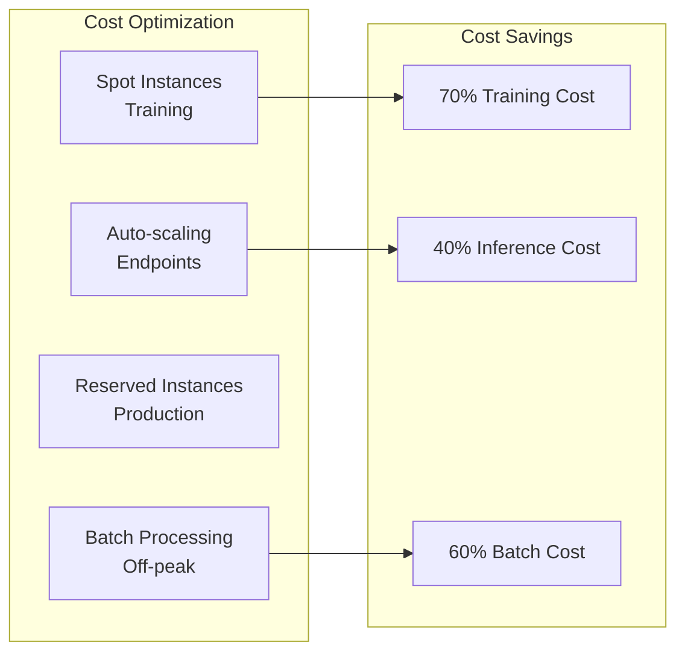

# 🏥 AWS SageMaker - Healthcare Industry

## 📋 Overview

AWS SageMaker is a fully managed machine learning platform that enables data scientists and developers to build, train, and deploy ML models at scale. This guide focuses on healthcare industry use cases.

## 🎯 Use Cases

### Primary Use Cases
- **Medical Image Analysis**: X-ray, MRI, CT scan interpretation
- **Patient Risk Prediction**: Early disease detection and risk stratification
- **Drug Discovery**: Molecular property prediction and compound screening
- **Clinical Decision Support**: Treatment recommendation systems
- **Healthcare Operations**: Resource optimization and scheduling

## 🏗️ Solution Architecture

### Healthcare ML Platform Architecture



## 🏥 Industry-Specific Implementation: Medical Image Analysis

### Use Case: Chest X-Ray Pneumonia Detection



### Architecture Components

```mermaid
graph LR
    subgraph "Data Pipeline"
        DICOM[DICOM Images] --> PREPROCESS[Preprocessing]
        PREPROCESS --> AUGMENT[Data Augmentation]
        AUGMENT --> STORE[Store in S3]
    end
    
    subgraph "Training Pipeline"
        STORE --> TRAIN[Training Job]
        TRAIN --> VALIDATE[Validation]
        VALIDATE --> TUNE[Hyperparameter Tuning]
        TUNE --> REGISTER[Register Model]
    end
    
    subgraph "Inference Pipeline"
        REGISTER --> DEPLOY[Deploy Endpoint]
        DEPLOY --> INFER[Real-time Inference]
        INFER --> MONITOR[Monitor Performance]
    end
```



## 🔧 Implementation Details

### 1. Data Preparation

```python
from sagemaker.processing import ProcessingInput, ProcessingOutput
from sagemaker.processing import ScriptProcessor
import sagemaker

# Initialize SageMaker session
sagemaker_session = sagemaker.Session()
role = sagemaker.get_execution_role()

# Create processing job for medical image preprocessing
processor = ScriptProcessor(
    image_uri='763104351884.dkr.ecr.us-east-1.amazonaws.com/pytorch-training:1.12.0-gpu-py38',
    role=role,
    command=['python3'],
    instance_type='ml.m5.xlarge',
    instance_count=1,
    sagemaker_session=sagemaker_session
)

processor.run(
    code='preprocess_medical_images.py',
    inputs=[
        ProcessingInput(
            source='s3://healthcare-data/dicom-images/',
            destination='/opt/ml/processing/input'
        )
    ],
    outputs=[
        ProcessingOutput(
            source='/opt/ml/processing/output',
            destination='s3://healthcare-data/processed-images/'
        )
    ]
)
```

### 2. Model Training

```python
from sagemaker.pytorch import PyTorch
from sagemaker.tuner import HyperparameterTuner, IntegerParameter, ContinuousParameter

# Define training job
estimator = PyTorch(
    entry_point='train_pneumonia_model.py',
    role=role,
    instance_type='ml.p3.2xlarge',
    instance_count=1,
    framework_version='1.12.0',
    py_version='py38',
    hyperparameters={
        'epochs': 50,
        'batch-size': 32,
        'learning-rate': 0.001
    }
)

# Hyperparameter tuning
hyperparameter_ranges = {
    'learning-rate': ContinuousParameter(0.0001, 0.01),
    'batch-size': IntegerParameter(16, 64),
    'epochs': IntegerParameter(30, 100)
}

tuner = HyperparameterTuner(
    estimator=estimator,
    objective_metric_name='validation:accuracy',
    objective_type='Maximize',
    hyperparameter_ranges=hyperparameter_ranges,
    max_jobs=20,
    max_parallel_jobs=5
)

# Start training
tuner.fit({'training': 's3://healthcare-data/processed-images/train',
           'validation': 's3://healthcare-data/processed-images/val'})
```

### 3. Model Deployment

```python
from sagemaker.model import Model
from sagemaker.predictor import Predictor

# Deploy best model from tuning
best_model = tuner.best_estimator()

# Create model
model = Model(
    image_uri=best_model.image_uri,
    model_data=best_model.model_data,
    role=role
)

# Deploy to real-time endpoint
predictor = model.deploy(
    initial_instance_count=1,
    instance_type='ml.m5.large',
    endpoint_name='pneumonia-detection-endpoint'
)

# Test inference
import numpy as np
from PIL import Image

# Load and preprocess image
image = Image.open('chest_xray.jpg')
image_array = np.array(image) / 255.0
image_array = image_array.reshape(1, 224, 224, 3)

# Predict
prediction = predictor.predict(image_array)
print(f"Pneumonia Probability: {prediction[0][1]:.2%}")
```

### 4. Batch Processing for Historical Data

```python
from sagemaker.transformer import Transformer

# Create transformer for batch processing
transformer = Transformer(
    model_name=model.name,
    instance_type='ml.m5.xlarge',
    instance_count=1,
    output_path='s3://healthcare-data/predictions/batch/'
)

# Process batch of images
transformer.transform(
    data='s3://healthcare-data/dicom-images/batch/',
    content_type='application/x-image',
    split_type='Line'
)
```

## 🔐 Security & Compliance

### HIPAA Compliance Architecture



## 📊 Monitoring & Observability

### Model Monitoring Setup

```python
from sagemaker.model_monitor import ModelMonitor, DefaultModelMonitor
from sagemaker.model_monitor import CronExpressionGenerator

# Create model monitor
monitor = DefaultModelMonitor(
    role=role,
    instance_count=1,
    instance_type='ml.m5.xlarge',
    volume_size_in_gb=20,
    max_runtime_in_seconds=3600
)

# Schedule monitoring
monitor.schedule_monitoring(
    baseline_statistics=baseline_statistics,
    statistics_s3_uri='s3://healthcare-data/monitoring/baseline/',
    constraints_s3_uri='s3://healthcare-data/monitoring/constraints/',
    schedule_cron_expression=CronExpressionGenerator.hourly(),
    output_s3_uri='s3://healthcare-data/monitoring/results/'
)
```

## 💰 Cost Optimization

### Cost Management Strategy



## 📈 Success Metrics

| Metric | Target | Measurement |
|--------|--------|-------------|
| **Model Accuracy** | > 95% | Validation set |
| **Inference Latency** | < 200ms | P95 latency |
| **Endpoint Uptime** | > 99.9% | CloudWatch |
| **Cost per Prediction** | < $0.01 | Cost analysis |
| **Compliance** | 100% | HIPAA audit |

## 🚀 Quick Start

```bash
# Install SageMaker SDK
pip install sagemaker

# Configure AWS credentials
aws configure

# Set up SageMaker session
export SAGEMAKER_ROLE_ARN="arn:aws:iam::ACCOUNT:role/SageMakerRole"

# Run training job
python train_pneumonia_model.py
```

## 📚 Best Practices

1. **Data Privacy**: Always encrypt PHI data at rest and in transit
2. **Model Validation**: Extensive validation before clinical use
3. **Explainability**: Use SageMaker Clarify for model interpretability
4. **Version Control**: Track all model versions in Model Registry
5. **Monitoring**: Continuous monitoring for data drift and model performance
6. **Compliance**: Regular HIPAA compliance audits
7. **Cost Management**: Use spot instances for training, auto-scaling for inference
8. **Documentation**: Maintain detailed documentation for regulatory compliance

---

**Next**: [Azure ML - Finance Industry](../azure-ml/)

