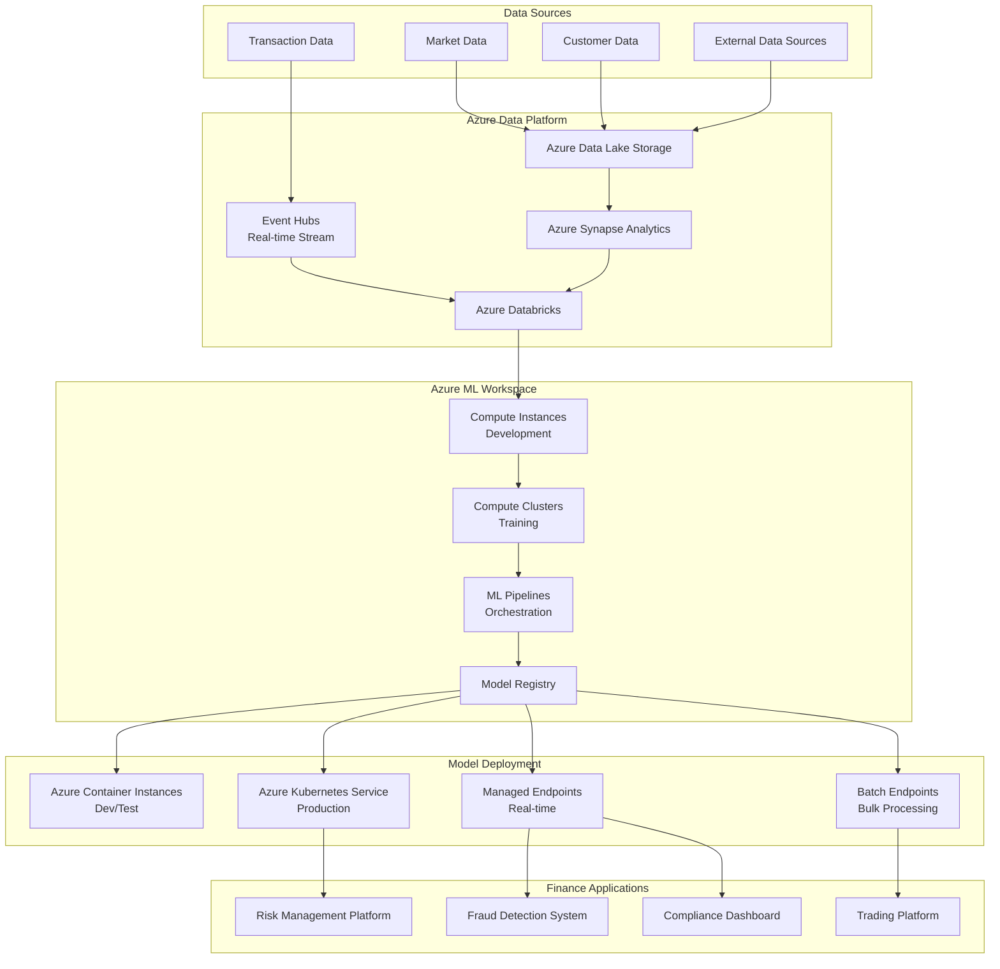
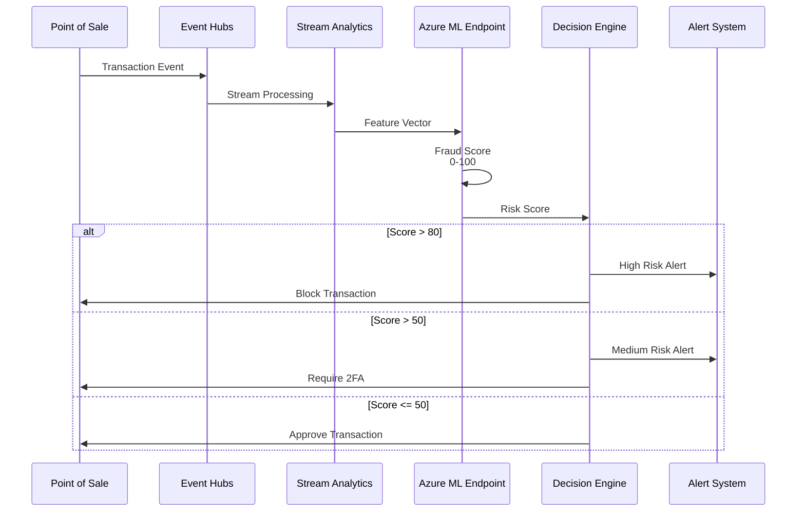
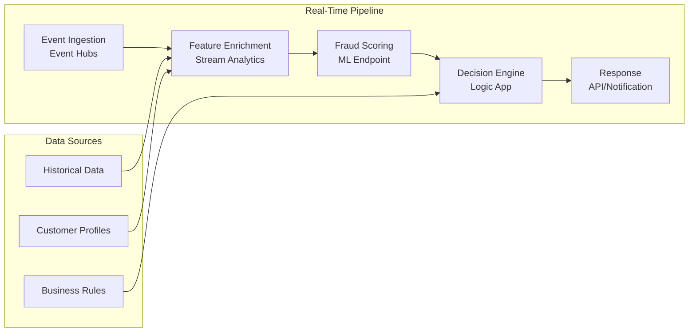
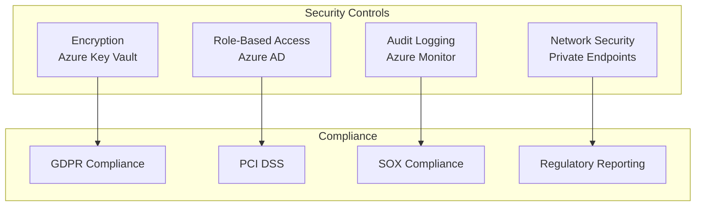
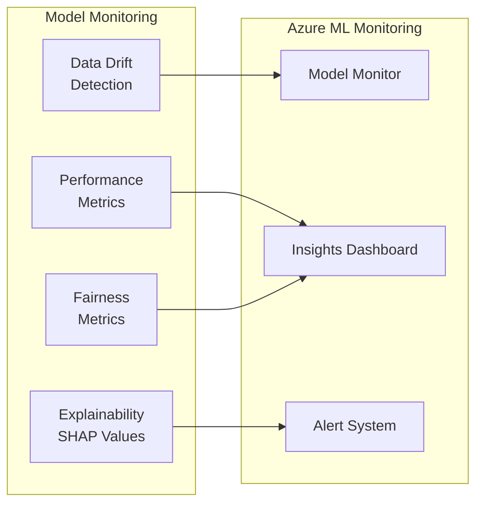
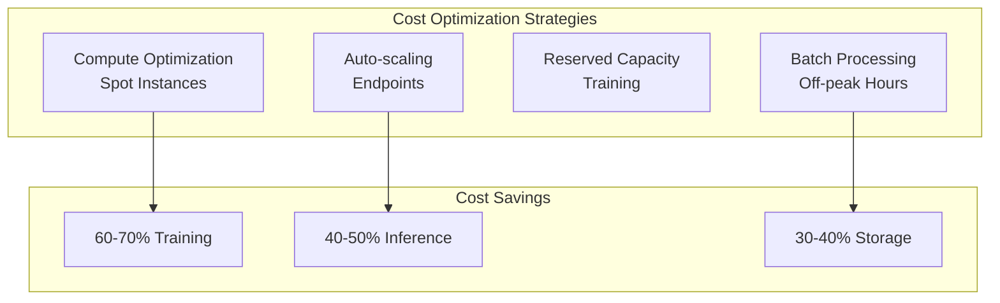

# 💼 Azure Machine Learning - Finance Industry

## 📋 Overview

Azure Machine Learning is a cloud-based platform for building, training, and deploying machine learning models. This guide focuses on finance industry use cases including fraud detection, credit risk modeling, and algorithmic trading.

## 🎯 Use Cases

### Primary Use Cases
- **Fraud Detection**: Real-time transaction fraud detection
- **Credit Risk Modeling**: Credit scoring and risk assessment
- **Algorithmic Trading**: Market prediction and trading strategies
- **Anti-Money Laundering (AML)**: Suspicious activity detection
- **Regulatory Compliance**: Model governance and explainability

## 🏗️ Solution Architecture

### Finance ML Platform Architecture



## 💳 Industry-Specific Implementation: Fraud Detection

### Use Case: Real-Time Transaction Fraud Detection



### Real-Time Fraud Detection Pipeline



## 🔧 Implementation Details

### 1. Azure ML Workspace Setup

```python
from azure.ai.ml import MLClient
from azure.identity import DefaultAzureCredential
from azure.ai.ml.entities import Workspace

# Authenticate
credential = DefaultAzureCredential()

# Create ML Client
ml_client = MLClient(
    credential=credential,
    subscription_id="your-subscription-id",
    resource_group_name="finance-ml-rg",
    workspace_name="finance-ml-ws"
)

# Create workspace
ws = Workspace(
    name="finance-ml-ws",
    location="eastus",
    display_name="Finance ML Workspace",
    description="ML workspace for finance applications"
)

ml_client.workspaces.begin_create(ws)
```

### 2. Fraud Detection Model Training

```python
from azure.ai.ml import command
from azure.ai.ml import Input, Output
from azure.ai.ml.constants import AssetTypes

# Define training job
job = command(
    code="./fraud-detection",
    command="python train_fraud_model.py --data ${{inputs.training_data}} --output ${{outputs.model}}",
    inputs={
        "training_data": Input(
            type=AssetTypes.URI_FILE,
            path="azureml://datastores/workspaceblobstore/paths/fraud_data/train.csv"
        )
    },
    outputs={
        "model": Output(type=AssetTypes.URI_FOLDER, path="./outputs")
    },
    environment="azureml:fraud-detection-env:1",
    compute="fraud-training-cluster",
    experiment_name="fraud-detection-training",
    display_name="Train Fraud Detection Model"
)

# Submit job
returned_job = ml_client.jobs.create_or_update(job)
ml_client.jobs.stream(returned_job.name)
```

### 3. Model Deployment to Managed Endpoint

```python
from azure.ai.ml.entities import ManagedOnlineEndpoint, ManagedOnlineDeployment
from azure.ai.ml import ManagedOnlineEndpoint

# Create endpoint
endpoint = ManagedOnlineEndpoint(
    name="fraud-detection-endpoint",
    description="Real-time fraud detection endpoint",
    auth_mode="key"
)

ml_client.online_endpoints.begin_create_or_update(endpoint)

# Create deployment
deployment = ManagedOnlineDeployment(
    name="fraud-detection-v1",
    endpoint_name="fraud-detection-endpoint",
    model=returned_job.outputs.model,
    environment="azureml:fraud-detection-env:1",
    code_configuration="./fraud-detection",
    instance_type="Standard_DS2_v2",
    instance_count=2,
    scale_settings={
        "scale_type": "auto",
        "min_instances": 1,
        "max_instances": 10,
        "target_utilization_percent": 70
    }
)

ml_client.online_deployments.begin_create_or_update(deployment)

# Set traffic allocation
ml_client.online_endpoints.begin_update_traffic(
    endpoint_name="fraud-detection-endpoint",
    traffic={"fraud-detection-v1": 100}
)
```

### 4. Real-Time Inference

```python
from azure.ai.ml import MLClient
from azure.identity import DefaultAzureCredential

# Initialize client
ml_client = MLClient(
    DefaultAzureCredential(),
    subscription_id="your-subscription-id",
    resource_group_name="finance-ml-rg",
    workspace_name="finance-ml-ws"
)

# Get endpoint
endpoint = ml_client.online_endpoints.get("fraud-detection-endpoint")

# Make prediction
import requests
import json

# Sample transaction data
transaction = {
    "amount": 1500.00,
    "merchant_category": "electronics",
    "transaction_time": "2024-01-15T14:30:00Z",
    "customer_id": "CUST123",
    "location": {"latitude": 40.7128, "longitude": -74.0060},
    "device_id": "DEV456",
    "previous_transactions_count": 25
}

# Get endpoint URL and key
endpoint_url = endpoint.scoring_uri
endpoint_key = ml_client.online_endpoints.get_keys("fraud-detection-endpoint").primary_key

# Make request
headers = {
    "Content-Type": "application/json",
    "Authorization": f"Bearer {endpoint_key}"
}

response = requests.post(
    endpoint_url,
    headers=headers,
    json={"data": [transaction]}
)

fraud_score = response.json()["result"][0]
print(f"Fraud Score: {fraud_score:.2f}")
```

## 🔐 Security & Compliance

### Financial Compliance Architecture



## 📊 Model Monitoring

### Responsible AI Dashboard



## 💰 Cost Optimization

### Cost Management



## 📈 Success Metrics

| Metric | Target | Measurement |
|--------|--------|-------------|
| **Fraud Detection Rate** | > 95% | Precision/Recall |
| **False Positive Rate** | < 2% | Confusion Matrix |
| **Inference Latency** | < 100ms | P95 latency |
| **Model Explainability** | 100% | SHAP values |
| **Compliance** | 100% | Regulatory audit |

## 🚀 Quick Start

```bash
# Install Azure ML SDK
pip install azure-ai-ml azure-identity

# Login to Azure
az login

# Create workspace
az ml workspace create \
  --resource-group finance-ml-rg \
  --name finance-ml-ws \
  --location eastus
```

## 📚 Best Practices

1. **Data Privacy**: Encrypt sensitive financial data
2. **Model Explainability**: Use Azure ML Responsible AI tools
3. **Real-time Processing**: Use Event Hubs + Stream Analytics
4. **Model Versioning**: Track all model versions
5. **Compliance**: Regular regulatory compliance checks
6. **Monitoring**: Continuous model performance monitoring
7. **Cost Management**: Use spot instances and auto-scaling
8. **Security**: Implement network isolation and access controls

---

**Next**: [Google Vertex AI - Retail Industry](../google-vertex-ai/)

