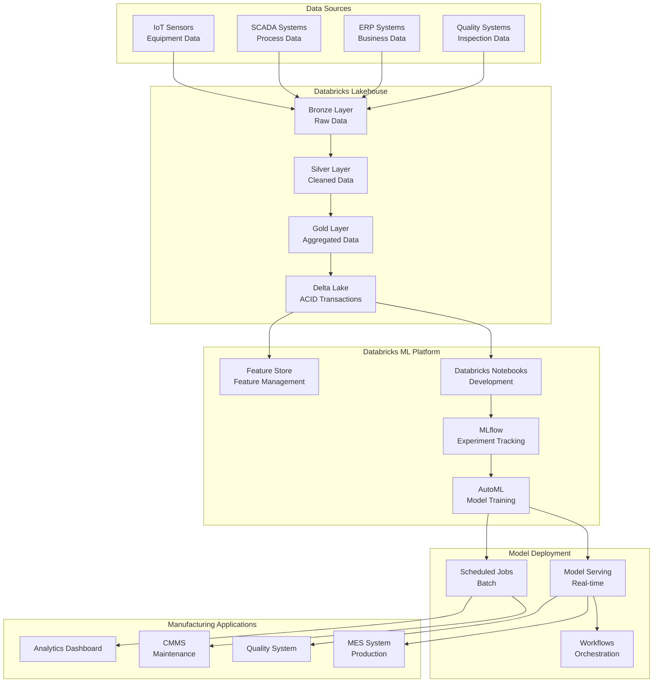
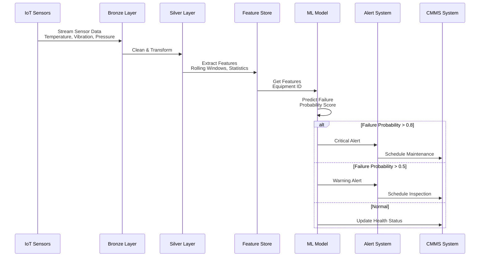
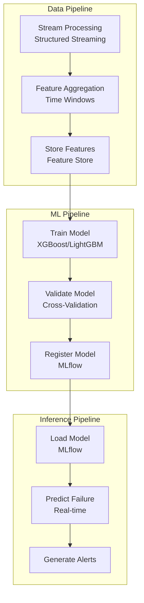
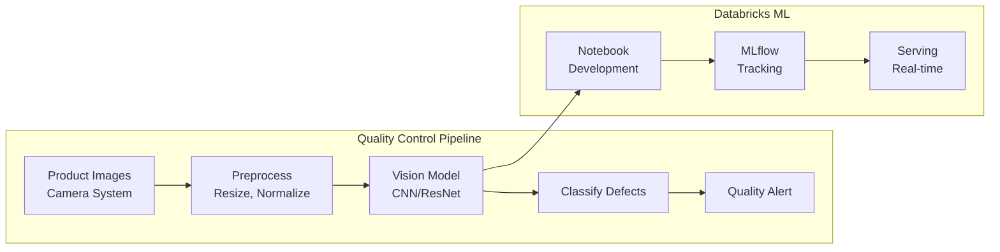
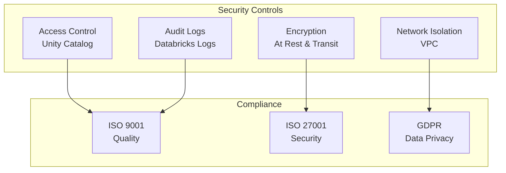

# 🏭 Databricks - Manufacturing Industry

## 📋 Overview

Databricks is a unified analytics platform built on Apache Spark that combines data engineering, data science, and machine learning. This guide focuses on manufacturing industry use cases including predictive maintenance, quality control, and supply chain optimization.

## 🎯 Use Cases

### Primary Use Cases
- **Predictive Maintenance**: Equipment failure prediction
- **Quality Control**: Defect detection and quality assurance
- **Supply Chain Optimization**: Demand forecasting and inventory management
- **Process Optimization**: Production line efficiency
- **Energy Management**: Energy consumption optimization

## 🏗️ Solution Architecture

### Manufacturing ML Platform Architecture



## 🏭 Industry-Specific Implementation: Predictive Maintenance

### Use Case: Equipment Failure Prediction



### Predictive Maintenance Pipeline



## 🔧 Implementation Details

### 1. Databricks Notebook for Feature Engineering

```python
# Databricks notebook code
from pyspark.sql import SparkSession
from pyspark.sql.functions import *
from databricks.feature_store import FeatureStoreClient

# Initialize
spark = SparkSession.builder.appName("PredictiveMaintenance").getOrCreate()
fs = FeatureStoreClient()

# Read sensor data from Delta Lake
sensor_data = spark.read.format("delta").table("bronze.iot_sensors")

# Feature engineering
features_df = sensor_data \
    .withColumn("timestamp", to_timestamp(col("timestamp"))) \
    .groupBy("equipment_id", window("timestamp", "1 hour")) \
    .agg(
        avg("temperature").alias("avg_temperature"),
        stddev("temperature").alias("std_temperature"),
        avg("vibration").alias("avg_vibration"),
        max("vibration").alias("max_vibration"),
        avg("pressure").alias("avg_pressure"),
        count("*").alias("sensor_readings_count")
    ) \
    .withColumn("temperature_trend", 
                col("avg_temperature") - lag("avg_temperature", 1).over(
                    Window.partitionBy("equipment_id").orderBy("window.start")
                )) \
    .withColumn("vibration_trend",
                col("avg_vibration") - lag("avg_vibration", 1).over(
                    Window.partitionBy("equipment_id").orderBy("window.start")
                ))

# Write to feature store
fs.write_table(
    name="manufacturing.equipment_features",
    df=features_df,
    mode="merge"
)
```

### 2. Model Training with MLflow

```python
from databricks import automl
import mlflow
from mlflow.tracking import MlflowClient

# Load features from feature store
features = fs.read_table("manufacturing.equipment_features")
labels = spark.read.format("delta").table("silver.equipment_failures")

# Join features with labels
training_data = features.join(labels, on="equipment_id", how="inner")

# AutoML for predictive maintenance
summary = automl.classify(
    dataset=training_data,
    target_col="failure_occurred",
    timeout_minutes=60,
    experiment_dir="/Shared/predictive_maintenance"
)

# Get best model
best_model = summary.best_trial.model_path
print(f"Best model: {best_model}")

# Log to MLflow
with mlflow.start_run():
    mlflow.spark.log_model(
        model=best_model,
        artifact_path="predictive_maintenance_model",
        registered_model_name="equipment_failure_prediction"
    )
```

### 3. Model Serving

```python
from databricks.model_serving import ModelServingClient
import mlflow

# Initialize serving client
serving_client = ModelServingClient()

# Deploy model
serving_client.create_endpoint(
    name="predictive-maintenance-endpoint",
    served_models=[
        {
            "model_name": "equipment_failure_prediction",
            "model_version": "1",
            "workload_size": "Small",
            "scale_to_zero_enabled": True
        }
    ]
)

# Make prediction
import requests

endpoint_url = "https://your-workspace.cloud.databricks.com/serving-endpoints/predictive-maintenance-endpoint/invocations"
token = dbutils.secrets.get(scope="ml", key="serving-token")

payload = {
    "dataframe_records": [{
        "equipment_id": "EQ001",
        "avg_temperature": 75.5,
        "std_temperature": 2.3,
        "avg_vibration": 0.45,
        "max_vibration": 0.52,
        "avg_pressure": 150.2,
        "temperature_trend": 0.5,
        "vibration_trend": 0.02
    }]
}

response = requests.post(
    endpoint_url,
    headers={"Authorization": f"Bearer {token}"},
    json=payload
)

prediction = response.json()["predictions"][0]
print(f"Failure Probability: {prediction['failure_probability']:.2%}")
```

### 4. Scheduled Batch Predictions

```python
# Databricks workflow job
from pyspark.sql import SparkSession
import mlflow

# Load model
model = mlflow.spark.load_model("models:/equipment_failure_prediction/1")

# Get latest features
features = fs.read_table("manufacturing.equipment_features")

# Predict
predictions = model.transform(features)

# Write predictions
predictions.write.format("delta").mode("overwrite").saveAsTable("gold.equipment_predictions")

# Generate maintenance alerts
alerts = predictions.filter(col("failure_probability") > 0.5) \
    .select("equipment_id", "failure_probability", "predicted_failure_date")

# Send to CMMS system
alerts.write.format("jdbc").option(
    "url", "jdbc:postgresql://cmms-db:5432/cmms"
).option("dbtable", "maintenance_alerts").save()
```

## 📊 Quality Control Use Case

### Defect Detection Architecture



## 🔐 Security & Compliance

### Manufacturing Data Security



## 📈 Success Metrics

| Metric | Target | Measurement |
|--------|--------|-------------|
| **Predictive Accuracy** | > 90% | Precision/Recall |
| **False Alarm Rate** | < 5% | False Positive Rate |
| **MTTR Reduction** | -30% | Mean Time to Repair |
| **Defect Detection Rate** | > 95% | Quality Metrics |
| **Cost Savings** | 20-30% | Maintenance Costs |

## 🚀 Quick Start

```bash
# Install Databricks CLI
pip install databricks-cli

# Configure
databricks configure --token

# Create cluster
databricks clusters create --json-file cluster-config.json

# Run notebook
databricks runs submit --json-file job-config.json
```

## 📚 Best Practices

1. **Delta Lake**: Use Delta Lake for ACID transactions
2. **Feature Store**: Centralize feature management
3. **MLflow**: Track all experiments
4. **Unity Catalog**: Implement data governance
5. **AutoML**: Start with AutoML, then customize
6. **Streaming**: Use Structured Streaming for real-time
7. **Cost Optimization**: Use spot instances
8. **Monitoring**: Monitor model performance continuously

---

**Next**: [MLflow - E-commerce Industry](../mlflow/)

