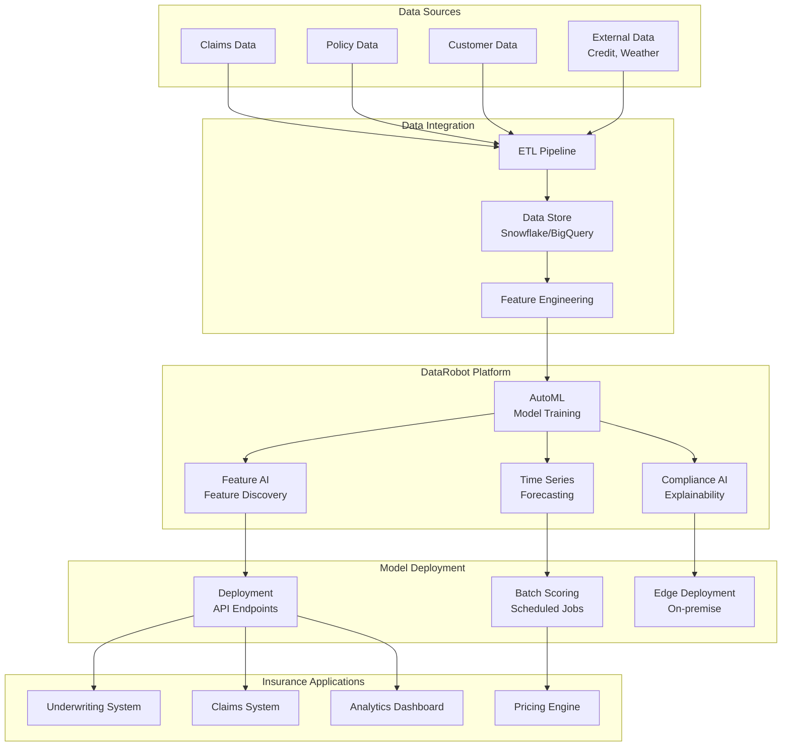
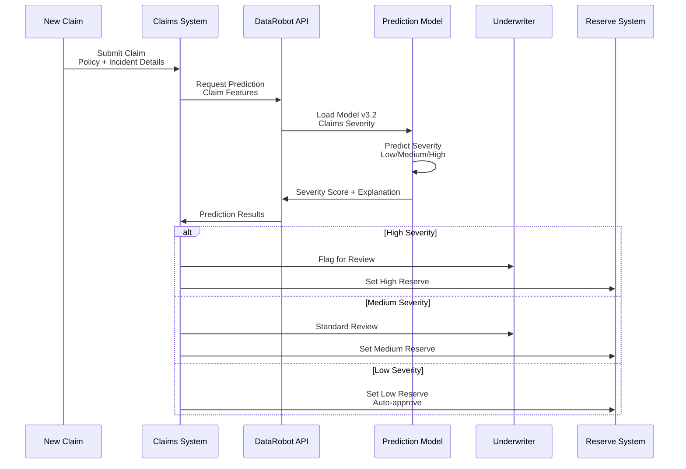
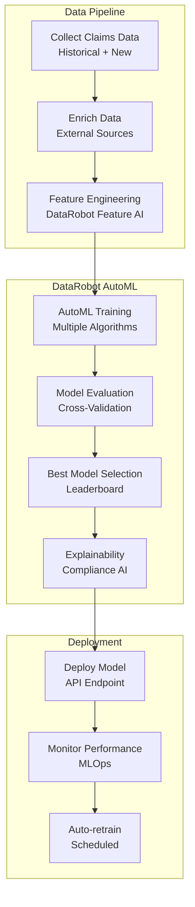
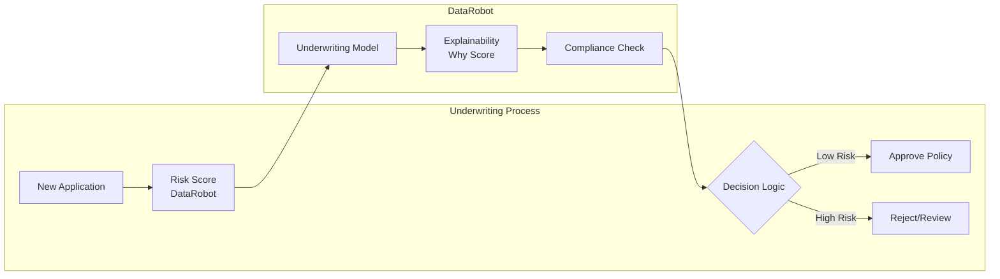
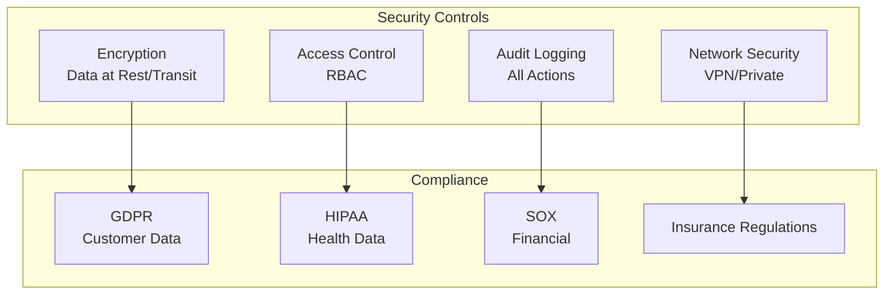

# 🏢 DataRobot - Insurance Industry

## 📋 Overview

DataRobot is an enterprise AI platform that automates the end-to-end process for building, deploying, and maintaining machine learning models. This guide focuses on insurance industry use cases including claims prediction, underwriting automation, and risk assessment.

## 🎯 Use Cases

### Primary Use Cases
- **Claims Prediction**: Predict claim likelihood and severity
- **Underwriting Automation**: Automated risk assessment
- **Fraud Detection**: Identify fraudulent claims
- **Risk Assessment**: Policy risk scoring
- **Customer Segmentation**: Personalized pricing

## 🏗️ Solution Architecture

### Insurance ML Platform Architecture



## 🏢 Industry-Specific Implementation: Claims Prediction

### Use Case: Automated Claims Severity Prediction



### Claims Prediction Pipeline



## 🔧 Implementation Details

### 1. DataRobot API Integration

```python
import datarobot as dr
import pandas as pd

# Initialize DataRobot client
dr.Client(
    token='your-api-token',
    endpoint='https://app.datarobot.com/api/v2'
)

# Create project
project = dr.Project.create(
    project_name="Claims Severity Prediction",
    s3_bucket="insurance-data",
    s3_file="claims_data.csv"
)

# Set target
project.set_target(
    target="claim_severity",
    mode=dr.AUTOPILOT_MODE.FULL_AUTO,
    worker_count=-1
)

# Wait for modeling to complete
project.wait_for_autopilot()

# Get best model
best_model = project.get_models()[0]
print(f"Best Model: {best_model.model_type}")
print(f"Validation Score: {best_model.metrics['RMSE']['validation']}")
```

### 2. Model Deployment

```python
# Create deployment
deployment = dr.Deployment.create_from_learning_model(
    model_id=best_model.id,
    label="Claims Severity v3.2",
    description="Claims severity prediction model",
    default_prediction_server_id=prediction_server.id
)

# Make predictions
predictions = dr.BatchPredictionJob.score(
    deployment=deployment,
    intake_settings={
        'type': 's3',
        'url': 's3://insurance-data/new_claims.csv',
        'credential_id': s3_credential_id
    },
    output_settings={
        'type': 's3',
        'url': 's3://insurance-data/predictions/',
        'credential_id': s3_credential_id
    }
)

predictions.wait_for_completion()
```

### 3. Real-Time Predictions

```python
import requests

# DataRobot prediction endpoint
endpoint = f"https://app.datarobot.com/predApi/v1.0/deployments/{deployment.id}/predictions"

# Claim data
claim_data = {
    "data": [{
        "policy_id": "POL123",
        "claim_type": "auto",
        "incident_date": "2024-01-15",
        "damage_amount": 5000,
        "driver_age": 35,
        "vehicle_age": 3,
        "claim_history": 0,
        "location": "urban"
    }]
}

# Make prediction
response = requests.post(
    endpoint,
    json=claim_data,
    headers={
        "Authorization": f"Bearer {api_token}",
        "Content-Type": "application/json"
    }
)

prediction = response.json()
severity_score = prediction["data"][0]["prediction"]
print(f"Predicted Severity: {severity_score}")
```

### 4. Model Explainability

```python
# Get prediction explanations
explanations = dr.PredictionExplanations.create(
    deployment=deployment,
    predictions=claim_data
)

# Feature impact
feature_impact = dr.FeatureImpact.get(project.id, best_model.id)

print("Top Feature Impacts:")
for feature in feature_impact[:5]:
    print(f"{feature.feature_name}: {feature.impact_normalized:.2%}")
```

## 📊 Underwriting Automation

### Automated Underwriting Flow



## 🔐 Security & Compliance

### Insurance Compliance Architecture



## 📈 Success Metrics

| Metric | Target | Measurement |
|--------|--------|-------------|
| **Claims Prediction Accuracy** | > 90% | Precision/Recall |
| **Underwriting Automation** | 70% | Auto-approved |
| **Processing Time** | -60% | Time Reduction |
| **Model Explainability** | 100% | Compliance Score |
| **Cost Savings** | 25-30% | Operational Costs |

## 🚀 Quick Start

```bash
# Install DataRobot SDK
pip install datarobot

# Configure API token
export DATAROBOT_API_TOKEN="your-api-token"
export DATAROBOT_ENDPOINT="https://app.datarobot.com/api/v2"

# Run training
python train_claims_model.py
```

## 📚 Best Practices

1. **AutoML First**: Leverage DataRobot's AutoML capabilities
2. **Feature AI**: Use Feature AI for feature discovery
3. **Explainability**: Always enable Compliance AI
4. **Model Monitoring**: Set up MLOps monitoring
5. **Version Control**: Track all model versions
6. **Compliance**: Regular compliance audits
7. **Documentation**: Document model decisions
8. **Retraining**: Schedule regular model retraining

---

**Next**: [Domino Data Lab - Pharmaceutical Industry](../domino/)

