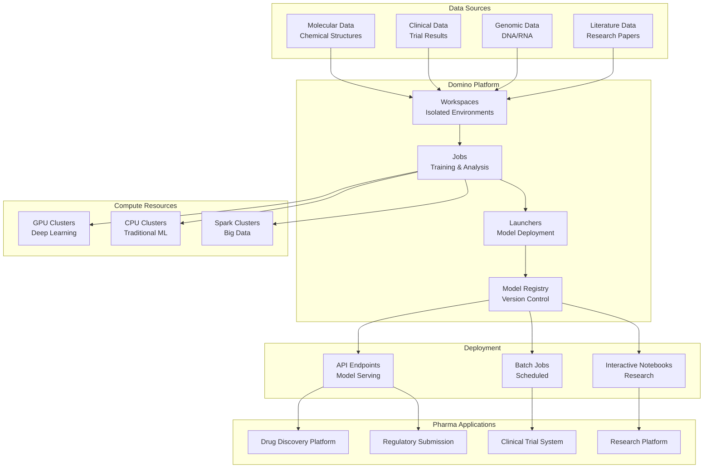
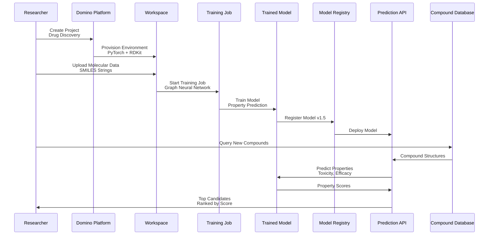
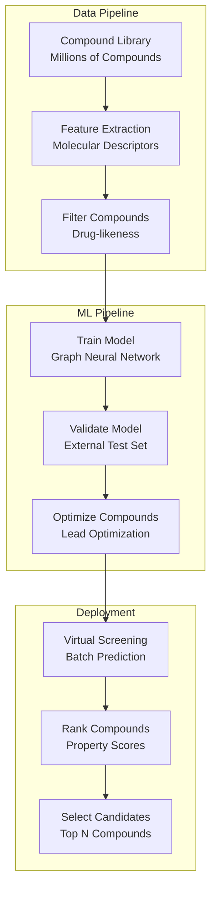
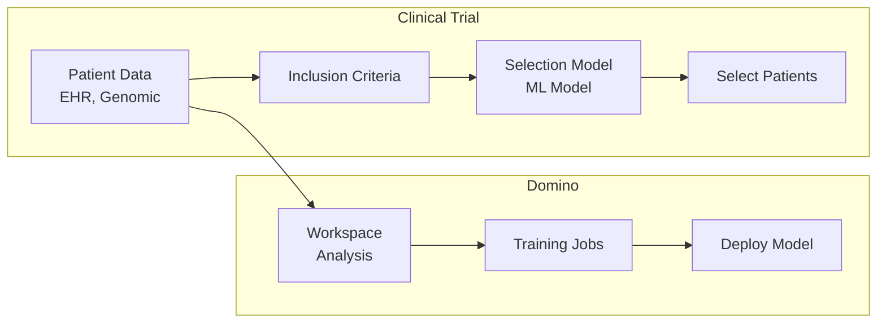
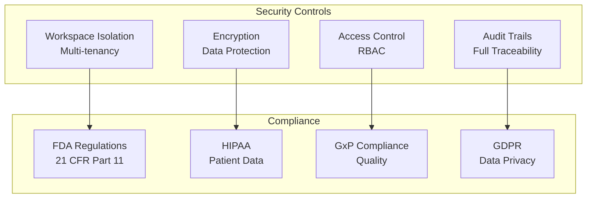

# 💊 Domino Data Lab - Pharmaceutical Industry

## 📋 Overview

Domino Data Lab is an enterprise MLOps platform that enables data science teams to build, deploy, and manage models at scale. This guide focuses on pharmaceutical industry use cases including drug discovery, clinical trial optimization, and research collaboration.

## 🎯 Use Cases

### Primary Use Cases
- **Drug Discovery**: Molecular property prediction and compound screening
- **Clinical Trial Optimization**: Patient selection and trial design
- **Research Collaboration**: Multi-team research workflows
- **Regulatory Compliance**: Model documentation and traceability
- **Biomarker Discovery**: Identify disease biomarkers

## 🏗️ Solution Architecture

### Pharmaceutical ML Platform Architecture



## 💊 Industry-Specific Implementation: Drug Discovery

### Use Case: Molecular Property Prediction



### Drug Discovery Pipeline



## 🔧 Implementation Details

### 1. Domino Project Setup

```python
# Domino project structure
# project/
#   ├── notebooks/
#   │   └── drug_discovery.ipynb
#   ├── scripts/
#   │   ├── train_model.py
#   │   └── predict_properties.py
#   ├── requirements.txt
#   └── domino.yaml

# domino.yaml
compute:
  - name: "gpu-cluster"
    clusterType: "Spark"
    hardwareTierId: "gpu-tier"
    computeClusterProperties:
      sparkVersion: "3.2.0"
      executorCount: 4
      executorHardwareTierId: "gpu-executor"
```

### 2. Model Training Job

```python
# train_molecular_model.py
import torch
import torch.nn as nn
from torch_geometric.nn import GCNConv, global_mean_pool
from torch_geometric.data import Data, DataLoader
import pandas as pd
from rdkit import Chem
from rdkit.Chem import Descriptors

class MolecularGNN(nn.Module):
    """Graph Neural Network for molecular property prediction"""
    def __init__(self, num_node_features, hidden_dim, num_classes):
        super(MolecularGNN, self).__init__()
        self.conv1 = GCNConv(num_node_features, hidden_dim)
        self.conv2 = GCNConv(hidden_dim, hidden_dim)
        self.classifier = nn.Linear(hidden_dim, num_classes)
    
    def forward(self, data):
        x, edge_index, batch = data.x, data.edge_index, data.batch
        x = self.conv1(x, edge_index)
        x = torch.relu(x)
        x = self.conv2(x, edge_index)
        x = global_mean_pool(x, batch)
        x = self.classifier(x)
        return x

# Training code
def train_model():
    # Load data
    compounds = pd.read_csv("data/compounds.csv")
    
    # Convert SMILES to graph
    dataset = []
    for _, row in compounds.iterrows():
        mol = Chem.MolFromSmiles(row['smiles'])
        # Convert to graph representation
        # ... graph conversion code ...
        dataset.append(graph_data)
    
    # Train model
    model = MolecularGNN(num_node_features=9, hidden_dim=64, num_classes=1)
    optimizer = torch.optim.Adam(model.parameters(), lr=0.001)
    criterion = nn.MSELoss()
    
    for epoch in range(100):
        for batch in DataLoader(dataset, batch_size=32):
            optimizer.zero_grad()
            pred = model(batch)
            loss = criterion(pred, batch.y)
            loss.backward()
            optimizer.step()
    
    # Save model
    torch.save(model.state_dict(), "models/molecular_gnn.pth")

if __name__ == "__main__":
    train_model()
```

### 3. Model Deployment

```python
# Domino Launcher for model serving
# launcher.yaml
apiVersion: v1
kind: Pod
metadata:
  name: molecular-prediction-api
spec:
  containers:
  - name: api
    image: domino/molecular-prediction:latest
    ports:
    - containerPort: 8000
    env:
    - name: MODEL_PATH
      value: "/domino/models/molecular_gnn.pth"
```

### 4. Prediction API

```python
# prediction_api.py
from fastapi import FastAPI
from pydantic import BaseModel
import torch
from rdkit import Chem

app = FastAPI()

class CompoundRequest(BaseModel):
    smiles: str

class PredictionResponse(BaseModel):
    toxicity_score: float
    efficacy_score: float
    drug_likeness: float

# Load model
model = MolecularGNN(num_node_features=9, hidden_dim=64, num_classes=3)
model.load_state_dict(torch.load("models/molecular_gnn.pth"))
model.eval()

@app.post("/predict", response_model=PredictionResponse)
async def predict_properties(compound: CompoundRequest):
    """Predict molecular properties"""
    # Convert SMILES to graph
    mol = Chem.MolFromSmiles(compound.smiles)
    graph = smiles_to_graph(mol)
    
    # Predict
    with torch.no_grad():
        predictions = model(graph)
    
    return PredictionResponse(
        toxicity_score=float(predictions[0][0]),
        efficacy_score=float(predictions[0][1]),
        drug_likeness=float(predictions[0][2])
    )
```

## 📊 Clinical Trial Optimization

### Patient Selection Pipeline



## 🔐 Security & Compliance

### Pharmaceutical Compliance



## 📈 Success Metrics

| Metric | Target | Measurement |
|--------|--------|-------------|
| **Compound Screening Speed** | 1000x faster | Virtual vs Physical |
| **Model Accuracy** | > 85% | Property Prediction |
| **Clinical Trial Efficiency** | +30% | Patient Selection |
| **Research Collaboration** | 5x faster | Multi-team Workflows |
| **Regulatory Compliance** | 100% | Audit Success |

## 🚀 Quick Start

```bash
# Install Domino CLI
pip install domino

# Configure
domino configure

# Create project
domino project create --name drug-discovery

# Run job
domino job run --command "python train_model.py"
```

## 📚 Best Practices

1. **Workspace Isolation**: Use separate workspaces for projects
2. **Version Control**: Track all code and data versions
3. **Reproducibility**: Use Domino's reproducibility features
4. **Collaboration**: Leverage Domino's collaboration tools
5. **Compliance**: Maintain full audit trails
6. **GPU Resources**: Use GPU clusters for deep learning
7. **Model Registry**: Centralize model management
8. **Documentation**: Document all research and models

---

**Next**: [H2O.ai - Banking Industry](../h2o-ai/)

