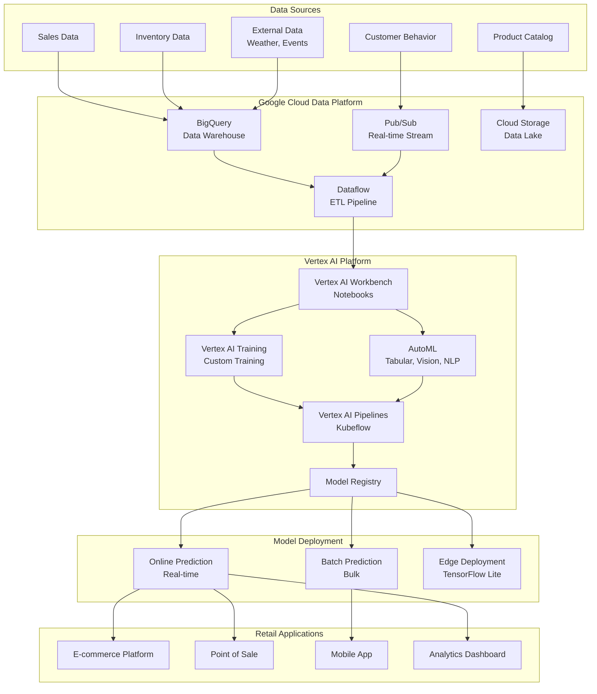
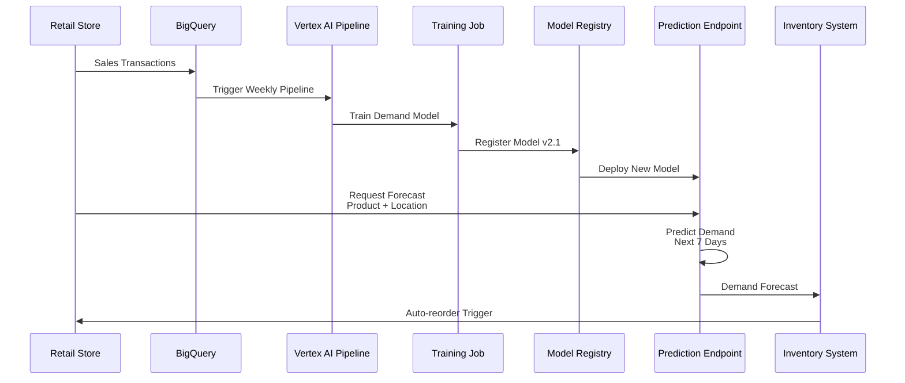
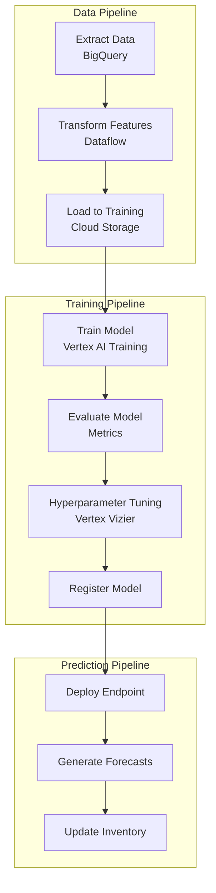
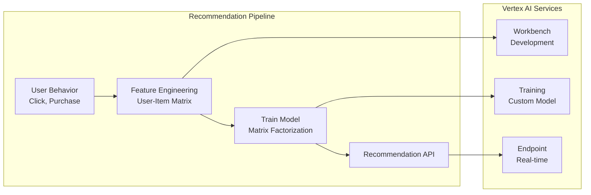
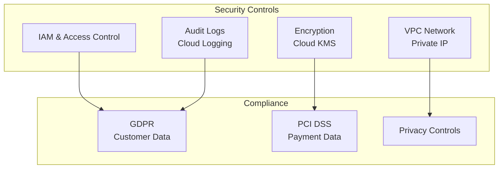

# 🛒 Google Vertex AI - Retail Industry

## 📋 Overview

Google Vertex AI is a unified machine learning platform on Google Cloud that helps build, deploy, and scale ML models. This guide focuses on retail industry use cases including demand forecasting, recommendation systems, and customer segmentation.

## 🎯 Use Cases

### Primary Use Cases
- **Demand Forecasting**: Inventory and sales prediction
- **Recommendation Systems**: Product recommendations
- **Customer Segmentation**: Personalized marketing
- **Price Optimization**: Dynamic pricing strategies
- **Supply Chain Optimization**: Logistics and inventory management

## 🏗️ Solution Architecture

### Retail ML Platform Architecture



## 🛍️ Industry-Specific Implementation: Demand Forecasting

### Use Case: Inventory Demand Prediction



### Demand Forecasting Pipeline



## 🔧 Implementation Details

### 1. Vertex AI Pipeline Setup

```python
from google.cloud import aiplatform
from kfp.v2 import dsl
from kfp.v2.dsl import component, pipeline, Input, Output, Dataset

# Initialize Vertex AI
aiplatform.init(project="retail-ml-project", location="us-central1")

@component(
    base_image="python:3.9",
    packages_to_install=["pandas", "scikit-learn", "google-cloud-bigquery"]
)
def extract_data(
    project_id: str,
    dataset_id: str,
    table_id: str,
    output_path: Output[Dataset]
):
    """Extract sales data from BigQuery"""
    from google.cloud import bigquery
    import pandas as pd
    
    client = bigquery.Client(project=project_id)
    query = f"""
        SELECT 
            product_id,
            store_id,
            sale_date,
            quantity,
            price,
            promotion_flag
        FROM `{project_id}.{dataset_id}.{table_id}`
        WHERE sale_date >= DATE_SUB(CURRENT_DATE(), INTERVAL 365 DAY)
    """
    
    df = client.query(query).to_dataframe()
    df.to_csv(output_path.path, index=False)

@component(
    base_image="python:3.9",
    packages_to_install=["pandas", "scikit-learn"]
)
def train_model(
    training_data: Input[Dataset],
    model_path: Output[Dataset]
):
    """Train demand forecasting model"""
    import pandas as pd
    from sklearn.ensemble import RandomForestRegressor
    import joblib
    
    df = pd.read_csv(training_data.path)
    
    # Feature engineering
    df['day_of_week'] = pd.to_datetime(df['sale_date']).dt.dayofweek
    df['month'] = pd.to_datetime(df['sale_date']).dt.month
    
    X = df[['product_id', 'store_id', 'day_of_week', 'month', 'price', 'promotion_flag']]
    y = df['quantity']
    
    # Train model
    model = RandomForestRegressor(n_estimators=100, random_state=42)
    model.fit(X, y)
    
    # Save model
    joblib.dump(model, model_path.path)

@pipeline(
    name="demand-forecasting-pipeline",
    description="Pipeline for demand forecasting model"
)
def demand_forecasting_pipeline(
    project_id: str = "retail-ml-project",
    dataset_id: str = "retail_data",
    table_id: str = "sales"
):
    """Complete demand forecasting pipeline"""
    
    # Extract data
    extract_task = extract_data(
        project_id=project_id,
        dataset_id=dataset_id,
        table_id=table_id
    )
    
    # Train model
    train_task = train_model(
        training_data=extract_task.outputs["output_path"]
    )
    
    return train_task

# Compile and run pipeline
from kfp.v2 import compiler

compiler.Compiler().compile(
    pipeline_func=demand_forecasting_pipeline,
    package_path="demand_forecasting_pipeline.json"
)

# Submit pipeline
job = aiplatform.PipelineJob(
    display_name="demand-forecasting-pipeline",
    template_path="demand_forecasting_pipeline.json",
    pipeline_root="gs://retail-ml-pipelines/",
    parameter_values={
        "project_id": "retail-ml-project",
        "dataset_id": "retail_data",
        "table_id": "sales"
    }
)

job.run()
```

### 2. AutoML Tabular for Demand Forecasting

```python
from google.cloud import aiplatform
from google.cloud.aiplatform import schema

# Initialize
aiplatform.init(project="retail-ml-project", location="us-central1")

# Create dataset
dataset = aiplatform.TabularDataset.create(
    display_name="demand-forecasting-dataset",
    gcs_source="gs://retail-data/training/demand_data.csv",
    bq_source="bq://retail-ml-project.retail_data.sales"
)

# Create AutoML training job
job = aiplatform.AutoMLTabularTrainingJob(
    display_name="demand-forecasting-automl",
    optimization_objective="minimize-rmse"
)

# Run training
model = job.run(
    dataset=dataset,
    target_column="quantity",
    training_fraction_split=0.8,
    validation_fraction_split=0.1,
    test_fraction_split=0.1,
    budget_milli_node_hours=1000,
    disable_early_stopping=False
)

# Deploy model
endpoint = model.deploy(
    machine_type="n1-standard-4",
    min_replica_count=1,
    max_replica_count=10
)
```

### 3. Real-Time Prediction

```python
from google.cloud import aiplatform

# Get endpoint
endpoint = aiplatform.Endpoint("projects/retail-ml-project/locations/us-central1/endpoints/ENDPOINT_ID")

# Prepare prediction request
instances = [{
    "product_id": "PROD123",
    "store_id": "STORE456",
    "day_of_week": 1,
    "month": 3,
    "price": 29.99,
    "promotion_flag": 1
}]

# Make prediction
predictions = endpoint.predict(instances=instances)

# Get forecast
forecast = predictions.predictions[0]['value']
print(f"Predicted demand: {forecast:.0f} units")
```

### 4. Batch Prediction for Inventory Planning

```python
from google.cloud import aiplatform

# Create batch prediction job
batch_prediction_job = model.batch_predict(
    job_display_name="weekly-demand-forecast",
    instances_format="csv",
    gcs_source="gs://retail-data/prediction/input/products.csv",
    gcs_destination_prefix="gs://retail-data/prediction/output/",
    machine_type="n1-standard-4",
    starting_replica_count=1,
    max_replica_count=5
)

# Wait for completion
batch_prediction_job.wait()

# Get results
print(f"Predictions saved to: {batch_prediction_job.output_info.gcs_output_directory}")
```

## 📊 Recommendation System Architecture

### Product Recommendation Pipeline



## 🔐 Security & Compliance

### Retail Data Security



## 📈 Success Metrics

| Metric | Target | Measurement |
|--------|--------|-------------|
| **Forecast Accuracy** | MAPE < 15% | Mean Absolute Percentage Error |
| **Recommendation CTR** | > 5% | Click-through Rate |
| **Inventory Turnover** | +20% | Inventory efficiency |
| **Prediction Latency** | < 50ms | P95 latency |
| **Cost per Prediction** | < $0.005 | Cost analysis |

## 🚀 Quick Start

```bash
# Install Vertex AI SDK
pip install google-cloud-aiplatform

# Authenticate
gcloud auth application-default login

# Set project
gcloud config set project retail-ml-project

# Initialize Vertex AI
python -c "from google.cloud import aiplatform; aiplatform.init(project='retail-ml-project', location='us-central1')"
```

## 📚 Best Practices

1. **Use BigQuery**: Leverage BigQuery for data warehousing
2. **AutoML First**: Start with AutoML, then customize
3. **Pipeline Orchestration**: Use Vertex AI Pipelines for workflows
4. **Feature Store**: Use Vertex AI Feature Store for consistency
5. **Model Monitoring**: Enable continuous monitoring
6. **Cost Optimization**: Use preemptible VMs for training
7. **Edge Deployment**: Deploy to Edge for low-latency
8. **Explainability**: Use Vertex AI Explainable AI

---

**Next**: [Databricks - Manufacturing Industry](../databricks/)

