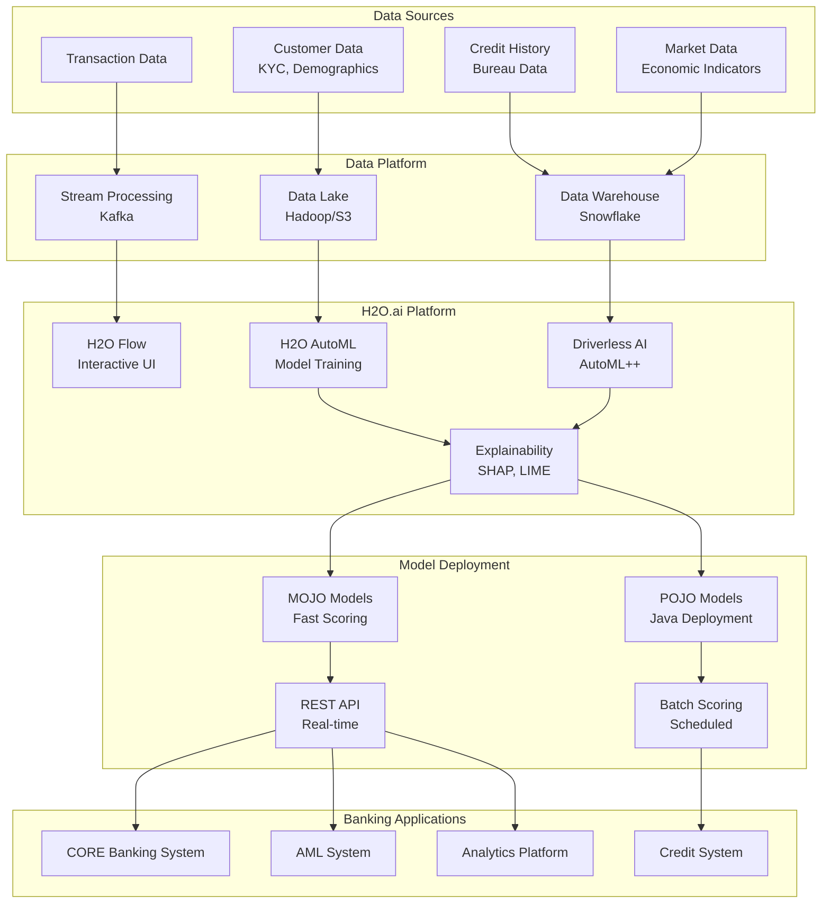
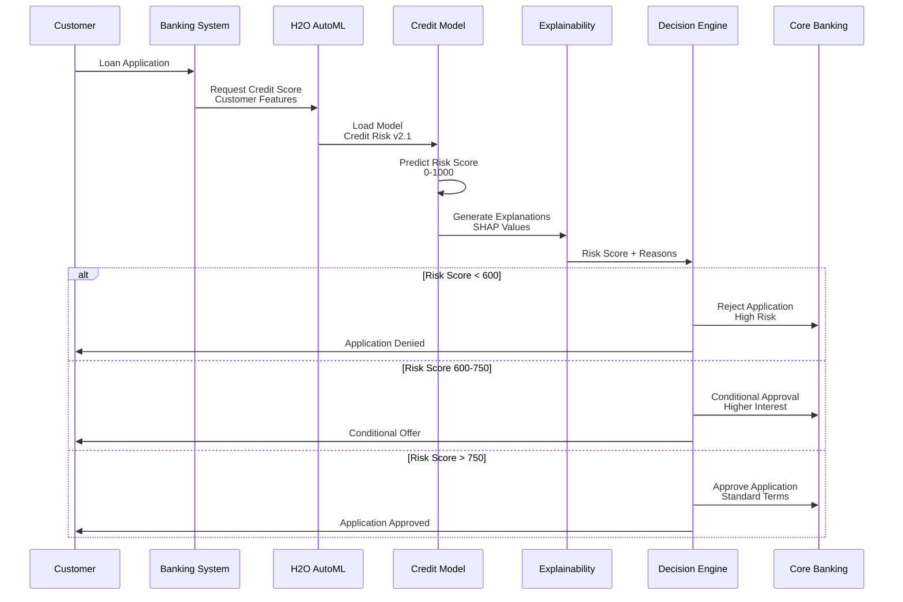
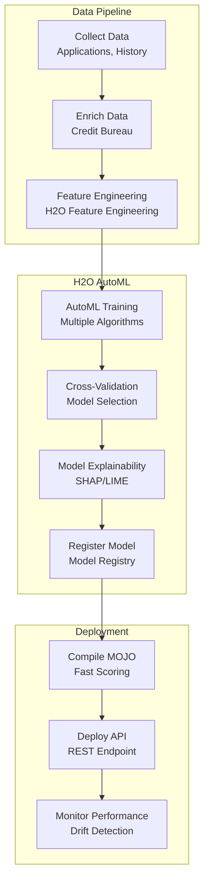
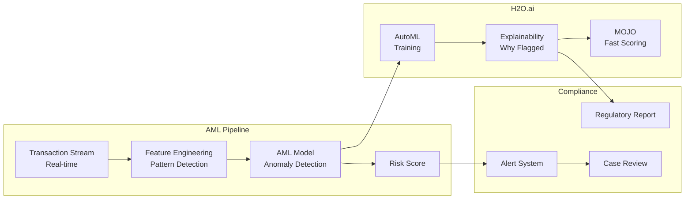
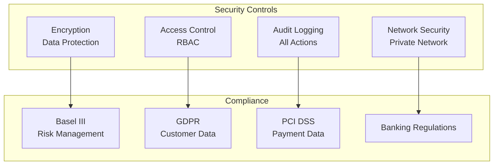

# 🏦 H2O.ai - Banking Industry

## 📋 Overview

H2O.ai is an open-source machine learning platform that provides AutoML capabilities, model explainability, and production deployment tools. This guide focuses on banking industry use cases including credit scoring, anti-money laundering, and customer analytics.

## 🎯 Use Cases

### Primary Use Cases
- **Credit Scoring**: Automated credit risk assessment
- **Anti-Money Laundering (AML)**: Transaction monitoring and suspicious activity detection
- **Customer Analytics**: Customer segmentation and lifetime value
- **Fraud Detection**: Real-time fraud detection
- **Regulatory Reporting**: Model explainability for compliance

## 🏗️ Solution Architecture

### Banking ML Platform Architecture



## 🏦 Industry-Specific Implementation: Credit Scoring

### Use Case: Automated Credit Risk Assessment



### Credit Scoring Pipeline



## 🔧 Implementation Details

### 1. H2O AutoML Training

```python
import h2o
from h2o.automl import H2OAutoML
import pandas as pd

# Initialize H2O
h2o.init()

# Load data
credit_data = h2o.import_file("data/credit_applications.csv")

# Define features and target
x = credit_data.columns[:-1]  # All columns except target
y = "credit_risk"  # Target variable

# Split data
train, valid, test = credit_data.split_frame(ratios=[0.7, 0.15], seed=42)

# Run AutoML
aml = H2OAutoML(
    max_models=20,
    max_runtime_secs=3600,
    seed=42,
    balance_classes=True,  # Handle class imbalance
    stopping_metric="AUC",
    sort_metric="AUC"
)

aml.train(x=x, y=y, training_frame=train, validation_frame=valid)

# Get best model
best_model = aml.leader
print(f"Best Model: {best_model.model_id}")
print(f"AUC: {best_model.auc(valid=True)}")

# Model explainability
explanations = best_model.explain(valid, top_n_features=10)
```

### 2. Model Explainability

```python
from h2o.explanation import explain

# Generate SHAP values
shap_values = best_model.shap_summary_plot(valid)

# Variable importance
var_importance = best_model.varimp(use_pandas=True)
print("Top 10 Most Important Features:")
print(var_importance.head(10))

# Partial dependence plots
pdp = best_model.partial_plot(valid, cols=["age", "income", "credit_history"])

# Generate explanation report
explanation = explain(
    best_model,
    valid,
    top_n_features=10,
    include_explanations=["varimp", "pdp", "shap_summary"]
)
```

### 3. MOJO Model Deployment

```python
# Download MOJO
mojo_path = best_model.download_mojo(path="./models", get_genmodel_jar=True)

# MOJO scoring in Python
import subprocess
import json

# Prepare data
test_data = test.as_data_frame()
test_json = test_data.to_json(orient='records')

# Score with MOJO
result = subprocess.run(
    ['java', '-cp', 'h2o-genmodel.jar', 'hex.genmodel.tools.PredictCsv',
     '--mojo', 'CreditRisk_GBM_model.zip',
     '--input', 'test_data.csv',
     '--output', 'predictions.csv',
     '--decimal'],
    capture_output=True,
    text=True
)

print(result.stdout)
```

### 4. REST API Deployment

```python
from flask import Flask, request, jsonify
import h2o
from h2o.estimators import H2OGradientBoostingEstimator

app = Flask(__name__)

# Load model
h2o.init()
model = h2o.load_model("models/CreditRisk_GBM_model")

@app.route('/predict', methods=['POST'])
def predict_credit_risk():
    """Predict credit risk for loan application"""
    data = request.json
    
    # Convert to H2O frame
    df = h2o.H2OFrame([data])
    
    # Predict
    prediction = model.predict(df)
    
    # Get prediction and probability
    risk_score = float(prediction[0, 0])
    probability = float(prediction[0, 1])
    
    # Get SHAP values for explanation
    shap_values = model.shap_explain_row_plot(df, row_index=0)
    
    return jsonify({
        "risk_score": risk_score,
        "default_probability": probability,
        "recommendation": "approve" if risk_score < 600 else "review",
        "explanation": {
            "top_factors": shap_values
        }
    })

if __name__ == '__main__':
    app.run(host='0.0.0.0', port=5000)
```

## 📊 Anti-Money Laundering (AML)

### AML Detection Pipeline



## 🔐 Security & Compliance

### Banking Compliance Architecture



## 📈 Success Metrics

| Metric | Target | Measurement |
|--------|--------|-------------|
| **Credit Score Accuracy** | > 90% | Precision/Recall |
| **False Positive Rate** | < 5% | AML Detection |
| **Model Explainability** | 100% | Regulatory Compliance |
| **Scoring Latency** | < 50ms | P95 latency |
| **Cost Savings** | 30-40% | Operational Costs |

## 🚀 Quick Start

```bash
# Install H2O
pip install h2o

# Start H2O cluster
python -c "import h2o; h2o.init()"

# Or use H2O Flow
java -jar h2o.jar
# Access at http://localhost:54321
```

## 📚 Best Practices

1. **AutoML**: Leverage H2O AutoML for quick model development
2. **Explainability**: Always generate SHAP values for compliance
3. **MOJO Deployment**: Use MOJO for fast, low-latency scoring
4. **Model Monitoring**: Monitor model performance and drift
5. **Feature Engineering**: Use H2O's feature engineering capabilities
6. **Ensemble Models**: Leverage stacked ensembles
7. **Compliance**: Maintain full model documentation
8. **Version Control**: Track all model versions

---

**Next**: [Weights & Biases - Research & Startups](../wandb/)

