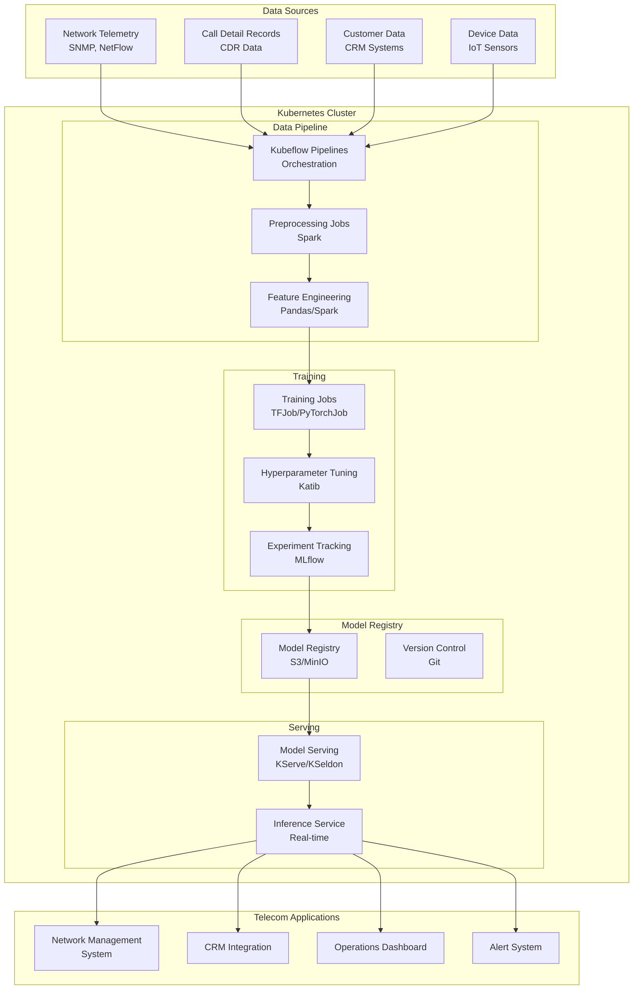
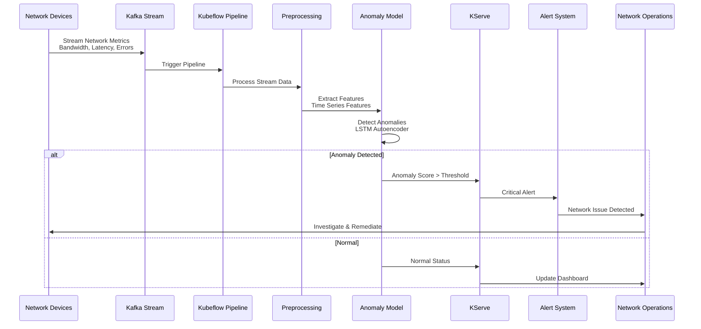
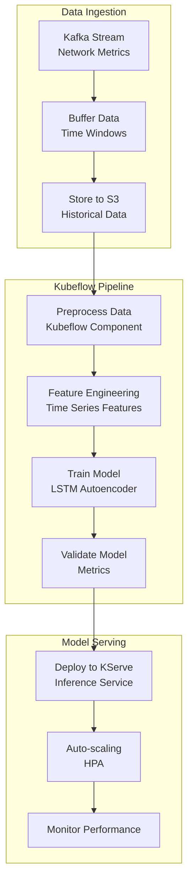
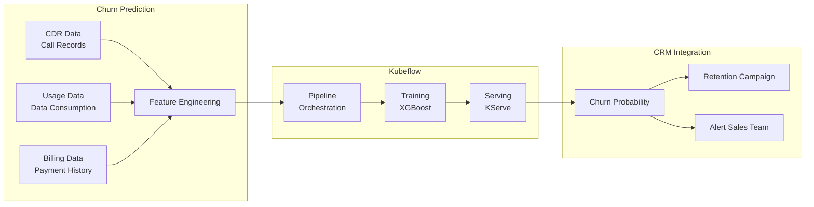
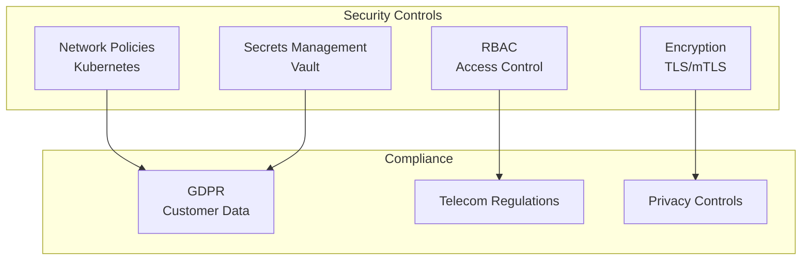

# 📡 Kubeflow - Telecommunications Industry

## 📋 Overview

Kubeflow is a machine learning toolkit for Kubernetes that makes ML workflows portable, scalable, and composable. This guide focuses on telecommunications industry use cases including network optimization, customer churn prediction, and network anomaly detection.

## 🎯 Use Cases

### Primary Use Cases
- **Network Optimization**: Traffic routing and capacity planning
- **Customer Churn Prediction**: Identify at-risk customers
- **Network Anomaly Detection**: Detect network issues and attacks
- **5G Network Management**: Optimize 5G network performance
- **Quality of Service (QoS)**: Predict and maintain service quality

## 🏗️ Solution Architecture

### Telecommunications ML Platform Architecture



## 📡 Industry-Specific Implementation: Network Anomaly Detection

### Use Case: Real-Time Network Anomaly Detection



### Network Anomaly Detection Pipeline



## 🔧 Implementation Details

### 1. Kubeflow Pipeline Definition

```python
import kfp
from kfp import dsl
from kfp.dsl import component, Input, Output, Dataset

@component(
    base_image="python:3.9",
    packages_to_install=["pandas", "kafka-python", "boto3"]
)
def ingest_network_data(
    kafka_broker: str,
    topic: str,
    output_path: Output[Dataset]
):
    """Ingest network telemetry data from Kafka"""
    from kafka import KafkaConsumer
    import pandas as pd
    import json
    
    consumer = KafkaConsumer(
        topic,
        bootstrap_servers=kafka_broker,
        value_deserializer=lambda x: json.loads(x.decode('utf-8'))
    )
    
    data = []
    for message in consumer:
        data.append(message.value)
        if len(data) >= 10000:  # Batch size
            break
    
    df = pd.DataFrame(data)
    df.to_csv(output_path.path, index=False)

@component(
    base_image="python:3.9",
    packages_to_install=["pandas", "numpy", "scikit-learn"]
)
def preprocess_network_data(
    input_data: Input[Dataset],
    output_data: Output[Dataset]
):
    """Preprocess network data for anomaly detection"""
    import pandas as pd
    import numpy as np
    
    df = pd.read_csv(input_data.path)
    
    # Feature engineering
    df['timestamp'] = pd.to_datetime(df['timestamp'])
    df['hour'] = df['timestamp'].dt.hour
    df['day_of_week'] = df['timestamp'].dt.dayofweek
    
    # Normalize features
    from sklearn.preprocessing import StandardScaler
    scaler = StandardScaler()
    features = ['bandwidth', 'latency', 'packet_loss', 'error_rate']
    df[features] = scaler.fit_transform(df[features])
    
    df.to_csv(output_data.path, index=False)

@component(
    base_image="tensorflow/tensorflow:2.11.0",
    packages_to_install=["pandas", "numpy"]
)
def train_anomaly_model(
    training_data: Input[Dataset],
    model_path: Output[Dataset]
):
    """Train LSTM autoencoder for anomaly detection"""
    import tensorflow as tf
    from tensorflow import keras
    import pandas as pd
    import numpy as np
    
    df = pd.read_csv(training_data.path)
    
    # Prepare sequences
    sequence_length = 60
    features = ['bandwidth', 'latency', 'packet_loss', 'error_rate']
    X = df[features].values
    
    # Create sequences
    sequences = []
    for i in range(len(X) - sequence_length):
        sequences.append(X[i:i+sequence_length])
    sequences = np.array(sequences)
    
    # Build LSTM autoencoder
    model = keras.Sequential([
        keras.layers.LSTM(50, activation='relu', input_shape=(sequence_length, len(features))),
        keras.layers.RepeatVector(sequence_length),
        keras.layers.LSTM(50, activation='relu', return_sequences=True),
        keras.layers.TimeDistributed(keras.layers.Dense(len(features)))
    ])
    
    model.compile(optimizer='adam', loss='mse')
    model.fit(sequences, sequences, epochs=10, batch_size=32, validation_split=0.2)
    
    # Save model
    model.save(model_path.path)

@dsl.pipeline(
    name="network-anomaly-detection",
    description="Pipeline for network anomaly detection"
)
def network_anomaly_pipeline(
    kafka_broker: str = "kafka:9092",
    topic: str = "network-metrics"
):
    """Complete network anomaly detection pipeline"""
    
    # Ingest data
    ingest_task = ingest_network_data(
        kafka_broker=kafka_broker,
        topic=topic
    )
    
    # Preprocess
    preprocess_task = preprocess_network_data(
        input_data=ingest_task.outputs["output_path"]
    )
    
    # Train model
    train_task = train_anomaly_model(
        training_data=preprocess_task.outputs["output_data"]
    )
    
    return train_task

# Compile pipeline
kfp.compiler.Compiler().compile(
    pipeline_func=network_anomaly_pipeline,
    package_path="network_anomaly_pipeline.yaml"
)
```

### 2. Deploy Model with KServe

```yaml
# kserve-inference-service.yaml
apiVersion: "serving.kserve.io/v1beta1"
kind: "InferenceService"
metadata:
  name: "network-anomaly-detector"
  namespace: "kubeflow"
spec:
  predictor:
    tensorflow:
      storageUri: "s3://models/network-anomaly-detector/v1"
      resources:
        requests:
          cpu: "2"
          memory: "4Gi"
        limits:
          cpu: "4"
          memory: "8Gi"
  canaryTrafficPercent: 10
```

### 3. Real-Time Inference

```python
import requests
import json

# KServe endpoint
endpoint = "http://network-anomaly-detector.kubeflow.svc.cluster.local/v1/models/network-anomaly-detector:predict"

# Network metrics
network_data = {
    "instances": [[
        [100.5, 25.3, 0.1, 0.05],  # bandwidth, latency, packet_loss, error_rate
        [102.1, 24.8, 0.12, 0.06],
        # ... 60 timesteps
    ]]
}

# Make prediction
response = requests.post(
    endpoint,
    json=network_data,
    headers={"Content-Type": "application/json"}
)

anomaly_score = response.json()["predictions"][0]
print(f"Anomaly Score: {anomaly_score}")

if anomaly_score > 0.8:
    print("⚠️ Network anomaly detected!")
```

## 📊 Customer Churn Prediction

### Churn Prediction Pipeline



## 🔐 Security & Compliance

### Telecommunications Security



## 📈 Success Metrics

| Metric | Target | Measurement |
|--------|--------|-------------|
| **Anomaly Detection Rate** | > 95% | True Positive Rate |
| **False Positive Rate** | < 3% | False Alarms |
| **Churn Prediction Accuracy** | > 85% | Precision/Recall |
| **Inference Latency** | < 100ms | P95 latency |
| **Network Uptime** | > 99.9% | Availability |

## 🚀 Quick Start

```bash
# Install Kubeflow
kubectl apply -k "github.com/kubeflow/manifests/kustomize/cluster-scoped-resources?ref=v1.7.0"
kubectl apply -k "github.com/kubeflow/manifests/kustomize/env/platform-agnostic?ref=v1.7.0"

# Install KServe
kubectl apply -f https://github.com/kserve/kserve/releases/download/v0.11.0/kserve.yaml

# Upload pipeline
kfp pipeline upload -p network_anomaly_pipeline.yaml

# Create run
kfp run submit -e network-anomaly-detection -r network-anomaly-run-001
```

## 📚 Best Practices

1. **Kubernetes Native**: Leverage Kubernetes features
2. **Pipeline Orchestration**: Use Kubeflow Pipelines
3. **Auto-scaling**: Configure HPA for serving
4. **Resource Management**: Set appropriate resource limits
5. **Model Versioning**: Use model versioning in registry
6. **Monitoring**: Monitor pipeline and model performance
7. **Security**: Implement network policies and RBAC
8. **Cost Optimization**: Use spot instances for training

---

**Next**: [DataRobot - Insurance Industry](../datarobot/)

