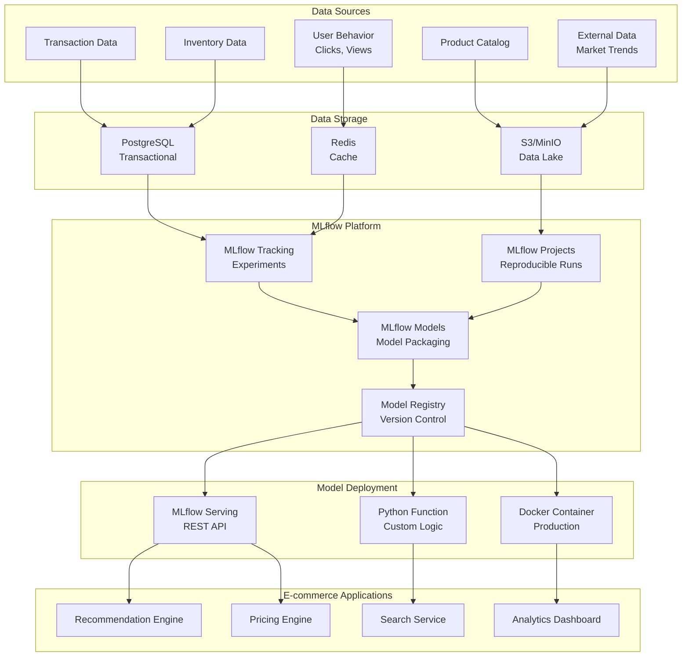
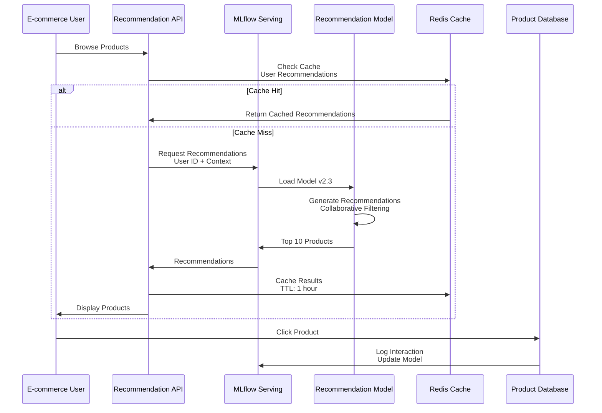
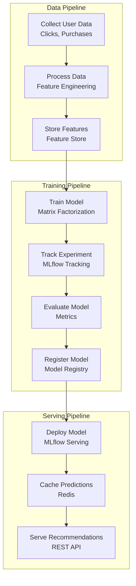
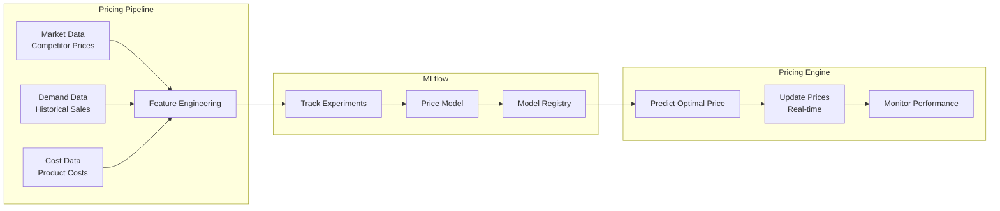
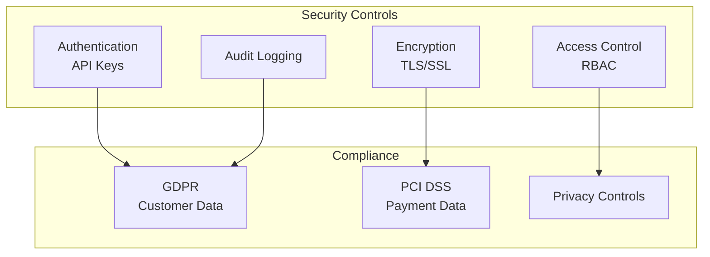

# 🛒 MLflow - E-commerce Industry

## 📋 Overview

MLflow is an open-source platform for managing the ML lifecycle, including experimentation, reproducibility, deployment, and a central model registry. This guide focuses on e-commerce industry use cases.

## 🎯 Use Cases

### Primary Use Cases
- **Product Recommendations**: Personalized product suggestions
- **Price Optimization**: Dynamic pricing strategies
- **Customer Lifetime Value**: CLV prediction and segmentation
- **Search Ranking**: Product search relevance
- **Inventory Management**: Stock level optimization

## 🏗️ Solution Architecture

### E-commerce ML Platform Architecture



## 🛍️ Industry-Specific Implementation: Product Recommendations

### Use Case: Personalized Product Recommendations



### Recommendation System Pipeline



## 🔧 Implementation Details

### 1. MLflow Experiment Tracking

```python
import mlflow
import mlflow.sklearn
from sklearn.model_selection import train_test_split
from sklearn.ensemble import RandomForestRegressor
from sklearn.metrics import mean_squared_error, r2_score
import pandas as pd

# Set tracking URI
mlflow.set_tracking_uri("http://mlflow-server:5000")
mlflow.set_experiment("product-recommendations")

# Load data
data = pd.read_csv("user_product_interactions.csv")

# Feature engineering
features = ['user_id', 'product_id', 'category', 'price', 'rating']
X = data[features]
y = data['purchase_probability']

# Split data
X_train, X_test, y_train, y_test = train_test_split(X, y, test_size=0.2, random_state=42)

# Start MLflow run
with mlflow.start_run(run_name="recommendation_model_v1"):
    # Log parameters
    mlflow.log_param("n_estimators", 100)
    mlflow.log_param("max_depth", 10)
    mlflow.log_param("min_samples_split", 5)
    
    # Train model
    model = RandomForestRegressor(
        n_estimators=100,
        max_depth=10,
        min_samples_split=5,
        random_state=42
    )
    model.fit(X_train, y_train)
    
    # Evaluate
    train_pred = model.predict(X_train)
    test_pred = model.predict(X_test)
    
    train_rmse = mean_squared_error(y_train, train_pred, squared=False)
    test_rmse = mean_squared_error(y_test, test_pred, squared=False)
    test_r2 = r2_score(y_test, test_pred)
    
    # Log metrics
    mlflow.log_metric("train_rmse", train_rmse)
    mlflow.log_metric("test_rmse", test_rmse)
    mlflow.log_metric("test_r2", test_r2)
    
    # Log model
    mlflow.sklearn.log_model(
        model,
        "recommendation_model",
        registered_model_name="product_recommendations"
    )
    
    # Log artifacts
    mlflow.log_artifact("feature_importance.png")
    mlflow.log_artifact("model_explanation.html")
```

### 2. Model Registry and Versioning

```python
from mlflow.tracking import MlflowClient

client = MlflowClient()

# Get latest model version
model_name = "product_recommendations"
latest_version = client.get_latest_versions(model_name, stages=["None"])[0]

# Transition to staging
client.transition_model_version_stage(
    name=model_name,
    version=latest_version.version,
    stage="Staging"
)

# Test staging model
staging_model = mlflow.sklearn.load_model(
    f"models:/{model_name}/Staging"
)

# If tests pass, promote to production
client.transition_model_version_stage(
    name=model_name,
    version=latest_version.version,
    stage="Production"
)
```

### 3. MLflow Model Serving

```python
# Start MLflow serving server
# mlflow models serve -m models:/product_recommendations/Production -p 5000

# Or use MLflow serving in code
from mlflow.pyfunc import load_model
import requests

# Load model
model = load_model("models:/product_recommendations/Production")

# Make prediction
user_features = {
    "user_id": 12345,
    "product_id": 67890,
    "category": "electronics",
    "price": 299.99,
    "rating": 4.5
}

prediction = model.predict([user_features])
print(f"Purchase Probability: {prediction[0]:.2%}")

# Or use REST API
response = requests.post(
    "http://localhost:5000/invocations",
    json={
        "dataframe_records": [user_features]
    },
    headers={"Content-Type": "application/json"}
)

print(response.json())
```

### 4. MLflow Projects for Reproducibility

```yaml
# MLproject file
name: product-recommendations

conda_env: conda.yaml

entry_points:
  main:
    parameters:
      data_path: {type: str, default: "data/interactions.csv"}
      n_estimators: {type: int, default: 100}
      max_depth: {type: int, default: 10}
    command: "python train.py {data_path} {n_estimators} {max_depth}"
```

```python
# train.py
import mlflow
import sys
import pandas as pd
from sklearn.ensemble import RandomForestRegressor

if __name__ == "__main__":
    data_path = sys.argv[1]
    n_estimators = int(sys.argv[2])
    max_depth = int(sys.argv[3])
    
    # Load and train
    data = pd.read_csv(data_path)
    # ... training code ...
    
    # Log to MLflow
    with mlflow.start_run():
        mlflow.log_param("n_estimators", n_estimators)
        mlflow.log_param("max_depth", max_depth)
        # ... rest of training ...
```

## 📊 Price Optimization Use Case

### Dynamic Pricing Architecture



## 🔐 Security & Compliance

### E-commerce Data Security



## 📈 Success Metrics

| Metric | Target | Measurement |
|--------|--------|-------------|
| **Recommendation CTR** | > 5% | Click-through Rate |
| **Conversion Rate** | +15% | Purchase Rate |
| **Revenue Impact** | +10% | Revenue Increase |
| **Model Latency** | < 50ms | P95 latency |
| **Model Accuracy** | > 85% | Precision/Recall |

## 🚀 Quick Start

```bash
# Install MLflow
pip install mlflow

# Start MLflow server
mlflow server --backend-store-uri sqlite:///mlflow.db --default-artifact-root ./artifacts

# Run experiment
mlflow run . -P data_path=data/interactions.csv -P n_estimators=150

# Serve model
mlflow models serve -m models:/product_recommendations/Production -p 5000
```

## 📚 Best Practices

1. **Experiment Tracking**: Log all experiments with MLflow
2. **Model Versioning**: Use Model Registry for version control
3. **Reproducibility**: Use MLflow Projects for reproducible runs
4. **Model Serving**: Use MLflow Serving for easy deployment
5. **Monitoring**: Track model performance in production
6. **Feature Store**: Integrate with feature stores
7. **A/B Testing**: Use model registry stages for A/B testing
8. **Documentation**: Document all models and experiments

---

**Next**: [Kubeflow - Telecommunications Industry](../kubeflow/)

