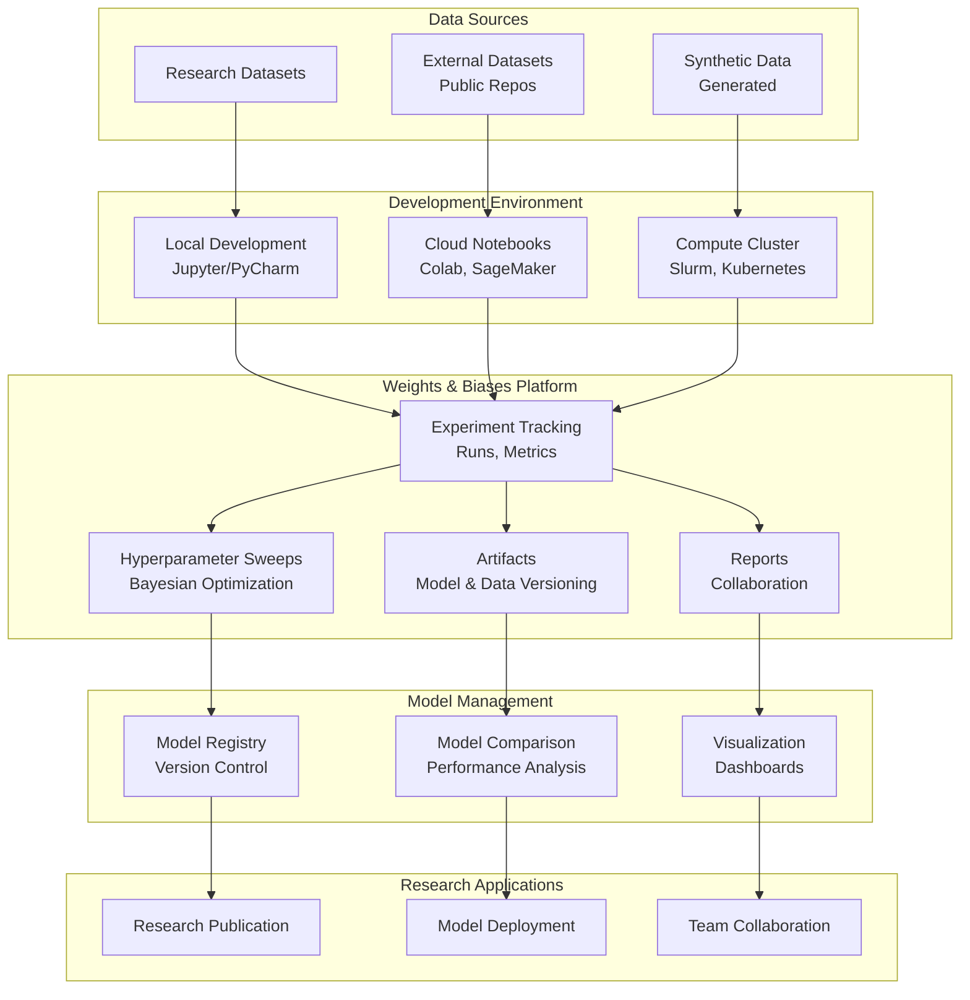
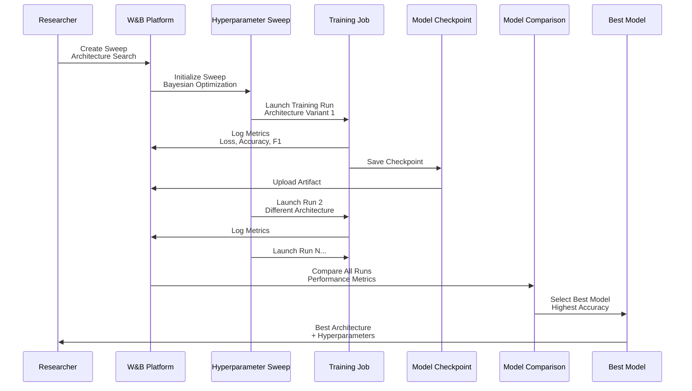
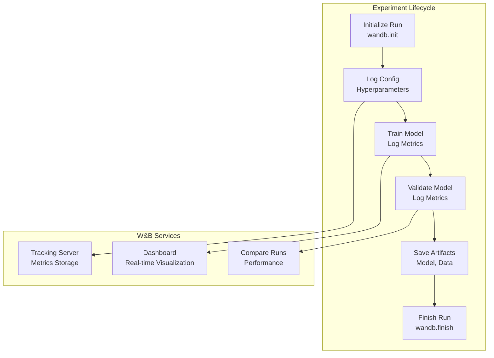
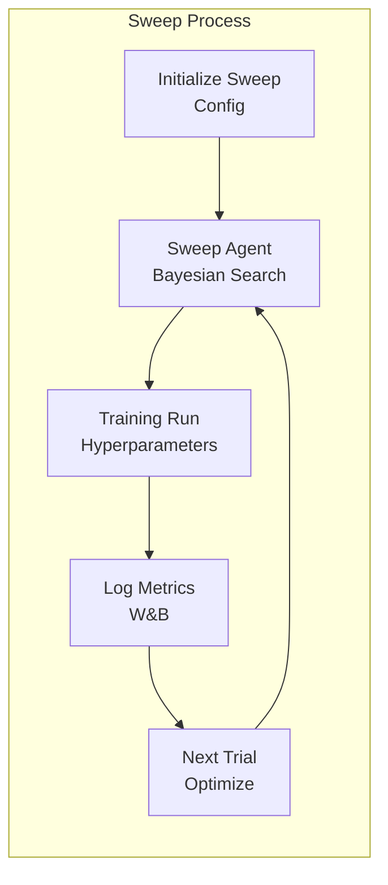
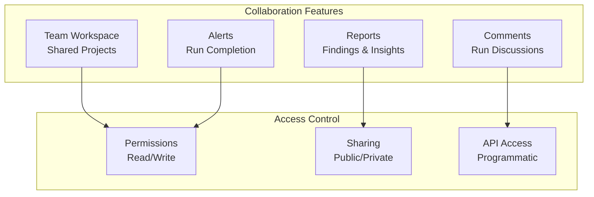

# 🔬 Weights & Biases - Research & Startups

## 📋 Overview

Weights & Biases (W&B) is a developer-first MLOps platform for experiment tracking, dataset versioning, and model management. This guide focuses on research and startup use cases including deep learning experiments, hyperparameter optimization, and model comparison.

## 🎯 Use Cases

### Primary Use Cases
- **Deep Learning Experiments**: Track training runs and hyperparameters
- **Hyperparameter Optimization**: Automated hyperparameter tuning
- **Model Comparison**: Compare multiple model architectures
- **Dataset Versioning**: Track dataset versions and changes
- **Collaboration**: Team collaboration on ML projects

## 🏗️ Solution Architecture

### Research ML Platform Architecture



## 🔬 Industry-Specific Implementation: Deep Learning Research

### Use Case: Neural Architecture Search



### Experiment Tracking Pipeline



## 🔧 Implementation Details

### 1. Basic Experiment Tracking

```python
import wandb
import torch
import torch.nn as nn
from torch.utils.data import DataLoader

# Initialize W&B
wandb.init(
    project="deep-learning-research",
    name="transformer-experiment-v1",
    config={
        "learning_rate": 0.001,
        "batch_size": 32,
        "epochs": 100,
        "model_type": "transformer",
        "num_layers": 6,
        "hidden_dim": 512
    }
)

# Define model
class TransformerModel(nn.Module):
    def __init__(self, config):
        super().__init__()
        # Model definition
        pass

model = TransformerModel(wandb.config)
optimizer = torch.optim.Adam(model.parameters(), lr=wandb.config.learning_rate)
criterion = nn.CrossEntropyLoss()

# Training loop
for epoch in range(wandb.config.epochs):
    for batch in train_loader:
        # Forward pass
        outputs = model(batch.input)
        loss = criterion(outputs, batch.target)
        
        # Backward pass
        optimizer.zero_grad()
        loss.backward()
        optimizer.step()
        
        # Log metrics
        wandb.log({
            "train_loss": loss.item(),
            "epoch": epoch
        })
    
    # Validation
    val_loss = validate(model, val_loader)
    wandb.log({
        "val_loss": val_loss,
        "epoch": epoch
    })
    
    # Log model checkpoint
    if epoch % 10 == 0:
        torch.save(model.state_dict(), f"checkpoint_epoch_{epoch}.pth")
        wandb.save(f"checkpoint_epoch_{epoch}.pth")

# Finish run
wandb.finish()
```

### 2. Hyperparameter Sweeps

```python
# sweep_config.yaml
program: train.py
method: bayes
metric:
  name: val_accuracy
  goal: maximize
parameters:
  learning_rate:
    min: 0.0001
    max: 0.01
    distribution: log_uniform
  batch_size:
    values: [16, 32, 64, 128]
  num_layers:
    values: [4, 6, 8, 12]
  hidden_dim:
    values: [256, 512, 1024]
  dropout:
    min: 0.1
    max: 0.5

# Initialize sweep
sweep_id = wandb.sweep(sweep_config, project="transformer-sweep")

# Run sweep
wandb.agent(sweep_id, function=train_model, count=50)
```

### 3. Dataset Versioning

```python
# Create dataset artifact
run = wandb.init(project="dataset-versioning")

# Log dataset
artifact = wandb.Artifact("training-dataset", type="dataset")
artifact.add_file("data/train.csv")
artifact.add_file("data/val.csv")
artifact.add_file("data/test.csv")

# Add metadata
artifact.metadata = {
    "num_samples": 100000,
    "num_features": 50,
    "split": "80/10/10",
    "preprocessing": "normalized"
}

run.log_artifact(artifact)
run.finish()

# Use dataset in another run
run = wandb.init(project="model-training")
artifact = run.use_artifact("training-dataset:latest")
artifact_dir = artifact.download()

# Load data
train_data = pd.read_csv(f"{artifact_dir}/train.csv")
```

### 4. Model Comparison

```python
import wandb

# Compare multiple runs
api = wandb.Api()

# Get runs
runs = api.runs("deep-learning-research")

# Compare metrics
comparison_data = []
for run in runs:
    comparison_data.append({
        "name": run.name,
        "val_accuracy": run.summary.get("val_accuracy", 0),
        "val_loss": run.summary.get("val_loss", float('inf')),
        "training_time": run.summary.get("training_time", 0),
        "config": run.config
    })

# Create comparison table
wandb.init(project="model-comparison")
wandb.log({"model_comparison": wandb.Table(dataframe=pd.DataFrame(comparison_data))})

# Visualize
wandb.log({
    "accuracy_comparison": wandb.plot.bar(
        wandb.Table(
            columns=["model", "accuracy"],
            data=[[r["name"], r["val_accuracy"]] for r in comparison_data]
        )
    )
})
```

## 📊 Hyperparameter Optimization

### Sweep Architecture



## 🔐 Security & Collaboration

### Team Collaboration Architecture



## 📈 Success Metrics

| Metric | Target | Measurement |
|--------|--------|-------------|
| **Experiment Tracking** | 100% | All runs tracked |
| **Hyperparameter Efficiency** | 50% faster | Time to best model |
| **Reproducibility** | 100% | All runs reproducible |
| **Collaboration** | 5x faster | Team productivity |
| **Model Comparison** | Instant | Real-time comparison |

## 🚀 Quick Start

```bash
# Install W&B
pip install wandb

# Login
wandb login

# Initialize project
wandb init

# Run experiment
python train.py
```

## 📚 Best Practices

1. **Track Everything**: Log all hyperparameters and metrics
2. **Use Sweeps**: Leverage hyperparameter sweeps for optimization
3. **Version Datasets**: Track dataset versions with artifacts
4. **Compare Models**: Use W&B compare for model selection
5. **Collaborate**: Share reports and findings with team
6. **Visualize**: Use W&B dashboards for insights
7. **Reproducibility**: Save all code and configs
8. **Documentation**: Document experiments in reports

---

**Back to**: [Platforms Overview](../README.md)

