# Infrastructure & DevOps

## Overview
This section covers cloud platforms, containerization, orchestration, CI/CD, and monitoring for enterprise AI platforms.

## 1. **Cloud Platforms & Multi-Cloud Strategy**

### 1. **Cloud Platform Comparison**
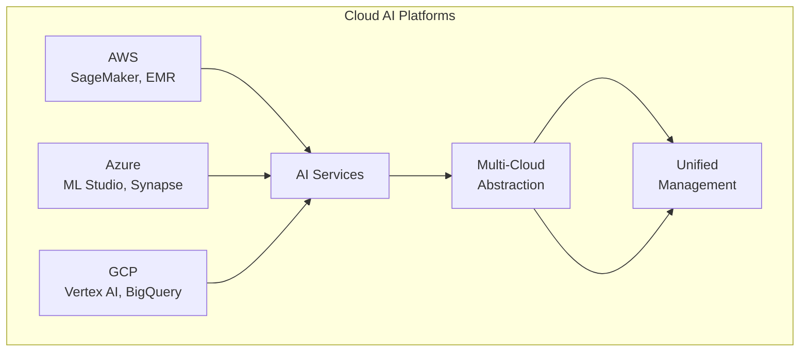

### 2. **Multi-Cloud Architecture**
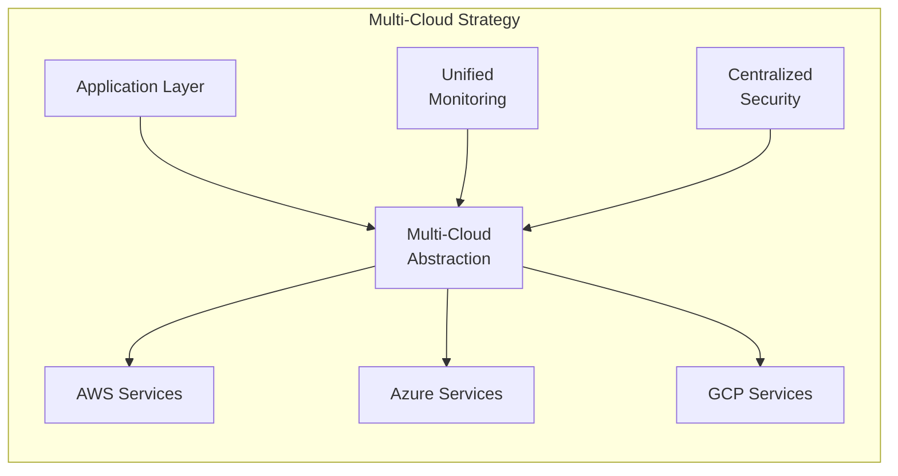

### 3. **AWS AI/ML Services**
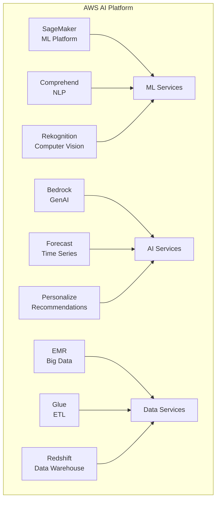

### 4. **Azure AI/ML Services**
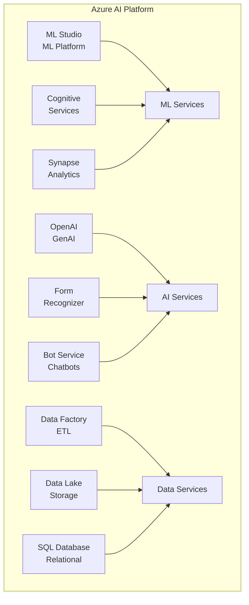

### 5. **GCP AI/ML Services**
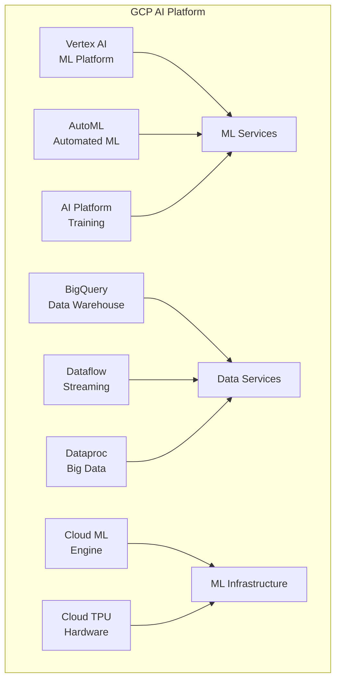

## 2. **Containerization & Orchestration**

### 1. **Docker Container Architecture**
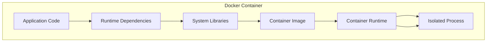

### 2. **Kubernetes Cluster Architecture**
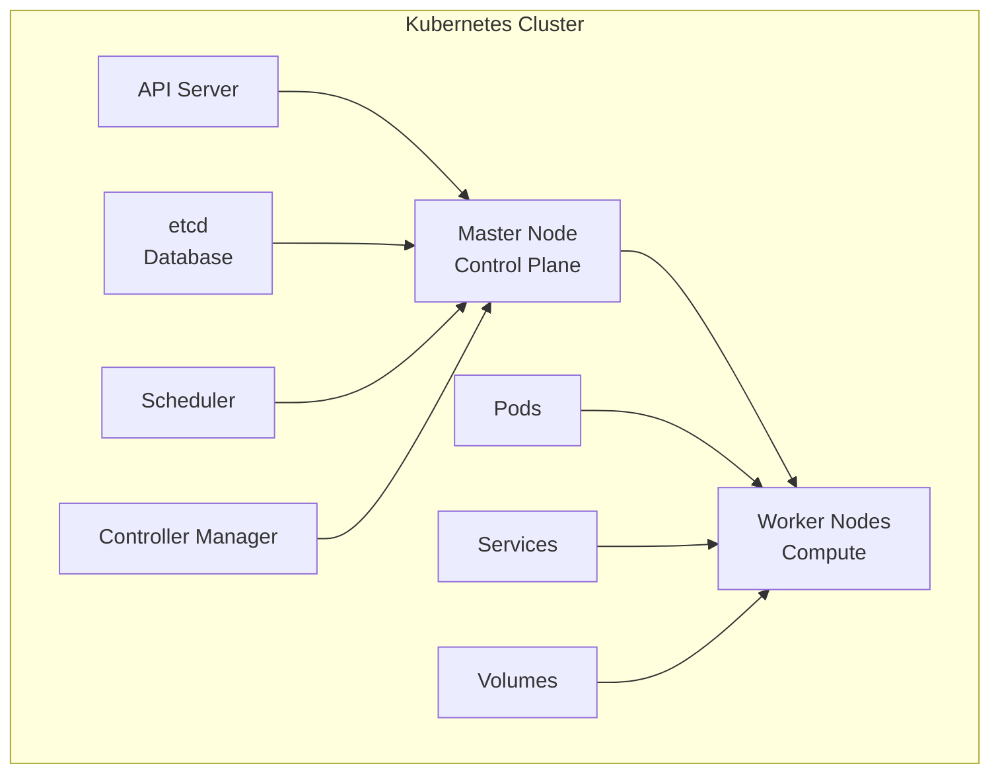

### 3. **ML Workload Orchestration**
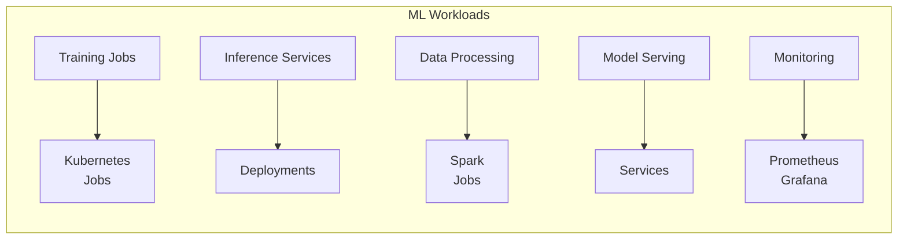

## 3. **CI/CD for AI Platforms**

### 1. **CI/CD Pipeline Architecture**
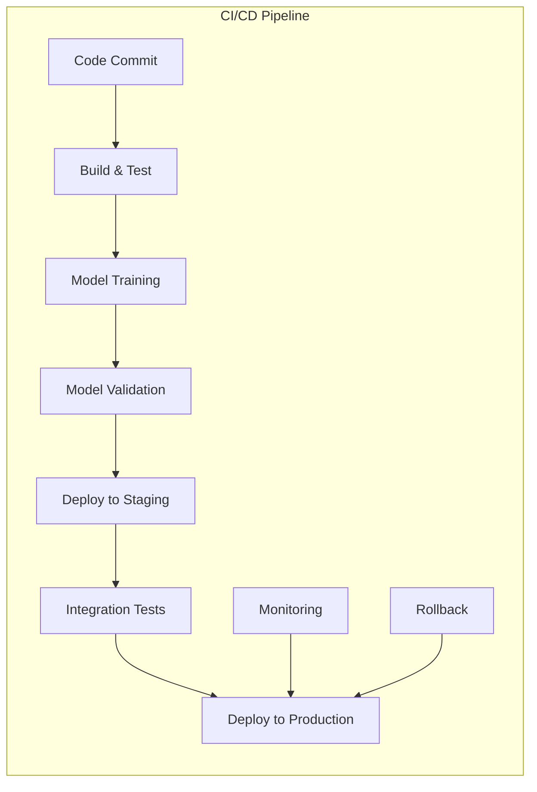

### 2. **GitOps Workflow**
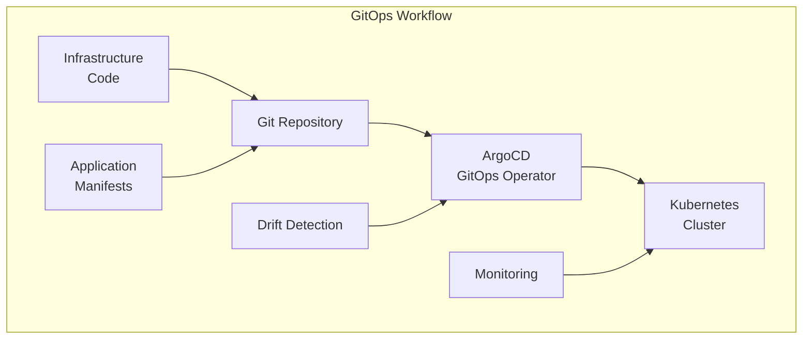

## 4. **Infrastructure as Code**

### 1. **Terraform Infrastructure**
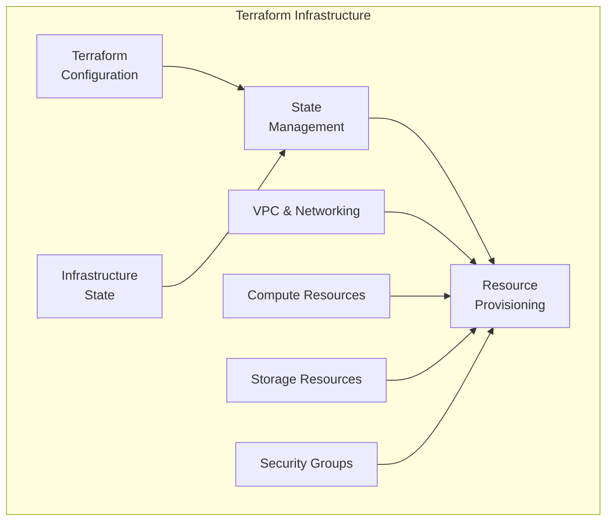

### 2. **Kubernetes Resource Management**
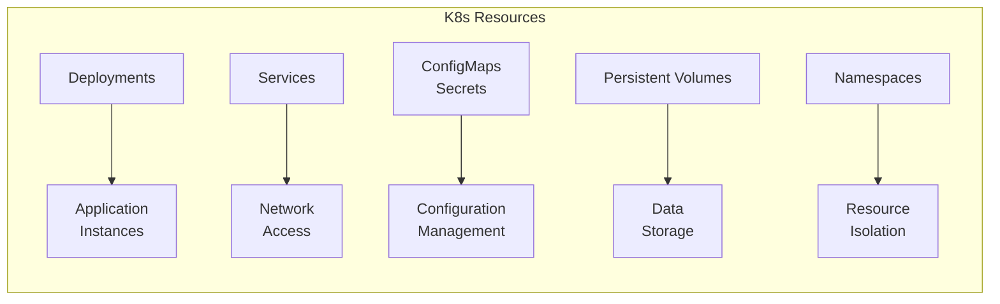

## 5. **Monitoring & Observability**

### 1. **Monitoring Stack Architecture**
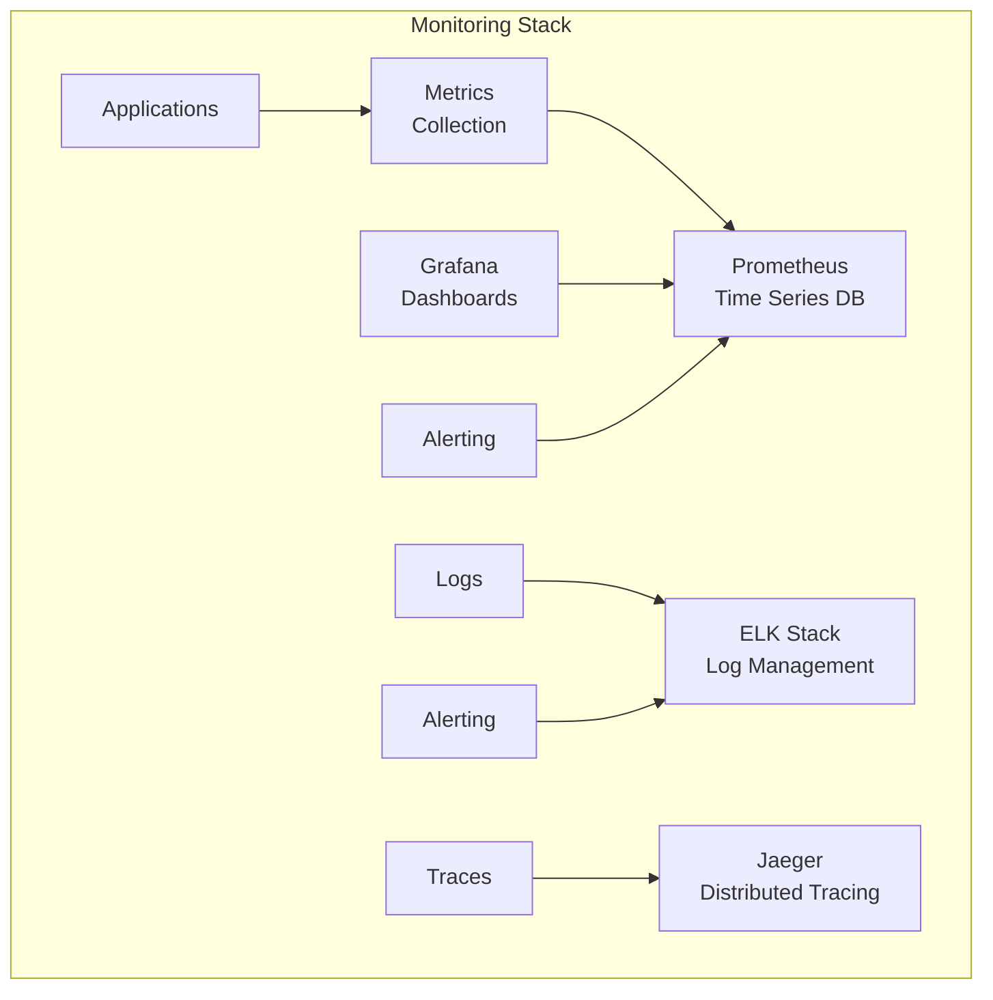

### 2. **Observability Pipeline**
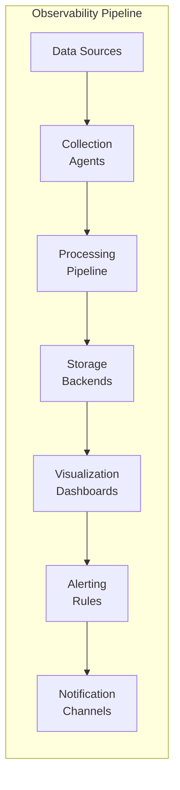

## 6. **Implementation Examples**

### **Multi-Cloud Abstraction Layer**
```python
class MultiCloudManager:
    def __init__(self):
        self.cloud_providers = {
            'aws': AWSProvider(),
            'azure': AzureProvider(),
            'gcp': GCPProvider()
        }
    
    def deploy_ml_platform(self, cloud_provider, config):
        """Deploy ML platform to specified cloud provider"""
        if cloud_provider not in self.cloud_providers:
            raise ValueError(f"Unsupported cloud provider: {cloud_provider}")
        
        provider = self.cloud_providers[cloud_provider]
        return provider.deploy_platform(config)
    
    def get_unified_metrics(self):
        """Get unified metrics across all cloud providers"""
        all_metrics = {}
        
        for provider_name, provider in self.cloud_providers.items():
            metrics = provider.get_metrics()
            all_metrics[provider_name] = metrics
        
        return self._normalize_metrics(all_metrics)
    
    def _normalize_metrics(self, metrics):
        """Normalize metrics across different cloud providers"""
        # Implementation for metric normalization
        pass
```

### **Docker Multi-Stage Build**
```dockerfile
# Multi-stage Dockerfile for ML model serving
FROM python:3.9-slim as base

# Install system dependencies
RUN apt-get update && apt-get install -y \
    gcc \
    g++ \
    && rm -rf /var/lib/apt/lists/*

# Install Python dependencies
COPY requirements.txt .
RUN pip install --no-cache-dir -r requirements.txt

# Build stage
FROM base as builder
COPY src/ /app/src/
COPY models/ /app/models/
RUN python -m py_compile /app/src/*.py

# Production stage
FROM python:3.9-slim as production
COPY --from=builder /app /app
COPY --from=builder /usr/local/lib/python3.9/site-packages /usr/local/lib/python3.9/site-packages

WORKDIR /app
EXPOSE 8000

CMD ["python", "src/app.py"]
```

### **Kubernetes Deployment for ML Platform**
```yaml
apiVersion: apps/v1
kind: Deployment
metadata:
  name: ml-platform
  labels:
    app: ml-platform
spec:
  replicas: 3
  selector:
    matchLabels:
      app: ml-platform
  template:
    metadata:
      labels:
        app: ml-platform
    spec:
      containers:
      - name: ml-platform
        image: ml-platform:latest
        ports:
        - containerPort: 8000
        resources:
          requests:
            memory: "1Gi"
            cpu: "500m"
          limits:
            memory: "2Gi"
            cpu: "1000m"
        env:
        - name: MODEL_PATH
          value: "/app/models"
        - name: LOG_LEVEL
          value: "INFO"
        volumeMounts:
        - name: model-storage
          mountPath: /app/models
        livenessProbe:
          httpGet:
            path: /health
            port: 8000
          initialDelaySeconds: 30
          periodSeconds: 10
        readinessProbe:
          httpGet:
            path: /ready
            port: 8000
          initialDelaySeconds: 5
          periodSeconds: 5
      volumes:
      - name: model-storage
        persistentVolumeClaim:
          claimName: ml-models-pvc
---
apiVersion: v1
kind: Service
metadata:
  name: ml-platform-service
spec:
  selector:
    app: ml-platform
  ports:
    - protocol: TCP
      port: 80
      targetPort: 8000
  type: LoadBalancer
```

### **Kubernetes Operator for ML Workflows**
```python
from kubernetes import client, config
from kubernetes.client.rest import ApiException
import yaml

class MLOperator:
    def __init__(self):
        config.load_incluster_config()
        self.v1 = client.CoreV1Api()
        self.apps_v1 = client.AppsV1Api()
        self.batch_v1 = client.BatchV1Api()
    
    def create_training_job(self, job_name, image, command, resources):
        """Create Kubernetes job for ML training"""
        job = client.V1Job(
            metadata=client.V1ObjectMeta(name=job_name),
            spec=client.V1JobSpec(
                template=client.V1PodTemplateSpec(
                    metadata=client.V1ObjectMeta(name=job_name),
                    spec=client.V1PodSpec(
                        containers=[
                            client.V1Container(
                                name=job_name,
                                image=image,
                                command=command,
                                resources=client.V1ResourceRequirements(
                                    requests=resources['requests'],
                                    limits=resources['limits']
                                )
                            )
                        ],
                        restart_policy="Never"
                    )
                )
            )
        )
        
        try:
            api_response = self.batch_v1.create_namespaced_job(
                namespace="default",
                body=job
            )
            return api_response
        except ApiException as e:
            print(f"Exception when creating job: {e}")
            return None
    
    def create_model_service(self, service_name, deployment_name, port):
        """Create Kubernetes service for model serving"""
        service = client.V1Service(
            metadata=client.V1ObjectMeta(name=service_name),
            spec=client.V1ServiceSpec(
                selector={"app": deployment_name},
                ports=[client.V1ServicePort(port=port, target_port=port)],
                type="LoadBalancer"
            )
        )
        
        try:
            api_response = self.v1.create_namespaced_service(
                namespace="default",
                body=service
            )
            return api_response
        except ApiException as e:
            print(f"Exception when creating service: {e}")
            return None
```

### **GitHub Actions CI/CD Pipeline**
```yaml
name: AI Platform CI/CD

on:
  push:
    branches: [main, develop]
  pull_request:
    branches: [main]

jobs:
  test:
    runs-on: ubuntu-latest
    steps:
      - uses: actions/checkout@v3
      
      - name: Set up Python
        uses: actions/setup-python@v4
        with:
          python-version: '3.9'
      
      - name: Install dependencies
        run: |
          pip install -r requirements.txt
          pip install pytest pytest-cov
      
      - name: Run tests
        run: |
          pytest --cov=src --cov-report=xml
      
      - name: Upload coverage
        uses: codecov/codecov-action@v3
        with:
          file: ./coverage.xml

  build:
    needs: test
    runs-on: ubuntu-latest
    if: github.ref == 'refs/heads/main'
    steps:
      - uses: actions/checkout@v3
      
      - name: Set up Docker Buildx
        uses: docker/setup-buildx-action@v2
      
      - name: Build and push Docker image
        uses: docker/build-push-action@v2
        with:
          context: .
          push: true
          tags: |
            ${{ secrets.ECR_REGISTRY }}/ml-platform:latest
            ${{ secrets.ECR_REGISTRY }}/ml-platform:${{ github.sha }}
          cache-from: type=gha
          cache-to: type=gha,mode=max

  deploy:
    needs: build
    runs-on: ubuntu-latest
    if: github.ref == 'refs/heads/main'
    steps:
      - uses: actions/checkout@v3
      
      - name: Configure AWS credentials
        uses: aws-actions/configure-aws-credentials@v2
        with:
          aws-access-key-id: ${{ secrets.AWS_ACCESS_KEY_ID }}
          aws-secret-access-key: ${{ secrets.AWS_SECRET_ACCESS_KEY }}
          aws-region: ${{ secrets.AWS_REGION }}
      
      - name: Update kubeconfig
        run: aws eks update-kubeconfig --name ${{ secrets.EKS_CLUSTER_NAME }}
      
      - name: Deploy to EKS
        run: |
          kubectl apply -f k8s/
          kubectl set image deployment/ml-platform ml-platform=${{ secrets.ECR_REGISTRY }}/ml-platform:${{ github.sha }}
```

### **ArgoCD Application for Infrastructure**
```yaml
apiVersion: argoproj.io/v1alpha1
kind: Application
metadata:
  name: ai-platform-infrastructure
  namespace: argocd
spec:
  project: default
  source:
    repoURL: https://github.com/your-org/ai-platform-manifests
    targetRevision: HEAD
    path: infrastructure
  destination:
    server: https://kubernetes.default.svc
    namespace: ai-platform
  syncPolicy:
    automated:
      prune: true
      selfHeal: true
    syncOptions:
      - CreateNamespace=true
      - PrunePropagationPolicy=foreground
      - PruneLast=true
  ignoreDifferences:
    - group: apps
      kind: Deployment
      jsonPointers:
        - /spec/replicas
```

### **Terraform Configuration for ML Infrastructure**
```hcl
# Terraform configuration for ML infrastructure on AWS
terraform {
  required_version = ">= 1.0"
  required_providers {
    aws = {
      source  = "hashicorp/aws"
      version = "~> 5.0"
    }
  }
}

provider "aws" {
  region = var.aws_region
}

# EKS Cluster for ML workloads
resource "aws_eks_cluster" "ml_cluster" {
  name     = "${var.project_name}-ml-cluster"
  role_arn = aws_iam_role.eks_cluster.arn
  version  = "1.28"

  vpc_config {
    subnet_ids              = var.subnet_ids
    endpoint_private_access = true
    endpoint_public_access  = true
  }

  depends_on = [
    aws_iam_role_policy_attachment.eks_cluster_policy,
    aws_iam_role_policy_attachment.eks_vpc_resource_controller,
  ]
}

# EKS Node Group
resource "aws_eks_node_group" "ml_nodes" {
  cluster_name    = aws_eks_cluster.ml_cluster.name
  node_group_name = "${var.project_name}-ml-nodes"
  node_role_arn   = aws_iam_role.eks_nodes.arn
  subnet_ids      = var.subnet_ids

  scaling_config {
    desired_size = var.node_group_desired_size
    max_size     = var.node_group_max_size
    min_size     = var.node_group_min_size
  }

  instance_types = var.node_group_instance_types

  depends_on = [
    aws_iam_role_policy_attachment.eks_worker_node_policy,
    aws_iam_role_policy_attachment.eks_cni_policy,
    aws_iam_role_policy_attachment.ec2_container_registry_read_only,
  ]
}

# SageMaker Domain
resource "aws_sagemaker_domain" "ml_domain" {
  domain_name = "${var.project_name}-ml-domain"
  auth_mode   = "IAM"
  vpc_id      = var.vpc_id
  subnet_ids  = var.subnet_ids

  default_user_settings {
    execution_role = aws_iam_role.sagemaker_execution.arn
  }
}

# S3 Bucket for ML artifacts
resource "aws_s3_bucket" "ml_artifacts" {
  bucket = "${var.project_name}-ml-artifacts-${random_string.bucket_suffix.result}"
}

resource "random_string" "bucket_suffix" {
  length  = 8
  special = false
  upper   = false
}

# IAM Role for EKS Cluster
resource "aws_iam_role" "eks_cluster" {
  name = "${var.project_name}-eks-cluster-role"

  assume_role_policy = jsonencode({
    Version = "2012-10-17"
    Statement = [
      {
        Action = "sts:AssumeRole"
        Effect = "Allow"
        Principal = {
          Service = "eks.amazonaws.com"
        }
      }
    ]
  })
}

# Variables
variable "project_name" {
  description = "Name of the project"
  type        = string
  default     = "ai-platform"
}

variable "aws_region" {
  description = "AWS region"
  type        = string
  default     = "us-west-2"
}

variable "vpc_id" {
  description = "VPC ID for the EKS cluster"
  type        = string
}

variable "subnet_ids" {
  description = "Subnet IDs for the EKS cluster"
  type        = list(string)
}

variable "node_group_desired_size" {
  description = "Desired size of the node group"
  type        = number
  default     = 2
}

variable "node_group_max_size" {
  description = "Maximum size of the node group"
  type        = number
  default     = 5
}

variable "node_group_min_size" {
  description = "Minimum size of the node group"
  type        = number
  default     = 1
}

variable "node_group_instance_types" {
  description = "Instance types for the node group"
  type        = list(string)
  default     = ["t3.medium", "t3.large"]
}

# Outputs
output "cluster_endpoint" {
  description = "Endpoint for EKS control plane"
  value       = aws_eks_cluster.ml_cluster.endpoint
}

output "cluster_security_group_id" {
  description = "Security group ID attached to the EKS cluster"
  value       = aws_eks_cluster.ml_cluster.vpc_config[0].cluster_security_group_id
}

output "cluster_iam_role_name" {
  description = "IAM role name associated with EKS cluster"
  value       = aws_eks_cluster.ml_cluster.iam_role_name
}

output "cluster_certificate_authority_data" {
  description = "Base64 encoded certificate data required to communicate with the cluster"
  value       = aws_eks_cluster.ml_cluster.certificate_authority[0].data
}
```

### **Prometheus Configuration**
```yaml
# prometheus.yml
global:
  scrape_interval: 15s
  evaluation_interval: 15s

rule_files:
  - "alert_rules.yml"

scrape_configs:
  - job_name: 'kubernetes-pods'
    kubernetes_sd_configs:
      - role: pod
    relabel_configs:
      - source_labels: [__meta_kubernetes_pod_annotation_prometheus_io_scrape]
        action: keep
        regex: true
      - source_labels: [__meta_kubernetes_pod_annotation_prometheus_io_path]
        action: replace
        target_label: __metrics_path__
        regex: (.+)
      - source_labels: [__address__, __meta_kubernetes_pod_annotation_prometheus_io_port]
        action: replace
        regex: ([^:]+)(?::\d+)?;(\d+)
        replacement: $1:$2
        target_label: __address__
      - action: labelmap
        regex: __meta_kubernetes_pod_label_(.+)
      - source_labels: [__meta_kubernetes_namespace]
        action: replace
        target_label: kubernetes_namespace
      - source_labels: [__meta_kubernetes_pod_name]
        action: replace
        target_label: kubernetes_pod_name

  - job_name: 'kubernetes-service-endpoints'
    kubernetes_sd_configs:
      - role: endpoints
    relabel_configs:
      - source_labels: [__meta_kubernetes_service_annotation_prometheus_io_scrape]
        action: keep
        regex: true
      - source_labels: [__meta_kubernetes_service_annotation_prometheus_io_scheme]
        action: replace
        target_label: __scheme__
        regex: (https?)
      - source_labels: [__meta_kubernetes_service_annotation_prometheus_io_path]
        action: replace
        target_label: __metrics_path__
        regex: (.+)
      - source_labels: [__address__, __meta_kubernetes_service_annotation_prometheus_io_port]
        action: replace
        regex: ([^:]+)(?::\d+)?;(\d+)
        replacement: $1:$2
        target_label: __address__
      - action: labelmap
        regex: __meta_kubernetes_service_label_(.+)
      - source_labels: [__meta_kubernetes_namespace]
        action: replace
        target_label: kubernetes_namespace
      - source_labels: [__meta_kubernetes_service_name]
        action: replace
        target_label: kubernetes_name

  - job_name: 'kubernetes-nodes'
    scheme: https
    tls_config:
      ca_file: /var/run/secrets/kubernetes.io/serviceaccount/ca.crt
      insecure_skip_verify: true
    bearer_token_file: /var/run/secrets/kubernetes.io/serviceaccount/token
    kubernetes_sd_configs:
      - role: node
    relabel_configs:
      - action: labelmap
        regex: __meta_kubernetes_node_label_(.+)
      - target_label: __address__
        replacement: kubernetes.default.svc:443
      - source_labels: [__meta_kubernetes_node_name]
        regex: (.+)
        target_label: __metrics_path__
        replacement: /api/v1/nodes/${1}/proxy/metrics

  - job_name: 'kube-state-metrics'
    static_configs:
      - targets: ['localhost:8080']

  - job_name: 'kubernetes-cadvisor'
    scheme: https
    tls_config:
      ca_file: /var/run/secrets/kubernetes.io/serviceaccount/ca.crt
      insecure_skip_verify: true
    bearer_token_file: /var/run/secrets/kubernetes.io/serviceaccount/token
    kubernetes_sd_configs:
      - role: node
    relabel_configs:
      - action: labelmap
        regex: __meta_kubernetes_node_label_(.+)
      - target_label: __address__
        replacement: kubernetes.default.svc:443
      - source_labels: [__meta_kubernetes_node_name]
        regex: (.+)
        target_label: __metrics_path__
        replacement: /api/v1/nodes/${1}/proxy/metrics/cadvisor
```

### **Grafana Dashboard Configuration**
```json
{
  "dashboard": {
    "id": null,
    "title": "AI Platform Dashboard",
    "tags": ["ai", "ml", "kubernetes"],
    "style": "dark",
    "timezone": "browser",
    "panels": [
      {
        "id": 1,
        "title": "Model Performance",
        "type": "graph",
        "targets": [
          {
            "expr": "rate(model_predictions_total[5m])",
            "legendFormat": "Predictions/sec"
          },
          {
            "expr": "rate(model_latency_seconds_sum[5m]) / rate(model_latency_seconds_count[5m])",
            "legendFormat": "Average Latency"
          }
        ],
        "gridPos": {
          "h": 8,
          "w": 12,
          "x": 0,
          "y": 0
        }
      },
      {
        "id": 2,
        "title": "Resource Usage",
        "type": "graph",
        "targets": [
          {
            "expr": "container_memory_usage_bytes{container=~\"ml-platform.*\"}",
            "legendFormat": "Memory Usage"
          },
          {
            "expr": "rate(container_cpu_usage_seconds_total{container=~\"ml-platform.*\"}[5m])",
            "legendFormat": "CPU Usage"
          }
        ],
        "gridPos": {
          "h": 8,
          "w": 12,
          "x": 12,
          "y": 0
        }
      },
      {
        "id": 3,
        "title": "Data Pipeline Status",
        "type": "stat",
        "targets": [
          {
            "expr": "data_pipeline_jobs_total",
            "legendFormat": "Total Jobs"
          },
          {
            "expr": "data_pipeline_jobs_failed_total",
            "legendFormat": "Failed Jobs"
          }
        ],
        "gridPos": {
          "h": 4,
          "w": 6,
          "x": 0,
          "y": 8
        }
      }
    ],
    "time": {
      "from": "now-1h",
      "to": "now"
    },
    "refresh": "10s"
  }
}
```

## 7. **Best Practices**

### **Infrastructure Management**
1. **Infrastructure as Code**: Use Terraform, CloudFormation, or similar tools
2. **Version Control**: Store all infrastructure configurations in Git
3. **Automation**: Automate deployment and scaling processes
4. **Monitoring**: Implement comprehensive monitoring and alerting

### **Containerization**
1. **Multi-stage Builds**: Use multi-stage Docker builds for optimization
2. **Security Scanning**: Scan container images for vulnerabilities
3. **Resource Limits**: Set appropriate resource limits for containers
4. **Health Checks**: Implement proper health checks for services

### **Kubernetes Operations**
1. **Resource Management**: Use resource requests and limits
2. **Horizontal Scaling**: Implement horizontal pod autoscaling
3. **Rolling Updates**: Use rolling update strategy for deployments
4. **Backup & Recovery**: Implement backup strategies for persistent data

---

**Next Section**: [Security & Compliance](../05-Security/README.md)
