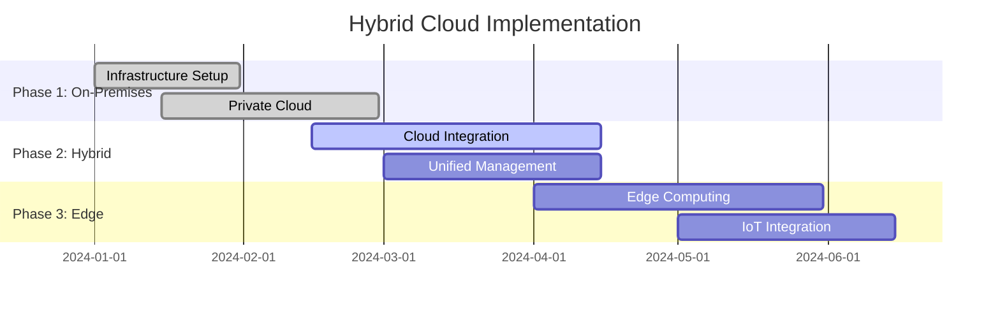
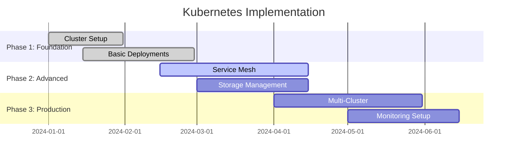
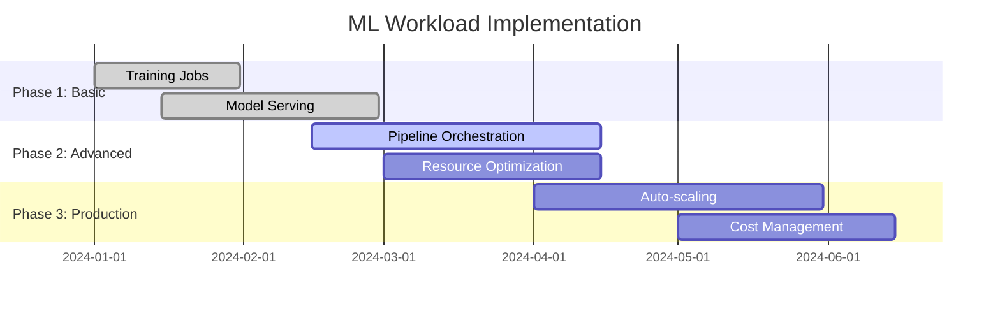
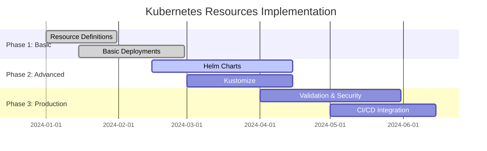
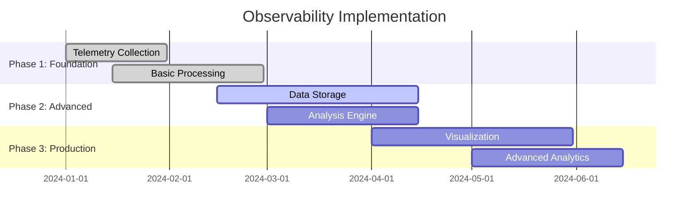

# Infrastructure & DevOps for AI Platforms

## Overview
This section covers comprehensive infrastructure and DevOps practices for building, deploying, and operating enterprise AI-Data platforms.

## Industry Standards & Best Practices

### 1. Cloud-Native AI Platforms
**Industry Standard:** Cloud Native Computing Foundation (CNCF), AWS Well-Architected
**Enterprise Adoption:** 80% of modern AI platforms

#### Project Features
- **Multi-Cloud Strategy**: AWS, Azure, GCP, hybrid cloud
- **Container Orchestration**: Kubernetes, Docker Swarm, ECS
- **Service Mesh**: Istio, Linkerd, Consul Connect
- **Cloud-Native Storage**: Object storage, managed databases, CDN

#### Implementation Roadmap

### 2. Multi-Cloud Strategy
**Industry Standard:** Cloud Native Computing Foundation (CNCF)
**Enterprise Adoption:** 75% of enterprises

#### Project Features
- **Cloud Abstraction**: Terraform, Kubernetes, service mesh
- **Portability**: Container-based deployment, cloud-agnostic APIs
- **Cost Optimization**: Multi-cloud pricing, resource optimization
- **Disaster Recovery**: Cross-cloud backup, failover strategies

#### Implementation Roadmap

### 3. Hybrid Cloud Architecture
**Industry Standard:** NIST Cloud Computing Reference Architecture
**Enterprise Adoption:** 80% of regulated industries

#### Project Features
- **Edge Computing**: IoT devices, edge nodes, local processing
- **Data Sovereignty**: On-premises storage, compliance requirements
- **Hybrid Connectivity**: VPN, direct connect, private links
- **Unified Management**: Single pane of glass, hybrid operations

#### Implementation Roadmap

## Containerization & Orchestration

### Docker Containerization
**Industry Standard:** Docker, OCI standards, container security
**Enterprise Adoption:** 95% of cloud-native applications

#### Project Features
- **Multi-Stage Builds**: Optimized images, security scanning
- **Container Security**: Image scanning, runtime protection, secrets management
- **Registry Management**: Private registries, image versioning, access control
- **Container Optimization**: Minimal base images, layer optimization

#### Implementation Roadmap

### Kubernetes Orchestration
**Industry Standard:** Kubernetes, CNCF standards, cloud-native patterns
**Enterprise Adoption:** 85% of containerized applications

#### Project Features
- **Cluster Management**: Multi-cluster, cluster federation, cluster API
- **Resource Management**: Namespaces, resource quotas, limit ranges
- **Service Mesh**: Istio, Linkerd, traffic management
- **Storage Management**: Persistent volumes, storage classes, CSI drivers

#### Implementation Roadmap

### ML Workload Orchestration
**Industry Standard:** Kubeflow, MLflow, SageMaker
**Enterprise Adoption:** 60% of ML production systems

#### Project Features
- **Training Jobs**: Distributed training, hyperparameter tuning, job scheduling
- **Model Serving**: Inference services, auto-scaling, load balancing
- **Pipeline Orchestration**: ML pipelines, workflow management, dependency handling
- **Resource Optimization**: GPU allocation, memory management, cost optimization

#### Implementation Roadmap

## CI/CD & GitOps

### CI/CD Pipeline Architecture
**Industry Standard:** Jenkins, GitHub Actions, GitLab CI, ArgoCD
**Enterprise Adoption:** 90% of development teams

#### Project Features
- **Source Control**: Git workflows, branching strategies, code review
- **Build Automation**: Automated building, testing, packaging
- **Deployment Automation**: Automated deployment, rollback, blue-green
- **Quality Gates**: Code quality, security scanning, performance testing

#### Implementation Roadmap

### GitOps Workflow
**Industry Standard:** ArgoCD, Flux, Tekton
**Enterprise Adoption:** 50% of advanced DevOps teams

#### Project Features
- **Declarative Infrastructure**: Infrastructure as Code, Git-based configuration
- **Automated Sync**: Continuous deployment, drift detection, reconciliation
- **Multi-Environment**: Development, staging, production environments
- **Rollback Capabilities**: Git-based rollbacks, version management

#### Implementation Roadmap

## Infrastructure as Code

### Terraform Infrastructure
**Industry Standard:** HashiCorp Terraform, AWS CloudFormation
**Enterprise Adoption:** 80% of cloud infrastructure

#### Project Features
- **Infrastructure Definition**: Declarative configuration, version control
- **Multi-Cloud Support**: AWS, Azure, GCP, on-premises
- **State Management**: Remote state, state locking, collaboration
- **Module System**: Reusable modules, versioning, testing

#### Implementation Roadmap

### Kubernetes Resource Management
**Industry Standard:** Kubernetes manifests, Helm charts, Kustomize
**Enterprise Adoption:** 85% of Kubernetes deployments

#### Project Features
- **Resource Definitions**: Deployments, services, ingress, configmaps
- **Helm Charts**: Chart packaging, versioning, dependency management
- **Kustomize**: Configuration customization, environment-specific configs
- **Resource Validation**: Schema validation, policy enforcement, security scanning

#### Implementation Roadmap

## Monitoring & Observability

### Monitoring Stack Architecture
**Industry Standard:** Prometheus, Grafana, ELK Stack
**Enterprise Adoption:** 90% of production systems

#### Project Features
- **Metrics Collection**: Prometheus, exporters, custom metrics
- **Visualization**: Grafana dashboards, alerting, reporting
- **Log Management**: ELK Stack, log aggregation, search, analysis
- **Tracing**: Distributed tracing, Jaeger, Zipkin

#### Implementation Roadmap

### Observability Pipeline
**Industry Standard:** OpenTelemetry, observability standards
**Enterprise Adoption:** 60% of modern applications

#### Project Features
- **Telemetry Collection**: Metrics, logs, traces, events
- **Data Processing**: Aggregation, filtering, transformation
- **Storage & Analysis**: Time-series databases, search engines, analytics
- **Visualization**: Dashboards, reports, alerting, insights

#### Implementation Roadmap

## Industry Case Studies

### Financial Services
- **JPMorgan Chase**: Multi-cloud AI platform, 99.99% uptime
- **Goldman Sachs**: Kubernetes-native ML platform, 50% cost reduction
- **American Express**: Hybrid cloud, 30% faster deployment

### Healthcare
- **Mayo Clinic**: Edge computing, 40% faster diagnosis
- **Kaiser Permanente**: Multi-cloud strategy, 25% cost reduction
- **Cleveland Clinic**: Hybrid cloud, 35% performance improvement

### Technology
- **Netflix**: Multi-cloud, 99.99% availability
- **Uber**: Kubernetes at scale, 10M+ containers
- **Airbnb**: GitOps, 100% automated deployments

## Success Metrics

### Technical Metrics
- **Availability**: 99.9% uptime, < 1 hour MTTR
- **Performance**: < 100ms response time, > 10K req/sec
- **Scalability**: Auto-scaling, 10x capacity increase

### Business Metrics
- **Time to Market**: 50% reduction in deployment time
- **Cost Efficiency**: 30% reduction in infrastructure costs
- **Developer Productivity**: 40% increase in deployment frequency

### Operational Metrics
- **Automation**: 90% automated deployments, 80% automated testing
- **Monitoring**: 100% service coverage, real-time alerting
- **Compliance**: 100% audit trail, security compliance

## Next Steps

1. **Assessment**: Evaluate current infrastructure capabilities
2. **Planning**: Create detailed implementation roadmap
3. **Pilot**: Start with small proof of concept
4. **Scale**: Gradually expand to full platform
5. **Optimize**: Continuous improvement and optimization

This comprehensive infrastructure and DevOps framework provides the foundation for building scalable, reliable, and efficient AI platforms that can support enterprise initiatives while maintaining operational excellence and cost efficiency.
