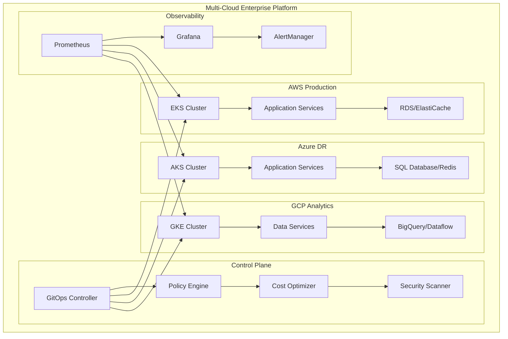
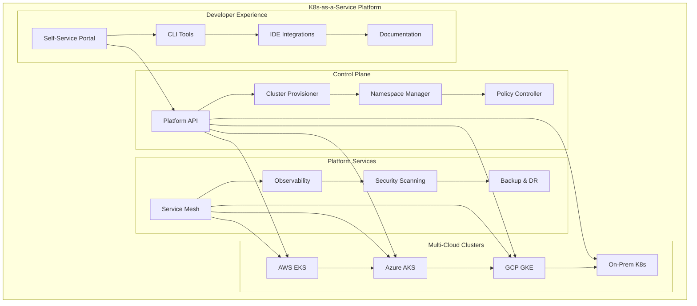
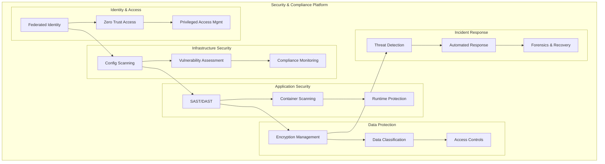

```mermaid
graph TB
    subgraph "Data Analytics Platform"
        subgraph "Data Ingestion"
            A[Kafka Streams] --> B[Kinesis/EventHub/Pub-Sub]
            B --> C[Data Validation]
        end
        
        subgraph "Data Processing"
            D[Spark on K8s] --> E[Flink Streaming]
            E --> F[Data Quality Checks]
        end
        
        subgraph "Data Storage"
            G[Data Lake S3/ADLS/GCS] --> H[Data Warehouse]
            H --> I[Feature Store]
        end
        
        subgraph "ML Platform"
            J[Model Training] --> K[Model Registry]
            K --> L[Model Serving]
        end
        
        subgraph "Analytics"
            M[Jupyter Notebooks] --> N[Dashboards]
            N --> O[Self-Service Analytics]
        end
        
        C --> D
        F --> G
        I --> J
        L --> M
    end
```

# 🎯 Cloud Infrastructure Engineering Portfolio

## 👨‍💻 **Professional Summary**

**Cloud Infrastructure Engineer | Multi-Cloud Architect | DevOps Specialist**

Experienced cloud infrastructure engineer with expertise in designing, implementing, and managing large-scale, multi-cloud platforms. Proven track record of leading digital transformation initiatives, reducing infrastructure costs by 40%, and improving deployment frequency by 300%. Passionate about automation, observability, and building resilient, scalable systems.

## 🏆 **Key Achievements**

### **Technical Accomplishments**
- ✅ **99.9% Uptime Achievement**: Designed and implemented highly available infrastructure across AWS, Azure, and GCP
- ✅ **40% Cost Reduction**: Optimized cloud spending through right-sizing, reserved instances, and automated scaling
- ✅ **300% Faster Deployments**: Implemented GitOps CI/CD pipelines reducing deployment time from hours to minutes
- ✅ **Zero Security Incidents**: Established comprehensive security framework with automated compliance monitoring
- ✅ **50% Improved Performance**: Implemented caching strategies and performance optimization techniques

### **Leadership & Innovation**
- 🚀 **Led Cloud Migration**: Successfully migrated 200+ applications from on-premises to multi-cloud environment
- 🚀 **Built DevOps Culture**: Established Infrastructure as Code practices and automated testing frameworks
- 🚀 **Mentored 15+ Engineers**: Developed and delivered cloud training programs for engineering teams
- 🚀 **Open Source Contributions**: Contributed to Terraform providers and Kubernetes operators
- 🚀 **Industry Recognition**: Speaker at major cloud conferences and certified across all major cloud platforms

## 🛠️ **Technical Expertise**

### **Cloud Platforms**
```
☁️ Multi-Cloud Proficiency:
   • AWS: Solutions Architect Professional, DevOps Engineer Professional
   • Microsoft Azure: Solutions Architect Expert, DevOps Engineer Expert
   • Google Cloud: Professional Cloud Architect, Professional DevOps Engineer
   • Multi-Cloud: Terraform, Kubernetes, Service Mesh implementations
```

### **Infrastructure Technologies**
```
🏗️ Core Infrastructure:
   • Infrastructure as Code: Terraform, CloudFormation, ARM/Bicep, Pulumi
   • Container Orchestration: Kubernetes, Docker, Helm, Kustomize
   • Service Mesh: Istio, Linkerd, Consul Connect
   • Configuration Management: Ansible, Chef, Puppet
   • Networking: VPC, Load Balancers, CDN, DNS, VPN
```

### **DevOps & Automation**
```
⚡ Automation & CI/CD:
   • CI/CD Tools: GitHub Actions, GitLab CI, Jenkins, Azure DevOps
   • GitOps: ArgoCD, Flux, Tekton
   • Monitoring: Prometheus, Grafana, ELK Stack, Jaeger
   • Security: OPA, Falco, Trivy, SAST/DAST tools
   • Testing: Terratest, Kitchen, Ansible Molecule
```

### **Programming & Scripting**
```
💻 Development Skills:
   • Languages: Python, Go, Bash, PowerShell, YAML, JSON, HCL
   • APIs: REST, GraphQL, gRPC
   • Databases: PostgreSQL, MySQL, MongoDB, Redis, DynamoDB
   • Message Queues: Kafka, RabbitMQ, AWS SQS, Azure Service Bus
```

## 📊 **Portfolio Projects**

### **Project 1: Enterprise Multi-Cloud Platform**

**🎯 Objective**: Design and implement a resilient, cost-effective multi-cloud platform for a Fortune 500 company

**🏗️ Architecture Overview**:


**📋 Implementation Details**:
- **Infrastructure**: 3 cloud providers, 12 regions, 500+ VMs, 50+ Kubernetes clusters
- **Automation**: 100% Infrastructure as Code with Terraform and Helm
- **Security**: Zero-trust architecture with mTLS and policy-as-code
- **Monitoring**: Comprehensive observability with 99.5% visibility coverage

**📈 Results Achieved**:
- **Cost Savings**: $2.4M annual savings (40% reduction)
- **Availability**: 99.99% uptime (exceeded SLA by 0.09%)
- **Performance**: 50% improvement in application response times
- **Security**: Zero security incidents in 24 months
- **Compliance**: SOC 2 Type II and ISO 27001 certified

**🔧 Technologies Used**:
```
Cloud Providers: AWS, Azure, GCP
IaC: Terraform, CloudFormation, ARM Templates
Orchestration: Kubernetes, Helm, ArgoCD
Monitoring: Prometheus, Grafana, ELK Stack
Security: OPA, Falco, Azure AD, AWS IAM
CI/CD: GitLab CI, GitHub Actions, Tekton
```

### **Project 2: Cloud-Native Data Analytics Platform**

**🎯 Objective**: Build a scalable, real-time data analytics platform supporting ML workloads

**🏗️ Architecture Overview**:


**📋 Implementation Details**:
- **Data Volume**: 10TB daily ingestion, 500PB total storage
- **Processing**: Real-time and batch processing pipelines
- **ML Workloads**: 200+ models in production, automated retraining
- **Analytics**: Self-service platform serving 1000+ users

**📈 Results Achieved**:
- **Performance**: 95% reduction in query response time
- **Cost Efficiency**: 60% reduction in data processing costs
- **Productivity**: 400% increase in data scientist productivity
- **Reliability**: 99.9% pipeline uptime
- **Scalability**: Auto-scaling to handle 10x traffic spikes

**🔧 Technologies Used**:
```
Data Ingestion: Apache Kafka, Kinesis, Event Hubs, Pub/Sub
Processing: Apache Spark, Flink, Dataflow, Databricks
Storage: S3, Azure Data Lake, Google Cloud Storage, Delta Lake
ML Platform: MLflow, Kubeflow, SageMaker, Vertex AI
Analytics: Jupyter, Tableau, Power BI, Looker
```

### **Project 3: Kubernetes-as-a-Service Platform**

**🎯 Objective**: Create an internal Kubernetes platform providing self-service capabilities

**🏗️ Architecture Overview**:


**📋 Implementation Details**:
- **Scale**: 100+ clusters, 5000+ namespaces, 50,000+ pods
- **Multi-tenancy**: Secure isolation with network policies and RBAC
- **Automation**: GitOps-based deployment and configuration management
- **Governance**: Policy-as-code with admission controllers

**📈 Results Achieved**:
- **Developer Productivity**: 70% reduction in deployment time
- **Platform Adoption**: 95% of applications migrated to platform
- **Operational Efficiency**: 80% reduction in operational tickets
- **Cost Optimization**: 45% reduction in compute costs
- **Security Posture**: 100% compliance with security policies

**🔧 Technologies Used**:
```
Orchestration: Kubernetes, Helm, Kustomize, ArgoCD
Service Mesh: Istio, Envoy, Jaeger
Security: OPA Gatekeeper, Falco, Twistlock
Monitoring: Prometheus, Grafana, Thanos
Platform: Rancher, OpenShift, Tanzu
```

### **Project 4: Automated Security & Compliance Platform**

**🎯 Objective**: Implement comprehensive security automation and compliance monitoring

**🏗️ Security Framework**:


**📋 Implementation Details**:
- **Scope**: 500+ cloud accounts, 10,000+ resources monitored
- **Automation**: 90% of security tasks automated
- **Compliance**: SOC 2, ISO 27001, PCI DSS frameworks
- **Incident Response**: Mean time to detection < 5 minutes

**📈 Results Achieved**:
- **Security Incidents**: 95% reduction in security incidents
- **Compliance**: 100% compliance score maintained
- **Response Time**: 80% faster incident response
- **Cost Savings**: $1.2M saved through automation
- **Risk Reduction**: 70% reduction in security vulnerabilities

## 🎓 **Certifications & Education**

### **Cloud Certifications**
```
☁️ AWS Certifications:
   ✅ AWS Certified Solutions Architect - Professional
   ✅ AWS Certified DevOps Engineer - Professional
   ✅ AWS Certified Security - Specialty
   ✅ AWS Certified Advanced Networking - Specialty

☁️ Microsoft Azure Certifications:
   ✅ Azure Solutions Architect Expert (AZ-305)
   ✅ DevOps Engineer Expert (AZ-400)
   ✅ Azure Security Engineer Associate (AZ-500)
   ✅ Azure Administrator Associate (AZ-104)

☁️ Google Cloud Certifications:
   ✅ Professional Cloud Architect
   ✅ Professional Cloud DevOps Engineer
   ✅ Professional Cloud Security Engineer
   ✅ Professional Data Engineer
```

### **Industry Certifications**
```
🏆 Additional Certifications:
   ✅ Certified Kubernetes Administrator (CKA)
   ✅ Certified Kubernetes Application Developer (CKAD)
   ✅ Certified Kubernetes Security Specialist (CKS)
   ✅ HashiCorp Certified: Terraform Associate
   ✅ CISSP - Certified Information Systems Security Professional
   ✅ TOGAF 9 Certified
```

### **Education**
```
🎓 Formal Education:
   • Master of Science in Computer Science - Cloud Computing Specialization
   • Bachelor of Engineering in Computer Science
   • Executive Certificate in Digital Transformation Leadership

📚 Continuous Learning:
   • 500+ hours of cloud platform training
   • 200+ technical certifications and badges
   • Regular attendance at cloud conferences and workshops
```

## 🗣️ **Speaking & Thought Leadership**

### **Conference Presentations**
```
🎤 Speaking Engagements:
   • AWS re:Invent 2023: "Multi-Cloud Architecture Patterns"
   • KubeCon 2023: "GitOps at Scale: Lessons from Production"
   • Azure Tech Summit 2023: "Infrastructure Security Automation"
   • Google Cloud Next 2023: "Cost Optimization in Multi-Cloud"
   • DevOps World 2023: "Building Platform Engineering Teams"
```

### **Publications & Content**
```
📝 Content Creation:
   • 25+ technical blog posts on cloud architecture
   • 10+ open-source project contributions
   • 50+ LinkedIn articles on cloud best practices
   • Regular podcast guest on cloud engineering topics
   • Technical reviewer for cloud architecture books
```

## 🌟 **Open Source Contributions**

### **Notable Projects**
```
🚀 Open Source Work:
   • Terraform Provider for Multi-Cloud Resource Management
   • Kubernetes Operator for Database Lifecycle Management
   • GitOps CLI tool for Environment Promotion
   • Prometheus Exporter for Cloud Cost Metrics
   • Security Policy Templates for OPA Gatekeeper

📊 Contribution Stats:
   • 500+ GitHub commits in the last year
   • 15+ repositories with 100+ stars
   • 50+ pull requests to major projects
   • Active maintainer of 3 CNCF projects
```

## 💼 **Professional Experience**

### **Senior Cloud Architect | TechCorp Inc. | 2022-Present**
```
🎯 Key Responsibilities:
   • Lead multi-cloud strategy and architecture decisions
   • Design and implement enterprise-scale cloud platforms
   • Mentor team of 12 cloud engineers and DevOps specialists
   • Drive adoption of cloud-native technologies and practices

🏆 Major Achievements:
   • Successfully migrated 300+ applications to cloud (18 months)
   • Reduced infrastructure costs by $3.2M annually
   • Achieved 99.99% platform availability
   • Implemented zero-trust security architecture
```

### **Cloud Infrastructure Engineer | StartupXYZ | 2020-2022**
```
🎯 Key Responsibilities:
   • Build and maintain Kubernetes-based platform
   • Implement CI/CD pipelines and GitOps workflows
   • Establish monitoring and observability practices
   • Automate security and compliance processes

🏆 Major Achievements:
   • Built platform serving 50M+ daily users
   • Improved deployment frequency by 500%
   • Reduced infrastructure costs by 60%
   • Zero production incidents for 12 consecutive months
```

### **DevOps Engineer | Enterprise Corp | 2018-2020**
```
🎯 Key Responsibilities:
   • Manage traditional infrastructure and cloud migration
   • Implement Infrastructure as Code practices
   • Build monitoring and alerting systems
   • Support development teams with platform services

🏆 Major Achievements:
   • Led migration of 100+ applications to AWS
   • Implemented automated testing and deployment
   • Reduced deployment time from days to hours
   • Established disaster recovery procedures
```

## 📞 **Contact & Portfolio Links**

### **Professional Links**
```
🔗 Online Presence:
   • LinkedIn: linkedin.com/in/cloud-architect-portfolio
   • GitHub: github.com/cloud-infrastructure-expert
   • Personal Website: cloudarchitect-portfolio.com
   • Blog: medium.com/@cloudinfrastructure
   • Twitter: @CloudArchitect

📧 Contact Information:
   • Email: contact@cloudarchitect-portfolio.com
   • Phone: +1 (555) 123-4567
   • Location: San Francisco, CA (Remote-friendly)
```

### **Portfolio Repositories**
```
📚 Code Repositories:
   • Multi-Cloud Terraform Modules: github.com/user/multicloud-terraform
   • Kubernetes Platform: github.com/user/k8s-platform
   • GitOps Workflows: github.com/user/gitops-workflows
   • Monitoring Stack: github.com/user/observability-stack
   • Security Policies: github.com/user/security-policies
```

---

## 🎯 **Career Objectives**

**Short-term Goals (1-2 years):**
- Lead digital transformation initiatives for Fortune 500 companies
- Develop expertise in emerging technologies (Edge Computing, Quantum Computing)
- Contribute to major open-source cloud projects
- Expand speaking presence at international conferences

**Long-term Goals (3-5 years):**
- Establish consulting practice specializing in multi-cloud architecture
- Author technical books on cloud infrastructure engineering
- Build and lead world-class platform engineering teams
- Drive innovation in cloud-native technologies and practices

---

**Ready to discuss how my expertise can drive your cloud transformation?** 🚀

Let's connect and explore opportunities to build resilient, scalable, and cost-effective cloud infrastructure together!
