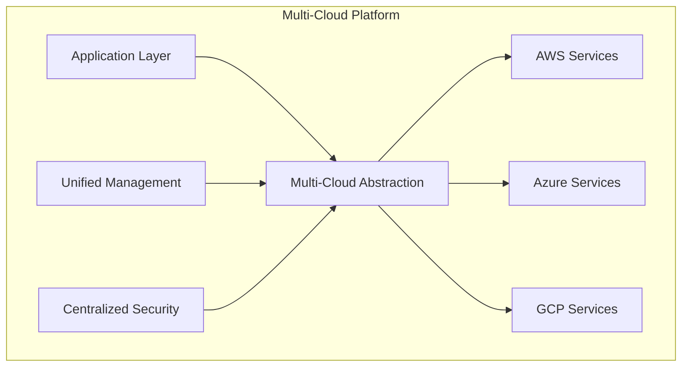
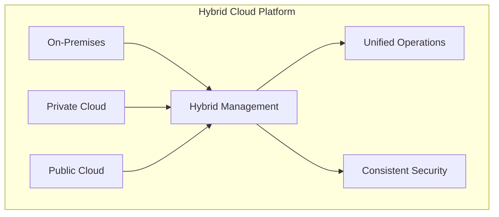
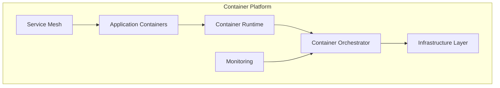

# Cloud-Native Platforms Project

## Overview
This project demonstrates cloud-native platform implementations for enterprise AI-Data platforms, including multi-cloud strategies, containerization, and infrastructure automation.

## Project Structure
```
cloud-native-platforms/
├── README.md
├── multi-cloud-strategy/
├── hybrid-cloud-architecture/
├── containerization/
├── kubernetes-orchestration/
├── service-mesh/
├── infrastructure-as-code/
├── ci-cd-pipelines/
├── monitoring-observability/
└── security-compliance/
```

## Getting Started
1. Choose the cloud-native component that fits your requirements
2. Review the implementation guide and code samples
3. Follow the step-by-step deployment instructions
4. Customize the configuration for your environment

## Cloud-Native Components

### 1. Multi-Cloud Strategy
- **Use Case**: Cloud vendor diversity and risk mitigation
- **Complexity**: High
- **Scalability**: Multi-cloud scaling
- **Best For**: Risk mitigation, cost optimization, vendor lock-in avoidance

### 2. Hybrid Cloud Architecture
- **Use Case**: On-premises + Cloud integration
- **Complexity**: High
- **Scalability**: Hybrid scaling
- **Best For**: Regulatory compliance, data sovereignty, legacy integration

### 3. Containerization
- **Use Case**: Application packaging and deployment
- **Complexity**: Medium
- **Scalability**: Container scaling
- **Best For**: Application portability, consistent deployments

### 4. Kubernetes Orchestration
- **Use Case**: Container orchestration and management
- **Complexity**: High
- **Scalability**: Cluster scaling
- **Best For**: Microservices, distributed applications

### 5. Service Mesh
- **Use Case**: Service-to-service communication
- **Complexity**: High
- **Scalability**: Mesh scaling
- **Best For**: Microservices, service discovery, traffic management

### 6. Infrastructure as Code
- **Use Case**: Automated infrastructure management
- **Complexity**: Medium
- **Scalability**: IaC scaling
- **Best For**: Infrastructure automation, version control

### 7. CI/CD Pipelines
- **Use Case**: Automated software delivery
- **Complexity**: Medium
- **Scalability**: Pipeline scaling
- **Best For**: Continuous delivery, automated testing

### 8. Monitoring & Observability
- **Use Case**: System monitoring and troubleshooting
- **Complexity**: Medium
- **Scalability**: Monitoring scaling
- **Best For**: Production systems, performance optimization

### 9. Security & Compliance
- **Use Case**: Platform security and regulatory compliance
- **Complexity**: High
- **Scalability**: Security scaling
- **Best For**: Regulated industries, enterprise security

## Technology Stack

### Multi-Cloud & Hybrid
- **Cloud Providers**: AWS, Azure, GCP, IBM Cloud
- **Multi-Cloud Tools**: Terraform, Kubernetes, Cloud Foundry
- **Hybrid Tools**: Azure Arc, AWS Outposts, GCP Anthos

### Containerization
- **Container Runtime**: Docker, containerd, CRI-O
- **Container Build**: Docker Build, Buildah, Kaniko
- **Container Registry**: Docker Hub, AWS ECR, Azure ACR, GCP GCR

### Kubernetes
- **Kubernetes**: Vanilla Kubernetes, EKS, AKS, GKE
- **Package Manager**: Helm, Kustomize, Operator SDK
- **Extensions**: Istio, Linkerd, Prometheus Operator

### Service Mesh
- **Service Mesh**: Istio, Linkerd, Consul Connect
- **Traffic Management**: Load balancing, routing, fault injection
- **Security**: mTLS, authorization, certificate management

### Infrastructure as Code
- **IaC Tools**: Terraform, CloudFormation, Pulumi, Bicep
- **Configuration Management**: Ansible, Chef, Puppet
- **GitOps**: ArgoCD, Flux, Tekton

### CI/CD
- **CI/CD Tools**: GitHub Actions, GitLab CI, Jenkins, CircleCI
- **Artifact Management**: JFrog Artifactory, Sonatype Nexus
- **Deployment**: ArgoCD, Spinnaker, Harness

### Monitoring & Observability
- **Metrics**: Prometheus, Grafana, Datadog, New Relic
- **Logging**: ELK Stack, Fluentd, Splunk
- **Tracing**: Jaeger, Zipkin, OpenTelemetry

### Security & Compliance
- **Security**: OPA, Falco, Trivy, Snyk
- **Compliance**: OpenSCAP, InSpec, Chef Compliance
- **Secrets**: HashiCorp Vault, AWS Secrets Manager, Azure Key Vault

## Implementation Phases

### Phase 1: Foundation (Weeks 1-2)
1. **Cloud Assessment**
   - Evaluate cloud providers
   - Design multi-cloud strategy
   - Plan hybrid cloud integration

2. **Basic Infrastructure**
   - Set up cloud accounts
   - Configure basic networking
   - Set up monitoring and logging

### Phase 2: Core Platform (Weeks 3-6)
1. **Containerization**
   - Containerize applications
   - Set up container registry
   - Implement CI/CD pipelines

2. **Kubernetes Setup**
   - Deploy Kubernetes clusters
   - Configure service mesh
   - Set up monitoring stack

### Phase 3: Advanced Features (Weeks 7-8)
1. **Multi-Cloud Integration**
   - Implement multi-cloud abstraction
   - Set up cross-cloud networking
   - Configure disaster recovery

2. **Security & Compliance**
   - Implement security controls
   - Set up compliance monitoring
   - Configure audit logging

## Success Metrics

### Technical Metrics
- **Platform Availability**: 99.9% uptime, < 1 hour MTTR
- **Performance**: < 100ms response time, > 10K req/sec
- **Scalability**: Auto-scaling, 10x capacity increase

### Business Metrics
- **Cost Efficiency**: 30% reduction in infrastructure costs
- **Time to Market**: 50% reduction in deployment time
- **Resource Utilization**: 80% resource efficiency

### Operational Metrics
- **Automation Level**: 90% automated deployments, 80% automated testing
- **Security Compliance**: 100% security compliance, zero security breaches
- **Team Productivity**: 40% increase in developer productivity

## Cloud-Native Best Practices

### 1. **Multi-Cloud Strategy**
- Use cloud-agnostic tools and APIs
- Implement consistent security policies
- Design for portability and vendor independence

### 2. **Hybrid Cloud Architecture**
- Maintain consistent management across environments
- Implement secure connectivity and data synchronization
- Plan for disaster recovery and business continuity

### 3. **Containerization**
- Use multi-stage builds for optimization
- Implement security scanning and vulnerability management
- Optimize container images for size and security

### 4. **Kubernetes Orchestration**
- Use namespaces for resource isolation
- Implement resource quotas and limits
- Use Helm charts for application packaging

### 5. **Service Mesh**
- Start with basic traffic management
- Gradually add advanced features
- Monitor performance impact

### 6. **Infrastructure as Code**
- Version control all infrastructure code
- Use modular and reusable components
- Implement automated testing and validation

### 7. **CI/CD Pipelines**
- Automate testing and deployment
- Implement quality gates and approvals
- Use GitOps for deployment automation

### 8. **Monitoring & Observability**
- Implement comprehensive monitoring
- Use structured logging and correlation IDs
- Set up automated alerting and escalation

### 9. **Security & Compliance**
- Implement defense in depth
- Use least privilege access
- Regular security audits and updates

## Architecture Patterns

### Multi-Cloud Architecture


### Hybrid Cloud Architecture


### Container Architecture


## Security Considerations

### 1. **Identity & Access Management**
- Implement single sign-on (SSO)
- Use role-based access control (RBAC)
- Implement multi-factor authentication (MFA)

### 2. **Network Security**
- Use network segmentation and firewalls
- Implement secure connectivity (VPN, Direct Connect)
- Monitor network traffic and anomalies

### 3. **Data Security**
- Encrypt data at rest and in transit
- Implement data classification and handling
- Use secure key management

### 4. **Application Security**
- Implement secure coding practices
- Use security scanning and testing
- Regular security updates and patches

### 5. **Compliance & Governance**
- Implement audit logging and monitoring
- Regular compliance assessments
- Document security policies and procedures

## Cost Optimization

### 1. **Resource Management**
- Use auto-scaling and right-sizing
- Implement resource tagging and cost allocation
- Monitor and optimize resource usage

### 2. **Multi-Cloud Optimization**
- Compare costs across cloud providers
- Use spot instances and reserved capacity
- Implement cost monitoring and alerting

### 3. **Container Optimization**
- Optimize container images and layers
- Use multi-stage builds
- Implement resource limits and requests

## Next Steps
Navigate to the specific cloud-native component folder to view detailed implementation guides, code samples, and deployment instructions.
