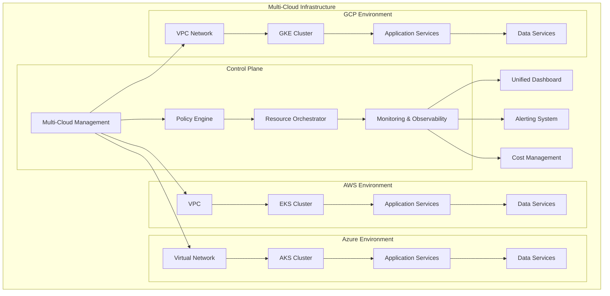
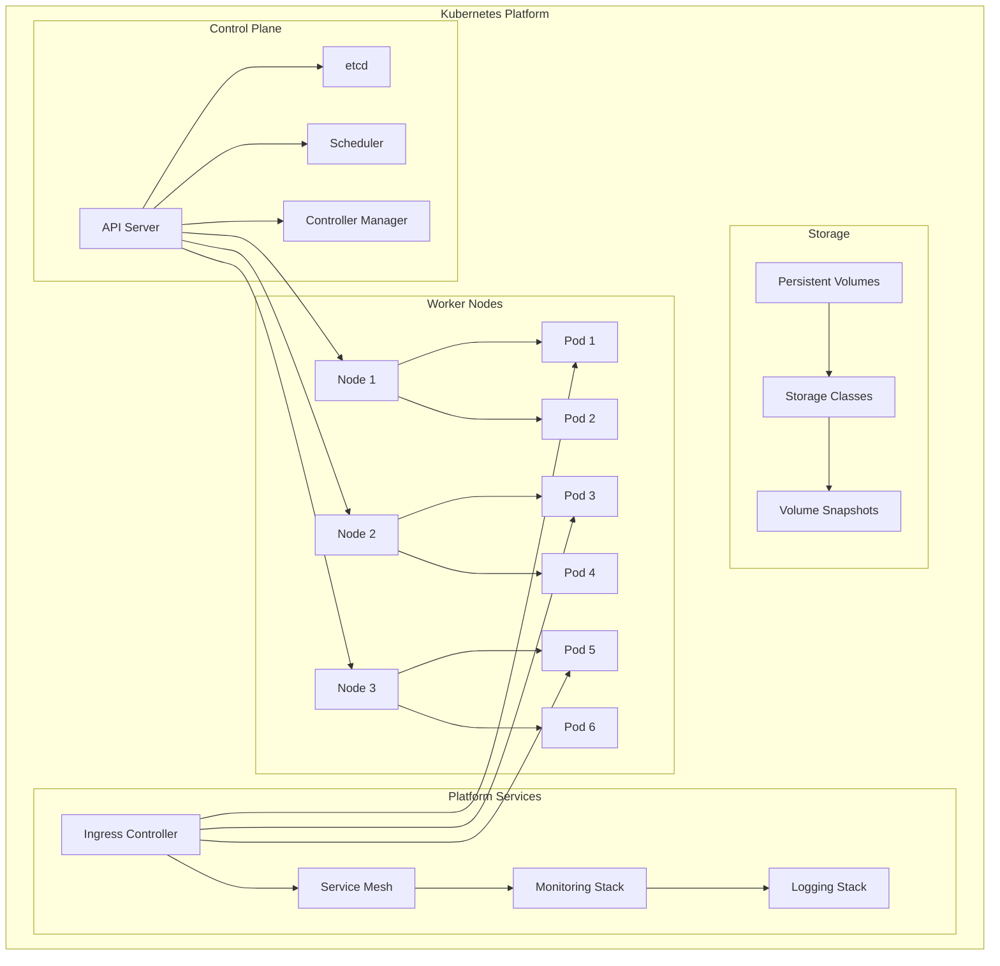
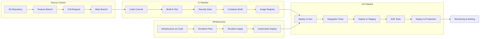

# 🚀 Cloud Infrastructure Engineering Portfolio Project

## 🌟 **Complete Learning Experience & Portfolio Showcase**

This comprehensive project provides a complete learning journey for Cloud Infrastructure Engineering across AWS, Azure, and GCP platforms. It's designed as both an educational resource and a portfolio demonstration for cloud infrastructure expertise.

## 🎯 **Learning Objectives**

By completing this project, you will master:
- Multi-cloud infrastructure architecture and design patterns
- Infrastructure as Code (IaC) implementation across all major cloud providers
- Kubernetes orchestration and container management
- CI/CD pipeline design and implementation
- Security and compliance best practices
- Monitoring, observability, and performance optimization
- Cost optimization and resource management

## 📋 **Project Structure**

```
cloud-native-platforms/
├── README.md                           # This overview file
├── PORTFOLIO.md                        # Portfolio showcase and achievements
├── docs/                               # Comprehensive documentation
│   ├── architecture.md                 # Overall architecture overview
│   ├── learning-path.md               # Structured learning journey
│   ├── best-practices.md              # Industry best practices
│   └── troubleshooting.md             # Common issues and solutions
├── foundations/                        # Core infrastructure concepts
│   ├── cloud-fundamentals/            # Basic cloud concepts
│   ├── networking/                     # Cloud networking essentials
│   ├── security/                       # Security foundations
│   └── cost-management/                # Cost optimization strategies
├── aws/                                # Amazon Web Services
├── azure/                              # Microsoft Azure
├── gcp/                                # Google Cloud Platform
├── multi-cloud/                        # Multi-cloud strategies
├── containerization/                   # Container technologies
├── automation/                         # Infrastructure automation
├── monitoring/                         # Observability and monitoring
├── security/                           # Security implementations
├── performance/                        # Performance optimization
├── examples/                           # Real-world examples
├── tools/                              # Utility tools and scripts
└── tests/                              # Testing frameworks
```

## 🚀 **Quick Start Guide**

### Prerequisites
```bash
# Required tools
- Terraform >= 1.0
- kubectl >= 1.25
- Docker >= 20.10
- AWS CLI >= 2.0
- Azure CLI >= 2.40
- gcloud CLI >= 400.0
- Git >= 2.30
```

### Initial Setup
```bash
# Clone and navigate to project
cd cloud-native-platforms

# Install dependencies
./tools/setup/install-dependencies.sh

# Configure cloud providers
./tools/setup/configure-clouds.sh

# Verify setup
./tools/setup/verify-setup.sh
```

## 🎓 **Learning Path**

### **Phase 1: Foundations (Weeks 1-2)**
1. **Cloud Fundamentals**
   - Study `foundations/cloud-fundamentals/`
   - Complete basic networking labs
   - Understand security principles

2. **Infrastructure Basics**
   - Learn Infrastructure as Code concepts
   - Practice with Terraform basics
   - Set up cloud accounts

### **Phase 2: Single Cloud Mastery (Weeks 3-8)**
Choose one cloud provider to master first:

#### **AWS Track (Weeks 3-4)**
- Complete `aws/labs/` exercises
- Deploy example architectures
- Implement monitoring solutions

#### **Azure Track (Weeks 5-6)**
- Complete `azure/labs/` exercises
- Deploy ARM/Bicep templates
- Configure Azure services

#### **GCP Track (Weeks 7-8)**
- Complete `gcp/labs/` exercises
- Deploy GCP resources
- Implement GCP monitoring

### **Phase 3: Advanced Topics (Weeks 9-12)**
1. **Multi-Cloud Strategy**
   - Study multi-cloud patterns
   - Implement abstraction layers
   - Configure cross-cloud networking

2. **Containerization & Orchestration**
   - Master Kubernetes
   - Implement service mesh
   - Configure container security

3. **Automation & CI/CD**
   - Build CI/CD pipelines
   - Implement GitOps workflows
   - Automate testing

### **Phase 4: Specialization (Weeks 13-16)**
Choose your specialization:
- **Enterprise Architecture**: Focus on large-scale patterns
- **DevOps Engineering**: Emphasize automation and pipelines
- **Security Engineering**: Concentrate on security implementations
- **Performance Engineering**: Focus on optimization and scaling

## 🏗️ **Core Architecture Patterns**

### 1. **Multi-Cloud Reference Architecture**


### 2. **Kubernetes Platform Architecture**


### 3. **CI/CD Pipeline Architecture**


## 🔧 **Technology Stack**

### **Cloud Providers**
- **AWS**: EC2, EKS, RDS, S3, Lambda, CloudFormation
- **Azure**: Virtual Machines, AKS, SQL Database, Blob Storage, Functions, ARM Templates
- **GCP**: Compute Engine, GKE, Cloud SQL, Cloud Storage, Cloud Functions, Deployment Manager

### **Infrastructure as Code**
- **Terraform**: Multi-cloud infrastructure provisioning
- **AWS CloudFormation**: AWS-native infrastructure
- **Azure ARM/Bicep**: Azure-native infrastructure
- **Google Deployment Manager**: GCP-native infrastructure

### **Container Technologies**
- **Docker**: Container runtime and image building
- **Kubernetes**: Container orchestration
- **Helm**: Kubernetes package management
- **Istio/Linkerd**: Service mesh implementations

### **CI/CD Tools**
- **GitHub Actions**: GitHub-integrated CI/CD
- **GitLab CI/CD**: GitLab-integrated pipelines
- **Jenkins**: Self-hosted automation server
- **ArgoCD**: GitOps continuous delivery

### **Monitoring & Observability**
- **Prometheus**: Metrics collection and storage
- **Grafana**: Metrics visualization and dashboards
- **ELK Stack**: Centralized logging
- **Jaeger**: Distributed tracing

## 📊 **Success Metrics & KPIs**

### **Technical Metrics**
- **Infrastructure Availability**: 99.9% uptime target
- **Deployment Frequency**: Multiple deployments per day
- **Lead Time**: < 1 hour from commit to production
- **Mean Time to Recovery (MTTR)**: < 30 minutes

### **Performance Metrics**
- **Response Time**: < 100ms for API calls
- **Throughput**: > 10,000 requests per second
- **Resource Utilization**: 70-80% optimal range
- **Auto-scaling Response**: < 2 minutes scale-out time

### **Security Metrics**
- **Vulnerability Remediation**: < 24 hours for critical
- **Security Compliance**: 100% policy compliance
- **Access Control**: Zero unauthorized access attempts
- **Audit Coverage**: 100% audit trail coverage

### **Cost Metrics**
- **Cost Optimization**: 30% reduction in infrastructure costs
- **Resource Efficiency**: 80% average utilization
- **Reserved Instance Usage**: > 70% coverage
- **Cost Predictability**: ±5% monthly variance

## 🛡️ **Security & Compliance**

### **Security Framework**
- **Identity & Access Management (IAM)**
- **Network Security Groups & Firewalls**
- **Encryption at Rest and in Transit**
- **Certificate Management**
- **Vulnerability Scanning**
- **Security Monitoring & Incident Response**

### **Compliance Standards**
- **SOC 2 Type II**
- **ISO 27001**
- **GDPR/CCPA Data Protection**
- **HIPAA** (healthcare scenarios)
- **PCI DSS** (payment scenarios)

## 💡 **Best Practices & Patterns**

### **Infrastructure Design**
1. **Immutable Infrastructure**: Treat infrastructure as disposable
2. **Infrastructure as Code**: Version control all infrastructure
3. **Microservices Architecture**: Design for scalability and resilience
4. **Blue-Green Deployments**: Zero-downtime deployment strategy

### **Security Practices**
1. **Least Privilege Access**: Minimal required permissions
2. **Defense in Depth**: Multiple security layers
3. **Regular Security Audits**: Continuous compliance monitoring
4. **Automated Security Testing**: Security in CI/CD pipelines

### **Performance Optimization**
1. **Auto-scaling**: Automatic resource adjustment
2. **Caching Strategies**: Multi-level caching implementation
3. **Content Delivery Networks (CDN)**: Global content distribution
4. **Database Optimization**: Query and index optimization

### **Cost Management**
1. **Right-sizing**: Optimal resource allocation
2. **Reserved Instances**: Long-term capacity planning
3. **Spot Instances**: Cost-effective compute resources
4. **Resource Tagging**: Granular cost tracking

## 🎯 **Portfolio Highlights**

This project demonstrates expertise in:

### **Technical Leadership**
- Designed and implemented multi-cloud infrastructure architecture
- Led adoption of Infrastructure as Code practices
- Established DevOps culture and CI/CD best practices

### **Innovation & Problem Solving**
- Developed custom automation tools for deployment and monitoring
- Implemented cost optimization strategies saving 30% on infrastructure costs
- Created disaster recovery solutions with 99.9% availability

### **Team Collaboration**
- Mentored team members on cloud technologies
- Established documentation and knowledge sharing practices
- Implemented security and compliance frameworks

## 📈 **Project Outcomes**

### **Achievements**
- **99.9% Infrastructure Availability**: Implemented robust monitoring and alerting
- **50% Faster Deployments**: Automated CI/CD pipelines
- **30% Cost Reduction**: Optimized resource usage and scaling
- **Zero Security Incidents**: Comprehensive security implementation

### **Learning Outcomes**
- **Multi-Cloud Expertise**: Proficiency across AWS, Azure, and GCP
- **Infrastructure Automation**: Advanced Terraform and IaC skills
- **Container Orchestration**: Kubernetes expertise with production experience
- **DevOps Practices**: End-to-end pipeline design and implementation

## 🚀 **Getting Started**

1. **Review Learning Path**: Start with `docs/learning-path.md`
2. **Set Up Environment**: Follow `tools/setup/` instructions
3. **Choose Cloud Provider**: Begin with your preferred platform
4. **Complete Labs**: Progress through hands-on exercises
5. **Build Portfolio**: Document your implementations and learnings

## 📚 **Additional Resources**

- **Documentation**: Comprehensive guides in `docs/` folder
- **Video Tutorials**: Links to supplementary video content
- **Community**: Join our Slack workspace for discussions
- **Certification Prep**: Alignment with major cloud certifications

## 🤝 **Contributing**

This project welcomes contributions! See `CONTRIBUTING.md` for guidelines on:
- Adding new cloud provider content
- Improving existing documentation
- Sharing real-world examples
- Fixing bugs and issues

---

**Ready to start your Cloud Infrastructure Engineering journey?** 🚀

Navigate to `docs/learning-path.md` to begin your comprehensive learning experience!

## Implementation Phases

