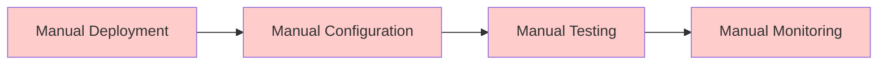
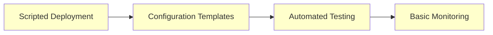
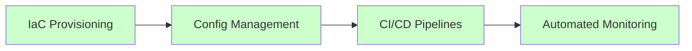
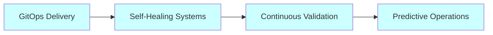
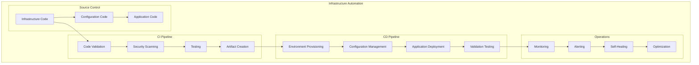
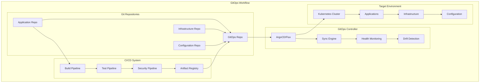
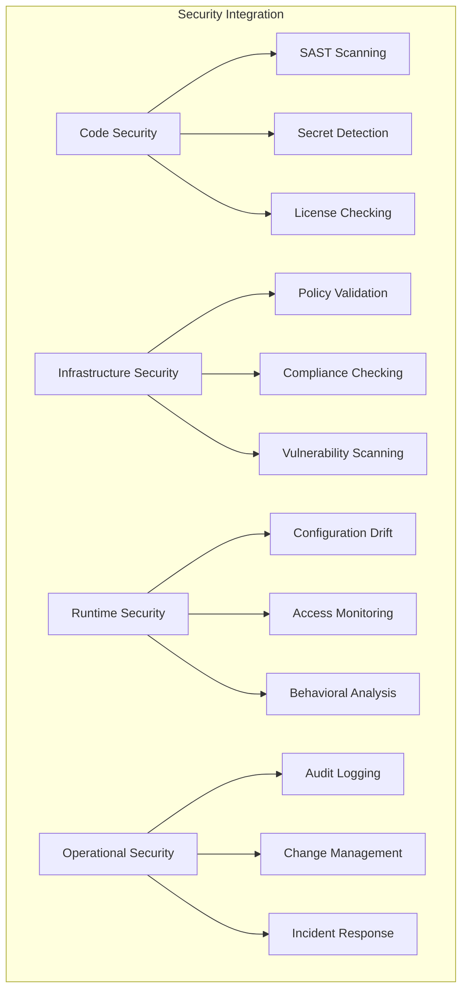
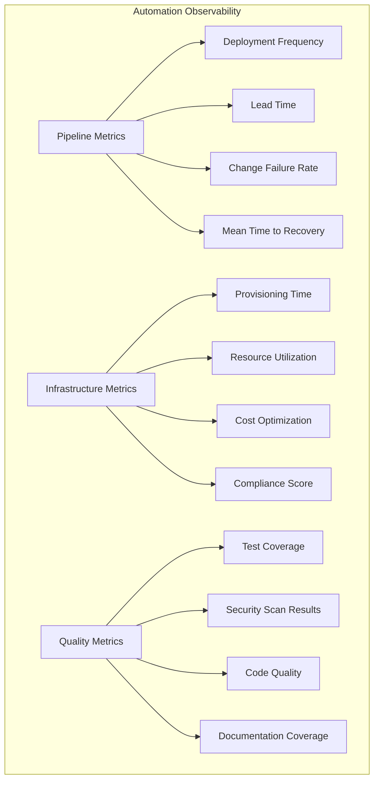

# 🤖 Infrastructure Automation

## Overview

This section covers comprehensive infrastructure automation strategies, tools, and practices for building, deploying, and managing cloud infrastructure at scale. Learn Infrastructure as Code (IaC), configuration management, CI/CD pipelines, and GitOps workflows.

## ⚡ **Automation Modules**

### **1. Terraform Infrastructure as Code**
**Location**: [`terraform/`](./terraform/)
**Duration**: Week 17-18 of learning path
**Objectives**: Master multi-cloud infrastructure provisioning

**Topics Covered**:
- Terraform fundamentals and HCL syntax
- State management and remote backends
- Module development and best practices
- Multi-cloud resource provisioning
- Testing and validation strategies
- Advanced patterns and enterprise usage

### **2. Ansible Configuration Management**
**Location**: [`ansible/`](./ansible/)
**Duration**: Week 18 of learning path
**Objectives**: Automate configuration and application deployment

**Topics Covered**:
- Ansible architecture and components
- Playbooks, roles, and collections
- Variable management and templating
- Cloud integration and dynamic inventory
- Security and secrets management
- Testing and continuous integration

### **3. CI/CD Pipelines**
**Location**: [`ci-cd/`](./ci-cd/)
**Duration**: Week 17-18 of learning path
**Objectives**: Implement automated build, test, and deployment pipelines

**Topics Covered**:
- Pipeline design patterns and strategies
- GitHub Actions, GitLab CI, and Jenkins
- Build automation and artifact management
- Testing strategies and quality gates
- Deployment strategies and rollback procedures
- Security integration and compliance

### **4. GitOps Workflows**
**Location**: [`gitops/`](./gitops/)
**Duration**: Week 18 of learning path
**Objectives**: Implement Git-driven infrastructure and application delivery

**Topics Covered**:
- GitOps principles and architecture
- ArgoCD and Flux implementation
- Git repository structure and workflows
- Environment promotion strategies
- Security and access control
- Monitoring and observability

## 🎯 **Automation Maturity Model**

### **Level 0: Manual Processes**


### **Level 1: Basic Automation**


### **Level 2: Infrastructure as Code**


### **Level 3: Full GitOps**


## 🏗️ **Automation Architecture Patterns**

### **Infrastructure Automation Pipeline**


### **GitOps Architecture Pattern**


## 🛠️ **Automation Tools Comparison**

### **Infrastructure as Code Tools**
```
Feature                Terraform    Pulumi       CloudFormation    ARM/Bicep
================================================================================
Multi-Cloud           Excellent    Excellent    AWS Only          Azure Only
Language Support       HCL          Multiple     JSON/YAML         JSON/Bicep
State Management       Built-in     Built-in     AWS Managed       Azure Managed
Community Support      Excellent    Growing      Good              Good
Learning Curve         Moderate     Steep        Moderate          Easy
Enterprise Features    Excellent    Good         Good              Good
```

### **Configuration Management Tools**
```
Feature                Ansible      Chef         Puppet           SaltStack
=========================================================================
Agent Required         No           Yes          Yes              Yes
Language               YAML         Ruby         Ruby             Python
Learning Curve         Easy         Steep        Steep            Moderate
Windows Support        Good         Excellent    Excellent        Good
Cloud Integration      Excellent    Good         Good             Good
Scalability           Good         Excellent    Excellent        Excellent
```

### **CI/CD Platforms**
```
Feature                GitHub Actions    GitLab CI    Jenkins    Azure DevOps
=============================================================================
Hosted Solution       Yes               Yes          No         Yes
Self-Hosted Option    No                Yes          Yes        Yes
YAML Configuration    Yes               Yes          No         Yes
Marketplace/Plugins   Extensive         Good         Extensive  Good
Multi-Cloud Support   Excellent         Excellent    Excellent  Good
Cost Model            Usage-based       Freemium     Free       Usage-based
```

## 📋 **Implementation Strategies**

### **Terraform Best Practices**
```hcl
# terraform/environments/production/main.tf
terraform {
  required_version = ">= 1.0"
  
  required_providers {
    aws = {
      source  = "hashicorp/aws"
      version = "~> 5.0"
    }
  }
  
  backend "s3" {
    bucket = "company-terraform-state"
    key    = "production/infrastructure.tfstate"
    region = "us-west-2"
    
    dynamodb_table = "terraform-state-lock"
    encrypt        = true
  }
}

# Use modules for reusability
module "vpc" {
  source = "../../modules/vpc"
  
  environment = var.environment
  vpc_cidr    = var.vpc_cidr
  
  tags = local.common_tags
}

module "eks_cluster" {
  source = "../../modules/eks"
  
  cluster_name = "${var.environment}-cluster"
  vpc_id       = module.vpc.vpc_id
  subnet_ids   = module.vpc.private_subnet_ids
  
  tags = local.common_tags
}

# Local values for consistency
locals {
  common_tags = {
    Environment = var.environment
    Project     = var.project_name
    ManagedBy   = "terraform"
    Owner       = var.team_name
  }
}
```

### **Ansible Playbook Structure**
```yaml
# ansible/playbooks/deploy-application.yml
---
- name: Deploy web application
  hosts: web_servers
  become: yes
  
  vars:
    app_name: "{{ application_name }}"
    app_version: "{{ application_version }}"
    
  pre_tasks:
    - name: Ensure system is updated
      package:
        name: "*"
        state: latest
      when: ansible_os_family == "RedHat"
  
  roles:
    - role: docker
      vars:
        docker_users:
          - "{{ ansible_user }}"
    
    - role: application
      vars:
        app_image: "{{ app_name }}:{{ app_version }}"
        app_port: 8080
        app_replicas: 3
  
  post_tasks:
    - name: Verify application health
      uri:
        url: "http://localhost:8080/health"
        method: GET
        status_code: 200
      retries: 5
      delay: 10
```

### **GitHub Actions Workflow**
```yaml
# .github/workflows/infrastructure.yml
name: Infrastructure Deployment

on:
  push:
    branches: [main]
    paths: ['infrastructure/**']
  pull_request:
    branches: [main]
    paths: ['infrastructure/**']

env:
  TF_VERSION: '1.5.0'
  AWS_REGION: 'us-west-2'

jobs:
  terraform-plan:
    runs-on: ubuntu-latest
    
    steps:
    - name: Checkout code
      uses: actions/checkout@v3
    
    - name: Setup Terraform
      uses: hashicorp/setup-terraform@v2
      with:
        terraform_version: ${{ env.TF_VERSION }}
    
    - name: Configure AWS credentials
      uses: aws-actions/configure-aws-credentials@v2
      with:
        aws-access-key-id: ${{ secrets.AWS_ACCESS_KEY_ID }}
        aws-secret-access-key: ${{ secrets.AWS_SECRET_ACCESS_KEY }}
        aws-region: ${{ env.AWS_REGION }}
    
    - name: Terraform Format Check
      run: terraform fmt -check -recursive
      working-directory: infrastructure/
    
    - name: Terraform Init
      run: terraform init
      working-directory: infrastructure/environments/production/
    
    - name: Terraform Validate
      run: terraform validate
      working-directory: infrastructure/environments/production/
    
    - name: Terraform Plan
      run: terraform plan -out=tfplan
      working-directory: infrastructure/environments/production/
    
    - name: Upload plan artifact
      uses: actions/upload-artifact@v3
      with:
        name: terraform-plan
        path: infrastructure/environments/production/tfplan

  terraform-apply:
    needs: terraform-plan
    runs-on: ubuntu-latest
    if: github.ref == 'refs/heads/main'
    
    steps:
    - name: Checkout code
      uses: actions/checkout@v3
    
    - name: Setup Terraform
      uses: hashicorp/setup-terraform@v2
      with:
        terraform_version: ${{ env.TF_VERSION }}
    
    - name: Configure AWS credentials
      uses: aws-actions/configure-aws-credentials@v2
      with:
        aws-access-key-id: ${{ secrets.AWS_ACCESS_KEY_ID }}
        aws-secret-access-key: ${{ secrets.AWS_SECRET_ACCESS_KEY }}
        aws-region: ${{ env.AWS_REGION }}
    
    - name: Download plan artifact
      uses: actions/download-artifact@v3
      with:
        name: terraform-plan
        path: infrastructure/environments/production/
    
    - name: Terraform Init
      run: terraform init
      working-directory: infrastructure/environments/production/
    
    - name: Terraform Apply
      run: terraform apply -auto-approve tfplan
      working-directory: infrastructure/environments/production/
```

### **ArgoCD Application Configuration**
```yaml
# gitops/applications/web-app.yaml
apiVersion: argoproj.io/v1alpha1
kind: Application
metadata:
  name: web-application
  namespace: argocd
  annotations:
    argocd.argoproj.io/sync-wave: "1"
spec:
  project: default
  
  source:
    repoURL: https://github.com/company/web-app-manifests
    targetRevision: HEAD
    path: overlays/production
  
  destination:
    server: https://kubernetes.default.svc
    namespace: web-app
  
  syncPolicy:
    automated:
      prune: true
      selfHeal: true
    syncOptions:
      - CreateNamespace=true
      - PrunePropagationPolicy=foreground
      - PruneLast=true
    retry:
      limit: 5
      backoff:
        duration: 5s
        factor: 2
        maxDuration: 3m
  
  revisionHistoryLimit: 10
  
  ignoreDifferences:
  - group: apps
    kind: Deployment
    jsonPointers:
    - /spec/replicas
```

## 🔐 **Security and Compliance**

### **Infrastructure Security**


### **Secrets Management**
```yaml
# Example: Using HashiCorp Vault with Terraform
resource "vault_generic_secret" "database_credentials" {
  path = "secret/database"
  
  data_json = jsonencode({
    username = var.db_username
    password = random_password.db_password.result
  })
}

# Kubernetes Secret from Vault
resource "kubernetes_secret" "database_secret" {
  metadata {
    name      = "database-credentials"
    namespace = "production"
  }
  
  data = {
    username = vault_generic_secret.database_credentials.data["username"]
    password = vault_generic_secret.database_credentials.data["password"]
  }
}
```

## 📊 **Monitoring and Observability**

### **Automation Metrics**


### **Alerting Configuration**
```yaml
# prometheus/alerts/automation.yml
groups:
- name: automation.rules
  rules:
  - alert: PipelineFailureRate
    expr: |
      (
        sum(rate(pipeline_runs_total{status="failed"}[5m])) /
        sum(rate(pipeline_runs_total[5m]))
      ) * 100 > 10
    for: 5m
    labels:
      severity: warning
    annotations:
      summary: "High pipeline failure rate detected"
      description: "Pipeline failure rate is {{ $value }}% over the last 5 minutes"

  - alert: InfrastructureDrift
    expr: terraform_state_drift_detected > 0
    for: 1m
    labels:
      severity: critical
    annotations:
      summary: "Infrastructure drift detected"
      description: "Terraform state drift detected in {{ $labels.environment }}"
```

## 🚀 **Getting Started**

### **Prerequisites**
- Git and version control understanding
- Basic scripting knowledge (Bash, Python)
- Cloud provider familiarity
- YAML/JSON configuration experience

### **Learning Path**
1. **Week 1**: [Terraform Fundamentals](./terraform/README.md)
2. **Week 2**: [Ansible Configuration Management](./ansible/README.md)
3. **Week 3**: [CI/CD Pipeline Implementation](./ci-cd/README.md)
4. **Week 4**: [GitOps Workflow Setup](./gitops/README.md)

### **Quick Start Environment**
```bash
#!/bin/bash
# setup-automation-env.sh

# Install Terraform
curl -fsSL https://apt.releases.hashicorp.com/gpg | sudo apt-key add -
sudo apt-add-repository "deb [arch=amd64] https://apt.releases.hashicorp.com $(lsb_release -cs) main"
sudo apt-get update && sudo apt-get install terraform

# Install Ansible
sudo apt-get install software-properties-common
sudo add-apt-repository --yes --update ppa:ansible/ansible
sudo apt-get install ansible

# Install kubectl
curl -LO "https://dl.k8s.io/release/$(curl -L -s https://dl.k8s.io/release/stable.txt)/bin/linux/amd64/kubectl"
sudo install kubectl /usr/local/bin/kubectl

# Install ArgoCD CLI
curl -sSL -o /tmp/argocd-linux-amd64 https://github.com/argoproj/argo-cd/releases/latest/download/argocd-linux-amd64
sudo install /tmp/argocd-linux-amd64 /usr/local/bin/argocd

echo "Automation tools installed successfully!"
```

## 📈 **Best Practices**

### **General Automation Principles**
1. **Infrastructure as Code**: Everything should be code
2. **Version Control**: All automation artifacts in Git
3. **Immutable Infrastructure**: Replace, don't modify
4. **Idempotency**: Operations should be repeatable
5. **Testing**: Validate before deployment
6. **Security**: Security by design and default

### **Pipeline Design Patterns**
1. **Fail Fast**: Early validation and quick feedback
2. **Parallel Execution**: Optimize for speed
3. **Artifact Management**: Consistent artifact handling
4. **Environment Parity**: Consistent across environments
5. **Rollback Strategy**: Plan for failure scenarios
6. **Observability**: Comprehensive monitoring and logging

---

**Ready to automate your infrastructure?** 🤖

Start with [Terraform Fundamentals](./terraform/README.md) and begin building your automation expertise!
