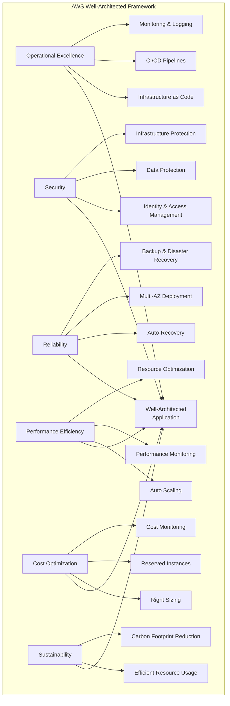
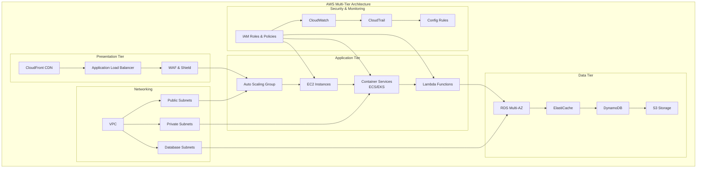
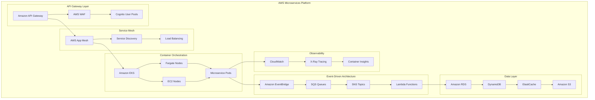
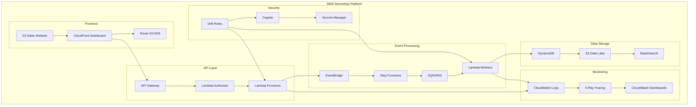
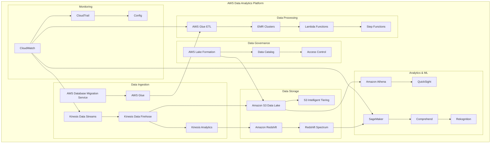
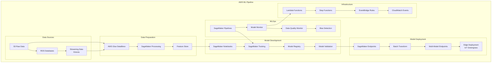
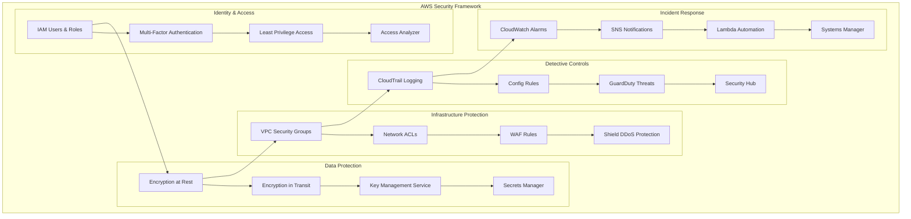

# 🚀 AWS Cloud Infrastructure Guide

## Overview

This comprehensive guide covers AWS infrastructure patterns, services, and implementations for cloud-native applications. It includes detailed architecture diagrams, hands-on labs, and real-world examples.

## 📋 AWS Architecture Patterns

### 1. **AWS Well-Architected Framework**



### 2. **AWS Multi-Tier Application Architecture**



### 3. **AWS Microservices Architecture**



### 4. **AWS Serverless Architecture**



### 5. **AWS Data Analytics Architecture**



### 6. **AWS Machine Learning Pipeline**



## 🏗️ **AWS Service Categories**

### **Compute Services**
- **EC2**: Virtual servers with various instance types
- **ECS**: Container orchestration service
- **EKS**: Managed Kubernetes service
- **Lambda**: Serverless compute functions
- **Fargate**: Serverless container platform
- **Batch**: Batch computing jobs

### **Storage Services**
- **S3**: Object storage with multiple storage classes
- **EBS**: Block storage for EC2 instances
- **EFS**: Managed file system
- **FSx**: High-performance file systems
- **Storage Gateway**: Hybrid cloud storage

### **Database Services**
- **RDS**: Managed relational databases
- **DynamoDB**: NoSQL database
- **ElastiCache**: In-memory caching
- **DocumentDB**: MongoDB-compatible database
- **Neptune**: Graph database
- **Timestream**: Time-series database

### **Networking Services**
- **VPC**: Virtual private cloud
- **CloudFront**: Content delivery network
- **Route 53**: DNS service
- **API Gateway**: API management
- **Direct Connect**: Dedicated network connection
- **Transit Gateway**: Network transit hub

### **Security Services**
- **IAM**: Identity and access management
- **Cognito**: User authentication
- **Secrets Manager**: Secure secrets storage
- **WAF**: Web application firewall
- **Shield**: DDoS protection
- **GuardDuty**: Threat detection

### **Analytics Services**
- **Redshift**: Data warehousing
- **Athena**: Interactive query service
- **EMR**: Big data processing
- **Kinesis**: Real-time data streaming
- **QuickSight**: Business intelligence
- **Glue**: Data preparation and ETL

### **Machine Learning Services**
- **SageMaker**: ML platform
- **Comprehend**: Natural language processing
- **Rekognition**: Image and video analysis
- **Textract**: Document text extraction
- **Translate**: Language translation
- **Polly**: Text-to-speech

## 🔧 **Implementation Examples**

### **VPC with Multi-AZ Setup**
```json
{
  "VPC": {
    "CIDR": "10.0.0.0/16",
    "EnableDnsHostnames": true,
    "EnableDnsSupport": true,
    "Tags": {
      "Name": "Production-VPC",
      "Environment": "Production"
    }
  },
  "Subnets": {
    "PublicSubnetAZ1": {
      "CIDR": "10.0.1.0/24",
      "AvailabilityZone": "us-west-2a",
      "MapPublicIpOnLaunch": true
    },
    "PublicSubnetAZ2": {
      "CIDR": "10.0.2.0/24",
      "AvailabilityZone": "us-west-2b",
      "MapPublicIpOnLaunch": true
    },
    "PrivateSubnetAZ1": {
      "CIDR": "10.0.3.0/24",
      "AvailabilityZone": "us-west-2a"
    },
    "PrivateSubnetAZ2": {
      "CIDR": "10.0.4.0/24",
      "AvailabilityZone": "us-west-2b"
    }
  }
}
```

### **EKS Cluster Configuration**
```yaml
apiVersion: eksctl.io/v1alpha5
kind: ClusterConfig

metadata:
  name: production-cluster
  region: us-west-2
  version: "1.28"

nodeGroups:
  - name: general-workers
    instanceType: t3.medium
    minSize: 2
    maxSize: 10
    desiredCapacity: 3
    ssh:
      allow: true
    iam:
      withAddonPolicies:
        autoScaler: true
        cloudWatch: true
        ebs: true
        efs: true
        albIngress: true

addons:
  - name: vpc-cni
  - name: coredns
  - name: kube-proxy
  - name: aws-ebs-csi-driver

cloudWatch:
  clusterLogging:
    enableTypes: ["*"]
```

## 📊 **AWS Cost Optimization**

### **Cost Management Strategies**

```mermaid
graph TB
    subgraph "AWS Cost Optimization"
        subgraph "Right Sizing"
            A[Instance Analysis] --> B[CPU & Memory Utilization]
            B --> C[Rightsizing Recommendations]
        end
        
        subgraph "Reserved Instances"
            D[Usage Patterns] --> E[RI Recommendations]
            E --> F[Convertible vs Standard]
        end
        
        subgraph "Spot Instances"
            G[Workload Analysis] --> H[Spot Fleet Configuration]
            H --> I[Mixed Instance Types]
        end
        
        subgraph "Storage Optimization"
            J[S3 Intelligent Tiering] --> K[Lifecycle Policies]
            K --> L[EBS Volume Types]
        end
        
        subgraph "Monitoring & Alerts"
            M[Cost Explorer] --> N[Budgets & Alerts]
            N --> O[Cost Anomaly Detection]
        end
        
        C --> D
        F --> G
        I --> J
        L --> M
    end
```



## 🔒 **AWS Security Best Practices**

### **Security Framework Implementation**



## 📈 **Monitoring & Observability**

### **AWS Monitoring Stack**

```mermaid
graph TB
    subgraph "AWS Observability Platform"
        subgraph "Metrics Collection"
            A[CloudWatch Metrics] --> B[Custom Metrics]
            B --> C[Application Insights]
        end
        
        subgraph "Logging"
            D[CloudWatch Logs] --> E[Log Groups]
            E --> F[Log Streams]
            F --> G[Log Insights]
        end
        
        subgraph "Tracing"
            H[X-Ray Tracing] --> I[Service Map]
            I --> J[Trace Analysis]
        end
        
        subgraph "Alerting"
            K[CloudWatch Alarms] --> L[SNS Topics]
            L --> M[Lambda Functions]
            M --> N[Auto Scaling Actions]
        end
        
        subgraph "Dashboards"
            O[CloudWatch Dashboards] --> P[QuickSight Analytics]
            P --> Q[Grafana Integration]
        end
        
        A --> H
        G --> K
        J --> O
        N --> A
    end
```



## 🎯 **Learning Path & Labs**

### **AWS Certification Alignment**
- **AWS Certified Solutions Architect - Associate**
- **AWS Certified Solutions Architect - Professional**
- **AWS Certified DevOps Engineer - Professional**
- **AWS Certified Security - Specialty**

### **Hands-on Labs Structure**
1. **Foundation Labs**: VPC, EC2, S3, IAM
2. **Application Labs**: Load Balancers, Auto Scaling, RDS
3. **Container Labs**: ECS, EKS, Fargate
4. **Serverless Labs**: Lambda, API Gateway, DynamoDB
5. **Data Labs**: Redshift, EMR, Kinesis, Glue
6. **ML Labs**: SageMaker, Comprehend, Rekognition
7. **Security Labs**: IAM, WAF, GuardDuty, Config
8. **DevOps Labs**: CodePipeline, CodeBuild, CodeDeploy

## 🚀 **Next Steps**

1. **Explore Architecture Patterns**: Study the detailed diagrams above
2. **Complete Hands-on Labs**: Navigate to `labs/` folder
3. **Review Service Documentation**: Check `services/` folder
4. **Practice Infrastructure as Code**: Use `infrastructure/` templates
5. **Set up Monitoring**: Implement observability with `monitoring/` examples

---

**Ready to master AWS?** Start with the foundation labs and progressively build your expertise! 🎯
