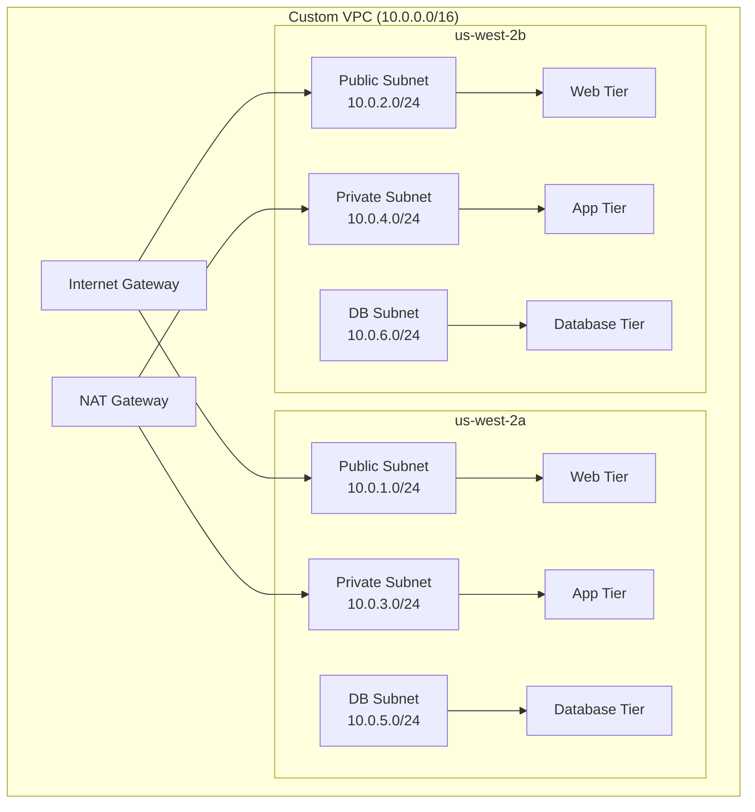

# 🧪 AWS Hands-On Labs

## Overview

This section contains comprehensive hands-on laboratories designed to provide practical experience with AWS services and cloud infrastructure patterns. Each lab includes detailed instructions, code samples, and real-world scenarios.

## 📋 **Lab Structure**

### **Learning Progression**
```
Foundation Labs (Week 1-2)
├── Lab 1: AWS Account Setup & IAM
├── Lab 2: VPC Design & Implementation
├── Lab 3: EC2 Instance Management
└── Lab 4: S3 Storage & Security

Intermediate Labs (Week 3-4)
├── Lab 5: RDS Database Setup
├── Lab 6: Load Balancing & Auto Scaling
├── Lab 7: CloudWatch Monitoring
└── Lab 8: Lambda Serverless Functions

Advanced Labs (Week 5-6)
├── Lab 9: EKS Kubernetes Cluster
├── Lab 10: Multi-Region Deployment
├── Lab 11: CI/CD with CodePipeline
└── Lab 12: Security & Compliance
```

## 🚀 **Lab 1: AWS Account Setup & IAM**

### **Objectives**
- Set up AWS account with billing alerts
- Configure IAM users, groups, and policies
- Implement MFA and password policies
- Understand AWS security best practices

### **Prerequisites**
- Valid email address and credit card
- Basic understanding of access control concepts

### **Lab Steps**

#### **Step 1: Account Setup**
```bash
# 1. Create AWS Account
# Navigate to https://aws.amazon.com/
# Click "Create an AWS Account"
# Follow the registration process

# 2. Set up billing alerts
aws budgets create-budget --account-id YOUR_ACCOUNT_ID --budget '{
  "BudgetName": "Monthly-Budget",
  "BudgetLimit": {
    "Amount": "50",
    "Unit": "USD"
  },
  "TimeUnit": "MONTHLY",
  "BudgetType": "COST"
}'

# 3. Configure AWS CLI
aws configure
# AWS Access Key ID: [Enter your access key]
# AWS Secret Access Key: [Enter your secret key]
# Default region name: us-west-2
# Default output format: json
```

#### **Step 2: IAM Configuration**
```json
# Create IAM policy for developers
{
  "Version": "2012-10-17",
  "Statement": [
    {
      "Effect": "Allow",
      "Action": [
        "ec2:*",
        "s3:*",
        "rds:Describe*",
        "cloudwatch:*"
      ],
      "Resource": "*",
      "Condition": {
        "StringEquals": {
          "aws:RequestedRegion": ["us-west-2", "us-east-1"]
        }
      }
    }
  ]
}
```

```bash
# Create IAM group
aws iam create-group --group-name Developers

# Attach policy to group
aws iam attach-group-policy \
  --group-name Developers \
  --policy-arn arn:aws:iam::ACCOUNT_ID:policy/DeveloperPolicy

# Create IAM user
aws iam create-user --user-name john-developer

# Add user to group
aws iam add-user-to-group \
  --group-name Developers \
  --user-name john-developer

# Enable MFA for user
aws iam enable-mfa-device \
  --user-name john-developer \
  --serial-number arn:aws:iam::ACCOUNT_ID:mfa/john-developer \
  --authentication-code-1 123456 \
  --authentication-code-2 789012
```

### **Verification Steps**
```bash
# Test IAM permissions
aws sts get-caller-identity

# List IAM policies
aws iam list-attached-group-policies --group-name Developers

# Verify MFA requirement
aws iam get-user --user-name john-developer
```

### **Expected Outcomes**
- [ ] AWS account configured with billing alerts
- [ ] IAM users and groups created with appropriate permissions
- [ ] MFA enabled for enhanced security
- [ ] AWS CLI configured and functional

---

## 🌐 **Lab 2: VPC Design & Implementation**

### **Objectives**
- Design a scalable VPC architecture
- Configure subnets across multiple AZs
- Set up routing tables and internet gateway
- Implement security groups and NACLs

### **Architecture Diagram**


### **Lab Implementation**

#### **Step 1: Create VPC Infrastructure**
```bash
# Create VPC
aws ec2 create-vpc \
  --cidr-block 10.0.0.0/16 \
  --tag-specifications 'ResourceType=vpc,Tags=[{Key=Name,Value=Production-VPC}]'

# Store VPC ID
VPC_ID=$(aws ec2 describe-vpcs \
  --filters "Name=tag:Name,Values=Production-VPC" \
  --query 'Vpcs[0].VpcId' --output text)

# Create Internet Gateway
aws ec2 create-internet-gateway \
  --tag-specifications 'ResourceType=internet-gateway,Tags=[{Key=Name,Value=Production-IGW}]'

IGW_ID=$(aws ec2 describe-internet-gateways \
  --filters "Name=tag:Name,Values=Production-IGW" \
  --query 'InternetGateways[0].InternetGatewayId' --output text)

# Attach Internet Gateway to VPC
aws ec2 attach-internet-gateway \
  --internet-gateway-id $IGW_ID \
  --vpc-id $VPC_ID
```

#### **Step 2: Create Subnets**
```bash
# Public Subnet AZ-A
aws ec2 create-subnet \
  --vpc-id $VPC_ID \
  --cidr-block 10.0.1.0/24 \
  --availability-zone us-west-2a \
  --tag-specifications 'ResourceType=subnet,Tags=[{Key=Name,Value=Public-Subnet-AZ-A}]'

# Public Subnet AZ-B
aws ec2 create-subnet \
  --vpc-id $VPC_ID \
  --cidr-block 10.0.2.0/24 \
  --availability-zone us-west-2b \
  --tag-specifications 'ResourceType=subnet,Tags=[{Key=Name,Value=Public-Subnet-AZ-B}]'

# Private Subnet AZ-A
aws ec2 create-subnet \
  --vpc-id $VPC_ID \
  --cidr-block 10.0.3.0/24 \
  --availability-zone us-west-2a \
  --tag-specifications 'ResourceType=subnet,Tags=[{Key=Name,Value=Private-Subnet-AZ-A}]'

# Private Subnet AZ-B
aws ec2 create-subnet \
  --vpc-id $VPC_ID \
  --cidr-block 10.0.4.0/24 \
  --availability-zone us-west-2b \
  --tag-specifications 'ResourceType=subnet,Tags=[{Key=Name,Value=Private-Subnet-AZ-B}]'

# Database Subnet AZ-A
aws ec2 create-subnet \
  --vpc-id $VPC_ID \
  --cidr-block 10.0.5.0/24 \
  --availability-zone us-west-2a \
  --tag-specifications 'ResourceType=subnet,Tags=[{Key=Name,Value=DB-Subnet-AZ-A}]'

# Database Subnet AZ-B
aws ec2 create-subnet \
  --vpc-id $VPC_ID \
  --cidr-block 10.0.6.0/24 \
  --availability-zone us-west-2b \
  --tag-specifications 'ResourceType=subnet,Tags=[{Key=Name,Value=DB-Subnet-AZ-B}]'
```

#### **Step 3: Configure Routing**
```bash
# Get public subnet IDs
PUBLIC_SUBNET_A=$(aws ec2 describe-subnets \
  --filters "Name=tag:Name,Values=Public-Subnet-AZ-A" \
  --query 'Subnets[0].SubnetId' --output text)

PUBLIC_SUBNET_B=$(aws ec2 describe-subnets \
  --filters "Name=tag:Name,Values=Public-Subnet-AZ-B" \
  --query 'Subnets[0].SubnetId' --output text)

# Create NAT Gateway
aws ec2 allocate-address --domain vpc
EIP_ALLOC_ID=$(aws ec2 describe-addresses \
  --query 'Addresses[?Domain==`vpc`] | [0].AllocationId' --output text)

aws ec2 create-nat-gateway \
  --subnet-id $PUBLIC_SUBNET_A \
  --allocation-id $EIP_ALLOC_ID \
  --tag-specifications 'ResourceType=nat-gateway,Tags=[{Key=Name,Value=Production-NAT}]'

# Create route tables
aws ec2 create-route-table \
  --vpc-id $VPC_ID \
  --tag-specifications 'ResourceType=route-table,Tags=[{Key=Name,Value=Public-RT}]'

aws ec2 create-route-table \
  --vpc-id $VPC_ID \
  --tag-specifications 'ResourceType=route-table,Tags=[{Key=Name,Value=Private-RT}]'
```

### **Verification Steps**
```bash
# Test VPC connectivity
aws ec2 describe-vpcs --vpc-ids $VPC_ID

# Verify subnet configuration
aws ec2 describe-subnets --filters "Name=vpc-id,Values=$VPC_ID"

# Check route tables
aws ec2 describe-route-tables --filters "Name=vpc-id,Values=$VPC_ID"
```

### **Expected Outcomes**
- [ ] VPC created with proper CIDR block
- [ ] Six subnets across two AZs configured
- [ ] Internet Gateway and NAT Gateway operational
- [ ] Route tables configured for public and private access

---

## 💻 **Lab 3: EC2 Instance Management**

### **Objectives**
- Launch EC2 instances with different configurations
- Implement auto-scaling groups
- Configure security groups
- Set up monitoring and logging

### **Lab Implementation**

#### **Step 1: Create Security Groups**
```bash
# Web tier security group
aws ec2 create-security-group \
  --group-name web-sg \
  --description "Security group for web servers" \
  --vpc-id $VPC_ID

WEB_SG_ID=$(aws ec2 describe-security-groups \
  --filters "Name=group-name,Values=web-sg" \
  --query 'SecurityGroups[0].GroupId' --output text)

# Allow HTTP and HTTPS
aws ec2 authorize-security-group-ingress \
  --group-id $WEB_SG_ID \
  --protocol tcp \
  --port 80 \
  --cidr 0.0.0.0/0

aws ec2 authorize-security-group-ingress \
  --group-id $WEB_SG_ID \
  --protocol tcp \
  --port 443 \
  --cidr 0.0.0.0/0

# Allow SSH from specific IP
aws ec2 authorize-security-group-ingress \
  --group-id $WEB_SG_ID \
  --protocol tcp \
  --port 22 \
  --cidr YOUR_IP/32
```

#### **Step 2: Launch Template**
```json
{
  "LaunchTemplateName": "web-server-template",
  "LaunchTemplateData": {
    "ImageId": "ami-0c55b159cbfafe1d0",
    "InstanceType": "t3.micro",
    "SecurityGroupIds": ["sg-xxxxxxxxx"],
    "UserData": "IyEvYmluL2Jhc2gKeXVtIHVwZGF0ZSAteQp5dW0gaW5zdGFsbCAteSBodHRwZApzeXN0ZW1jdGwgc3RhcnQgaHR0cGQKc3lzdGVtY3RsIGVuYWJsZSBodHRwZA==",
    "TagSpecifications": [
      {
        "ResourceType": "instance",
        "Tags": [
          {
            "Key": "Name",
            "Value": "Web-Server"
          }
        ]
      }
    ]
  }
}
```

```bash
# Create launch template
aws ec2 create-launch-template \
  --cli-input-json file://launch-template.json
```

#### **Step 3: Auto Scaling Group**
```bash
# Create Auto Scaling Group
aws autoscaling create-auto-scaling-group \
  --auto-scaling-group-name web-asg \
  --launch-template LaunchTemplateName=web-server-template,Version=1 \
  --min-size 2 \
  --max-size 6 \
  --desired-capacity 2 \
  --vpc-zone-identifier "$PUBLIC_SUBNET_A,$PUBLIC_SUBNET_B" \
  --health-check-type ELB \
  --health-check-grace-period 300 \
  --tags "Key=Name,Value=Web-ASG,ResourceId=web-asg,ResourceType=auto-scaling-group,PropagateAtLaunch=true"

# Create scaling policies
aws autoscaling put-scaling-policy \
  --auto-scaling-group-name web-asg \
  --policy-name scale-up-policy \
  --scaling-adjustment 1 \
  --adjustment-type ChangeInCapacity \
  --cooldown 300

aws autoscaling put-scaling-policy \
  --auto-scaling-group-name web-asg \
  --policy-name scale-down-policy \
  --scaling-adjustment -1 \
  --adjustment-type ChangeInCapacity \
  --cooldown 300
```

### **Expected Outcomes**
- [ ] Security groups configured with appropriate rules
- [ ] Launch template created with web server configuration
- [ ] Auto Scaling Group operational with 2 instances
- [ ] Scaling policies configured for automatic scaling

---

## 🗄️ **Lab 4: RDS Database Setup**

### **Objectives**
- Deploy RDS instance with Multi-AZ
- Configure security and backup settings
- Set up read replicas
- Implement database monitoring

### **Lab Implementation**

#### **Step 1: Create DB Subnet Group**
```bash
# Get database subnet IDs
DB_SUBNET_A=$(aws ec2 describe-subnets \
  --filters "Name=tag:Name,Values=DB-Subnet-AZ-A" \
  --query 'Subnets[0].SubnetId' --output text)

DB_SUBNET_B=$(aws ec2 describe-subnets \
  --filters "Name=tag:Name,Values=DB-Subnet-AZ-B" \
  --query 'Subnets[0].SubnetId' --output text)

# Create DB subnet group
aws rds create-db-subnet-group \
  --db-subnet-group-name production-db-subnet-group \
  --db-subnet-group-description "Subnet group for production database" \
  --subnet-ids $DB_SUBNET_A $DB_SUBNET_B \
  --tags Key=Name,Value=Production-DB-Subnet-Group
```

#### **Step 2: Create Database Security Group**
```bash
# Database security group
aws ec2 create-security-group \
  --group-name db-sg \
  --description "Security group for database servers" \
  --vpc-id $VPC_ID

DB_SG_ID=$(aws ec2 describe-security-groups \
  --filters "Name=group-name,Values=db-sg" \
  --query 'SecurityGroups[0].GroupId' --output text)

# Allow MySQL access from application tier
aws ec2 authorize-security-group-ingress \
  --group-id $DB_SG_ID \
  --protocol tcp \
  --port 3306 \
  --source-group $APP_SG_ID
```

#### **Step 3: Deploy RDS Instance**
```bash
# Create RDS instance
aws rds create-db-instance \
  --db-instance-identifier production-mysql \
  --db-instance-class db.t3.micro \
  --engine mysql \
  --engine-version 8.0.28 \
  --allocated-storage 20 \
  --storage-type gp2 \
  --storage-encrypted \
  --master-username admin \
  --master-user-password MySecurePassword123! \
  --vpc-security-group-ids $DB_SG_ID \
  --db-subnet-group-name production-db-subnet-group \
  --backup-retention-period 7 \
  --preferred-backup-window "03:00-04:00" \
  --preferred-maintenance-window "sun:04:00-sun:05:00" \
  --multi-az \
  --deletion-protection \
  --tags Key=Name,Value=Production-MySQL
```

### **Expected Outcomes**
- [ ] RDS instance deployed with Multi-AZ configuration
- [ ] Database security group allowing application access
- [ ] Automated backups configured
- [ ] Encryption enabled for data protection

---

## ⚖️ **Lab 5: Load Balancing & Auto Scaling**

### **Objectives**
- Configure Application Load Balancer
- Set up target groups and health checks
- Implement auto-scaling based on metrics
- Test scaling behavior under load

### **Lab Implementation**

#### **Step 1: Create Application Load Balancer**
```bash
# Create ALB
aws elbv2 create-load-balancer \
  --name production-alb \
  --subnets $PUBLIC_SUBNET_A $PUBLIC_SUBNET_B \
  --security-groups $WEB_SG_ID \
  --tags Key=Name,Value=Production-ALB

ALB_ARN=$(aws elbv2 describe-load-balancers \
  --names production-alb \
  --query 'LoadBalancers[0].LoadBalancerArn' --output text)

# Create target group
aws elbv2 create-target-group \
  --name web-targets \
  --protocol HTTP \
  --port 80 \
  --vpc-id $VPC_ID \
  --health-check-path /health \
  --health-check-interval-seconds 30 \
  --health-check-timeout-seconds 5 \
  --healthy-threshold-count 2 \
  --unhealthy-threshold-count 5

TARGET_GROUP_ARN=$(aws elbv2 describe-target-groups \
  --names web-targets \
  --query 'TargetGroups[0].TargetGroupArn' --output text)

# Create listener
aws elbv2 create-listener \
  --load-balancer-arn $ALB_ARN \
  --protocol HTTP \
  --port 80 \
  --default-actions Type=forward,TargetGroupArn=$TARGET_GROUP_ARN
```

#### **Step 2: Configure Auto Scaling Policies**
```bash
# Create CloudWatch alarms
aws cloudwatch put-metric-alarm \
  --alarm-name high-cpu-usage \
  --alarm-description "Alarm when CPU exceeds 70%" \
  --metric-name CPUUtilization \
  --namespace AWS/EC2 \
  --statistic Average \
  --period 300 \
  --threshold 70 \
  --comparison-operator GreaterThanThreshold \
  --evaluation-periods 2 \
  --alarm-actions arn:aws:autoscaling:us-west-2:ACCOUNT_ID:scalingPolicy:policy-id:autoScalingGroupName/web-asg:policyName/scale-up-policy

aws cloudwatch put-metric-alarm \
  --alarm-name low-cpu-usage \
  --alarm-description "Alarm when CPU is below 30%" \
  --metric-name CPUUtilization \
  --namespace AWS/EC2 \
  --statistic Average \
  --period 300 \
  --threshold 30 \
  --comparison-operator LessThanThreshold \
  --evaluation-periods 2 \
  --alarm-actions arn:aws:autoscaling:us-west-2:ACCOUNT_ID:scalingPolicy:policy-id:autoScalingGroupName/web-asg:policyName/scale-down-policy
```

### **Load Testing Script**
```bash
#!/bin/bash
# load-test.sh

ALB_DNS=$(aws elbv2 describe-load-balancers \
  --names production-alb \
  --query 'LoadBalancers[0].DNSName' --output text)

echo "Starting load test against $ALB_DNS"

# Install Apache Bench if not available
sudo yum install -y httpd-tools

# Run load test
ab -n 10000 -c 100 http://$ALB_DNS/

echo "Load test completed. Monitor CloudWatch for scaling activity."
```

### **Expected Outcomes**
- [ ] Application Load Balancer distributing traffic
- [ ] Target groups with healthy instances
- [ ] Auto-scaling responding to CPU metrics
- [ ] Load testing triggering scale-out events

---

## 📊 **Lab 6: CloudWatch Monitoring**

### **Objectives**
- Set up comprehensive monitoring dashboard
- Configure custom metrics and alarms
- Implement log aggregation
- Create notification workflows

### **Lab Implementation**

#### **Step 1: Custom Metrics**
```python
# custom-metrics.py
import boto3
import psutil
import time

cloudwatch = boto3.client('cloudwatch')

def publish_custom_metrics():
    # Get system metrics
    cpu_percent = psutil.cpu_percent()
    memory_percent = psutil.virtual_memory().percent
    disk_percent = psutil.disk_usage('/').percent
    
    # Publish to CloudWatch
    cloudwatch.put_metric_data(
        Namespace='Custom/Application',
        MetricData=[
            {
                'MetricName': 'CPUUtilization',
                'Value': cpu_percent,
                'Unit': 'Percent'
            },
            {
                'MetricName': 'MemoryUtilization',
                'Value': memory_percent,
                'Unit': 'Percent'
            },
            {
                'MetricName': 'DiskUtilization',
                'Value': disk_percent,
                'Unit': 'Percent'
            }
        ]
    )

if __name__ == "__main__":
    while True:
        publish_custom_metrics()
        time.sleep(60)  # Send metrics every minute
```

#### **Step 2: CloudWatch Dashboard**
```json
{
  "widgets": [
    {
      "type": "metric",
      "properties": {
        "metrics": [
          ["AWS/EC2", "CPUUtilization", "AutoScalingGroupName", "web-asg"],
          ["AWS/ApplicationELB", "RequestCount", "LoadBalancer", "production-alb"],
          ["AWS/RDS", "CPUUtilization", "DBInstanceIdentifier", "production-mysql"]
        ],
        "period": 300,
        "stat": "Average",
        "region": "us-west-2",
        "title": "Infrastructure Overview"
      }
    }
  ]
}
```

```bash
# Create dashboard
aws cloudwatch put-dashboard \
  --dashboard-name "Production-Infrastructure" \
  --dashboard-body file://dashboard.json
```

### **Expected Outcomes**
- [ ] CloudWatch dashboard showing key metrics
- [ ] Custom metrics being published
- [ ] Alarms configured for critical thresholds
- [ ] SNS notifications for alert delivery

---

## 🔐 **Lab 7: Security & Compliance**

### **Objectives**
- Implement AWS Config for compliance monitoring
- Set up AWS CloudTrail for audit logging
- Configure AWS GuardDuty for threat detection
- Implement security best practices

### **Lab Implementation**

#### **Step 1: AWS Config Setup**
```bash
# Create Config configuration recorder
aws configservice put-configuration-recorder \
  --configuration-recorder name=default,roleARN=arn:aws:iam::ACCOUNT_ID:role/config-role,recordingGroup='{
    "allSupported": true,
    "includeGlobalResourceTypes": true,
    "resourceTypes": []
  }'

# Create delivery channel
aws configservice put-delivery-channel \
  --delivery-channel name=default,s3BucketName=config-bucket-ACCOUNT_ID

# Start configuration recorder
aws configservice start-configuration-recorder --configuration-recorder-name default
```

#### **Step 2: CloudTrail Configuration**
```bash
# Create CloudTrail
aws cloudtrail create-trail \
  --name production-cloudtrail \
  --s3-bucket-name cloudtrail-logs-ACCOUNT_ID \
  --include-global-service-events \
  --is-multi-region-trail \
  --enable-log-file-validation

# Start logging
aws cloudtrail start-logging --name production-cloudtrail
```

#### **Step 3: GuardDuty Setup**
```bash
# Enable GuardDuty
aws guardduty create-detector \
  --enable \
  --finding-publishing-frequency FIFTEEN_MINUTES

# Get detector ID
DETECTOR_ID=$(aws guardduty list-detectors \
  --query 'DetectorIds[0]' --output text)

# Create threat intel set
aws guardduty create-threat-intel-set \
  --detector-id $DETECTOR_ID \
  --name custom-threat-intel \
  --format TXT \
  --location s3://threat-intel-bucket/threat-ips.txt \
  --activate
```

### **Expected Outcomes**
- [ ] AWS Config monitoring resource compliance
- [ ] CloudTrail capturing all API activity
- [ ] GuardDuty detecting security threats
- [ ] Security notifications configured

---

## 🎯 **Lab Assessment & Validation**

### **Comprehensive Testing Checklist**

#### **Infrastructure Validation**
```bash
# Test VPC connectivity
aws ec2 describe-vpcs --vpc-ids $VPC_ID

# Verify load balancer health
aws elbv2 describe-target-health --target-group-arn $TARGET_GROUP_ARN

# Check database connectivity
mysql -h DB_ENDPOINT -u admin -p -e "SELECT VERSION();"

# Test auto-scaling
aws autoscaling describe-auto-scaling-groups --auto-scaling-group-names web-asg
```

#### **Security Validation**
```bash
# Verify security groups
aws ec2 describe-security-groups --group-ids $WEB_SG_ID $DB_SG_ID

# Check IAM policies
aws iam list-attached-user-policies --user-name john-developer

# Validate CloudTrail
aws cloudtrail lookup-events --lookup-attributes AttributeKey=EventName,AttributeValue=CreateVpc
```

#### **Performance Testing**
```bash
# Load test the application
ab -n 1000 -c 50 http://$ALB_DNS/

# Monitor CloudWatch metrics
aws cloudwatch get-metric-statistics \
  --namespace AWS/EC2 \
  --metric-name CPUUtilization \
  --dimensions Name=AutoScalingGroupName,Value=web-asg \
  --start-time 2023-01-01T00:00:00Z \
  --end-time 2023-01-01T01:00:00Z \
  --period 300 \
  --statistics Average
```

### **Lab Completion Criteria**
- [ ] All AWS services deployed and functional
- [ ] Security groups properly configured
- [ ] Auto-scaling responding to load changes
- [ ] Monitoring and alerting operational
- [ ] Security and compliance controls active
- [ ] Load testing demonstrates scalability
- [ ] Documentation completed with architecture diagrams

### **Cleanup Instructions**
```bash
# Delete resources to avoid charges
aws autoscaling delete-auto-scaling-group --auto-scaling-group-name web-asg --force-delete
aws elbv2 delete-load-balancer --load-balancer-arn $ALB_ARN
aws rds delete-db-instance --db-instance-identifier production-mysql --skip-final-snapshot
aws ec2 delete-vpc --vpc-id $VPC_ID
```

---

**Congratulations!** 🎉 You've completed the comprehensive AWS infrastructure labs. These hands-on exercises provide practical experience with real-world AWS scenarios and prepare you for production deployments.

**Next Steps:**
1. Document your lab experience in your portfolio
2. Explore additional AWS services and advanced patterns
3. Practice for AWS certifications
4. Apply these skills to real projects
