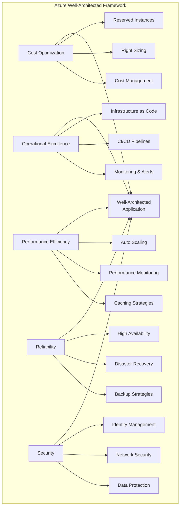
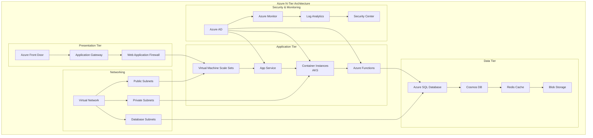
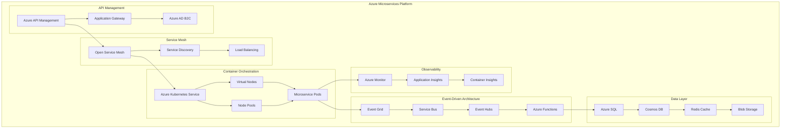
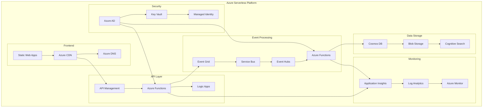
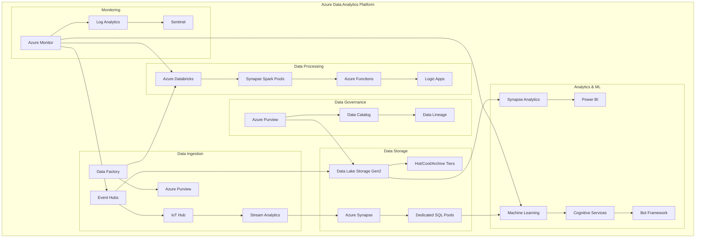
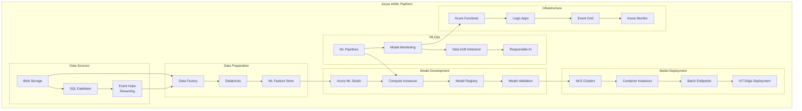
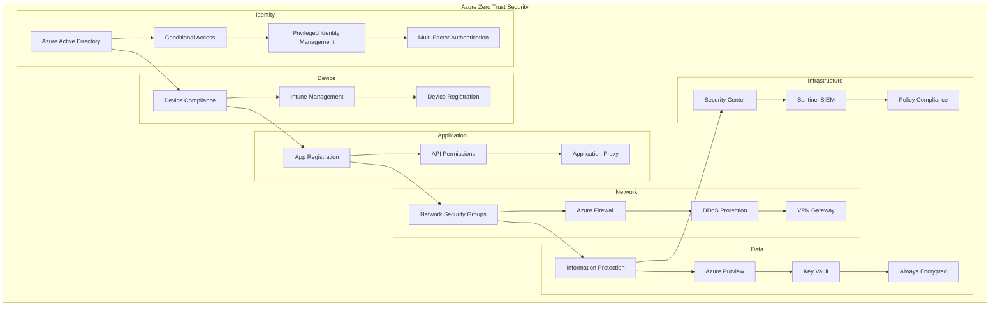
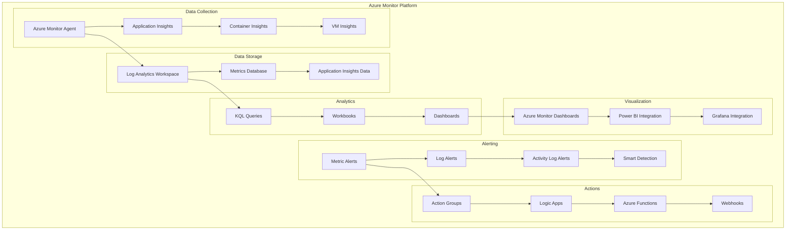

# ☁️ Azure Cloud Infrastructure Guide

## Overview

This comprehensive guide covers Microsoft Azure infrastructure patterns, services, and implementations for enterprise cloud-native applications. It includes detailed architecture diagrams, ARM/Bicep templates, and hands-on labs.

## 📋 Azure Architecture Patterns

### 1. **Azure Well-Architected Framework**



### 2. **Azure N-Tier Application Architecture**



### 3. **Azure Microservices Architecture**



### 4. **Azure Serverless Architecture**



### 5. **Azure Data Analytics Architecture**



### 6. **Azure AI/ML Pipeline**



## 🏗️ **Azure Service Categories**

### **Compute Services**
- **Virtual Machines**: Scalable compute resources
- **App Service**: Platform-as-a-Service for web apps
- **AKS**: Managed Kubernetes service
- **Container Instances**: Serverless containers
- **Azure Functions**: Event-driven serverless compute
- **Service Fabric**: Microservices platform

### **Storage Services**
- **Blob Storage**: Object storage with multiple access tiers
- **Files**: Managed file shares
- **Queue Storage**: Message queuing service
- **Table Storage**: NoSQL key-value store
- **Disk Storage**: High-performance disks for VMs
- **Data Lake Storage**: Analytics-optimized storage

### **Database Services**
- **SQL Database**: Managed relational database
- **Cosmos DB**: Globally distributed NoSQL database
- **Database for MySQL/PostgreSQL**: Managed open-source databases
- **Redis Cache**: In-memory data store
- **SQL Managed Instance**: Fully managed SQL Server
- **Azure Database Migration Service**: Database migration

### **Networking Services**
- **Virtual Network**: Software-defined networking
- **Load Balancer**: Layer 4 load balancing
- **Application Gateway**: Layer 7 load balancing with WAF
- **Azure DNS**: Domain name system service
- **VPN Gateway**: Site-to-site connectivity
- **ExpressRoute**: Dedicated private network connections

### **Security Services**
- **Azure Active Directory**: Identity and access management
- **Key Vault**: Secure key and secret management
- **Security Center**: Security posture management
- **Sentinel**: Cloud-native SIEM
- **Azure Firewall**: Network security service
- **DDoS Protection**: Distributed denial of service protection

### **Analytics Services**
- **Synapse Analytics**: Enterprise data warehouse
- **Databricks**: Apache Spark-based analytics
- **Data Factory**: Data integration service
- **Stream Analytics**: Real-time analytics
- **Power BI**: Business intelligence platform
- **Purview**: Data governance service

### **AI/ML Services**
- **Machine Learning**: ML lifecycle management
- **Cognitive Services**: Pre-built AI APIs
- **Bot Service**: Intelligent bot development
- **Form Recognizer**: Document processing
- **Translator**: Language translation
- **Speech Services**: Speech recognition and synthesis

## 🔧 **Implementation Examples**

### **Virtual Network with Hub-Spoke Topology**
```json
{
  "HubVNet": {
    "AddressSpace": "10.0.0.0/16",
    "Subnets": {
      "GatewaySubnet": "10.0.0.0/24",
      "AzureFirewallSubnet": "10.0.1.0/24",
      "SharedServicesSubnet": "10.0.2.0/24"
    }
  },
  "Spoke1VNet": {
    "AddressSpace": "10.1.0.0/16",
    "Subnets": {
      "WebTierSubnet": "10.1.1.0/24",
      "AppTierSubnet": "10.1.2.0/24",
      "DataTierSubnet": "10.1.3.0/24"
    }
  },
  "Spoke2VNet": {
    "AddressSpace": "10.2.0.0/16",
    "Subnets": {
      "DevWorkloadSubnet": "10.2.1.0/24",
      "TestWorkloadSubnet": "10.2.2.0/24"
    }
  }
}
```

### **AKS Cluster with Bicep Template**
```bicep
param clusterName string = 'production-aks'
param location string = resourceGroup().location
param kubernetesVersion string = '1.28.0'
param nodeCount int = 3
param vmSize string = 'Standard_D2s_v3'

resource aks 'Microsoft.ContainerService/managedClusters@2023-05-01' = {
  name: clusterName
  location: location
  identity: {
    type: 'SystemAssigned'
  }
  properties: {
    kubernetesVersion: kubernetesVersion
    agentPoolProfiles: [
      {
        name: 'systempool'
        count: nodeCount
        vmSize: vmSize
        mode: 'System'
        osType: 'Linux'
        enableAutoScaling: true
        minCount: 1
        maxCount: 10
      }
    ]
    addonProfiles: {
      azureKeyvaultSecretsProvider: {
        enabled: true
      }
      azurepolicy: {
        enabled: true
      }
      omsagent: {
        enabled: true
        config: {
          logAnalyticsWorkspaceResourceID: logAnalyticsWorkspace.id
        }
      }
    }
    networkProfile: {
      networkPlugin: 'azure'
      serviceCidr: '10.240.0.0/16'
      dnsServiceIP: '10.240.0.10'
    }
  }
}
```

## 📊 **Azure Cost Management**

### **Cost Optimization Strategies**

```mermaid
graph TB
    subgraph "Azure Cost Management"
        subgraph "Resource Optimization"
            A[VM Right Sizing] --> B[Reserved Instances]
            B --> C[Spot Instances]
        end
        
        subgraph "Storage Optimization"
            D[Storage Tiering] --> E[Lifecycle Management]
            E --> F[Backup Optimization]
        end
        
        subgraph "PaaS Optimization"
            G[App Service Plans] --> H[Function Consumption]
            H --> I[SQL Database DTU/vCore]
        end
        
        subgraph "Monitoring & Governance"
            J[Cost Management] --> K[Budgets & Alerts]
            K --> L[Azure Advisor]
        end
        
        subgraph "Automation"
            M[Auto-shutdown] --> N[Scaling Policies]
            N --> O[Tag-based Policies]
        end
        
        C --> D
        F --> G
        I --> J
        L --> M
    end
```



## 🔒 **Azure Security Framework**

### **Zero Trust Security Model**



## 📈 **Azure Monitoring & Observability**

### **Azure Monitor Ecosystem**



## 🎯 **Learning Path & Certification**

### **Azure Certification Tracks**
- **AZ-104**: Azure Administrator Associate
- **AZ-204**: Azure Developer Associate
- **AZ-305**: Azure Solutions Architect Expert
- **AZ-400**: DevOps Engineer Expert
- **AZ-500**: Azure Security Engineer Associate

### **Hands-on Labs Structure**
1. **Foundation Labs**: Resource Groups, Virtual Networks, Storage
2. **Compute Labs**: Virtual Machines, App Service, AKS
3. **Data Labs**: SQL Database, Cosmos DB, Storage Accounts
4. **Serverless Labs**: Azure Functions, Logic Apps, Event Grid
5. **Analytics Labs**: Synapse, Databricks, Data Factory
6. **AI/ML Labs**: Machine Learning, Cognitive Services
7. **Security Labs**: Azure AD, Key Vault, Security Center
8. **DevOps Labs**: Azure DevOps, GitHub Actions, ARM Templates

## 🛠️ **Infrastructure as Code**

### **ARM Template Example**
```json
{
  "$schema": "https://schema.management.azure.com/schemas/2019-04-01/deploymentTemplate.json#",
  "contentVersion": "1.0.0.0",
  "parameters": {
    "vmName": {
      "type": "string",
      "defaultValue": "myVM"
    },
    "adminUsername": {
      "type": "string"
    },
    "adminPassword": {
      "type": "secureString"
    }
  },
  "resources": [
    {
      "type": "Microsoft.Compute/virtualMachines",
      "apiVersion": "2021-03-01",
      "name": "[parameters('vmName')]",
      "location": "[resourceGroup().location]",
      "properties": {
        "hardwareProfile": {
          "vmSize": "Standard_B2s"
        },
        "osProfile": {
          "computerName": "[parameters('vmName')]",
          "adminUsername": "[parameters('adminUsername')]",
          "adminPassword": "[parameters('adminPassword')]"
        }
      }
    }
  ]
}
```

### **Bicep Template Example**
```bicep
@description('Name of the virtual machine')
param vmName string = 'myVM'

@description('Administrator username')
param adminUsername string

@description('Administrator password')
@secure()
param adminPassword string

@description('Location for all resources')
param location string = resourceGroup().location

resource vm 'Microsoft.Compute/virtualMachines@2021-03-01' = {
  name: vmName
  location: location
  properties: {
    hardwareProfile: {
      vmSize: 'Standard_B2s'
    }
    osProfile: {
      computerName: vmName
      adminUsername: adminUsername
      adminPassword: adminPassword
    }
  }
}

output vmId string = vm.id
```

## 🚀 **Next Steps**

1. **Explore Architecture Patterns**: Study the detailed diagrams above
2. **Complete Hands-on Labs**: Navigate to `labs/` folder
3. **Review Service Documentation**: Check `services/` folder
4. **Practice ARM/Bicep Templates**: Use `infrastructure/` templates
5. **Set up Monitoring**: Implement observability with `monitoring/` examples

---

**Ready to master Azure?** Start with the foundation concepts and progressively build your cloud expertise! 🎯
