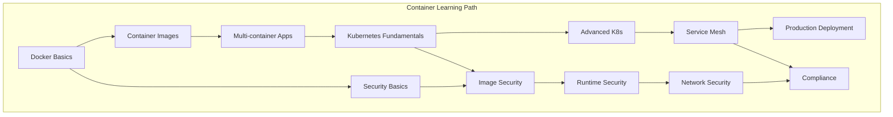
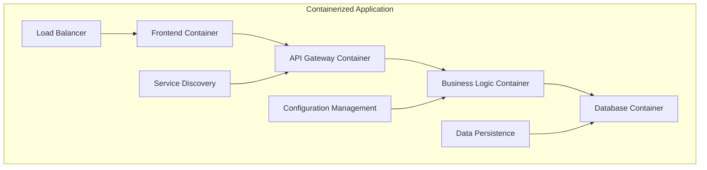
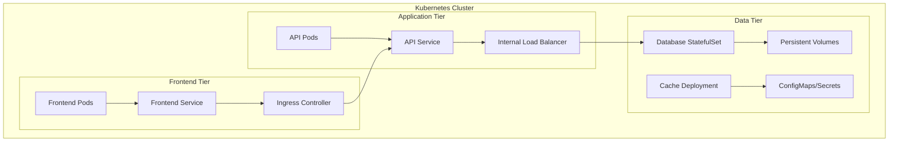
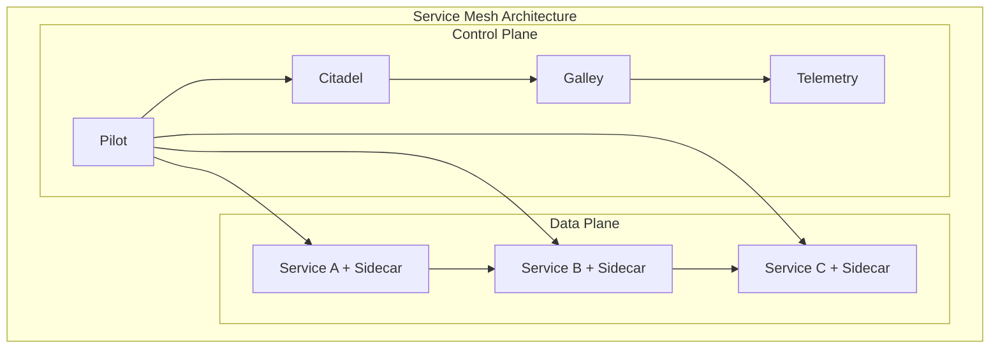
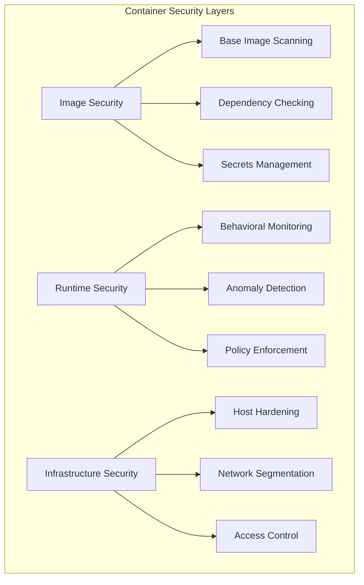
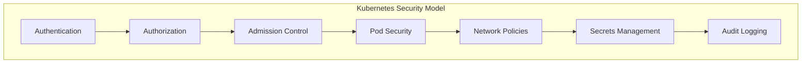

# 🐳 Containerization Technologies

## Overview

This section covers containerization technologies and orchestration platforms that form the backbone of modern cloud-native applications. Learn Docker fundamentals, Kubernetes orchestration, service mesh implementations, and container security practices.

## 📦 **Containerization Modules**

### **1. Docker Fundamentals**
**Location**: [`docker/`](./docker/)
**Duration**: Week 15 of learning path
**Objectives**: Master container creation, management, and optimization

**Topics Covered**:
- Container concepts and architecture
- Docker image creation and optimization
- Multi-stage builds and best practices
- Container networking and storage
- Docker Compose for multi-container applications
- Container registry management

### **2. Kubernetes Orchestration**
**Location**: [`kubernetes/`](./kubernetes/)
**Duration**: Week 15-16 of learning path
**Objectives**: Implement production-grade container orchestration

**Topics Covered**:
- Kubernetes architecture and components
- Pods, Services, and Deployments
- ConfigMaps, Secrets, and Persistent Volumes
- Ingress controllers and networking
- RBAC and security policies
- Monitoring and logging integration

### **3. Service Mesh**
**Location**: [`service-mesh/`](./service-mesh/)
**Duration**: Week 16 of learning path
**Objectives**: Implement advanced service communication patterns

**Topics Covered**:
- Service mesh architecture and benefits
- Istio installation and configuration
- Traffic management and routing
- Security policies and mTLS
- Observability and monitoring
- Progressive deployment strategies

### **4. Container Security**
**Location**: [`container-security/`](./container-security/)
**Duration**: Throughout container modules
**Objectives**: Secure containerized applications and infrastructure

**Topics Covered**:
- Container security threats and vulnerabilities
- Image scanning and vulnerability management
- Runtime security and monitoring
- Network policies and segmentation
- Admission controllers and policy enforcement
- Compliance and governance

## 🎯 **Learning Progression**

### **Container Mastery Journey**


### **Skill Development Timeline**

```mermaid
gantt
    title Container Technology Learning Timeline
    dateFormat X
    axisFormat %d
    
    section Docker
    Docker Basics        :1, 7
    Image Optimization   :7, 14
    
    section Kubernetes
    K8s Fundamentals     :14, 21
    Advanced Features    :21, 28
    
    section Service Mesh
    Istio Basics         :28, 35
    Advanced Patterns    :35, 42
    
    section Security
    Container Security   :1, 42
```


## 🛠️ **Practical Projects**

### **Project 1: Multi-Tier Application Containerization**


**Components**:
- React frontend in Nginx container
- Node.js API in custom container
- PostgreSQL database container
- Redis cache container
- Docker Compose orchestration

### **Project 2: Kubernetes Production Deployment**


**Features**:
- High availability deployment
- Auto-scaling configuration
- Health checks and monitoring
- Secret management
- Network policies

### **Project 3: Service Mesh Implementation**


**Capabilities**:
- Traffic routing and load balancing
- Security policies and mTLS
- Observability and tracing
- Fault injection and testing
- Progressive deployments

## 📊 **Technology Comparison**

### **Container Platforms**
```
Feature               Docker    Podman    containerd
========================================================
Daemon Required       Yes       No        Yes
Root Privileges       Yes       No        Yes
OCI Compliant        Yes       Yes       Yes
Kubernetes Support   Yes       Yes       Native
Security Model       Daemon    Rootless  Minimal
```

### **Orchestration Platforms**
```
Feature               Kubernetes    Docker Swarm    Nomad
===========================================================
Complexity           High          Low             Medium
Scalability          Excellent     Good            Excellent
Ecosystem            Mature        Limited         Growing
Multi-cloud          Yes           Limited         Yes
Learning Curve       Steep         Gentle          Moderate
```

### **Service Mesh Solutions**
```
Feature               Istio     Linkerd    Consul Connect
==========================================================
Performance           Good      Excellent  Good
Feature Richness      High      Medium     Medium
Operational Overhead  High      Low        Medium
Observability         Excellent Good       Good
Security Features     Excellent Good       Good
```

## 🔧 **Tools and Technologies**

### **Container Tools**
- **Docker**: Container runtime and development platform
- **Podman**: Daemonless container engine
- **Buildah**: Container image building tool
- **Skopeo**: Container image inspection and transfer
- **Crane**: Container registry interaction tool

### **Kubernetes Tools**
- **kubectl**: Kubernetes command-line interface
- **Helm**: Kubernetes package manager
- **Kustomize**: Configuration customization tool
- **Operator SDK**: Kubernetes operator development
- **Telepresence**: Local development with remote clusters

### **Service Mesh Tools**
- **Istio**: Feature-rich service mesh platform
- **Linkerd**: Lightweight service mesh
- **Consul Connect**: Service mesh from HashiCorp
- **Envoy**: High-performance proxy
- **Jaeger**: Distributed tracing system

### **Security Tools**
- **Trivy**: Container vulnerability scanner
- **Falco**: Runtime security monitoring
- **OPA Gatekeeper**: Policy enforcement
- **Twistlock/Prisma**: Container security platform
- **Aqua Security**: Container security solution

## 📈 **Learning Resources**

### **Official Documentation**
- [Docker Documentation](https://docs.docker.com/)
- [Kubernetes Documentation](https://kubernetes.io/docs/)
- [Istio Documentation](https://istio.io/docs/)
- [CNCF Landscape](https://landscape.cncf.io/)

### **Certification Paths**
- **Docker**: Docker Certified Associate (DCA)
- **Kubernetes**: CKA, CKAD, CKS
- **Cloud Provider**: EKS, AKS, GKE certifications
- **Security**: Certified Kubernetes Security Specialist

### **Hands-On Platforms**
- **Local**: Docker Desktop, Minikube, k3s
- **Cloud**: EKS, AKS, GKE managed services
- **Learning**: Katacoda, Play with Docker/Kubernetes
- **Training**: Linux Foundation, Cloud Native Computing Foundation

## 🎯 **Best Practices**

### **Container Best Practices**
1. **Use minimal base images**: Alpine, distroless images
2. **Multi-stage builds**: Optimize image size and security
3. **Non-root users**: Run containers with least privilege
4. **Health checks**: Implement proper health monitoring
5. **Resource limits**: Set appropriate CPU and memory limits
6. **Immutable containers**: Avoid changing running containers

### **Kubernetes Best Practices**
1. **Resource management**: Use requests and limits
2. **Security contexts**: Configure security settings
3. **Network policies**: Implement micro-segmentation
4. **RBAC**: Use role-based access control
5. **Monitoring**: Comprehensive observability
6. **GitOps**: Infrastructure and application as code

### **Service Mesh Best Practices**
1. **Gradual adoption**: Start with observability
2. **Security first**: Enable mTLS early
3. **Performance monitoring**: Watch for latency impact
4. **Policy enforcement**: Implement traffic policies
5. **Upgrade planning**: Plan for control plane updates
6. **Troubleshooting**: Understand debugging tools

## 🔒 **Security Considerations**

### **Container Security**


### **Kubernetes Security**


## 📊 **Performance Optimization**

### **Container Optimization**
- **Image size**: Minimize layers and dependencies
- **Resource allocation**: Right-size CPU and memory
- **Networking**: Optimize container networking
- **Storage**: Use appropriate volume types
- **Caching**: Leverage build and runtime caching

### **Kubernetes Optimization**
- **Node sizing**: Optimize node configuration
- **Pod placement**: Use affinity and anti-affinity
- **Horizontal scaling**: Configure HPA and VPA
- **Resource allocation**: Tune requests and limits
- **Networking**: Optimize CNI configuration

## 🚀 **Getting Started**

### **Prerequisites**
- Understanding of Linux fundamentals
- Basic networking knowledge
- Familiarity with YAML configuration
- Command-line interface experience

### **Recommended Learning Path**
1. **Week 1**: [Docker Fundamentals](./docker/README.md)
2. **Week 2**: [Kubernetes Basics](./kubernetes/README.md)
3. **Week 3**: [Advanced Kubernetes](./kubernetes/README.md)
4. **Week 4**: [Service Mesh](./service-mesh/README.md)
5. **Ongoing**: [Container Security](./container-security/README.md)

### **Lab Environment Setup**
```bash
# Install Docker
curl -fsSL https://get.docker.com -o get-docker.sh
sh get-docker.sh

# Install Kubernetes (minikube for local development)
curl -LO https://storage.googleapis.com/minikube/releases/latest/minikube-linux-amd64
sudo install minikube-linux-amd64 /usr/local/bin/minikube

# Install kubectl
curl -LO "https://dl.k8s.io/release/$(curl -L -s https://dl.k8s.io/release/stable.txt)/bin/linux/amd64/kubectl"
sudo install kubectl /usr/local/bin/kubectl

# Install Helm
curl https://raw.githubusercontent.com/helm/helm/main/scripts/get-helm-3 | bash
```

---

**Ready to containerize your applications?** 🐳

Start with [Docker Fundamentals](./docker/README.md) and begin your journey into the world of containers and orchestration!
