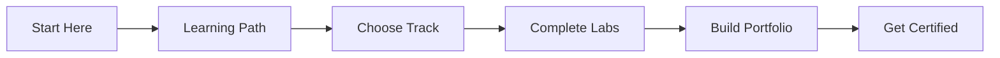
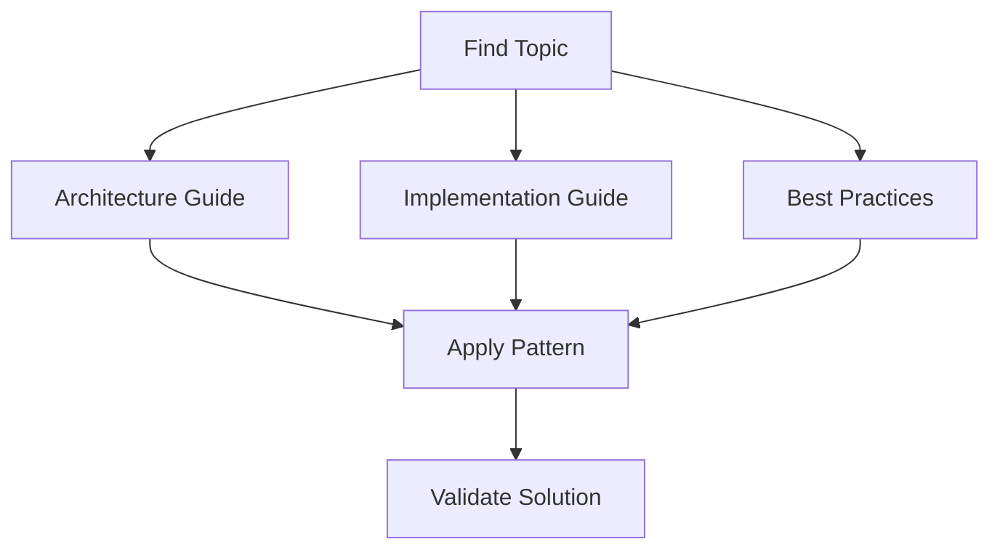

# 📚 Documentation Hub

## Overview

This documentation hub contains comprehensive guides, learning materials, and reference documentation for the Cloud Infrastructure Engineering project. It serves as the central knowledge base for understanding cloud architecture patterns, best practices, and implementation strategies.

## 📋 **Documentation Structure**

### **Core Documentation**
- [`architecture.md`](./architecture.md) - Comprehensive architecture patterns and design principles
- [`learning-path.md`](./learning-path.md) - Structured 24-week learning curriculum
- [`best-practices.md`](./best-practices.md) - Industry best practices and guidelines
- [`troubleshooting.md`](./troubleshooting.md) - Common issues and solutions

## 🎯 **Quick Navigation**

### **For Beginners**
1. Start with [Learning Path](./learning-path.md) - Phase 1: Foundations
2. Review [Cloud Fundamentals](../foundations/cloud-fundamentals/README.md)
3. Complete [Foundation Labs](../aws/labs/README.md)

### **For Intermediate Learners**
1. Study [Architecture Patterns](./architecture.md)
2. Explore [Multi-Cloud Strategies](../multi-cloud/README.md)
3. Practice [Container Orchestration](../containerization/kubernetes/README.md)

### **For Advanced Practitioners**
1. Implement [Enterprise Patterns](../examples/README.md)
2. Master [Security Frameworks](../security/README.md)
3. Optimize [Performance](../performance/README.md)

## 📖 **Documentation Categories**

### **Architecture & Design**
- **Patterns**: Reference architectures for various use cases
- **Principles**: Design principles and best practices
- **Decision Trees**: Technology selection frameworks
- **Case Studies**: Real-world implementation examples

### **Learning Materials**
- **Curriculum**: Structured learning progression
- **Labs**: Hands-on practical exercises
- **Assessments**: Knowledge validation and testing
- **Certification**: Preparation for industry certifications

### **Implementation Guides**
- **Step-by-Step**: Detailed implementation instructions
- **Code Examples**: Production-ready code samples
- **Configuration**: Service and infrastructure configurations
- **Automation**: Infrastructure as Code templates

### **Operational Guides**
- **Monitoring**: Observability and alerting setup
- **Security**: Security controls and compliance
- **Performance**: Optimization and tuning guides
- **Troubleshooting**: Problem diagnosis and resolution

## 🛠️ **How to Use This Documentation**

### **Learning Journey**


### **Reference Usage**


## 📊 **Documentation Quality Standards**

### **Content Guidelines**
- **Clear Objectives**: Each document has defined learning outcomes
- **Practical Examples**: Real-world scenarios and use cases
- **Visual Aids**: Diagrams, charts, and illustrations
- **Code Samples**: Working, tested code examples
- **Regular Updates**: Content kept current with technology changes

### **Structure Standards**
- **Consistent Format**: Standardized document structure
- **Navigation**: Clear hierarchy and cross-references
- **Searchability**: Proper tagging and indexing
- **Accessibility**: Clear language and formatting

## 🎓 **Learning Resources**

### **Internal Resources**
- [Foundation Concepts](../foundations/README.md)
- [Cloud Provider Guides](../aws/README.md)
- [Hands-on Labs](../aws/labs/README.md)
- [Example Projects](../examples/README.md)

### **External Resources**
- Cloud Provider Documentation (AWS, Azure, GCP)
- Industry Publications and Whitepapers
- Open Source Project Documentation
- Community Forums and Discussions

## 🤝 **Contributing to Documentation**

### **Content Contribution**
- Review existing documentation for gaps
- Submit improvements and updates
- Add new examples and use cases
- Share real-world experiences

### **Quality Assurance**
- Technical accuracy review
- Grammar and style checking
- Link validation and testing
- User experience feedback

### **Documentation Standards**
```markdown
# Document Title

## Overview
Brief description of the document's purpose and scope.

## Prerequisites
What readers should know before reading this document.

## Learning Objectives
What readers will accomplish after reading this document.

## Content Sections
Organized, logical flow of information.

## Examples
Practical, working examples.

## Next Steps
Where to go next in the learning journey.
```

## 📈 **Documentation Metrics**

### **Usage Statistics**
- Most accessed documents
- Learning path completion rates
- Lab exercise success rates
- User feedback scores

### **Quality Metrics**
- Document completeness
- Code example accuracy
- Link validity
- User satisfaction ratings

## 🔄 **Continuous Improvement**

### **Regular Reviews**
- Monthly content updates
- Quarterly comprehensive reviews
- Annual curriculum assessment
- Technology trend integration

### **Feedback Integration**
- User experience surveys
- Technical accuracy validation
- Industry expert reviews
- Community contributions

---

**Ready to start your learning journey?** 🚀

Choose your path from the [Learning Guide](./learning-path.md) and begin building your cloud infrastructure expertise!
