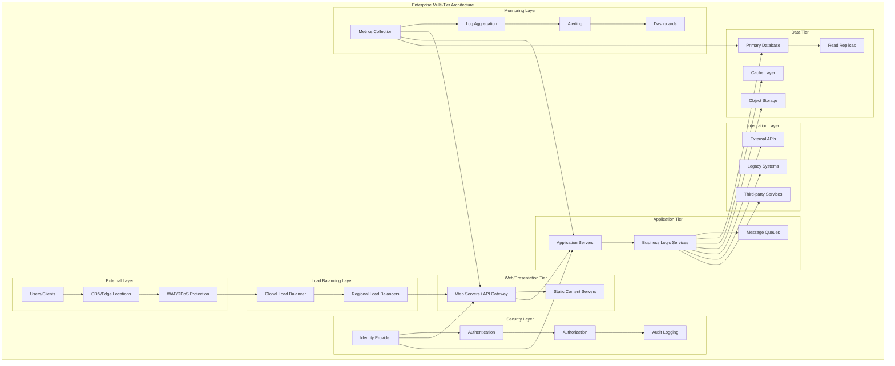
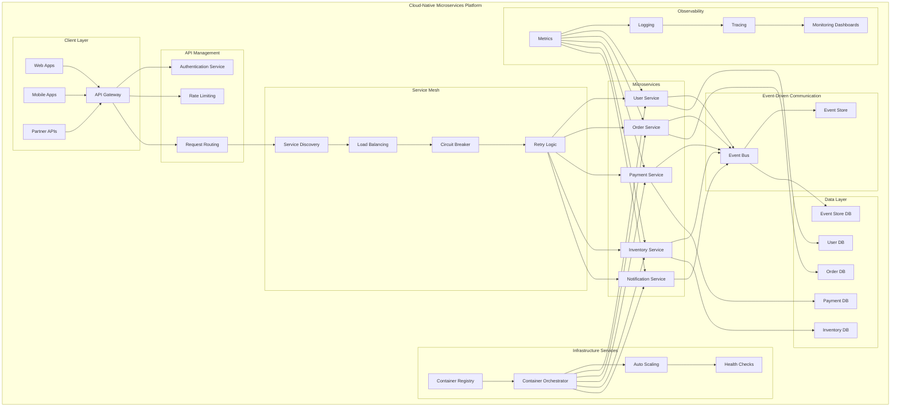
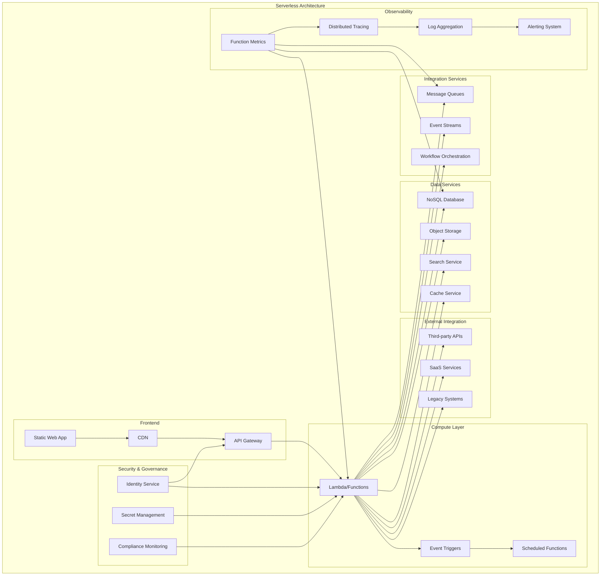
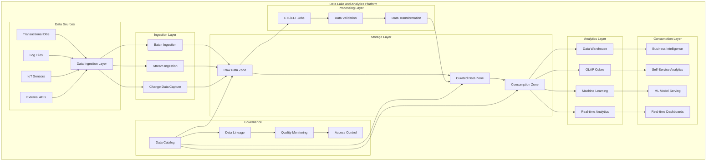
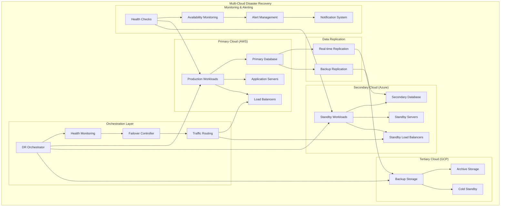
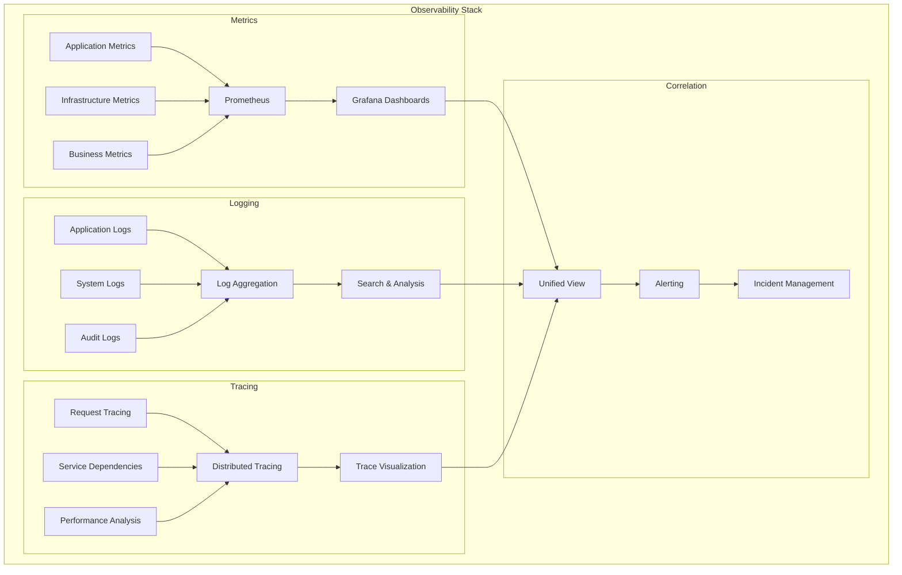
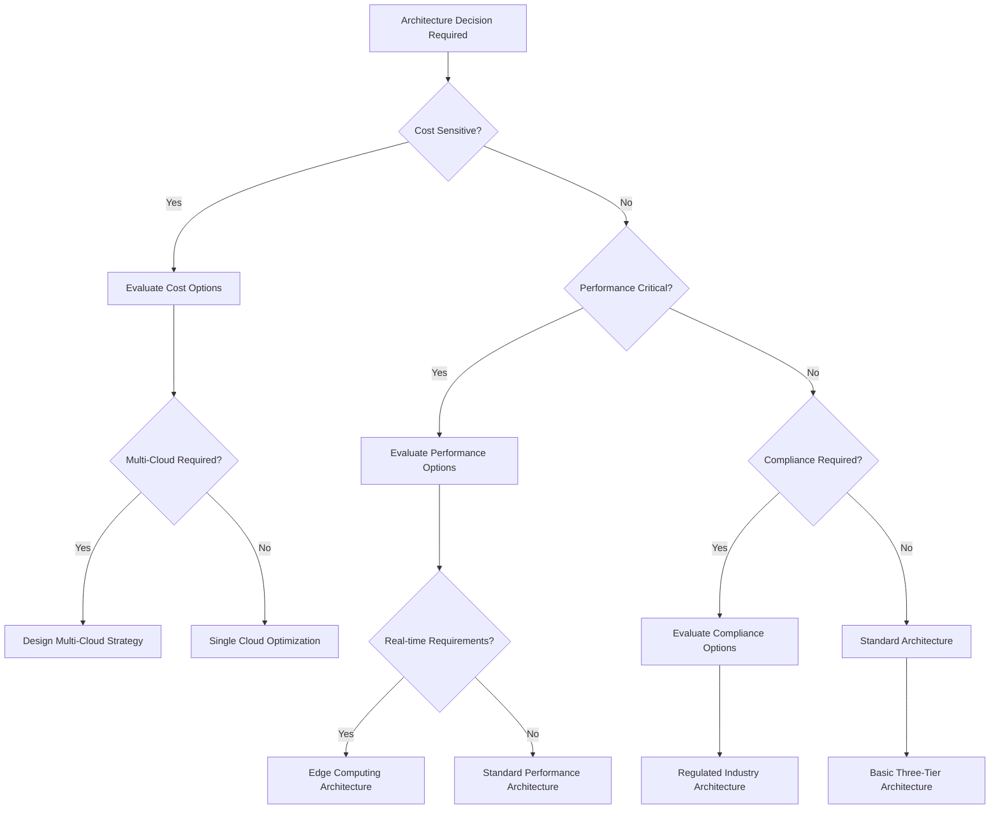
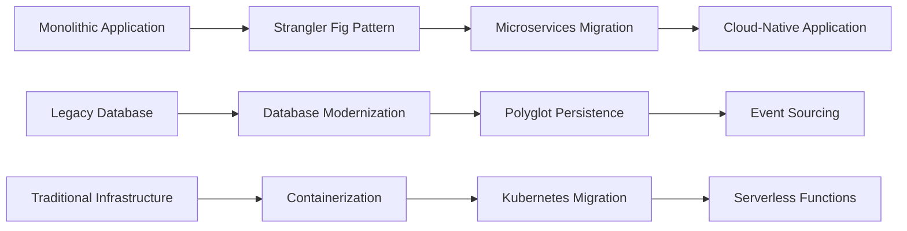

# 🏗️ Cloud Infrastructure Architecture Guide

## Overview

This comprehensive architecture guide provides detailed patterns, best practices, and implementation strategies for building robust, scalable, and secure cloud infrastructure across multiple cloud providers. It serves as both a reference and a practical guide for cloud architects and engineers.

## 🎯 **Architecture Principles**

### **Core Design Principles**
1. **Scalability**: Design for horizontal and vertical scaling
2. **Reliability**: Build fault-tolerant and self-healing systems
3. **Security**: Implement defense-in-depth security strategies
4. **Performance**: Optimize for speed and efficiency
5. **Cost Optimization**: Balance performance with cost effectiveness
6. **Operability**: Design for monitoring, logging, and maintenance

### **Cloud-Native Principles**
1. **Microservices Architecture**: Decompose monoliths into services
2. **API-First Design**: Everything accessible via well-defined APIs
3. **Stateless Design**: Minimize state and use external storage
4. **Event-Driven Architecture**: Use events for service communication
5. **Immutable Infrastructure**: Treat infrastructure as disposable
6. **DevOps Integration**: Embed operations into development lifecycle

## 🌟 **Reference Architectures**

### **1. Enterprise Multi-Tier Architecture**



**Key Components:**
- **CDN/Edge**: Global content delivery and edge computing
- **Load Balancers**: Traffic distribution and high availability
- **Web Tier**: Frontend applications and API gateways
- **Application Tier**: Business logic and microservices
- **Data Tier**: Databases, caching, and storage systems
- **Security**: Identity, access management, and compliance
- **Monitoring**: Observability and operational insights

### **2. Cloud-Native Microservices Architecture**



**Key Features:**
- **Service Independence**: Each service can be developed and deployed independently
- **API Gateway**: Single entry point with cross-cutting concerns
- **Service Mesh**: Service-to-service communication management
- **Event-Driven**: Asynchronous communication between services
- **Data Isolation**: Each service owns its data
- **Container-Based**: Deployment using containers and orchestrators

### **3. Serverless Architecture Pattern**



**Benefits:**
- **Cost Efficiency**: Pay only for actual execution time
- **Auto Scaling**: Automatic scaling based on demand
- **Reduced Operations**: Minimal infrastructure management
- **Fast Development**: Focus on business logic
- **Event-Driven**: Natural fit for event-driven architectures

### **4. Data Lake and Analytics Architecture**



**Components:**
- **Data Ingestion**: Batch and real-time data collection
- **Data Storage**: Layered approach with raw, curated, and consumption zones
- **Data Processing**: ETL/ELT pipelines with validation and transformation
- **Analytics**: Various analytical workloads and ML capabilities
- **Data Governance**: Metadata management and compliance

### **5. Multi-Cloud Disaster Recovery Architecture**



**DR Strategies:**
- **Active-Passive**: Primary site active, secondary on standby
- **Active-Active**: Both sites serving traffic simultaneously
- **Pilot Light**: Minimal infrastructure always running
- **Warm Standby**: Scaled-down version always running
- **Cold Standby**: Infrastructure provisioned on-demand

## 🔧 **Implementation Patterns**

### **Infrastructure as Code Patterns**

#### **Modular Terraform Structure**
```
infrastructure/
├── modules/
│   ├── vpc/
│   │   ├── main.tf
│   │   ├── variables.tf
│   │   └── outputs.tf
│   ├── compute/
│   │   ├── main.tf
│   │   ├── variables.tf
│   │   └── outputs.tf
│   └── database/
│       ├── main.tf
│       ├── variables.tf
│       └── outputs.tf
├── environments/
│   ├── dev/
│   │   ├── main.tf
│   │   ├── terraform.tfvars
│   │   └── backend.tf
│   ├── staging/
│   │   ├── main.tf
│   │   ├── terraform.tfvars
│   │   └── backend.tf
│   └── production/
│       ├── main.tf
│       ├── terraform.tfvars
│       └── backend.tf
└── shared/
    ├── providers.tf
    ├── variables.tf
    └── outputs.tf
```

#### **Kubernetes Application Patterns**

**Deployment Pattern**
```yaml
apiVersion: apps/v1
kind: Deployment
metadata:
  name: web-application
  labels:
    app: web-application
spec:
  replicas: 3
  strategy:
    type: RollingUpdate
    rollingUpdate:
      maxSurge: 1
      maxUnavailable: 0
  selector:
    matchLabels:
      app: web-application
  template:
    metadata:
      labels:
        app: web-application
    spec:
      containers:
      - name: web-application
        image: myapp:v1.0.0
        ports:
        - containerPort: 8080
        resources:
          requests:
            memory: "256Mi"
            cpu: "250m"
          limits:
            memory: "512Mi"
            cpu: "500m"
        livenessProbe:
          httpGet:
            path: /health
            port: 8080
          initialDelaySeconds: 30
          periodSeconds: 10
        readinessProbe:
          httpGet:
            path: /ready
            port: 8080
          initialDelaySeconds: 5
          periodSeconds: 5
        env:
        - name: DATABASE_URL
          valueFrom:
            secretKeyRef:
              name: database-secret
              key: url
```

**Service Pattern**
```yaml
apiVersion: v1
kind: Service
metadata:
  name: web-application-service
  labels:
    app: web-application
spec:
  selector:
    app: web-application
  ports:
  - protocol: TCP
    port: 80
    targetPort: 8080
  type: ClusterIP

---
apiVersion: networking.k8s.io/v1
kind: Ingress
metadata:
  name: web-application-ingress
  annotations:
    nginx.ingress.kubernetes.io/rewrite-target: /
    cert-manager.io/cluster-issuer: letsencrypt-prod
spec:
  tls:
  - hosts:
    - myapp.example.com
    secretName: myapp-tls
  rules:
  - host: myapp.example.com
    http:
      paths:
      - path: /
        pathType: Prefix
        backend:
          service:
            name: web-application-service
            port:
              number: 80
```

### **Security Patterns**

#### **Zero Trust Network Architecture**

```mermaid
graph TB
    subgraph "Zero Trust Architecture"
        subgraph "Identity Verification"
            A[User/Device] --> B[Identity Provider]
            B --> C[Multi-Factor Authentication]
            C --> D[Risk Assessment]
        end
        
        subgraph "Policy Engine"
            D --> E[Access Policies]
            E --> F[Conditional Access]
            F --> G[Continuous Verification]
        end
        
        subgraph "Micro-Segmentation"
            G --> H[Network Segmentation]
            H --> I[Application Segmentation]
            I --> J[Data Segmentation]
        end
        
        subgraph "Encryption"
            K[Data at Rest] --> L[Data in Transit]
            L --> M[End-to-End Encryption]
        end
        
        subgraph "Monitoring"
            N[User Behavior] --> O[Anomaly Detection]
            O --> P[Threat Intelligence]
            P --> Q[Incident Response]
        end
        
        G --> K
        J --> N
    end
```


#### **Security Controls Implementation**
```yaml
# Network Policy Example
apiVersion: networking.k8s.io/v1
kind: NetworkPolicy
metadata:
  name: deny-all-ingress
  namespace: production
spec:
  podSelector: {}
  policyTypes:
  - Ingress
  - Egress
  egress:
  - to:
    - namespaceSelector:
        matchLabels:
          name: kube-system
    ports:
    - protocol: TCP
      port: 53
    - protocol: UDP
      port: 53

---
apiVersion: networking.k8s.io/v1
kind: NetworkPolicy
metadata:
  name: allow-web-to-api
  namespace: production
spec:
  podSelector:
    matchLabels:
      app: api-server
  policyTypes:
  - Ingress
  ingress:
  - from:
    - podSelector:
        matchLabels:
          app: web-server
    ports:
    - protocol: TCP
      port: 8080
```

### **Monitoring and Observability Patterns**

#### **Three Pillars of Observability**


#### **Monitoring Configuration**
```yaml
# ServiceMonitor for Prometheus
apiVersion: monitoring.coreos.com/v1
kind: ServiceMonitor
metadata:
  name: web-application-metrics
  labels:
    app: web-application
spec:
  selector:
    matchLabels:
      app: web-application
  endpoints:
  - port: metrics
    path: /metrics
    interval: 30s
    scrapeTimeout: 10s

---
# PrometheusRule for Alerting
apiVersion: monitoring.coreos.com/v1
kind: PrometheusRule
metadata:
  name: web-application-alerts
spec:
  groups:
  - name: web-application.rules
    rules:
    - alert: HighErrorRate
      expr: rate(http_requests_total{status=~"5.."}[5m]) > 0.1
      for: 5m
      labels:
        severity: critical
      annotations:
        summary: "High error rate detected"
        description: "Error rate is {{ $value }} errors per second"
    
    - alert: HighLatency
      expr: histogram_quantile(0.95, rate(http_request_duration_seconds_bucket[5m])) > 0.5
      for: 2m
      labels:
        severity: warning
      annotations:
        summary: "High latency detected"
        description: "95th percentile latency is {{ $value }} seconds"
```

## 📊 **Architecture Decision Framework**

### **Technology Selection Criteria**

#### **Evaluation Matrix**
```
Criteria                Weight    AWS    Azure    GCP    Score
================================================================
Cost                    25%       8      7        9      8.25
Performance             20%       9      8        8      8.4
Security                20%       9      9        8      8.8
Ecosystem               15%       9      7        7      7.8
Support                 10%       8      9        7      8.1
Innovation              10%       8      8        9      8.3
================================================================
Total Score                                               8.3
```

#### **Decision Tree**


### **Risk Assessment Matrix**
```
Risk Level    Impact    Probability    Mitigation Strategy
===========================================================
High          High      High          Immediate action required
Medium        High      Low           Contingency planning
Medium        Medium    Medium        Regular monitoring
Low           Low       Low           Accept risk
```

## 🎯 **Best Practices**

### **Design Principles**
1. **Design for Failure**: Assume components will fail
2. **Automate Everything**: Reduce manual processes
3. **Use Managed Services**: Leverage cloud provider services
4. **Implement Circuit Breakers**: Prevent cascade failures
5. **Cache Strategically**: Improve performance and reduce load
6. **Monitor Continuously**: Implement comprehensive observability

### **Security Best Practices**
1. **Principle of Least Privilege**: Grant minimum required access
2. **Defense in Depth**: Multiple layers of security
3. **Encrypt Everything**: Data at rest and in transit
4. **Regular Security Audits**: Continuous security assessment
5. **Incident Response Plan**: Prepared response procedures
6. **Security Training**: Keep teams educated on threats

### **Performance Optimization**
1. **Horizontal Scaling**: Scale out rather than up
2. **Asynchronous Processing**: Use queues and events
3. **Content Delivery Networks**: Reduce latency globally
4. **Database Optimization**: Proper indexing and query optimization
5. **Caching Layers**: Multiple levels of caching
6. **Resource Right-Sizing**: Match resources to workload

### **Cost Optimization**
1. **Reserved Instances**: Long-term capacity planning
2. **Spot Instances**: Use for fault-tolerant workloads
3. **Auto Scaling**: Scale resources based on demand
4. **Resource Tagging**: Track costs by project/team
5. **Regular Reviews**: Periodic cost optimization reviews
6. **Unused Resource Cleanup**: Remove orphaned resources

## 📈 **Architecture Evolution**

### **Migration Strategies**

#### **Lift and Shift**
- Minimal changes to existing applications
- Quick migration with limited cloud benefits
- Suitable for legacy applications

#### **Re-platforming**
- Minimal code changes with cloud optimizations
- Better cloud integration than lift and shift
- Balance between speed and optimization

#### **Re-architecting**
- Significant application redesign
- Full cloud-native benefits
- Longer timeline but maximum benefits

#### **Rebuild**
- Complete application rewrite
- Modern architecture patterns
- Maximum cloud optimization

### **Modernization Patterns**


## 🔮 **Future Architecture Trends**

### **Emerging Patterns**
1. **Edge Computing**: Processing closer to data sources
2. **Serverless Architectures**: Event-driven, pay-per-use computing
3. **AI/ML Integration**: Intelligent infrastructure and applications
4. **Quantum Computing**: Next-generation computing capabilities
5. **Sustainable Computing**: Green and energy-efficient architectures

### **Technology Evolution**
1. **WebAssembly**: Portable code execution
2. **Service Mesh**: Advanced service communication
3. **GitOps**: Git-driven operations and deployment
4. **Chaos Engineering**: Proactive failure testing
5. **Platform Engineering**: Internal developer platforms

---

This architecture guide provides a comprehensive foundation for designing and implementing cloud infrastructure. Use it as a reference for making informed architectural decisions and building robust, scalable systems.
