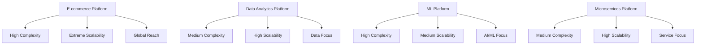
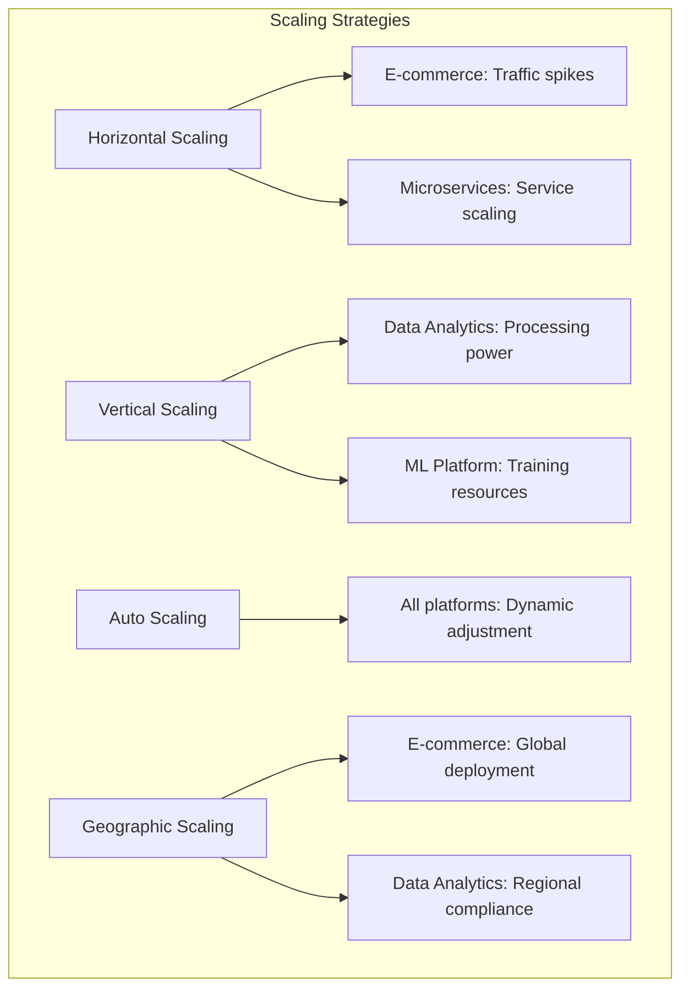
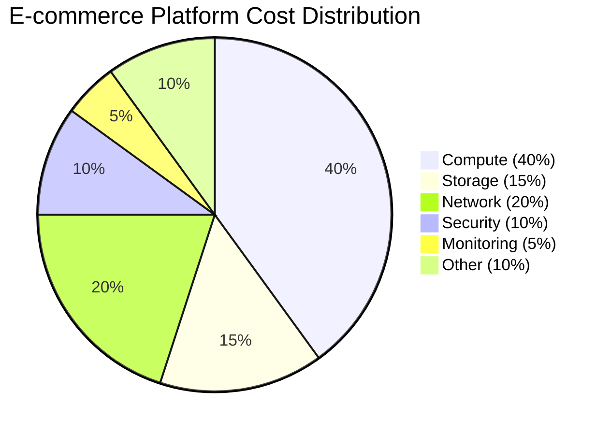
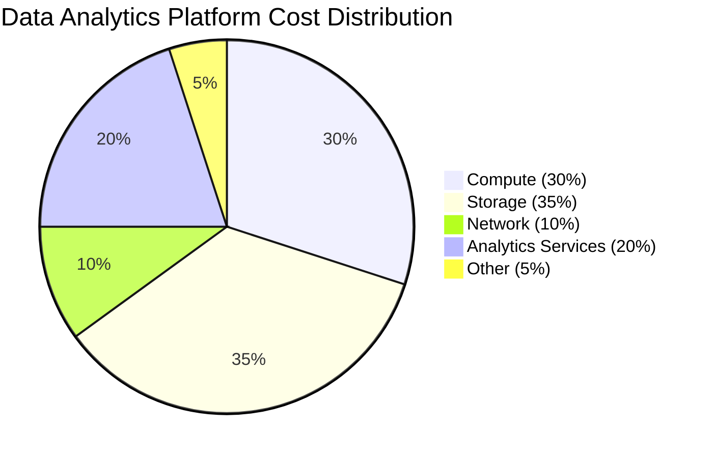
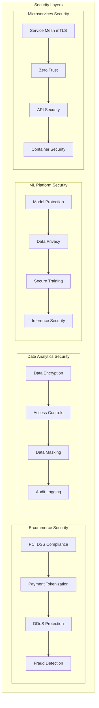
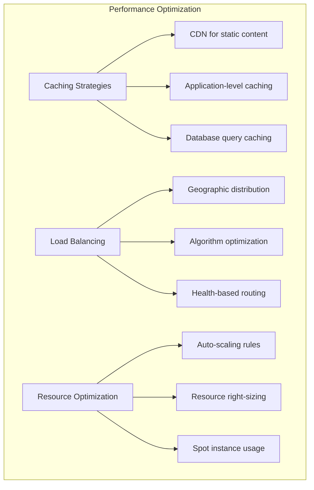
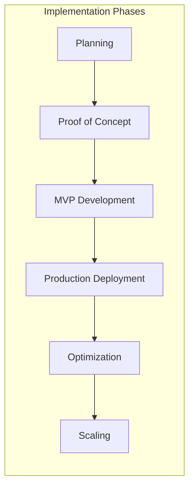
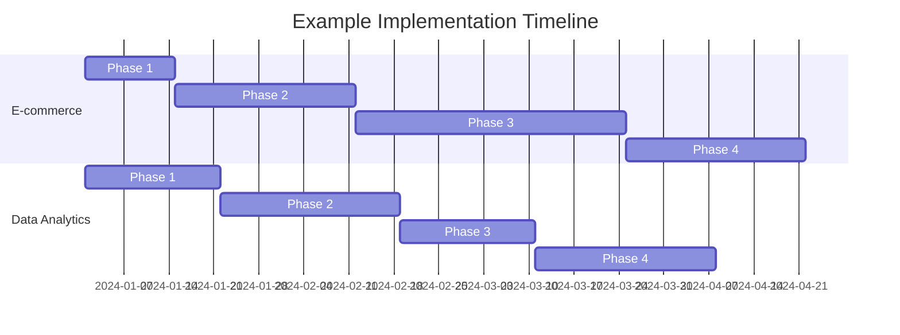

# 🏢 Real-World Implementation Examples

## Overview

This section contains comprehensive, production-ready examples of cloud infrastructure implementations across various industries and use cases. Each example demonstrates best practices, architectural patterns, and real-world considerations for building scalable, secure, and cost-effective cloud solutions.

## 🎯 **Example Projects**

### **1. E-commerce Platform**
**Location**: [`e-commerce-platform/`](./e-commerce-platform/)
**Industry**: Retail/E-commerce
**Scale**: High-traffic, global deployment
**Technologies**: Multi-cloud, microservices, event-driven architecture

**Key Features**:
- Global content delivery and edge computing
- Auto-scaling for traffic spikes (Black Friday, etc.)
- Multi-region deployment for high availability
- PCI DSS compliance for payment processing
- Real-time inventory management
- Personalization and recommendation engines

### **2. Data Analytics Platform**
**Location**: [`data-analytics-platform/`](./data-analytics-platform/)
**Industry**: Data-driven organizations
**Scale**: Petabyte-scale data processing
**Technologies**: Data lakes, streaming analytics, machine learning

**Key Features**:
- Real-time and batch data processing
- Data governance and compliance (GDPR, CCPA)
- Self-service analytics capabilities
- Machine learning model deployment
- Cost optimization for data storage
- Data quality monitoring and validation

### **3. Machine Learning Platform**
**Location**: [`ml-platform/`](./ml-platform/)
**Industry**: AI/ML organizations
**Scale**: Enterprise ML lifecycle management
**Technologies**: MLOps, model serving, experiment tracking

**Key Features**:
- End-to-end ML pipeline automation
- Model versioning and registry
- A/B testing and gradual rollouts
- Model monitoring and drift detection
- Scalable training infrastructure
- Multi-cloud model deployment

### **4. Microservices Platform**
**Location**: [`microservices-platform/`](./microservices-platform/)
**Industry**: Modern application development
**Scale**: Hundreds of microservices
**Technologies**: Kubernetes, service mesh, event streaming

**Key Features**:
- Service discovery and communication
- Distributed tracing and observability
- Circuit breakers and fault tolerance
- API gateway and rate limiting
- Service mesh security (mTLS)
- Progressive deployment strategies

## 🏗️ **Architecture Comparison**

### **Deployment Complexity vs. Scalability**


### **Technology Stack Comparison**
```
Component           E-commerce    Data Analytics    ML Platform    Microservices
==================================================================================
Frontend            React/Vue     Tableau/PowerBI   Jupyter        React/Angular
API Gateway         Kong/AWS ALB  Not Applicable    FastAPI        Istio/Envoy
Compute             EKS/AKS       EMR/Databricks    SageMaker      EKS/AKS/GKE
Storage             S3/Blob       Data Lake/BigQ    S3/HDFS        S3/PV
Database            RDS/Cosmos    Redshift/Synapse  PostgreSQL     MongoDB/Cassandra
Messaging           Kafka/SQS     Kafka/EventHub    Celery/Redis   Kafka/NATS
Monitoring          DataDog       CloudWatch        MLflow         Prometheus
```

## 📊 **Business Requirements Matrix**

### **Non-Functional Requirements**
```
Requirement         E-commerce    Data Analytics    ML Platform    Microservices
================================================================================
Availability        99.99%        99.9%            99.95%         99.9%
Response Time       < 200ms       < 30s batch     < 100ms        < 500ms
Throughput          100K req/s    10TB/day         1K pred/s      50K req/s
Data Retention      7 years       Indefinite       5 years        1 year
Recovery Time       < 15 min      < 4 hours        < 1 hour       < 30 min
Compliance          PCI DSS       GDPR/CCPA        HIPAA          SOC2
```

### **Scalability Patterns**


## 💰 **Cost Analysis**

### **Cost Structure by Platform**




### **Cost Optimization Strategies**
```
Platform            Primary Optimization    Secondary Optimization    Savings
===============================================================================
E-commerce          Auto-scaling           Reserved Instances        35%
Data Analytics      Storage Tiering        Spot Instances           45%
ML Platform         GPU Scheduling         Preemptible Instances    40%
Microservices       Resource Right-sizing  Container Optimization   30%
```

## 🔒 **Security Implementations**

### **Security Framework by Use Case**


### **Compliance Requirements**
```
Compliance          E-commerce    Data Analytics    ML Platform    Microservices
===============================================================================
PCI DSS            Required      Not Required      Optional       Optional
GDPR                Required      Required          Required       Required
HIPAA               Optional      Industry Specific Required       Optional
SOC 2               Required      Required          Required       Required
ISO 27001           Recommended   Recommended       Recommended    Recommended
```

## 📈 **Performance Benchmarks**

### **Typical Performance Metrics**
```
Metric              E-commerce    Data Analytics    ML Platform    Microservices
================================================================================
Peak Load           1M users      100TB/day        10K models     100K services
Response Time       150ms avg     5min batch       50ms           200ms
Throughput          500K req/s    50GB/min         5K pred/s      200K req/s
Uptime              99.99%        99.5%            99.9%          99.8%
Error Rate          < 0.01%       < 0.1%           < 0.05%        < 0.1%
```

### **Performance Optimization Techniques**


## 🛠️ **Implementation Approaches**

### **Development Methodology**


### **Technology Selection Criteria**
```
Criteria            Weight    E-commerce    Data Analytics    ML Platform
======================================================================
Performance         25%       9             8                9
Scalability        20%       9             9                8
Cost               15%       7             8                7
Security           15%       9             8                9
Ecosystem          10%       8             9                8
Support            10%       8             7                8
Innovation         5%        8             9                9
======================================================================
Total Score                  8.4           8.4              8.3
```

## 📚 **Learning Resources**

### **Documentation Structure**
Each example includes:
- **Architecture Overview**: High-level design and components
- **Implementation Guide**: Step-by-step deployment instructions
- **Code Repository**: Complete, working codebase
- **Configuration Files**: Infrastructure as Code templates
- **Monitoring Setup**: Observability and alerting configuration
- **Security Implementation**: Security controls and compliance
- **Cost Analysis**: Detailed cost breakdown and optimization
- **Troubleshooting Guide**: Common issues and solutions

### **Hands-On Labs**
- **Lab 1**: Basic deployment and configuration
- **Lab 2**: Scaling and performance optimization
- **Lab 3**: Security implementation and testing
- **Lab 4**: Monitoring and observability setup
- **Lab 5**: Disaster recovery and business continuity

## 🎯 **Learning Outcomes**

### **Technical Skills**
- [ ] Architect complex, multi-tier applications
- [ ] Implement auto-scaling and high availability
- [ ] Design secure, compliant infrastructure
- [ ] Optimize costs while maintaining performance
- [ ] Set up comprehensive monitoring and alerting
- [ ] Implement disaster recovery strategies

### **Business Skills**
- [ ] Translate business requirements to technical architecture
- [ ] Perform cost-benefit analysis for technology decisions
- [ ] Communicate technical concepts to stakeholders
- [ ] Plan and execute large-scale migrations
- [ ] Establish operational procedures and documentation

### **Industry Knowledge**
- [ ] Understand regulatory compliance requirements
- [ ] Apply industry-specific best practices
- [ ] Implement appropriate security frameworks
- [ ] Design for industry-specific scalability patterns

## 🚀 **Getting Started**

### **Choose Your Path**
1. **E-commerce Focus**: Start with [E-commerce Platform](./e-commerce-platform/README.md)
2. **Data Engineering**: Begin with [Data Analytics Platform](./data-analytics-platform/README.md)
3. **AI/ML Engineering**: Explore [ML Platform](./ml-platform/README.md)
4. **Microservices Architecture**: Dive into [Microservices Platform](./microservices-platform/README.md)

### **Prerequisites by Example**
- **All Examples**: Cloud provider accounts, basic infrastructure knowledge
- **E-commerce**: Understanding of web applications and payment processing
- **Data Analytics**: Familiarity with data concepts and analytics tools
- **ML Platform**: Knowledge of machine learning workflows
- **Microservices**: Experience with containerization and API design

### **Implementation Timeline**


## 💡 **Success Factors**

### **Technical Success Factors**
1. **Start Simple**: Begin with MVP and iterate
2. **Automate Early**: Implement CI/CD from the beginning
3. **Monitor Everything**: Comprehensive observability
4. **Security by Design**: Integrate security throughout
5. **Document Thoroughly**: Maintain up-to-date documentation

### **Organizational Success Factors**
1. **Executive Sponsorship**: Strong leadership support
2. **Cross-functional Teams**: Diverse skill sets
3. **Change Management**: Proper training and adoption
4. **Continuous Learning**: Stay current with technology
5. **Customer Focus**: Always consider end-user impact

---

**Ready to build production-grade infrastructure?** 🏗️

Choose an example that aligns with your goals and start implementing real-world cloud solutions!
