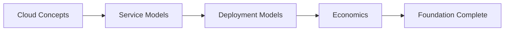
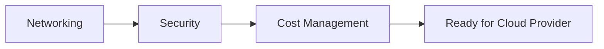
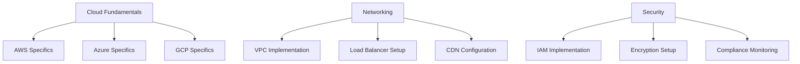

# 🏗️ Cloud Foundations

## Overview

This section covers the fundamental concepts and building blocks of cloud computing that form the foundation for all cloud infrastructure engineering. These materials provide essential knowledge that applies across all cloud providers and architectural patterns.

## 📚 **Foundation Modules**

### **1. Cloud Fundamentals**
**Location**: [`cloud-fundamentals/`](./cloud-fundamentals/)
**Duration**: Week 1 of learning path
**Objectives**: Understand core cloud concepts, service models, and deployment models

**Topics Covered**:
- Cloud computing definitions and characteristics
- Service models: IaaS, PaaS, SaaS, FaaS
- Deployment models: Public, Private, Hybrid, Multi-cloud
- Cloud economics and pricing models
- Shared responsibility model

### **2. Networking Essentials**
**Location**: [`networking/`](./networking/)
**Duration**: Week 2 of learning path
**Objectives**: Master cloud networking concepts and implementation

**Topics Covered**:
- TCP/IP fundamentals and OSI model
- Virtual Private Clouds (VPCs) and subnets
- Load balancing and traffic distribution
- DNS and content delivery networks
- VPN and dedicated connections
- Network security groups and firewalls

### **3. Security Foundations**
**Location**: [`security/`](./security/)
**Duration**: Week 3 of learning path
**Objectives**: Understand cloud security principles and controls

**Topics Covered**:
- Cloud security frameworks
- Identity and Access Management (IAM)
- Encryption at rest and in transit
- Certificate management
- Security monitoring and compliance
- Incident response procedures

### **4. Cost Management**
**Location**: [`cost-management/`](./cost-management/)
**Duration**: Week 4 of learning path
**Objectives**: Learn cost optimization strategies and financial operations

**Topics Covered**:
- Cloud pricing models and calculators
- Resource optimization techniques
- Reserved instances and committed use discounts
- Cost monitoring and alerting
- Chargeback and showback models
- FinOps best practices

## 🎯 **Learning Progression**

### **Phase 1: Conceptual Understanding**

### **Phase 2: Technical Implementation**

## 🛠️ **Practical Exercises**

### **Foundation Labs**
Each module includes hands-on exercises:

1. **Cloud Fundamentals Lab**
   - Compare cloud service offerings
   - Calculate TCO for cloud migration
   - Design deployment model selection

2. **Networking Lab**
   - Design VPC architecture
   - Configure load balancing
   - Implement DNS resolution

3. **Security Lab**
   - Set up IAM policies
   - Configure encryption
   - Implement monitoring

4. **Cost Management Lab**
   - Use cost calculators
   - Set up budget alerts
   - Analyze spending patterns

## 📋 **Prerequisites**

### **Technical Background**
- Basic understanding of IT infrastructure
- Familiarity with networking concepts
- Knowledge of operating systems (Linux/Windows)
- Understanding of virtualization

### **Tools Required**
- Web browser for cloud console access
- Command line interface (CLI) tools
- Text editor for configuration files
- Calculator for cost analysis

## 📊 **Assessment Criteria**

### **Knowledge Validation**
- [ ] Explain cloud service models and use cases
- [ ] Design basic cloud network architecture
- [ ] Implement security best practices
- [ ] Calculate and optimize cloud costs

### **Practical Skills**
- [ ] Configure virtual networks
- [ ] Set up security policies
- [ ] Monitor resource usage
- [ ] Optimize cost allocation

## 🎓 **Certification Alignment**

### **Foundation Knowledge Supports**
- **AWS**: Cloud Practitioner, Solutions Architect Associate
- **Azure**: Fundamentals (AZ-900), Administrator Associate (AZ-104)
- **GCP**: Cloud Digital Leader, Associate Cloud Engineer
- **Multi-Cloud**: CompTIA Cloud+, (ISC)² CCSP

## 📈 **Success Metrics**

### **Completion Criteria**
- All module content reviewed and understood
- Hands-on labs completed successfully
- Assessment scores of 80% or higher
- Practical skills demonstrated

### **Progression Indicators**
- Can explain cloud concepts to others
- Comfortable with basic cloud terminology
- Ready to tackle cloud provider specifics
- Confident in foundation skills

## 🔗 **Integration with Advanced Topics**

### **Foundation to Implementation**

## 💡 **Best Practices**

### **Learning Approach**
1. **Conceptual First**: Understand the "why" before the "how"
2. **Hands-On Practice**: Apply concepts immediately
3. **Cross-Provider**: Learn patterns that work everywhere
4. **Real-World Context**: Use practical scenarios
5. **Incremental Building**: Each concept builds on previous ones

### **Study Tips**
1. **Visual Learning**: Use diagrams and flowcharts
2. **Note Taking**: Document key concepts and examples
3. **Discussion**: Engage with community forums
4. **Teaching**: Explain concepts to others
5. **Practice**: Repeat labs until comfortable

## 🚀 **Getting Started**

### **Recommended Path**
1. **Start Here**: Review this overview
2. **Module 1**: [Cloud Fundamentals](./cloud-fundamentals/README.md)
3. **Module 2**: [Networking](./networking/README.md)
4. **Module 3**: [Security](./security/README.md)
5. **Module 4**: [Cost Management](./cost-management/README.md)
6. **Next Step**: Choose cloud provider track

### **Time Commitment**
- **Total Duration**: 4 weeks (part-time study)
- **Weekly Commitment**: 8-10 hours
- **Daily Study**: 1-2 hours
- **Lab Time**: 3-4 hours per week

## 📚 **Additional Resources**

### **Recommended Reading**
- Cloud architecture whitepapers
- Industry best practice guides
- Case studies and success stories
- Technology trend reports

### **Online Resources**
- Cloud provider documentation
- Industry forums and communities
- Video tutorials and courses
- Certification study guides

---

**Ready to build your cloud foundation?** 🏗️

Start with [Cloud Fundamentals](./cloud-fundamentals/README.md) and begin your journey to cloud infrastructure mastery!
