# ☁️ Cloud Computing Fundamentals

## Overview

This module provides a comprehensive introduction to cloud computing concepts, service models, and deployment strategies. It establishes the foundational knowledge necessary for understanding and implementing cloud infrastructure solutions.

## 🎯 **Learning Objectives**

By completing this module, you will:
- [ ] Understand the core characteristics of cloud computing
- [ ] Differentiate between various cloud service models
- [ ] Compare cloud deployment models and their use cases
- [ ] Analyze cloud economics and pricing strategies
- [ ] Apply the shared responsibility model
- [ ] Evaluate cloud providers and services

## 📚 **Module Content**

### **1. Introduction to Cloud Computing**

#### **Definition and Characteristics**
Cloud computing is the on-demand delivery of computing services over the internet with pay-as-you-go pricing.

**Essential Characteristics (NIST Definition)**:
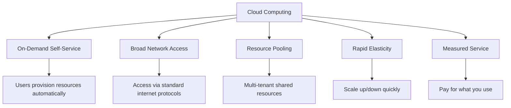

#### **Cloud Benefits**
- **Cost Reduction**: Lower capital and operational expenses
- **Scalability**: Elastic resource allocation
- **Reliability**: High availability and disaster recovery
- **Security**: Enterprise-grade security controls
- **Innovation**: Access to cutting-edge technologies
- **Global Reach**: Worldwide infrastructure presence

### **2. Cloud Service Models**

#### **Infrastructure as a Service (IaaS)**
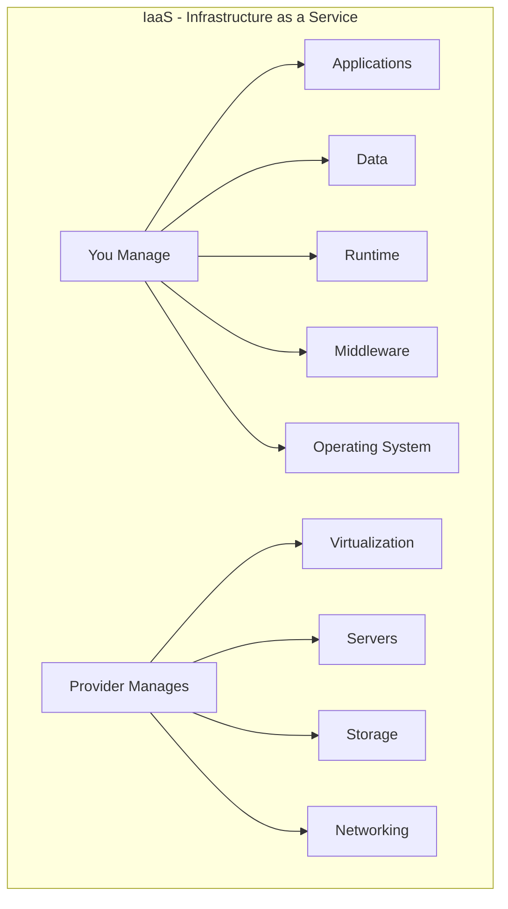

**Examples**: AWS EC2, Azure Virtual Machines, Google Compute Engine
**Use Cases**: 
- Migrating existing applications
- Development and testing environments
- High-performance computing
- Backup and disaster recovery

#### **Platform as a Service (PaaS)**
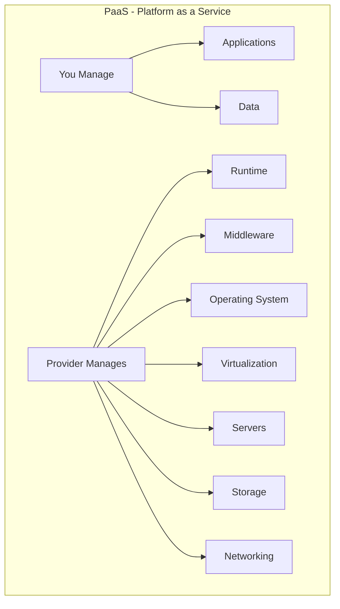

**Examples**: AWS Elastic Beanstalk, Azure App Service, Google App Engine
**Use Cases**:
- Web application development
- API development and hosting
- Database services
- Development frameworks

#### **Software as a Service (SaaS)**
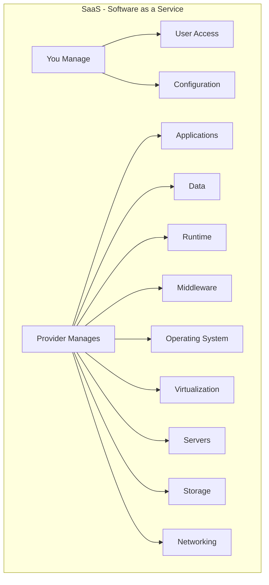

**Examples**: Office 365, Salesforce, Google Workspace
**Use Cases**:
- Business applications
- Collaboration tools
- Customer relationship management
- Enterprise resource planning

#### **Function as a Service (FaaS)**
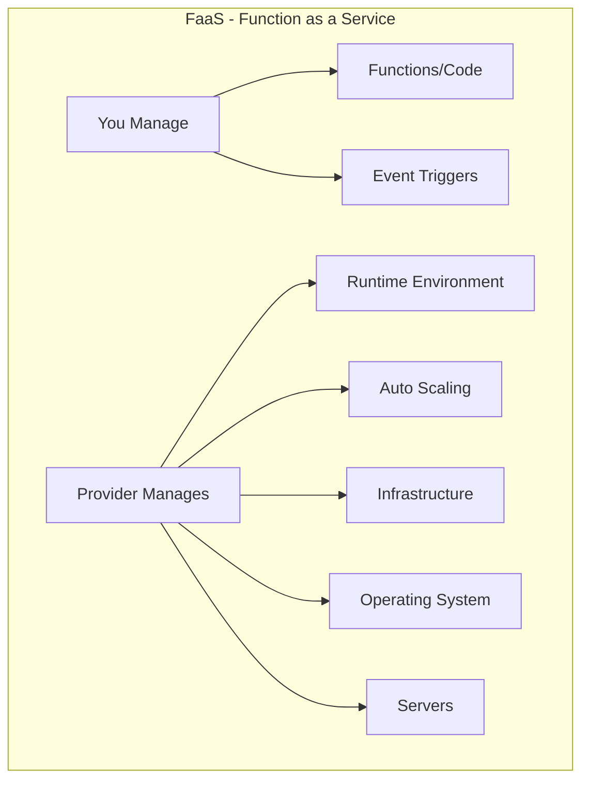

**Examples**: AWS Lambda, Azure Functions, Google Cloud Functions
**Use Cases**:
- Event-driven processing
- Microservices backends
- Real-time data processing
- Serverless APIs

### **3. Cloud Deployment Models**

#### **Public Cloud**
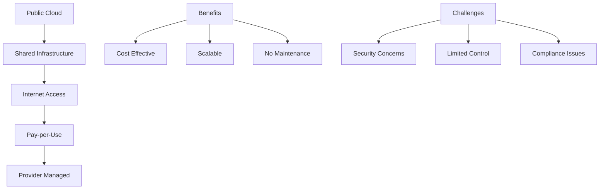

#### **Private Cloud**
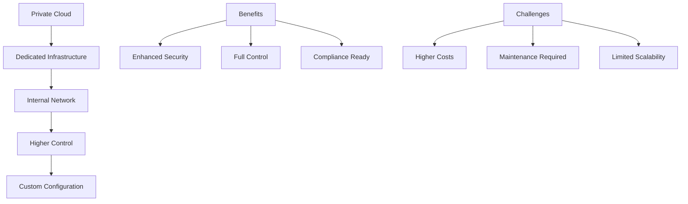

#### **Hybrid Cloud**
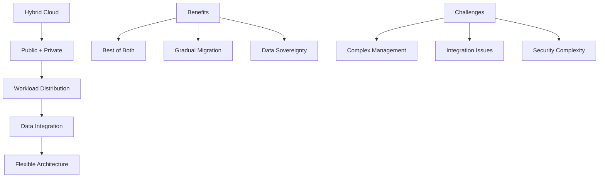

#### **Multi-Cloud**
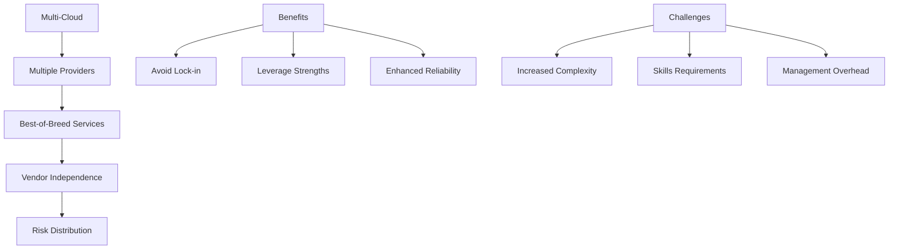

### **4. Cloud Economics**

#### **Pricing Models**
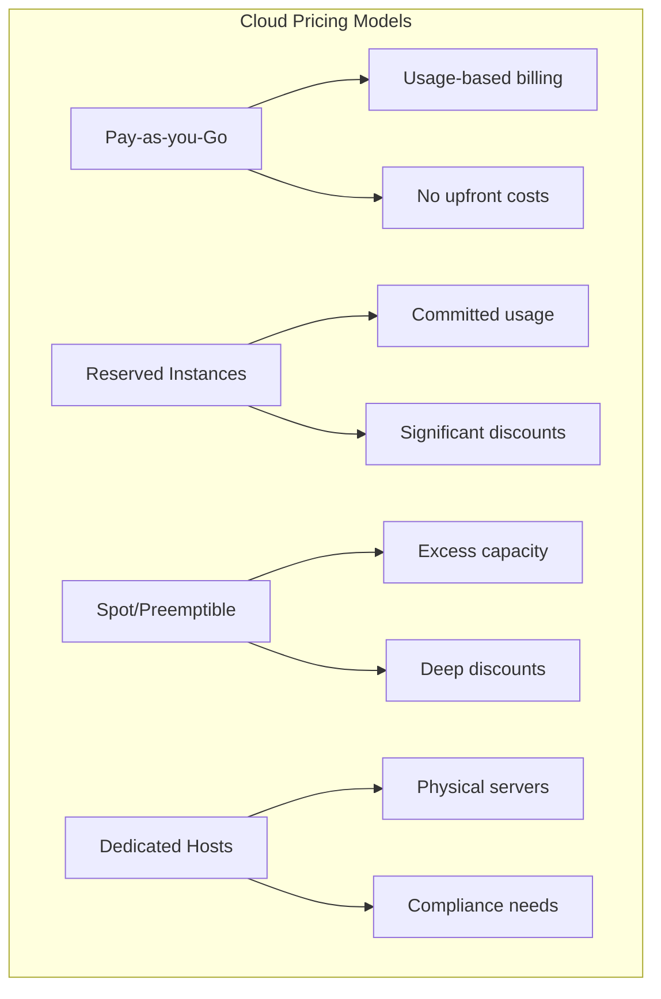

#### **Cost Optimization Strategies**
- **Right-sizing**: Match resources to actual needs
- **Auto-scaling**: Scale resources based on demand
- **Reserved capacity**: Commit to usage for discounts
- **Spot instances**: Use excess capacity at lower costs
- **Resource scheduling**: Turn off non-production resources
- **Storage optimization**: Use appropriate storage tiers

#### **Total Cost of Ownership (TCO)**
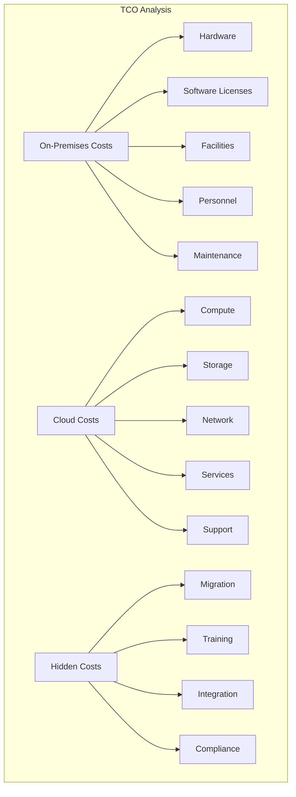

### **5. Shared Responsibility Model**

#### **Security Responsibilities**
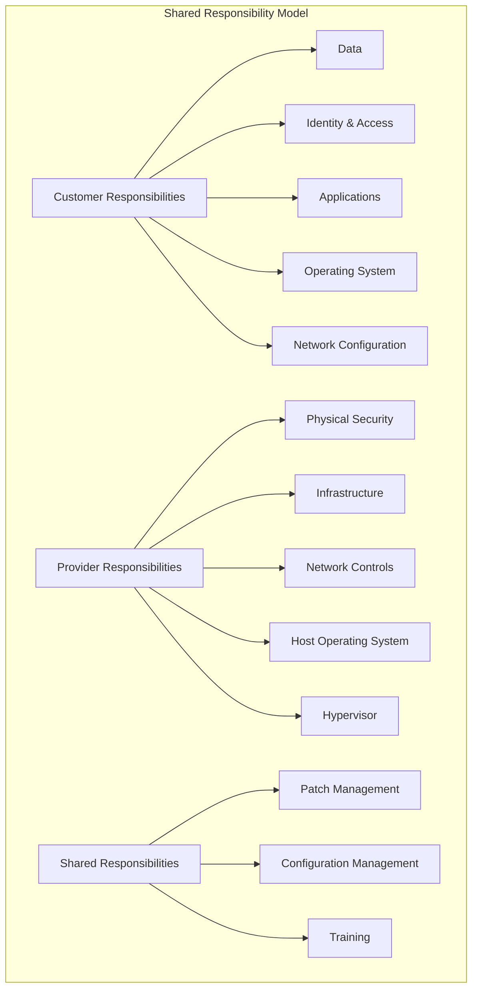

#### **Compliance and Governance**
- **Data Protection**: Encryption, backup, and recovery
- **Access Control**: Identity and access management
- **Audit and Monitoring**: Logging and compliance reporting
- **Incident Response**: Security incident procedures
- **Business Continuity**: Disaster recovery planning

## 🛠️ **Hands-On Exercises**

### **Exercise 1: Cloud Service Comparison**
**Objective**: Compare cloud services across providers
**Duration**: 2 hours

**Tasks**:
1. Research compute services (AWS EC2, Azure VM, GCP Compute)
2. Compare pricing for similar workloads
3. Identify unique features and capabilities
4. Create comparison matrix

**Deliverable**: Service comparison spreadsheet

### **Exercise 2: TCO Calculator**
**Objective**: Calculate total cost of ownership
**Duration**: 2 hours

**Tasks**:
1. Use AWS, Azure, and GCP pricing calculators
2. Model a 3-tier web application
3. Compare on-premises vs. cloud costs
4. Factor in hidden costs

**Deliverable**: TCO analysis report

### **Exercise 3: Deployment Model Selection**
**Objective**: Choose appropriate deployment model
**Duration**: 1 hour

**Scenarios**:
1. Healthcare application with HIPAA requirements
2. E-commerce platform with global reach
3. Legacy application modernization
4. Startup with limited budget

**Deliverable**: Deployment model recommendations

## 📋 **Assessment Questions**

### **Knowledge Check**
1. What are the five essential characteristics of cloud computing?
2. Explain the difference between IaaS, PaaS, and SaaS with examples.
3. When would you choose a hybrid cloud over public cloud?
4. How does the shared responsibility model vary by service type?
5. What factors influence cloud pricing?

### **Scenario Analysis**
1. A company wants to migrate their email system to the cloud. Which service model would you recommend and why?
2. Design a cloud strategy for a financial services company with strict compliance requirements.
3. How would you optimize costs for a seasonal e-commerce business?

## 📚 **Resources and References**

### **Official Documentation**
- [NIST Cloud Computing Definition](https://csrc.nist.gov/publications/detail/sp/800-145/final)
- [AWS Well-Architected Framework](https://aws.amazon.com/architecture/well-architected/)
- [Azure Architecture Center](https://docs.microsoft.com/en-us/azure/architecture/)
- [Google Cloud Architecture Framework](https://cloud.google.com/architecture/framework)

### **Industry Reports**
- Gartner Magic Quadrant for Cloud Infrastructure
- Forrester Wave: Public Cloud Platforms
- IDC MarketScape: Cloud Infrastructure Services

### **Books and Publications**
- "Cloud Computing: Concepts, Technology & Architecture" by Thomas Erl
- "Architecting the Cloud" by Michael J. Kavis
- "The DevOps Handbook" by Gene Kim

## 🚀 **Next Steps**

### **Immediate Actions**
1. Complete all hands-on exercises
2. Take the module assessment
3. Review and understand key concepts
4. Set up cloud provider accounts for hands-on learning

### **Preparation for Next Module**
1. Familiarize yourself with networking terminology
2. Review OSI model and TCP/IP basics
3. Understand virtual networking concepts
4. Prepare for [Networking Fundamentals](../networking/README.md)

### **Additional Learning**
1. Explore cloud provider free tiers
2. Watch cloud architecture webinars
3. Join cloud community forums
4. Start following cloud thought leaders

---

**Congratulations!** 🎉 You've completed the Cloud Fundamentals module. You now have a solid foundation in cloud computing concepts and are ready to dive deeper into specific technologies and implementations.

**Next Module**: [Networking Fundamentals](../networking/README.md)
