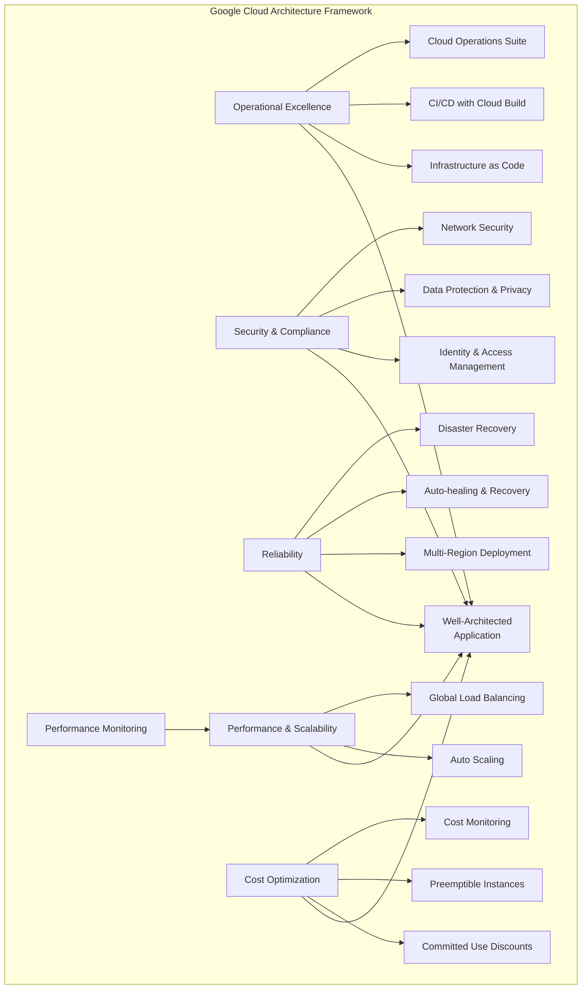
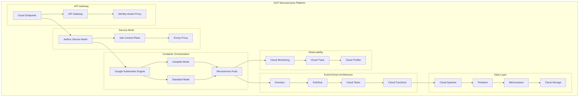
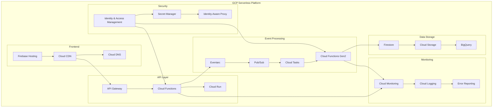
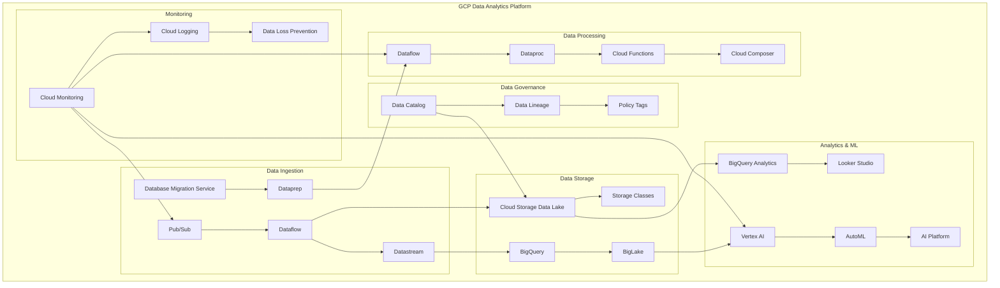
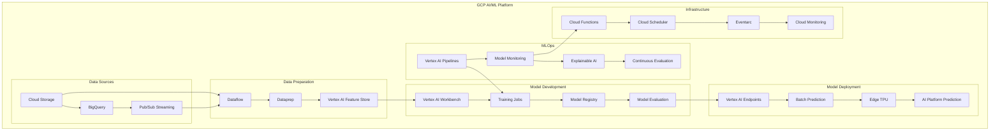
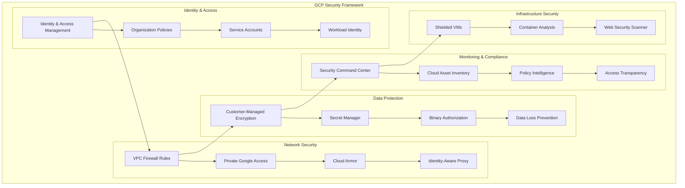
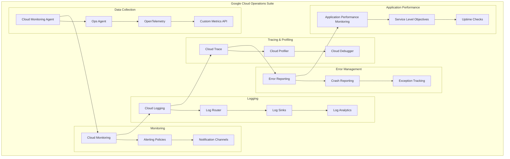

# 🌐 Google Cloud Platform (GCP) Infrastructure Guide

## Overview

This comprehensive guide covers Google Cloud Platform infrastructure patterns, services, and implementations for modern cloud-native applications. It includes detailed architecture diagrams, Deployment Manager templates, Terraform configurations, and hands-on labs.

## 📋 GCP Architecture Patterns

### 1. **Google Cloud Architecture Framework**



### 2. **GCP Multi-Tier Application Architecture**

```mermaid
graph TB
    subgraph "GCP Multi-Tier Architecture"
        subgraph "Global Edge"
            A[Cloud CDN] --> B[Global HTTP(S) Load Balancer]
            B --> C[Cloud Armor]
        end
        
        subgraph "Application Layer"
            D[Managed Instance Groups] --> E[App Engine]
            E --> F[GKE Clusters]
            F --> G[Cloud Functions]
        end
        
        subgraph "Data Layer"
            H[Cloud SQL] --> I[Firestore]
            I --> J[Memorystore Redis]
            J --> K[Cloud Storage]
        end
        
        subgraph "Networking"
            L[VPC Network] --> M[Public Subnets]
            L --> N[Private Subnets]
            L --> O[Database Subnets]
        end
        
        C --> D
        G --> H
        M --> D
        N --> F
        O --> H
        
        subgraph "Security & Monitoring"
            P[Cloud IAM] --> Q[Cloud Monitoring]
            Q --> R[Cloud Logging]
            R --> S[Security Command Center]
        end
        
        P --> E
        P --> F
        P --> G
    end
```

### 3. **GCP Microservices Architecture**



### 4. **GCP Serverless Architecture**



### 5. **GCP Data Analytics Architecture**



### 6. **GCP AI/ML Pipeline**



## 🏗️ **GCP Service Categories**

### **Compute Services**
- **Compute Engine**: Virtual machines with custom configurations
- **App Engine**: Platform-as-a-Service for applications
- **GKE**: Managed Kubernetes with Autopilot and Standard modes
- **Cloud Run**: Fully managed serverless containers
- **Cloud Functions**: Event-driven serverless functions
- **Batch**: Large-scale batch job processing

### **Storage Services**
- **Cloud Storage**: Object storage with multiple storage classes
- **Persistent Disk**: High-performance block storage
- **Filestore**: Managed NFS file storage
- **Local SSD**: High-performance local storage
- **Cloud Storage for Firebase**: Mobile and web app storage

### **Database Services**
- **Cloud SQL**: Managed relational databases (MySQL, PostgreSQL, SQL Server)
- **Cloud Spanner**: Globally distributed relational database
- **Firestore**: NoSQL document database
- **Cloud Bigtable**: Wide-column NoSQL database
- **Memorystore**: Managed Redis and Memcached
- **Firebase Realtime Database**: Real-time NoSQL database

### **Networking Services**
- **VPC**: Virtual private cloud with global reach
- **Cloud Load Balancing**: Global and regional load balancing
- **Cloud CDN**: Content delivery network
- **Cloud DNS**: Scalable DNS service
- **Cloud VPN**: Site-to-site VPN connectivity
- **Cloud Interconnect**: Dedicated network connections

### **Security Services**
- **Identity and Access Management (IAM)**: Fine-grained access control
- **Cloud Security Command Center**: Security management platform
- **Cloud Armor**: DDoS protection and WAF
- **Binary Authorization**: Container image security
- **Secret Manager**: Secure secret storage
- **Cloud HSM**: Hardware security modules

### **Analytics Services**
- **BigQuery**: Serverless data warehouse
- **Dataflow**: Stream and batch data processing
- **Dataproc**: Managed Hadoop and Spark
- **Pub/Sub**: Real-time messaging service
- **Looker Studio**: Business intelligence platform
- **Data Catalog**: Metadata management service

### **AI/ML Services**
- **Vertex AI**: Unified ML platform
- **AutoML**: Automated machine learning
- **AI Platform**: Custom ML model training and serving
- **Vision AI**: Image analysis and recognition
- **Natural Language AI**: Text analysis and understanding
- **Translation AI**: Language translation service

## 🔧 **Implementation Examples**

### **VPC Network with Shared VPC Setup**
```yaml
# vpc-network.yaml
resources:
- name: host-project-vpc
  type: compute.v1.network
  properties:
    autoCreateSubnetworks: false
    routingConfig:
      routingMode: REGIONAL

- name: public-subnet
  type: compute.v1.subnetwork
  properties:
    network: $(ref.host-project-vpc.selfLink)
    ipCidrRange: 10.0.1.0/24
    region: us-central1
    enableFlowLogs: true

- name: private-subnet
  type: compute.v1.subnetwork
  properties:
    network: $(ref.host-project-vpc.selfLink)
    ipCidrRange: 10.0.2.0/24
    region: us-central1
    enableFlowLogs: true
    privateIpGoogleAccess: true
```

### **GKE Cluster with Terraform**
```hcl
resource "google_container_cluster" "primary" {
  name     = "production-gke-cluster"
  location = "us-central1"

  # Enable Autopilot mode
  enable_autopilot = true

  # Network configuration
  network    = google_compute_network.vpc.name
  subnetwork = google_compute_subnetwork.subnet.name

  # IP allocation policy
  ip_allocation_policy {
    cluster_secondary_range_name  = "pod-ranges"
    services_secondary_range_name = "service-ranges"
  }

  # Security configuration
  master_auth {
    client_certificate_config {
      issue_client_certificate = false
    }
  }

  # Enable Workload Identity
  workload_identity_config {
    workload_pool = "${var.project_id}.svc.id.goog"
  }

  # Logging and monitoring
  logging_config {
    enable_components = [
      "SYSTEM_COMPONENTS",
      "WORKLOADS",
      "API_SERVER"
    ]
  }

  monitoring_config {
    enable_components = [
      "SYSTEM_COMPONENTS",
      "WORKLOADS"
    ]
  }

  # Add-ons
  addons_config {
    horizontal_pod_autoscaling {
      disabled = false
    }
    http_load_balancing {
      disabled = false
    }
    network_policy_config {
      disabled = false
    }
    gce_persistent_disk_csi_driver_config {
      enabled = true
    }
  }
}
```

## 📊 **GCP Cost Optimization**

### **Cost Management Strategies**

```mermaid
graph TB
    subgraph "GCP Cost Optimization"
        subgraph "Compute Optimization"
            A[Right Sizing] --> B[Committed Use Discounts]
            B --> C[Preemptible/Spot VMs]
        end
        
        subgraph "Storage Optimization"
            D[Storage Classes] --> E[Lifecycle Policies]
            E --> F[Data Transfer Optimization]
        end
        
        subgraph "BigQuery Optimization"
            G[Query Optimization] --> H[Partitioning & Clustering]
            H --> I[Slot Reservations]
        end
        
        subgraph "Monitoring & Governance"
            J[Cloud Billing] --> K[Budget Alerts]
            K --> L[Recommender API]
        end
        
        subgraph "Automation"
            M[Cloud Scheduler] --> N[Resource Policies]
            N --> O[Cost Anomaly Detection]
        end
        
        C --> D
        F --> G
        I --> J
        L --> M
    end
```



## 🔒 **GCP Security Framework**

### **Defense in Depth Security Model**



## 📈 **GCP Observability Stack**

### **Cloud Operations Suite**



## 🎯 **Learning Path & Certification**

### **Google Cloud Certification Tracks**
- **Cloud Digital Leader**: Business-focused cloud knowledge
- **Associate Cloud Engineer**: Fundamental technical skills
- **Professional Cloud Architect**: Advanced architecture design
- **Professional Data Engineer**: Data processing and ML
- **Professional Cloud DevOps Engineer**: DevOps practices
- **Professional Cloud Security Engineer**: Security implementation

### **Hands-on Labs Structure**
1. **Foundation Labs**: Projects, IAM, Compute Engine, Cloud Storage
2. **Networking Labs**: VPC, Load Balancers, Cloud CDN
3. **Container Labs**: GKE, Cloud Run, Artifact Registry
4. **Serverless Labs**: Cloud Functions, App Engine, Firebase
5. **Data Labs**: BigQuery, Dataflow, Pub/Sub, Bigtable
6. **AI/ML Labs**: Vertex AI, AutoML, Vision API, Natural Language AI
7. **Security Labs**: IAM, Security Command Center, Binary Authorization
8. **DevOps Labs**: Cloud Build, Cloud Deploy, Infrastructure as Code

## 🛠️ **Infrastructure as Code Examples**

### **Deployment Manager Template**
```yaml
# gke-cluster.yaml
imports:
  - path: cluster.py

resources:
  - name: production-cluster
    type: cluster.py
    properties:
      zone: us-central1-a
      cluster:
        name: production-gke
        initialNodeCount: 3
        nodeConfig:
          machineType: e2-standard-4
          diskSizeGb: 100
          oauthScopes:
            - https://www.googleapis.com/auth/cloud-platform
```

### **Terraform Configuration**
```hcl
# main.tf
terraform {
  required_providers {
    google = {
      source  = "hashicorp/google"
      version = "~> 4.0"
    }
  }
}

provider "google" {
  project = var.project_id
  region  = var.region
}

# VPC Network
resource "google_compute_network" "vpc_network" {
  name                    = "production-vpc"
  auto_create_subnetworks = false
}

# Subnet
resource "google_compute_subnetwork" "subnet" {
  name          = "production-subnet"
  ip_cidr_range = "10.0.1.0/24"
  region        = var.region
  network       = google_compute_network.vpc_network.id

  secondary_ip_range {
    range_name    = "pod-ranges"
    ip_cidr_range = "10.1.0.0/16"
  }

  secondary_ip_range {
    range_name    = "service-ranges"
    ip_cidr_range = "10.2.0.0/16"
  }
}

# Cloud SQL Instance
resource "google_sql_database_instance" "postgres" {
  name             = "production-postgres"
  database_version = "POSTGRES_14"
  region           = var.region

  settings {
    tier = "db-f1-micro"
    
    backup_configuration {
      enabled                        = true
      start_time                     = "02:00"
      point_in_time_recovery_enabled = true
    }

    ip_configuration {
      ipv4_enabled    = false
      private_network = google_compute_network.vpc_network.id
    }
  }

  deletion_protection = true
}
```

## 🚀 **Getting Started with GCP**

### **Initial Setup Steps**
1. **Create GCP Account**: Sign up for Google Cloud Platform
2. **Set up Billing**: Configure billing account and budget alerts
3. **Install gcloud CLI**: Download and configure gcloud command-line tool
4. **Enable APIs**: Enable required Google Cloud APIs
5. **Set up IAM**: Configure users, roles, and service accounts
6. **Create Projects**: Organize resources using GCP projects

### **Essential Commands**
```bash
# Initialize gcloud
gcloud init

# Set default project
gcloud config set project PROJECT_ID

# List available zones
gcloud compute zones list

# Create a VM instance
gcloud compute instances create my-instance \
    --zone=us-central1-a \
    --machine-type=e2-medium

# Create a GKE cluster
gcloud container clusters create my-cluster \
    --zone=us-central1-a \
    --num-nodes=3

# Deploy to Cloud Run
gcloud run deploy my-service \
    --image=gcr.io/PROJECT_ID/my-image \
    --platform=managed
```

## 🚀 **Next Steps**

1. **Explore Architecture Patterns**: Study the detailed diagrams above
2. **Complete Hands-on Labs**: Navigate to `labs/` folder
3. **Review Service Documentation**: Check `services/` folder
4. **Practice Infrastructure as Code**: Use `infrastructure/` templates
5. **Set up Monitoring**: Implement observability with `monitoring/` examples

---

**Ready to master Google Cloud Platform?** Start with the foundational concepts and build your way up to advanced cloud architectures! 🎯
