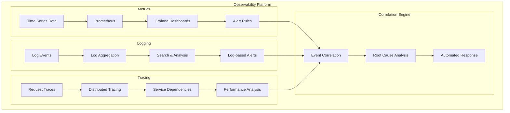
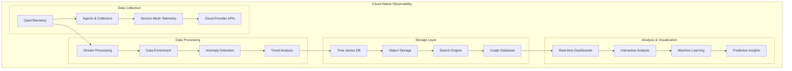
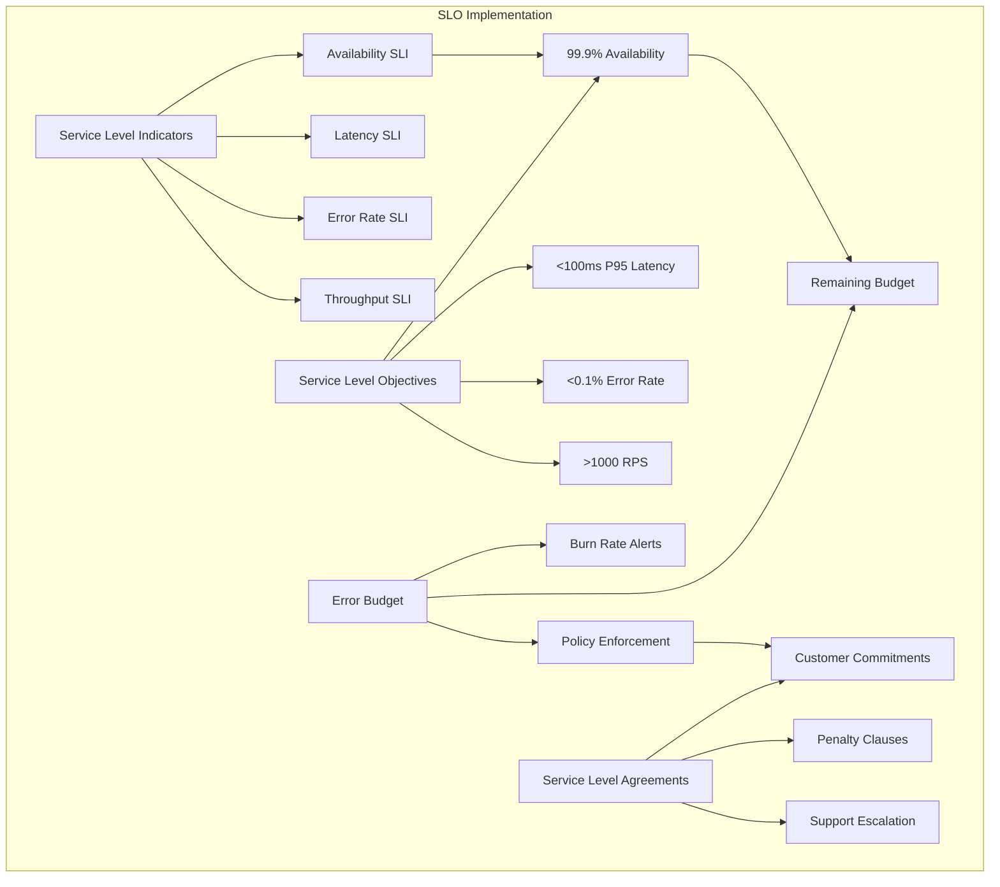
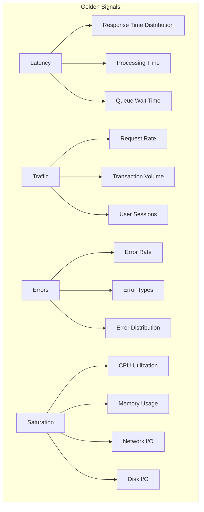
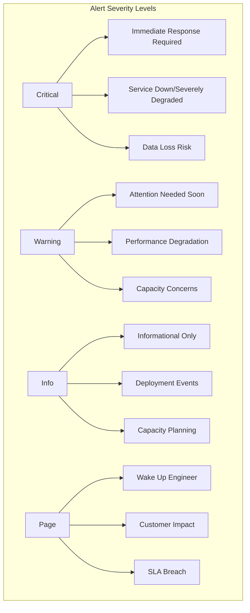

# 📊 Monitoring & Observability

## Overview

This section provides comprehensive monitoring and observability solutions for cloud-native infrastructure. Learn to implement the three pillars of observability (metrics, logging, tracing), create effective dashboards, and build proactive alerting systems that ensure reliable, performant cloud operations.

## 📈 **Monitoring Modules**

### **1. Prometheus Metrics**
**Location**: [`prometheus/`](./prometheus/)
**Focus**: Metrics collection, storage, and alerting
**Technologies**: Prometheus, AlertManager, Exporters

**Topics Covered**:
- Prometheus architecture and components
- Metric types and data modeling
- Service discovery and target configuration
- Recording rules and alerting rules
- High availability and federation
- Integration with cloud provider metrics

### **2. Grafana Dashboards**
**Location**: [`grafana/`](./grafana/)
**Focus**: Visualization and dashboard creation
**Technologies**: Grafana, Grafana Cloud, Data sources

**Topics Covered**:
- Dashboard design principles
- Panel types and visualization options
- Template variables and dynamic dashboards
- Alerting and notification channels
- Dashboard as code and version control
- User management and permissions

### **3. Centralized Logging**
**Location**: [`logging/`](./logging/)
**Focus**: Log aggregation, processing, and analysis
**Technologies**: ELK Stack, Fluentd, Loki, Cloud logging

**Topics Covered**:
- Log aggregation architecture patterns
- Structured logging and log formatting
- Log parsing and enrichment
- Log retention and storage optimization
- Security and compliance in logging
- Log-based metrics and alerting

### **4. Alerting Systems**
**Location**: [`alerting/`](./alerting/)
**Focus**: Proactive incident detection and notification
**Technologies**: AlertManager, PagerDuty, Slack, Cloud alerting

**Topics Covered**:
- Alert design and escalation policies
- Alert routing and notification channels
- Alert fatigue prevention strategies
- Service Level Objectives (SLOs) and SLIs
- Incident response integration
- Alert testing and validation

## 🏗️ **Observability Architecture**

### **Three Pillars of Observability**


### **Modern Observability Stack**


### **Service Level Objectives (SLO) Framework**


## 🔧 **Implementation Examples**

### **Prometheus Configuration**
```yaml
# prometheus.yml
global:
  scrape_interval: 15s
  evaluation_interval: 15s
  external_labels:
    cluster: 'production'
    region: 'us-west-2'

rule_files:
  - "alert_rules/*.yml"
  - "recording_rules/*.yml"

alerting:
  alertmanagers:
    - static_configs:
        - targets:
          - alertmanager:9093

scrape_configs:
  # Kubernetes API server
  - job_name: 'kubernetes-apiservers'
    kubernetes_sd_configs:
      - role: endpoints
        namespaces:
          names:
            - default
    scheme: https
    tls_config:
      ca_file: /var/run/secrets/kubernetes.io/serviceaccount/ca.crt
    bearer_token_file: /var/run/secrets/kubernetes.io/serviceaccount/token
    relabel_configs:
      - source_labels: [__meta_kubernetes_namespace, __meta_kubernetes_service_name, __meta_kubernetes_endpoint_port_name]
        action: keep
        regex: default;kubernetes;https

  # Node exporter
  - job_name: 'kubernetes-nodes'
    kubernetes_sd_configs:
      - role: node
    relabel_configs:
      - action: labelmap
        regex: __meta_kubernetes_node_label_(.+)
      - target_label: __address__
        replacement: kubernetes.default.svc:443
      - source_labels: [__meta_kubernetes_node_name]
        regex: (.+)
        target_label: __metrics_path__
        replacement: /api/v1/nodes/${1}/proxy/metrics

  # Application metrics
  - job_name: 'application-metrics'
    kubernetes_sd_configs:
      - role: pod
    relabel_configs:
      - source_labels: [__meta_kubernetes_pod_annotation_prometheus_io_scrape]
        action: keep
        regex: true
      - source_labels: [__meta_kubernetes_pod_annotation_prometheus_io_path]
        action: replace
        target_label: __metrics_path__
        regex: (.+)
      - source_labels: [__address__, __meta_kubernetes_pod_annotation_prometheus_io_port]
        action: replace
        regex: ([^:]+)(?::\d+)?;(\d+)
        replacement: $1:$2
        target_label: __address__
```

### **Grafana Dashboard as Code**
```json
{
  "dashboard": {
    "id": null,
    "title": "Kubernetes Cluster Overview",
    "tags": ["kubernetes", "infrastructure"],
    "style": "dark",
    "timezone": "browser",
    "panels": [
      {
        "id": 1,
        "title": "CPU Usage",
        "type": "graph",
        "targets": [
          {
            "expr": "100 - (avg by(instance) (rate(node_cpu_seconds_total{mode=\"idle\"}[5m])) * 100)",
            "legendFormat": "{{instance}}"
          }
        ],
        "yAxes": [
          {
            "label": "Percent",
            "min": 0,
            "max": 100
          }
        ],
        "alert": {
          "conditions": [
            {
              "query": {
                "queryType": "",
                "refId": "A"
              },
              "reducer": {
                "type": "last",
                "params": []
              },
              "evaluator": {
                "params": [80],
                "type": "gt"
              }
            }
          ],
          "executionErrorState": "alerting",
          "for": "5m",
          "frequency": "10s",
          "handler": 1,
          "name": "High CPU Usage",
          "noDataState": "no_data",
          "notifications": []
        },
        "gridPos": {
          "h": 8,
          "w": 12,
          "x": 0,
          "y": 0
        }
      },
      {
        "id": 2,
        "title": "Memory Usage",
        "type": "graph",
        "targets": [
          {
            "expr": "(1 - (node_memory_MemAvailable_bytes / node_memory_MemTotal_bytes)) * 100",
            "legendFormat": "{{instance}}"
          }
        ],
        "gridPos": {
          "h": 8,
          "w": 12,
          "x": 12,
          "y": 0
        }
      }
    ],
    "templating": {
      "list": [
        {
          "name": "cluster",
          "type": "query",
          "query": "label_values(up, cluster)",
          "refresh": 1,
          "includeAll": false,
          "multi": false
        }
      ]
    },
    "time": {
      "from": "now-1h",
      "to": "now"
    },
    "refresh": "30s"
  }
}
```

### **Alert Rules Configuration**
```yaml
# alert_rules/infrastructure.yml
groups:
  - name: infrastructure.rules
    rules:
      - alert: HighCPUUsage
        expr: 100 - (avg by(instance) (rate(node_cpu_seconds_total{mode="idle"}[5m])) * 100) > 80
        for: 5m
        labels:
          severity: warning
          component: infrastructure
        annotations:
          summary: "High CPU usage detected"
          description: "CPU usage is above 80% on {{ $labels.instance }} for more than 5 minutes"
          runbook_url: "https://wiki.company.com/runbooks/high-cpu"

      - alert: HighMemoryUsage
        expr: (1 - (node_memory_MemAvailable_bytes / node_memory_MemTotal_bytes)) * 100 > 90
        for: 2m
        labels:
          severity: critical
          component: infrastructure
        annotations:
          summary: "High memory usage detected"
          description: "Memory usage is above 90% on {{ $labels.instance }}"

      - alert: DiskSpaceLow
        expr: (node_filesystem_avail_bytes{mountpoint="/"} / node_filesystem_size_bytes{mountpoint="/"}) * 100 < 10
        for: 1m
        labels:
          severity: critical
          component: infrastructure
        annotations:
          summary: "Low disk space"
          description: "Disk space is below 10% on {{ $labels.instance }}"

      - alert: PodCrashLooping
        expr: rate(kube_pod_container_status_restarts_total[15m]) > 0
        for: 5m
        labels:
          severity: warning
          component: kubernetes
        annotations:
          summary: "Pod is crash looping"
          description: "Pod {{ $labels.namespace }}/{{ $labels.pod }} is crash looping"

  - name: application.rules
    rules:
      - alert: HighErrorRate
        expr: |
          (
            sum(rate(http_requests_total{status=~"5.."}[5m])) by (service) /
            sum(rate(http_requests_total[5m])) by (service)
          ) * 100 > 5
        for: 2m
        labels:
          severity: critical
          component: application
        annotations:
          summary: "High error rate detected"
          description: "Error rate is {{ $value }}% for service {{ $labels.service }}"

      - alert: HighLatency
        expr: histogram_quantile(0.95, rate(http_request_duration_seconds_bucket[5m])) > 0.5
        for: 5m
        labels:
          severity: warning
          component: application
        annotations:
          summary: "High latency detected"
          description: "95th percentile latency is {{ $value }}s for service {{ $labels.service }}"
```

### **Fluentd Log Collection**
```yaml
# fluentd-configmap.yaml
apiVersion: v1
kind: ConfigMap
metadata:
  name: fluentd-config
data:
  fluent.conf: |
    # Input plugins
    <source>
      @type tail
      path /var/log/containers/*.log
      pos_file /var/log/containers.log.pos
      tag kubernetes.*
      format json
      read_from_head true
    </source>

    # Filter plugins
    <filter kubernetes.**>
      @type kubernetes_metadata
      @id filter_kube_metadata
      kubernetes_url "#{ENV['FLUENT_FILTER_KUBERNETES_URL'] || 'https://' + ENV['KUBERNETES_SERVICE_HOST'] + ':' + ENV['KUBERNETES_SERVICE_PORT'] + '/api'}"
      verify_ssl "#{ENV['KUBERNETES_VERIFY_SSL'] || true}"
      preserve_json_log true
      merge_json_log true
      flatten_hashes true
      flatten_hashes_separator _
    </filter>

    <filter kubernetes.**>
      @type parser
      key_name message
      reserve_data true
      remove_key_name_field true
      replace_invalid_sequence true
      emit_invalid_record_to_error false
      <parse>
        @type multi_format
        <pattern>
          format json
        </pattern>
        <pattern>
          format none
        </pattern>
      </parse>
    </filter>

    # Add custom fields
    <filter kubernetes.**>
      @type record_transformer
      <record>
        cluster_name "#{ENV['CLUSTER_NAME']}"
        environment "#{ENV['ENVIRONMENT']}"
        timestamp ${time}
      </record>
    </filter>

    # Output plugins
    <match kubernetes.**>
      @type elasticsearch
      host "#{ENV['FLUENT_ELASTICSEARCH_HOST']}"
      port "#{ENV['FLUENT_ELASTICSEARCH_PORT']}"
      scheme "#{ENV['FLUENT_ELASTICSEARCH_SCHEME'] || 'http'}"
      ssl_verify "#{ENV['FLUENT_ELASTICSEARCH_SSL_VERIFY'] || 'true'}"
      user "#{ENV['FLUENT_ELASTICSEARCH_USER']}"
      password "#{ENV['FLUENT_ELASTICSEARCH_PASSWORD']}"
      
      index_name kubernetes-logs
      type_name _doc
      
      <buffer>
        @type file
        path /var/log/fluentd-buffers/kubernetes.system.buffer
        flush_mode interval
        retry_type exponential_backoff
        flush_thread_count 2
        flush_interval 5s
        retry_forever
        retry_max_interval 30
        chunk_limit_size 2M
        queue_limit_length 8
        overflow_action block
      </buffer>
    </match>
```

## 📊 **Observability Patterns**

### **Golden Signals Monitoring**


### **RED Method (Requests, Errors, Duration)**
```yaml
# RED method recording rules
groups:
  - name: red_method
    interval: 30s
    rules:
      # Request rate
      - record: http_request_rate
        expr: sum(rate(http_requests_total[5m])) by (service, method)

      # Error rate
      - record: http_error_rate
        expr: |
          sum(rate(http_requests_total{status=~"[45].."}[5m])) by (service, method) /
          sum(rate(http_requests_total[5m])) by (service, method)

      # Duration (latency)
      - record: http_request_duration_p50
        expr: histogram_quantile(0.50, sum(rate(http_request_duration_seconds_bucket[5m])) by (service, method, le))

      - record: http_request_duration_p95
        expr: histogram_quantile(0.95, sum(rate(http_request_duration_seconds_bucket[5m])) by (service, method, le))

      - record: http_request_duration_p99
        expr: histogram_quantile(0.99, sum(rate(http_request_duration_seconds_bucket[5m])) by (service, method, le))
```

### **USE Method (Utilization, Saturation, Errors)**
```yaml
# USE method for infrastructure monitoring
groups:
  - name: use_method
    rules:
      # CPU Utilization
      - record: node_cpu_utilization
        expr: 100 - (avg by(instance) (rate(node_cpu_seconds_total{mode="idle"}[5m])) * 100)

      # Memory Utilization
      - record: node_memory_utilization
        expr: (1 - (node_memory_MemAvailable_bytes / node_memory_MemTotal_bytes)) * 100

      # Disk Utilization
      - record: node_disk_utilization
        expr: (1 - (node_filesystem_avail_bytes / node_filesystem_size_bytes)) * 100

      # Network Utilization
      - record: node_network_utilization_rx
        expr: rate(node_network_receive_bytes_total[5m]) * 8

      - record: node_network_utilization_tx
        expr: rate(node_network_transmit_bytes_total[5m]) * 8

      # CPU Saturation (load average)
      - record: node_cpu_saturation
        expr: node_load1 / count by(instance) (node_cpu_seconds_total{mode="idle"})

      # Memory Saturation (swap usage)
      - record: node_memory_saturation
        expr: (node_memory_SwapTotal_bytes - node_memory_SwapFree_bytes) / node_memory_SwapTotal_bytes * 100

      # Disk Saturation (I/O wait)
      - record: node_disk_saturation
        expr: rate(node_cpu_seconds_total{mode="iowait"}[5m]) * 100
```

## 🚨 **Alerting Best Practices**

### **Alert Hierarchy**


### **Alert Routing Configuration**
```yaml
# alertmanager.yml
global:
  smtp_smarthost: 'localhost:587'
  smtp_from: 'alerts@company.com'
  slack_api_url: 'https://hooks.slack.com/services/YOUR/SLACK/WEBHOOK'

route:
  group_by: ['alertname', 'cluster', 'service']
  group_wait: 10s
  group_interval: 10s
  repeat_interval: 1h
  receiver: 'web.hook'
  routes:
    - match:
        severity: critical
      receiver: 'critical-alerts'
      group_wait: 0s
      repeat_interval: 5m
    
    - match:
        severity: warning
      receiver: 'warning-alerts'
      repeat_interval: 30m
    
    - match_re:
        service: ^(database|payment).*
      receiver: 'database-team'
      
    - match:
        component: infrastructure
      receiver: 'infrastructure-team'

receivers:
  - name: 'web.hook'
    webhook_configs:
      - url: 'http://webhook-service:5000/alerts'
        send_resolved: true

  - name: 'critical-alerts'
    slack_configs:
      - channel: '#critical-alerts'
        title: 'Critical Alert: {{ .GroupLabels.alertname }}'
        text: '{{ range .Alerts }}{{ .Annotations.description }}{{ end }}'
        send_resolved: true
    pagerduty_configs:
      - routing_key: 'YOUR_PAGERDUTY_ROUTING_KEY'
        description: '{{ .GroupLabels.alertname }}'
        
  - name: 'warning-alerts'
    slack_configs:
      - channel: '#monitoring'
        title: 'Warning: {{ .GroupLabels.alertname }}'
        text: '{{ range .Alerts }}{{ .Annotations.description }}{{ end }}'

  - name: 'database-team'
    email_configs:
      - to: 'database-team@company.com'
        subject: 'Database Alert: {{ .GroupLabels.alertname }}'
        body: |
          {{ range .Alerts }}
          Alert: {{ .Annotations.summary }}
          Description: {{ .Annotations.description }}
          {{ end }}

inhibit_rules:
  - source_match:
      severity: 'critical'
    target_match:
      severity: 'warning'
    equal: ['alertname', 'instance']
```

## 📈 **Monitoring Tools Comparison**

### **Metrics Platforms**
```
Feature              Prometheus    DataDog    New Relic    Grafana Cloud
=======================================================================
Cost Model           Free          Per Host   Per Host     Per Series
Multi-Cloud          Excellent     Excellent  Excellent    Excellent
Kubernetes Support   Native        Good       Good         Native
Custom Metrics       Excellent     Good       Good         Excellent
Alerting             Built-in      Built-in   Built-in     Built-in
Data Retention       Configurable  Fixed      Fixed        Configurable
Learning Curve       Moderate      Easy       Easy         Moderate
```

### **Logging Solutions**
```
Feature              ELK Stack     Fluentd    Loki         Cloud Logging
=====================================================================
Cost                 Self-hosted   Free       Free         Usage-based
Scalability         Excellent     Good       Good         Excellent
Query Language      Lucene        Ruby       LogQL        SQL-like
Kubernetes Support  Good          Excellent  Excellent    Native
Resource Usage      High          Medium     Low          N/A
Storage Cost        Medium        N/A        Low          High
```

## 🎯 **Implementation Roadmap**

### **Phase 1: Foundation (Week 1-2)**
- [ ] Deploy Prometheus and basic metrics collection
- [ ] Set up Grafana with essential dashboards
- [ ] Configure basic alerting rules
- [ ] Implement health checks and uptime monitoring

### **Phase 2: Enhanced Monitoring (Week 3-4)**
- [ ] Add comprehensive application metrics
- [ ] Implement centralized logging
- [ ] Create custom dashboards for business metrics
- [ ] Set up alert routing and escalation

### **Phase 3: Advanced Observability (Week 5-6)**
- [ ] Implement distributed tracing
- [ ] Add SLO/SLI monitoring
- [ ] Create predictive alerting
- [ ] Integrate with incident management

### **Phase 4: Optimization (Week 7-8)**
- [ ] Optimize alert noise and accuracy
- [ ] Implement automated remediation
- [ ] Add capacity planning dashboards
- [ ] Create observability runbooks

## 🚀 **Getting Started**

### **Quick Setup Script**
```bash
#!/bin/bash
# monitoring-setup.sh

echo "Setting up monitoring stack..."

# Create monitoring namespace
kubectl create namespace monitoring

# Install Prometheus using Helm
helm repo add prometheus-community https://prometheus-community.github.io/helm-charts
helm repo update

helm install prometheus prometheus-community/kube-prometheus-stack \
  --namespace monitoring \
  --set prometheus.prometheusSpec.retention=30d \
  --set prometheus.prometheusSpec.storageSpec.volumeClaimTemplate.spec.resources.requests.storage=50Gi \
  --set grafana.adminPassword=admin123

# Install Loki for logging
helm repo add grafana https://grafana.github.io/helm-charts
helm install loki grafana/loki-stack \
  --namespace monitoring \
  --set promtail.enabled=true \
  --set loki.persistence.enabled=true \
  --set loki.persistence.size=20Gi

echo "Monitoring stack deployed successfully!"
echo "Access Grafana at: kubectl port-forward -n monitoring svc/prometheus-grafana 3000:80"
echo "Default credentials: admin/admin123"
```

---

**Ready to implement comprehensive observability?** 📊

Start with [Prometheus Metrics](./prometheus/README.md) and build a robust monitoring foundation for your cloud infrastructure!
