# 🏗️ Dynatrace AWS Serverless Monitoring Architecture

## 📋 Executive Summary

This document describes the architecture of a comprehensive monitoring solution for AWS serverless applications using Dynatrace. The solution provides full-stack observability including distributed tracing, metrics collection, log aggregation, and AI-powered problem detection.

## 🎯 Design Principles

1. **Zero-Code Instrumentation**: Leverage Dynatrace OneAgent and AWS integrations for automatic instrumentation
2. **Infrastructure as Code**: All monitoring configurations are version-controlled and deployable via CI/CD
3. **Least Privilege Access**: Minimal IAM permissions required for monitoring
4. **Cost Optimization**: Efficient data collection without impacting application performance
5. **Multi-Environment Support**: Consistent monitoring across dev, staging, and production

## 🏛️ High-Level Architecture

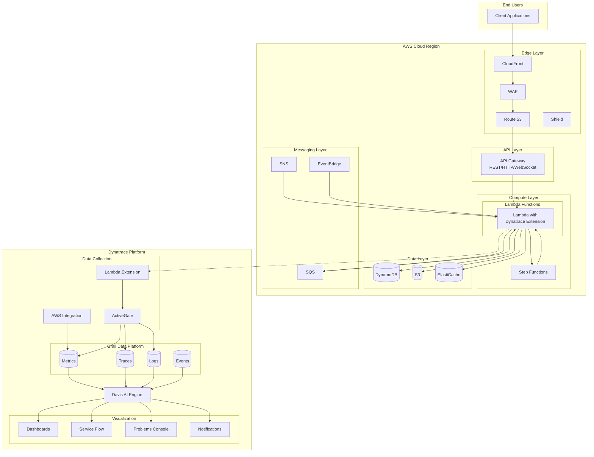

## 🔌 Data Collection Components

### 1. Dynatrace Lambda Extension

The Lambda Extension is deployed as a Lambda Layer that provides automatic instrumentation:

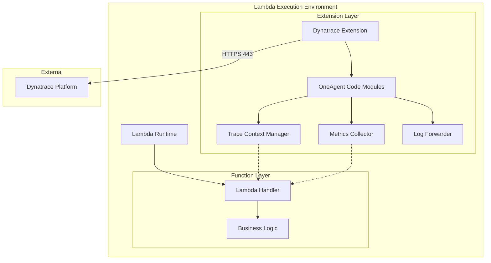

**Data Flow:**
1. Function receives invocation event
2. Extension captures trace context from headers
3. Function code executes with automatic instrumentation
4. Extension collects metrics (duration, memory, cold start)
5. Extension forwards data to Dynatrace (buffered, async)
6. Function returns response

**Supported Runtimes:**
- Node.js 14.x, 16.x, 18.x, 20.x
- Python 3.8, 3.9, 3.10, 3.11, 3.12
- Java 8, 11, 17, 21
- .NET Core 3.1, .NET 6, .NET 8
- Go 1.x (via manual instrumentation)

### 2. AWS Integration (CloudWatch Metrics)

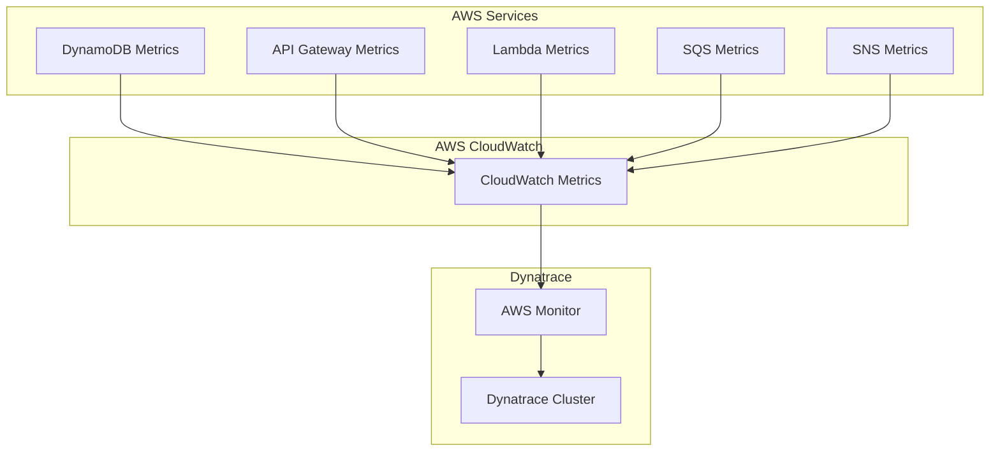

**Collected Metrics:**
- **Lambda**: Invocations, Duration, Errors, Throttles, ConcurrentExecutions
- **API Gateway**: Count, Latency, 4XXError, 5XXError, IntegrationLatency
- **DynamoDB**: ConsumedRCU, ConsumedWCU, ThrottledRequests, LatencyGetItem
- **SQS**: NumberOfMessagesSent, ApproximateAgeOfOldestMessage, ApproximateNumberOfMessagesVisible
- **SNS**: NumberOfMessagesPublished, PublishSize, NumberOfNotificationsDelivered

### 3. ActiveGate Architecture

ActiveGate serves as a secure proxy and processing node:

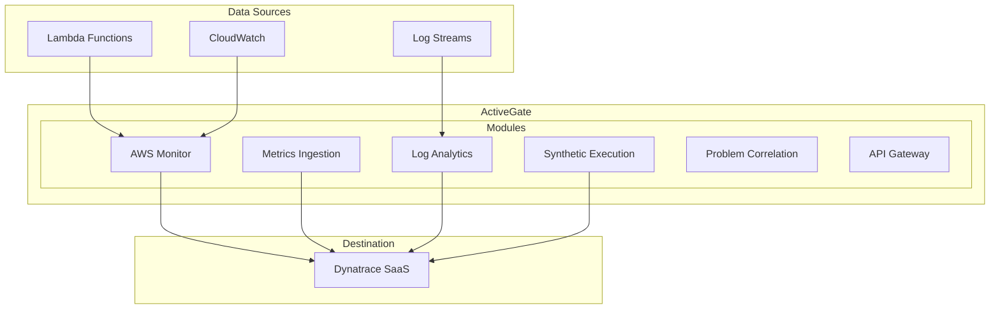

## 🔄 Data Flow Patterns

### Pattern 1: Synchronous API Request

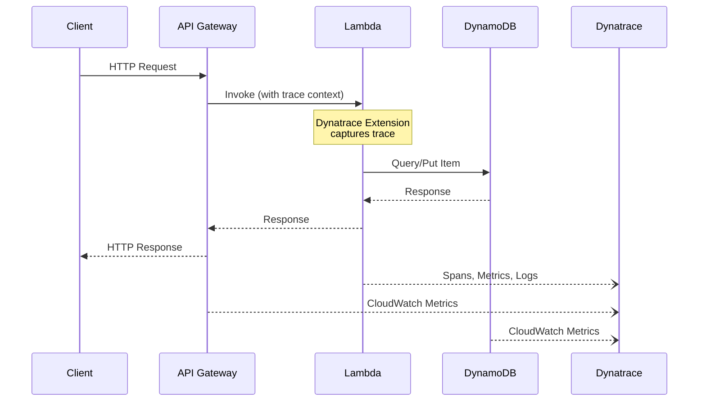

### Pattern 2: Asynchronous Event Processing

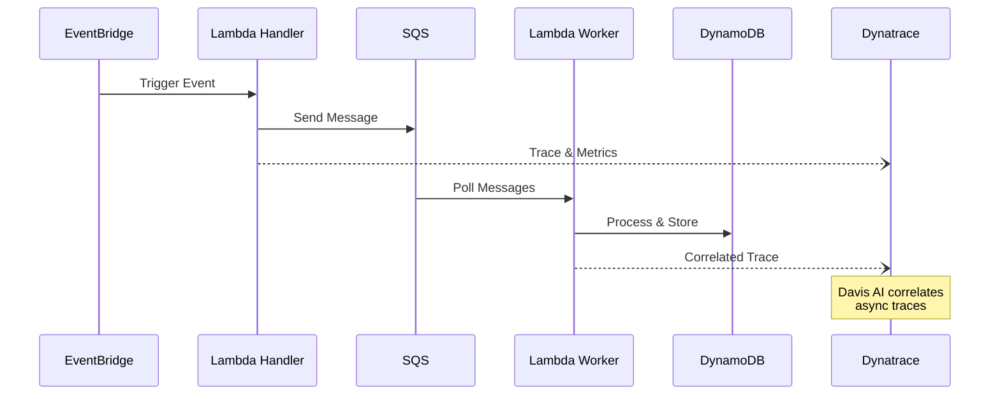

### Pattern 3: Step Functions Orchestration

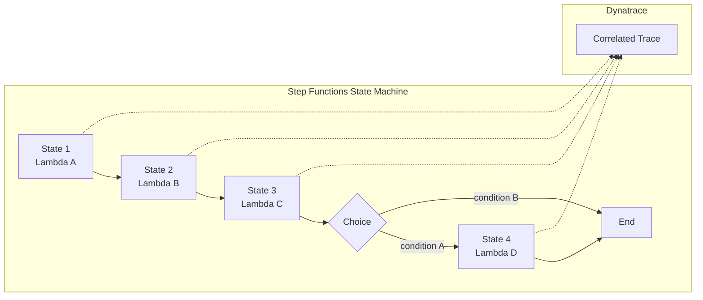

## 🔐 Security Architecture

### IAM Roles and Permissions

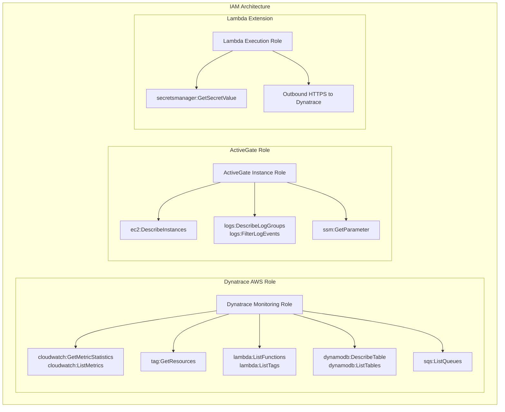

### Network Security

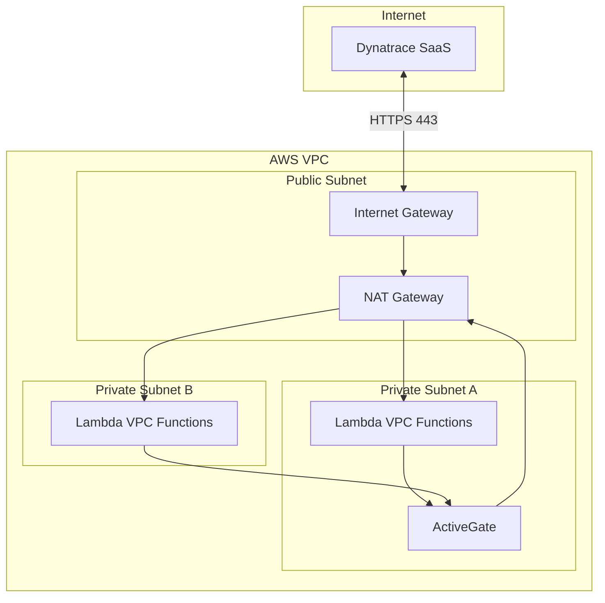

## 📊 Metrics Architecture

### Custom Metrics Pipeline

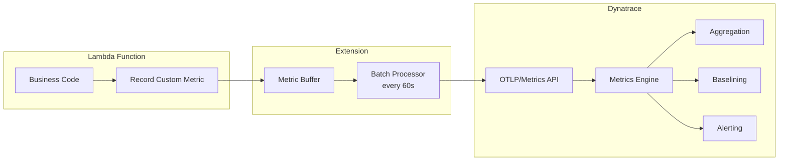

### Metric Dimensions

```yaml
# Standard dimensions applied to all serverless metrics
dimensions:
  # AWS Infrastructure
  - aws.account.id
  - aws.region
  - aws.availability_zone
  
  # Lambda Specific
  - aws.lambda.function_name
  - aws.lambda.function_version
  - aws.lambda.memory_size
  - aws.lambda.runtime
  
  # Custom Business Dimensions
  - environment           # dev, staging, production
  - service.name          # order-service, payment-service
  - service.version       # v1.2.3
  - team                  # platform, payments, orders
  
  # Request Context
  - http.method
  - http.status_code
  - http.route
```

## 🚨 Alerting Architecture

### Problem Detection Pipeline

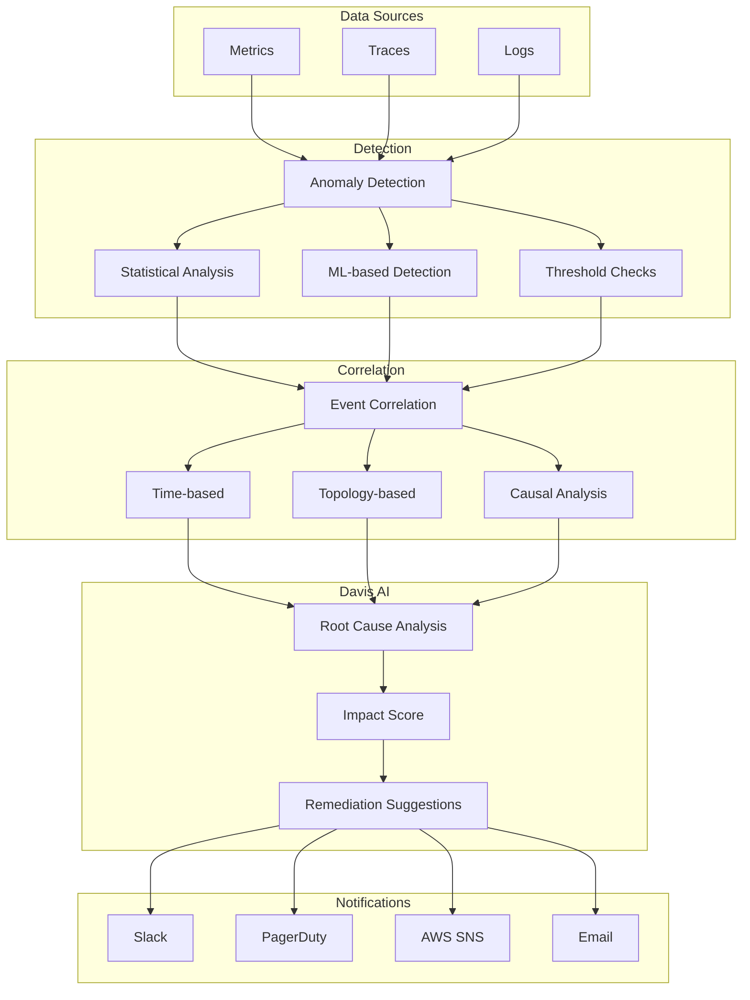

### Alert Severity Matrix

| Condition | Severity | Response Time | Notification |
|-----------|----------|---------------|--------------|
| Lambda Error Rate > 10% | Critical | Immediate | PagerDuty |
| Lambda P95 Latency > 5s | High | 5 min | Slack + Email |
| DynamoDB Throttling | High | 5 min | Slack |
| SQS DLQ Messages > 0 | Warning | 15 min | Email |
| Cold Start Rate > 50% | Info | 1 hour | Dashboard |

## 📈 Capacity Planning

### Resource Sizing

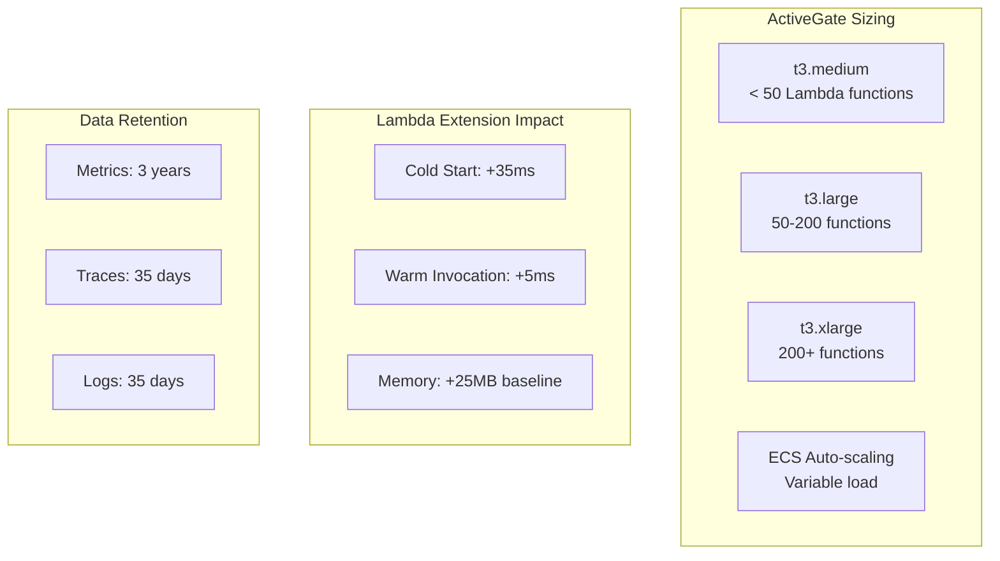

### DDU Estimation

| Component | DDU Usage |
|-----------|-----------|
| Lambda invocation | ~0.001 DDU |
| Trace | ~0.01 DDU |
| Log line | ~0.0001 DDU |

## 🔄 Deployment Architecture

### GitOps Workflow

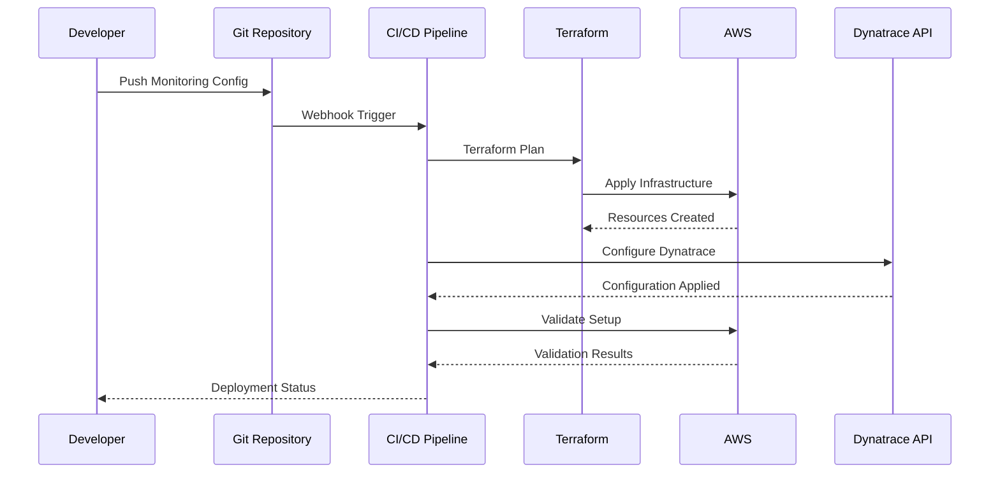

## 📝 Configuration as Code

### Monaco Project Structure

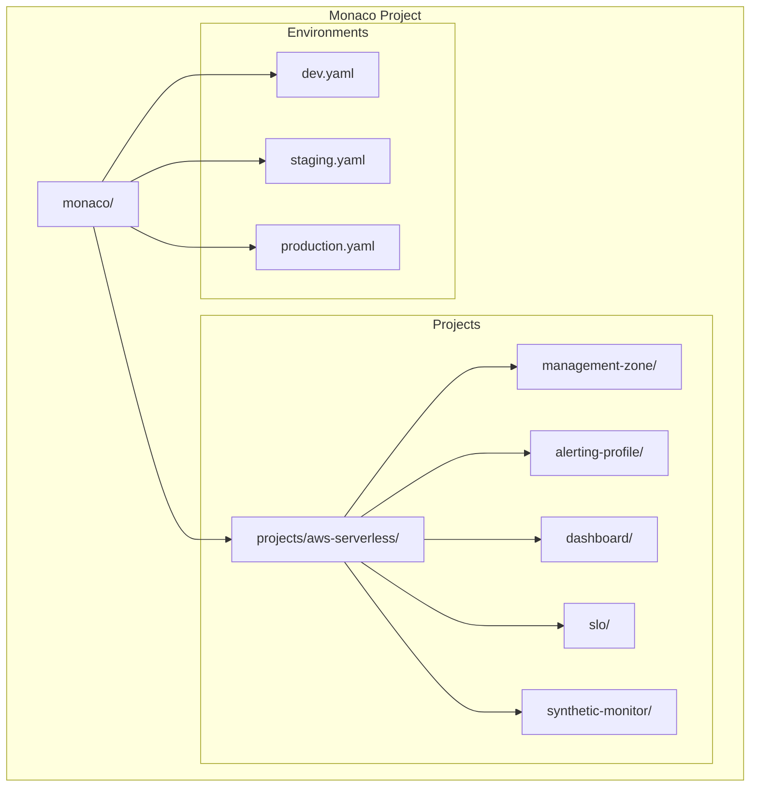

## 🎯 Success Criteria

| Metric | Target | Measurement |
|--------|--------|-------------|
| Mean Time to Detection | < 2 min | Dynatrace problem timeline |
| Mean Time to Resolution | < 30 min | Problem close time |
| False Positive Rate | < 5% | Alert accuracy review |
| Dashboard Load Time | < 3s | User experience |
| Data Completeness | > 99% | Missing data alerts |
| Extension Availability | > 99.9% | Layer deployment health |

## 🔗 Integration Points

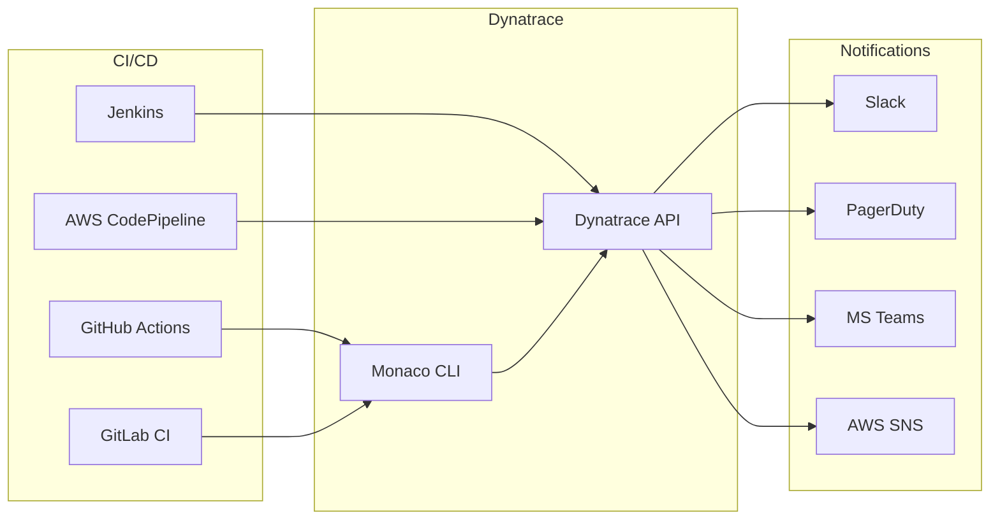

---

**Next Steps**: See the [Getting Started Guide](docs/getting-started.md) for implementation instructions.
