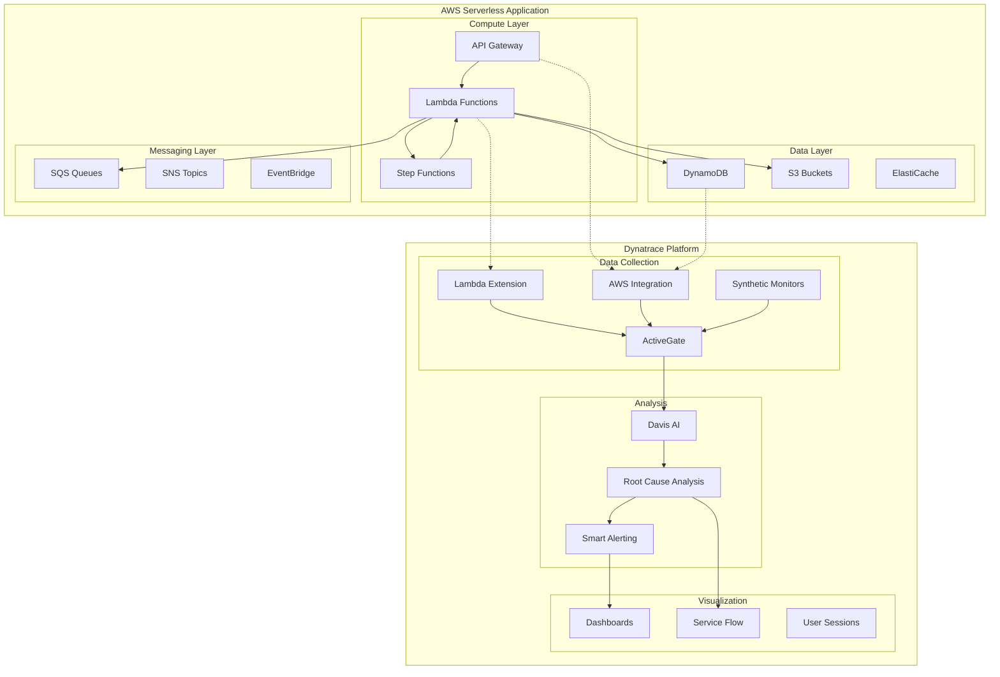

# 🔍 Dynatrace AWS Serverless Monitoring Solution

## 📋 Overview

This comprehensive solution provides end-to-end monitoring, observability, and intelligent alerting for AWS serverless applications using Dynatrace. It covers the complete serverless stack including Lambda, API Gateway, DynamoDB, S3, SQS, SNS, Step Functions, and EventBridge.

## 🎯 Key Features

- **Full-Stack Observability**: Complete visibility across all serverless components
- **AI-Powered Root Cause Analysis**: Davis AI automatically identifies problems
- **Real User Monitoring**: Track actual user experience and performance
- **Synthetic Monitoring**: Proactive endpoint and API testing
- **Custom Business Metrics**: Track KPIs specific to your application
- **Infrastructure as Code**: Deploy monitoring alongside your applications

## 📁 Solution Structure

```
dynatrace/
├── README.md                           # This overview document
├── ARCHITECTURE.md                     # Solution architecture details
├── docs/                               # Comprehensive documentation
│   ├── getting-started.md              # Quick start guide
│   ├── configuration-guide.md          # Detailed configuration
│   ├── best-practices.md               # Monitoring best practices
│   ├── troubleshooting.md              # Common issues & solutions
│   └── security.md                     # Security considerations
├── infrastructure/                     # IaC for Dynatrace deployment
│   ├── terraform/                      # Terraform modules & configs
│   │   ├── main.tf
│   │   ├── variables.tf
│   │   ├── outputs.tf
│   │   ├── providers.tf
│   │   ├── modules/                    # Reusable Terraform modules
│   │   └── environments/               # Environment-specific configs
│   └── cloudformation/                 # CloudFormation templates
│       ├── dynatrace-activegate.yaml
│       ├── lambda-extension.yaml
│       └── monitoring-resources.yaml
├── lambda-extension/                   # Dynatrace Lambda Layer
│   ├── README.md
│   ├── layer/
│   │   └── deploy-extension.sh
│   └── examples/                       # Language-specific examples
│       ├── python-lambda/
│       ├── nodejs-lambda/
│       └── go-lambda/
├── activegate/                         # ActiveGate deployment
│   ├── README.md
│   ├── docker/                         # Docker-based deployment
│   ├── kubernetes/                     # K8s deployment configs
│   └── ecs/                            # ECS task definitions
├── configuration/                      # Dynatrace configurations
│   ├── dynatrace-api/                  # Direct API configurations
│   │   ├── management-zones.json
│   │   ├── alerting-profiles.json
│   │   ├── problem-notifications.json
│   │   └── custom-metrics.json
│   └── monaco/                         # Monaco configuration
│       ├── README.md
│       └── projects/
│           └── aws-serverless/
├── dashboards/                         # Custom dashboard definitions
│   ├── README.md
│   ├── lambda-overview.json
│   ├── api-gateway-metrics.json
│   ├── dynamodb-performance.json
│   ├── step-functions-monitoring.json
│   └── sqs-monitoring.json
├── alerting/                           # Alerting configurations
│   ├── README.md
│   ├── problem-patterns/
│   │   ├── lambda-cold-starts.json
│   │   ├── api-gateway-errors.json
│   │   └── dynamodb-throttling.json
│   └── notification-integrations/
│       ├── slack.json
│       ├── pagerduty.json
│       └── sns.json
├── synthetics/                         # Synthetic monitoring
│   ├── README.md
│   ├── monitors/
│   │   ├── http-monitors.json
│   │   └── browser-monitors.json
│   └── scripts/
│       └── api-tests/
├── automation/                         # Automation & CI/CD
│   ├── scripts/
│   │   ├── deploy-monitoring.sh
│   │   ├── configure-dynatrace.py
│   │   └── validate-setup.sh
│   └── github-actions/
│       └── deploy-monitoring.yaml
└── examples/                           # Sample applications
    ├── sample-serverless-app/
    │   ├── README.md
    │   ├── serverless.yaml
    │   └── src/
    └── sam-application/
        ├── README.md
        └── template.yaml
```

## 🚀 Quick Start

### Prerequisites

```bash
# Required tools
- AWS CLI v2.x configured with appropriate credentials
- Dynatrace SaaS or Managed environment
- Dynatrace API Token with required permissions
- Terraform >= 1.0 (for IaC deployment)
- Python 3.9+ (for automation scripts)
```

### 1. Set Environment Variables

```bash
# Dynatrace Configuration
export DT_TENANT_URL="https://your-tenant.live.dynatrace.com"
export DT_API_TOKEN="dt0c01.XXXXXX.XXXXXXXXXXXXXXXX"
export DT_PAAS_TOKEN="dt0c01.XXXXXX.XXXXXXXXXXXXXXXX"

# AWS Configuration
export AWS_REGION="us-east-1"
export AWS_ACCOUNT_ID="123456789012"
export ENVIRONMENT="production"
```

### 2. Deploy ActiveGate (Optional but Recommended)

```bash
cd infrastructure/terraform
terraform init
terraform plan -var-file="environments/production/terraform.tfvars"
terraform apply -var-file="environments/production/terraform.tfvars"
```

### 3. Enable Lambda Extension

```bash
# Deploy the Dynatrace Lambda Layer
cd lambda-extension/layer
./deploy-extension.sh

# Or add to your serverless.yaml
layers:
  - arn:aws:lambda:${AWS_REGION}:725887861453:layer:Dynatrace_OneAgent:${LAYER_VERSION}
```

### 4. Configure Dashboards & Alerts

```bash
cd automation/scripts
python configure-dynatrace.py --config production
```

## 🏗️ Architecture Overview



## 📊 Monitored AWS Services

| Service | Metrics | Traces | Logs | Alerts |
|---------|---------|--------|------|--------|
| Lambda | ✅ | ✅ | ✅ | ✅ |
| API Gateway | ✅ | ✅ | ✅ | ✅ |
| DynamoDB | ✅ | ✅ | ✅ | ✅ |
| S3 | ✅ | ❌ | ✅ | ✅ |
| SQS | ✅ | ✅ | ✅ | ✅ |
| SNS | ✅ | ✅ | ✅ | ✅ |
| Step Functions | ✅ | ✅ | ✅ | ✅ |
| EventBridge | ✅ | ✅ | ✅ | ✅ |
| Kinesis | ✅ | ✅ | ✅ | ✅ |
| AppSync | ✅ | ✅ | ✅ | ✅ |

## 🔑 Key Monitoring Capabilities

### 1. Lambda Function Monitoring
- **Cold Start Analysis**: Track and optimize cold start frequency and duration
- **Memory Optimization**: Right-size functions based on actual usage
- **Error Tracking**: Automatic detection and correlation of errors
- **Distributed Tracing**: End-to-end visibility across service calls

### 2. API Gateway Monitoring
- **Latency Tracking**: P50, P95, P99 latency metrics
- **Error Rates**: 4xx and 5xx error tracking
- **Throttling Detection**: Identify capacity issues
- **Request/Response Analysis**: Deep dive into API behavior

### 3. Database Performance
- **DynamoDB Insights**: Consumed capacity, throttling, latency
- **Query Analysis**: Identify slow and expensive queries
- **Capacity Planning**: Predictive scaling recommendations

### 4. Business Metrics
- **Custom KPIs**: Define and track business-specific metrics
- **User Journey Mapping**: Understand user flows and drop-offs
- **Revenue Impact Analysis**: Correlate technical issues with business impact

## 📈 SLO/SLI Configuration

```yaml
# Example SLO Configuration
slos:
  - name: "Lambda Function Availability"
    target: 99.9%
    window: 30d
    sli:
      type: "availability"
      goodEvents: "successful invocations"
      totalEvents: "total invocations"
    
  - name: "API Gateway Latency"
    target: 95%
    window: 7d
    sli:
      type: "latency"
      threshold: 500ms
      percentile: 95
      
  - name: "Error Budget - Order Service"
    target: 99.5%
    window: 30d
    sli:
      type: "error_rate"
      maxErrorRate: 0.5%
```

## 🔧 Integration Points

### CI/CD Integration
- GitHub Actions workflows for monitoring deployment
- GitLab CI templates
- Jenkins pipeline examples
- AWS CodePipeline integration

### Notification Channels
- Slack integration for team alerts
- PagerDuty for on-call escalation
- AWS SNS for custom workflows
- Microsoft Teams webhooks
- Email notifications

### Automation
- Dynatrace Monaco for configuration as code
- Terraform provider for infrastructure
- Python SDK for custom integrations
- REST API for advanced automation

## 📚 Documentation

| Document | Description |
|----------|-------------|
| [Getting Started](docs/getting-started.md) | Initial setup and quick wins |
| [Configuration Guide](docs/configuration-guide.md) | Detailed configuration options |
| [Best Practices](docs/best-practices.md) | Monitoring patterns and anti-patterns |
| [Troubleshooting](docs/troubleshooting.md) | Common issues and solutions |
| [Security](docs/security.md) | Security considerations and compliance |
| [Architecture](ARCHITECTURE.md) | Detailed architecture documentation |

## 🎓 Learning Path

### Week 1: Foundation
- [ ] Set up Dynatrace environment
- [ ] Deploy AWS integration
- [ ] Enable Lambda extension for pilot functions
- [ ] Create first dashboard

### Week 2: Observability
- [ ] Configure distributed tracing
- [ ] Set up log ingestion
- [ ] Create service-level objectives
- [ ] Build alerting profiles

### Week 3: Advanced Features
- [ ] Implement synthetic monitoring
- [ ] Configure business analytics
- [ ] Set up problem notifications
- [ ] Create custom metrics

### Week 4: Optimization
- [ ] Tune alert sensitivity
- [ ] Optimize dashboard performance
- [ ] Document runbooks
- [ ] Train team members

## 🤝 Contributing

Contributions are welcome! Please see the main project's `CONTRIBUTING.md` for guidelines.

## 📝 License

This project is part of the DevSecOps-Bootcamp and follows the main project's licensing.

---

**Need help?** Check the [Troubleshooting Guide](docs/troubleshooting.md) or open an issue in the repository.

