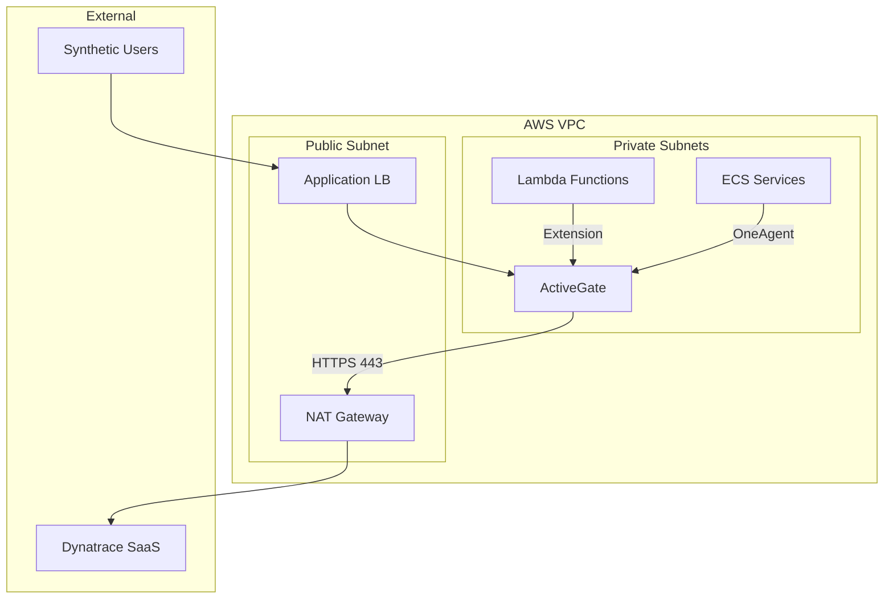

# 🖥️ Dynatrace ActiveGate Deployment

## 📋 Overview

ActiveGate is an optional but recommended component that provides:
- Secure communication proxy to Dynatrace
- AWS CloudWatch metric ingestion
- Log forwarding capabilities
- Synthetic execution for private locations

## 🏗️ Architecture



## 📁 Deployment Options

| Option | Use Case | Complexity |
|--------|----------|------------|
| Docker | Development, small scale | Low |
| Kubernetes | K8s-based infrastructure | Medium |
| ECS | AWS-native containerization | Medium |
| EC2 | Traditional VM deployment | Low |

## 🐳 Docker Deployment

### Quick Start

```bash
cd docker
docker-compose up -d
```

### Configuration

Set environment variables before running:

```bash
export DT_TENANT_URL="https://abc12345.live.dynatrace.com"
export DT_PAAS_TOKEN="dt0c01.XXX.YYY"
export DT_ACTIVEGATE_GROUP="aws-serverless"
```

## ☸️ Kubernetes Deployment

### Prerequisites

- Kubernetes cluster (EKS recommended)
- kubectl configured
- Helm 3.x (optional)

### Deploy

```bash
cd kubernetes

# Create namespace
kubectl create namespace dynatrace

# Create secret
kubectl create secret generic dynatrace-credentials \
  --namespace dynatrace \
  --from-literal=paas-token="${DT_PAAS_TOKEN}"

# Apply manifests
kubectl apply -f configmap.yaml
kubectl apply -f deployment.yaml
kubectl apply -f service.yaml
```

## 🚀 ECS Deployment

### Prerequisites

- ECS cluster
- VPC with private subnets
- IAM roles configured

### Deploy

```bash
cd ecs

# Register task definition
aws ecs register-task-definition --cli-input-json file://task-definition.json

# Create service
aws ecs create-service \
  --cluster your-cluster \
  --service-name dynatrace-activegate \
  --task-definition dynatrace-activegate \
  --desired-count 1
```

## 🔧 Modules Configuration

### AWS Monitor Module

Enable for CloudWatch metrics collection:

```ini
[aws_monitoring]
aws_monitoring_enabled = true
```

### Log Analytics Module

Enable for log forwarding:

```ini
[log_analytics]
log_analytics_enabled = true
```

## 📊 Health Checks

### Endpoint

```
GET /rest/health
```

### Expected Response

```json
{
  "state": "HEALTHY",
  "version": "1.285.0.20240221-135729"
}
```

## 🔐 Security

- Deploy in private subnet only
- Use security groups to restrict access
- Rotate PaaS tokens regularly
- Enable encryption at rest for EBS volumes

