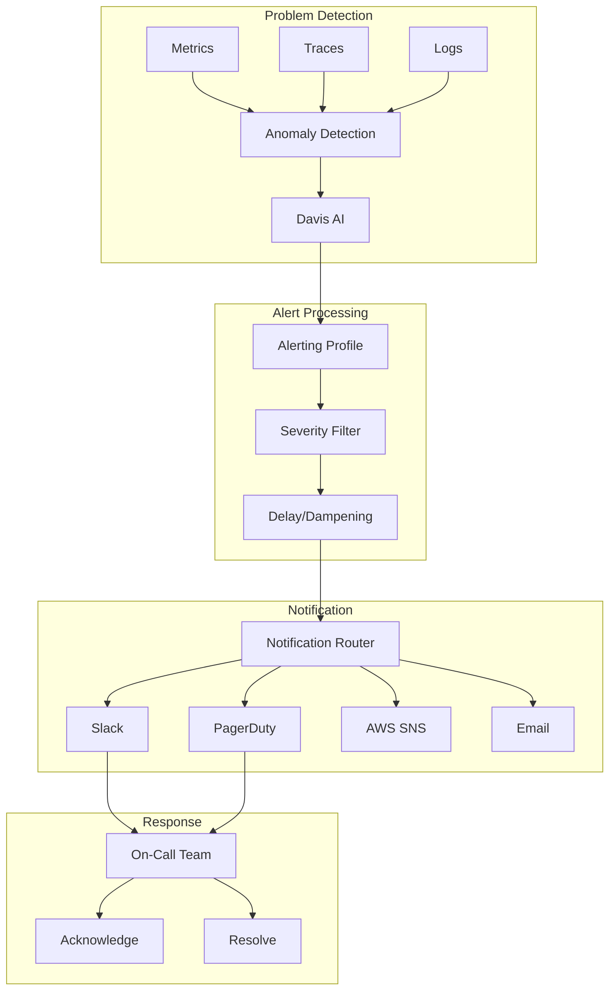
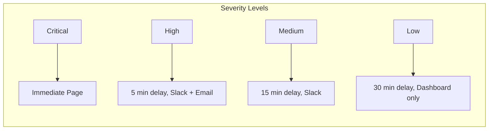

# 🚨 Dynatrace Alerting Configuration

## 📋 Overview

Comprehensive alerting configuration for AWS serverless applications with proper escalation and notification routing.

## 🏗️ Alerting Architecture

## 📁 Configuration Files

| File | Purpose |
|------|---------|
| `problem-patterns/*.json` | Custom alert definitions |
| `notification-integrations/*.json` | Notification channel configs |

## 🎯 Alert Severity Matrix

| Severity | Response Time | Notification | Example |
|----------|---------------|--------------|---------|
| Critical | Immediate | PagerDuty + Slack | Service down |
| High | 5 min | Slack + Email | High error rate |
| Medium | 15 min | Slack | Performance degradation |
| Low | 30 min | Dashboard | Capacity warning |

## 📊 Problem Patterns

### Lambda Cold Starts
- **Trigger**: Cold start rate > 50%
- **Severity**: Medium
- **Action**: Review provisioned concurrency

### API Gateway Errors
- **Trigger**: 5xx rate > 1%
- **Severity**: High
- **Action**: Check backend Lambda functions

### DynamoDB Throttling
- **Trigger**: Any throttled requests
- **Severity**: High
- **Action**: Review capacity settings

## 🔔 Notification Integration

### Slack Setup

1. Create Slack App with incoming webhook
2. Configure webhook URL in Dynatrace
3. Set channel routing by severity

### PagerDuty Setup

1. Create service in PagerDuty
2. Get integration key
3. Configure in Dynatrace notification settings

### AWS SNS Setup

1. Create SNS topic
2. Configure IAM permissions
3. Set topic ARN in Dynatrace

## 📝 Best Practices

1. **Start with high thresholds**, then tune down
2. **Use baseline alerts** for adaptive detection
3. **Add dampening** to reduce noise
4. **Include runbook links** in alert messages
5. **Review and tune** alerts monthly

