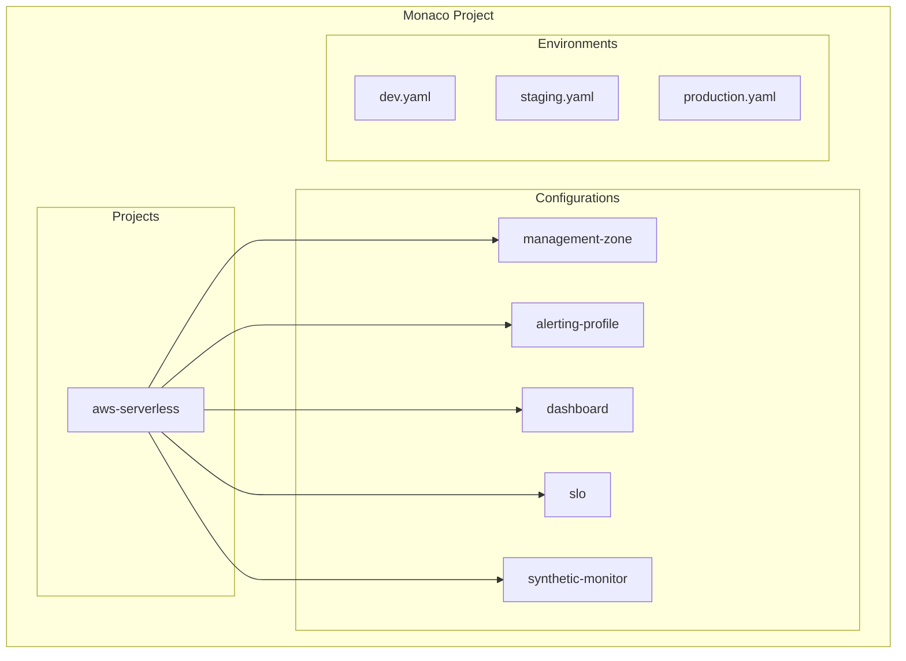

# 🔧 Dynatrace Monaco Configuration

## 📋 Overview

Monaco (Monitoring as Code) is Dynatrace's configuration-as-code tool that enables version-controlled, repeatable deployment of Dynatrace configurations.

## 🏗️ Project Structure



## 🚀 Quick Start

### Prerequisites

```bash
# Install Monaco CLI
# macOS
brew install dynatrace-monaco

# Linux
curl -L -o monaco https://github.com/dynatrace-oss/dynatrace-monitoring-as-code/releases/latest/download/monaco-linux-amd64
chmod +x monaco
sudo mv monaco /usr/local/bin/
```

### Setup

```bash
# Set environment variables
export DT_TENANT_URL="https://abc12345.live.dynatrace.com"
export DT_API_TOKEN="dt0c01.XXX.YYY"

# Validate configuration
monaco deploy --dry-run --project aws-serverless --environment production
```

### Deploy

```bash
# Deploy to production
monaco deploy --project aws-serverless --environment production

# Deploy specific configuration type
monaco deploy --project aws-serverless --environment production --specific dashboard
```

## 📁 Configuration Structure

```
monaco/
├── environments/
│   ├── dev.yaml
│   ├── staging.yaml
│   └── production.yaml
└── projects/
    └── aws-serverless/
        ├── project.yaml
        ├── management-zone/
        │   ├── config.yaml
        │   └── mz-serverless-production.json
        ├── alerting-profile/
        │   ├── config.yaml
        │   └── ap-serverless-critical.json
        ├── dashboard/
        │   ├── config.yaml
        │   ├── lambda-overview.json
        │   └── api-gateway.json
        ├── slo/
        │   ├── config.yaml
        │   └── lambda-availability.json
        └── synthetic-monitor/
            ├── config.yaml
            └── api-health-check.json
```

## ⚙️ Environment Configuration

### production.yaml

```yaml
environment:
  name: production
  url:
    type: environment
    value: DT_TENANT_URL
  token:
    type: environment
    value: DT_API_TOKEN
```

### dev.yaml

```yaml
environment:
  name: development
  url:
    type: environment
    value: DT_TENANT_URL_DEV
  token:
    type: environment
    value: DT_API_TOKEN_DEV
```

## 📝 Configuration Types

### Management Zone

```yaml
# config.yaml
configs:
  - id: mz-serverless-production
    type:
      api: builtin:management-zones
    config:
      name: AWS Serverless - Production
      template: mz-serverless-production.json
```

### Alerting Profile

```yaml
# config.yaml
configs:
  - id: ap-serverless-critical
    type:
      api: builtin:alerting.profile
    config:
      name: Serverless Critical
      template: ap-serverless-critical.json
```

### Dashboard

```yaml
# config.yaml
configs:
  - id: dashboard-lambda-overview
    type:
      api: dashboard
    config:
      name: Lambda Overview Dashboard
      template: lambda-overview.json
```

### SLO

```yaml
# config.yaml
configs:
  - id: slo-lambda-availability
    type:
      api: builtin:monitoring.slo
    config:
      name: Lambda Availability SLO
      template: lambda-availability.json
```

## 🔄 CI/CD Integration

### GitHub Actions

```yaml
name: Deploy Dynatrace Configuration

on:
  push:
    branches: [main]
    paths:
      - 'monitoring/dynatrace/configuration/monaco/**'

jobs:
  deploy:
    runs-on: ubuntu-latest
    steps:
      - uses: actions/checkout@v4
      
      - name: Install Monaco
        run: |
          curl -L -o monaco https://github.com/dynatrace-oss/dynatrace-monitoring-as-code/releases/latest/download/monaco-linux-amd64
          chmod +x monaco
          sudo mv monaco /usr/local/bin/
      
      - name: Deploy to Production
        env:
          DT_TENANT_URL: ${{ secrets.DT_TENANT_URL }}
          DT_API_TOKEN: ${{ secrets.DT_API_TOKEN }}
        run: |
          cd monitoring/dynatrace/configuration/monaco
          monaco deploy --project aws-serverless --environment production
```

## 📚 Best Practices

1. **Version Control**: Always commit configuration changes
2. **Environment Parity**: Use same configurations across environments
3. **Parameterization**: Use variables for environment-specific values
4. **Dry Run**: Always validate with `--dry-run` first
5. **Incremental Changes**: Deploy specific configs when possible

## 🔗 Resources

- [Monaco Documentation](https://www.dynatrace.com/support/help/manage/configuration-as-code/monaco)
- [Monaco GitHub](https://github.com/dynatrace-oss/dynatrace-monitoring-as-code)
- [Configuration API Reference](https://www.dynatrace.com/support/help/dynatrace-api/configuration-api)

