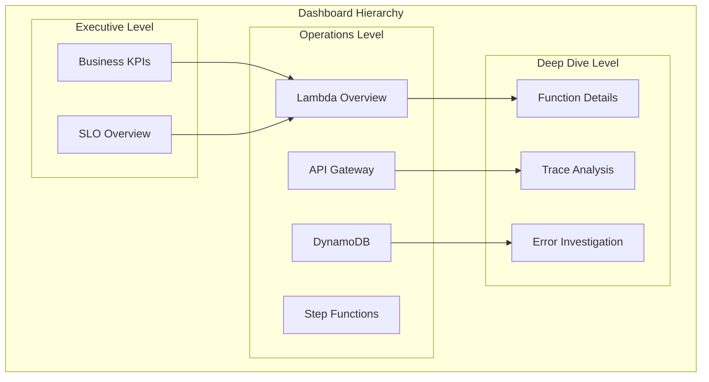

# 📊 Dynatrace Dashboards

## 📋 Overview

Pre-built dashboards for monitoring AWS serverless applications with Dynatrace.

## 🏗️ Dashboard Architecture



## 📁 Available Dashboards

| Dashboard | Purpose | Audience |
|-----------|---------|----------|
| `lambda-overview.json` | Lambda function performance | Operations |
| `api-gateway-metrics.json` | API Gateway health | Operations |
| `dynamodb-performance.json` | DynamoDB metrics | Database Team |
| `step-functions-monitoring.json` | Workflow monitoring | Development |
| `sqs-monitoring.json` | Queue health | Operations |

## 🚀 Importing Dashboards

### Using API

```bash
# Import dashboard
curl -X POST "${DT_TENANT_URL}/api/config/v1/dashboards" \
  -H "Authorization: Api-Token ${DT_API_TOKEN}" \
  -H "Content-Type: application/json" \
  -d @lambda-overview.json
```

### Using Dynatrace UI

1. Navigate to **Dashboards**
2. Click **Import dashboard**
3. Select JSON file
4. Click **Import**

## 🎨 Dashboard Components

### Key Tiles

- **Single Value**: Current status/count
- **Timeseries**: Trends over time
- **Top List**: Ranked items
- **Table**: Detailed data
- **Markdown**: Documentation

### Variables

Each dashboard supports these variables:

- `$environment`: Filter by environment
- `$function`: Filter by Lambda function
- `$region`: Filter by AWS region

## 📊 Metrics Reference

### Lambda Metrics

| Metric | Description |
|--------|-------------|
| `builtin:cloud.aws.lambda.invocations` | Total invocations |
| `builtin:cloud.aws.lambda.errors` | Error count |
| `builtin:cloud.aws.lambda.duration` | Execution duration |
| `builtin:cloud.aws.lambda.throttles` | Throttled invocations |
| `builtin:cloud.aws.lambda.coldStarts` | Cold start count |

### API Gateway Metrics

| Metric | Description |
|--------|-------------|
| `builtin:cloud.aws.apigateway.count` | Request count |
| `builtin:cloud.aws.apigateway.latency` | Response latency |
| `builtin:cloud.aws.apigateway.4xxError` | Client errors |
| `builtin:cloud.aws.apigateway.5xxError` | Server errors |

