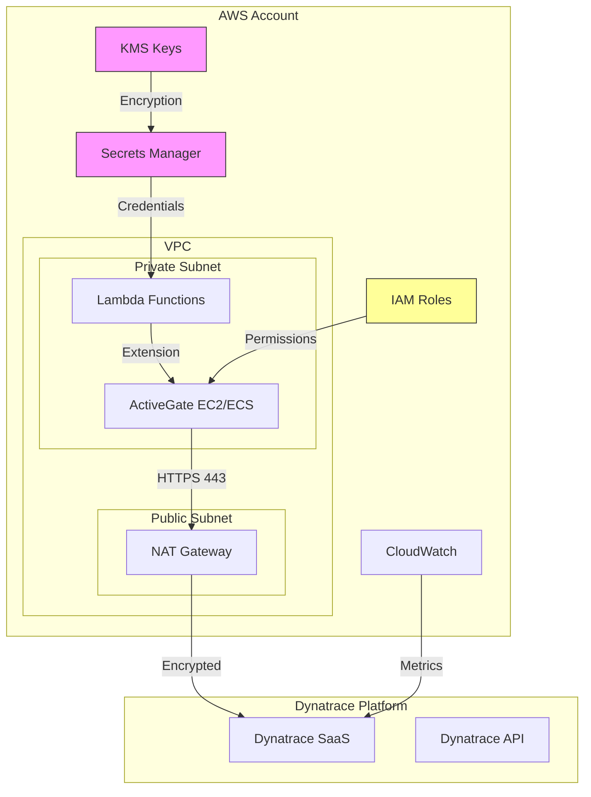
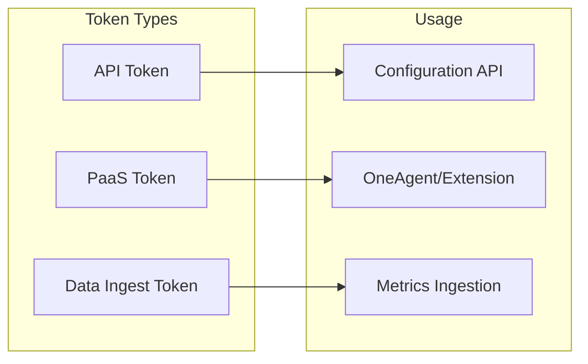
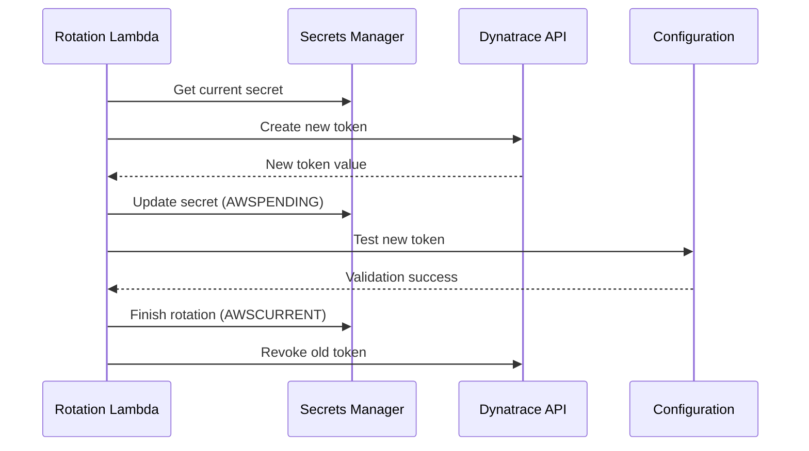
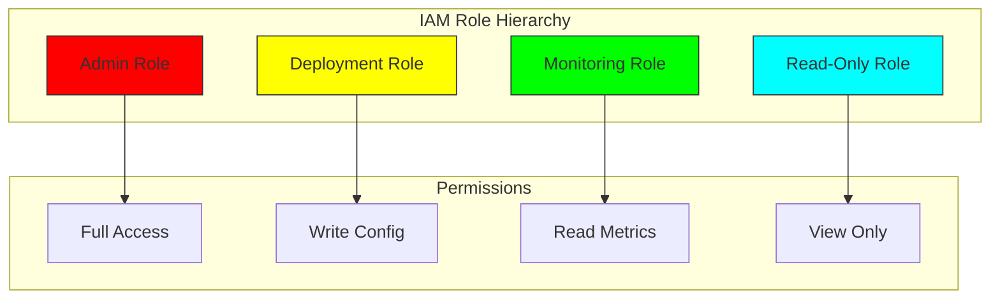
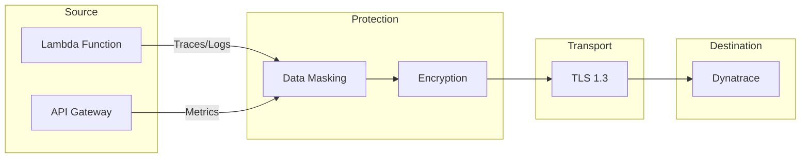
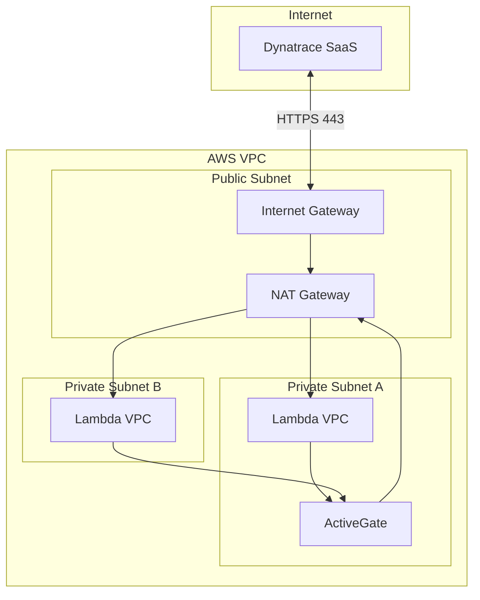
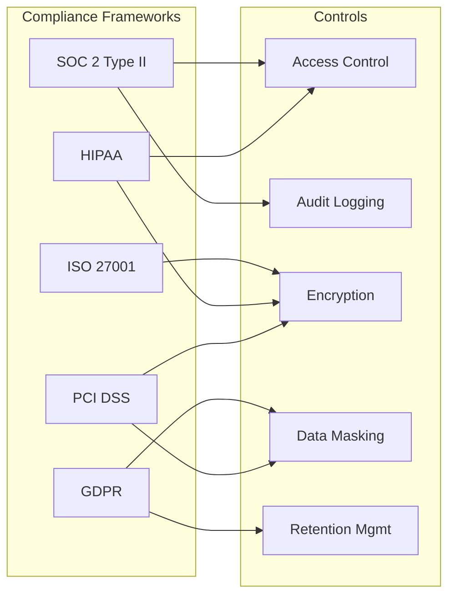
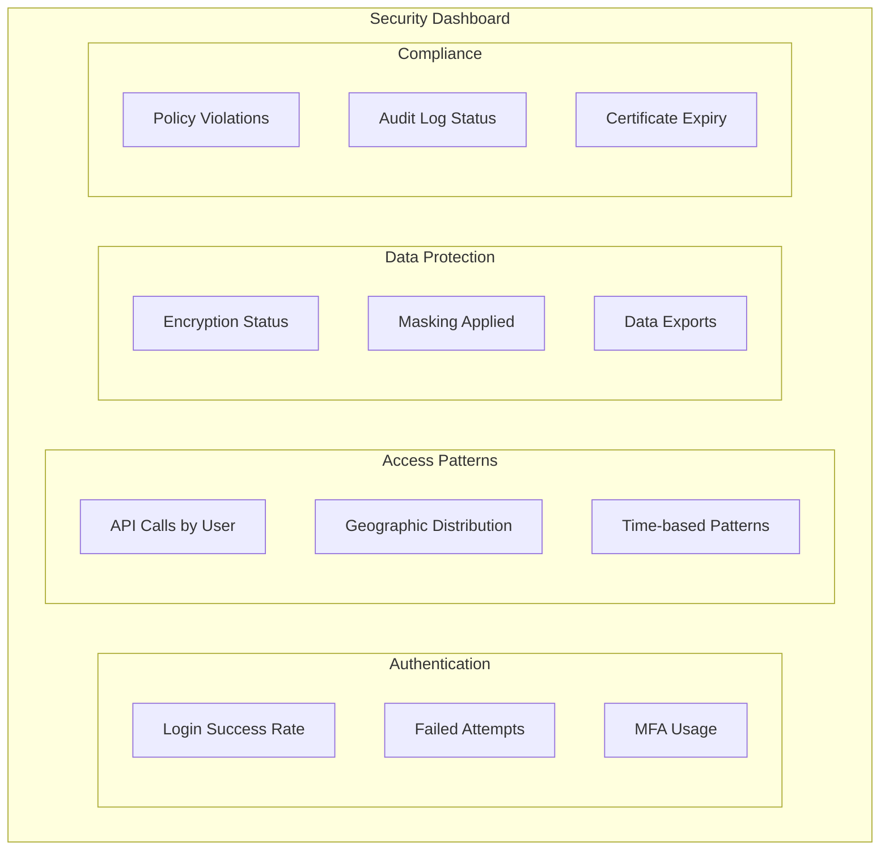

# 🔐 Security Guide

## 📋 Overview

This guide covers security considerations, best practices, and compliance requirements for the Dynatrace AWS Serverless monitoring solution.

## 🏛️ Security Architecture



## 🔑 Credential Management

### Token Types and Usage



### Secrets Manager Integration

```bash
# Create secret with encryption
aws secretsmanager create-secret \
  --name "dynatrace/production/credentials" \
  --description "Dynatrace monitoring credentials" \
  --kms-key-id alias/dynatrace-secrets \
  --secret-string '{
    "api_token": "dt0c01.XXXXXX.YYYYYYYY",
    "paas_token": "dt0c01.XXXXXX.ZZZZZZZZ",
    "tenant_url": "https://abc12345.live.dynatrace.com"
  }'
```

### Token Rotation Policy



**Rotation Lambda Implementation:**

```python
import boto3
import requests
import json

def lambda_handler(event, context):
    """Rotate Dynatrace API token."""
    secret_id = event['SecretId']
    step = event['Step']
    
    sm_client = boto3.client('secretsmanager')
    
    if step == 'createSecret':
        create_new_token(sm_client, secret_id, event['ClientRequestToken'])
    elif step == 'setSecret':
        # Token already set in Dynatrace during create
        pass
    elif step == 'testSecret':
        test_token(sm_client, secret_id, event['ClientRequestToken'])
    elif step == 'finishSecret':
        finish_rotation(sm_client, secret_id, event['ClientRequestToken'])

def create_new_token(sm_client, secret_id, token):
    """Create new Dynatrace token."""
    current = sm_client.get_secret_value(SecretId=secret_id)
    secret_dict = json.loads(current['SecretString'])
    
    # Create new token via Dynatrace API
    response = requests.post(
        f"{secret_dict['tenant_url']}/api/v2/apiTokens",
        headers={"Authorization": f"Api-Token {secret_dict['api_token']}"},
        json={
            "name": f"rotated-{token[:8]}",
            "scopes": ["metrics.ingest", "entities.read"]
        }
    )
    new_token = response.json()['token']
    
    # Store as pending
    secret_dict['api_token'] = new_token
    sm_client.put_secret_value(
        SecretId=secret_id,
        ClientRequestToken=token,
        SecretString=json.dumps(secret_dict),
        VersionStages=['AWSPENDING']
    )
```

## 🛡️ IAM Security

### Principle of Least Privilege



### Dynatrace AWS Role Policy

```json
{
  "Version": "2012-10-17",
  "Statement": [
    {
      "Sid": "DynatraceCloudWatchAccess",
      "Effect": "Allow",
      "Action": [
        "cloudwatch:GetMetricStatistics",
        "cloudwatch:ListMetrics",
        "cloudwatch:GetMetricData"
      ],
      "Resource": "*",
      "Condition": {
        "StringEquals": {
          "aws:RequestedRegion": [
            "us-east-1",
            "us-west-2",
            "eu-west-1"
          ]
        }
      }
    },
    {
      "Sid": "DynatraceResourceDiscovery",
      "Effect": "Allow",
      "Action": [
        "tag:GetResources",
        "lambda:ListFunctions",
        "lambda:ListTags",
        "dynamodb:ListTables",
        "dynamodb:DescribeTable",
        "sqs:ListQueues",
        "sqs:GetQueueAttributes",
        "sns:ListTopics"
      ],
      "Resource": "*"
    },
    {
      "Sid": "DenyDestructiveActions",
      "Effect": "Deny",
      "Action": [
        "lambda:DeleteFunction",
        "dynamodb:DeleteTable",
        "sqs:DeleteQueue",
        "sns:DeleteTopic"
      ],
      "Resource": "*"
    }
  ]
}
```

### Trust Policy with External ID

```json
{
  "Version": "2012-10-17",
  "Statement": [
    {
      "Effect": "Allow",
      "Principal": {
        "AWS": "arn:aws:iam::509560245411:root"
      },
      "Action": "sts:AssumeRole",
      "Condition": {
        "StringEquals": {
          "sts:ExternalId": "YOUR_UNIQUE_EXTERNAL_ID"
        }
      }
    }
  ]
}
```

## 🔒 Data Protection

### Data Flow Security



### Data Masking Configuration

```json
{
  "sensitiveDataMasking": {
    "enabled": true,
    "rules": [
      {
        "name": "Credit Card Numbers",
        "pattern": "\\b(?:\\d{4}[- ]?){3}\\d{4}\\b",
        "replacement": "****-****-****-****",
        "applyTo": ["logs", "request_attributes"]
      },
      {
        "name": "Social Security Numbers",
        "pattern": "\\b\\d{3}-\\d{2}-\\d{4}\\b",
        "replacement": "***-**-****",
        "applyTo": ["logs", "request_attributes"]
      },
      {
        "name": "Email Addresses",
        "pattern": "[a-zA-Z0-9._%+-]+@[a-zA-Z0-9.-]+\\.[a-zA-Z]{2,}",
        "replacement": "***@***.***",
        "applyTo": ["logs"]
      },
      {
        "name": "API Keys",
        "pattern": "(?i)(api[_-]?key|apikey)[\"']?\\s*[:=]\\s*[\"']?([\\w-]+)",
        "replacement": "$1=***REDACTED***",
        "applyTo": ["logs", "request_attributes"]
      }
    ]
  }
}
```

### Encryption Standards

| Data State | Encryption Method | Key Management |
|------------|-------------------|----------------|
| At Rest (AWS) | AES-256 | AWS KMS |
| In Transit | TLS 1.3 | Certificate Manager |
| At Rest (Dynatrace) | AES-256 | Dynatrace Managed Keys |
| Secrets | AES-256 | Customer Managed KMS |

## 🌐 Network Security

### Network Architecture



### Security Group Configuration

```hcl
# ActiveGate Security Group
resource "aws_security_group" "activegate" {
  name        = "dynatrace-activegate-sg"
  description = "Security group for Dynatrace ActiveGate"
  vpc_id      = var.vpc_id

  # Inbound from Lambda functions
  ingress {
    from_port       = 9999
    to_port         = 9999
    protocol        = "tcp"
    security_groups = [aws_security_group.lambda.id]
    description     = "ActiveGate communication port"
  }

  # Outbound to Dynatrace
  egress {
    from_port   = 443
    to_port     = 443
    protocol    = "tcp"
    cidr_blocks = ["0.0.0.0/0"]
    description = "HTTPS to Dynatrace SaaS"
  }

  tags = {
    Name = "dynatrace-activegate-sg"
  }
}

# Lambda Security Group
resource "aws_security_group" "lambda" {
  name        = "dynatrace-lambda-sg"
  description = "Security group for Lambda functions"
  vpc_id      = var.vpc_id

  # Outbound to ActiveGate
  egress {
    from_port       = 9999
    to_port         = 9999
    protocol        = "tcp"
    security_groups = [aws_security_group.activegate.id]
    description     = "To ActiveGate"
  }

  # Outbound HTTPS (for functions not using ActiveGate)
  egress {
    from_port   = 443
    to_port     = 443
    protocol    = "tcp"
    cidr_blocks = ["0.0.0.0/0"]
    description = "HTTPS outbound"
  }
}
```

### VPC Endpoints (Optional)

```hcl
# For enhanced security, use VPC endpoints
resource "aws_vpc_endpoint" "secrets_manager" {
  vpc_id              = var.vpc_id
  service_name        = "com.amazonaws.${var.region}.secretsmanager"
  vpc_endpoint_type   = "Interface"
  subnet_ids          = var.private_subnet_ids
  security_group_ids  = [aws_security_group.vpc_endpoints.id]
  private_dns_enabled = true
}

resource "aws_vpc_endpoint" "cloudwatch" {
  vpc_id              = var.vpc_id
  service_name        = "com.amazonaws.${var.region}.monitoring"
  vpc_endpoint_type   = "Interface"
  subnet_ids          = var.private_subnet_ids
  security_group_ids  = [aws_security_group.vpc_endpoints.id]
  private_dns_enabled = true
}
```

## 📋 Compliance

### Compliance Framework Mapping



### Audit Logging

```python
# Audit logging for Dynatrace configuration changes
import json
import boto3
from datetime import datetime

def log_config_change(change_type, resource, user, details):
    """Log configuration changes to CloudWatch."""
    logs_client = boto3.client('logs')
    
    log_entry = {
        "timestamp": datetime.utcnow().isoformat(),
        "change_type": change_type,
        "resource": resource,
        "user": user,
        "details": details,
        "source": "dynatrace-monitoring"
    }
    
    logs_client.put_log_events(
        logGroupName="/dynatrace/audit-logs",
        logStreamName=datetime.utcnow().strftime("%Y/%m/%d"),
        logEvents=[{
            "timestamp": int(datetime.utcnow().timestamp() * 1000),
            "message": json.dumps(log_entry)
        }]
    )
```

### Data Retention Policy

```yaml
data_retention:
  metrics:
    high_resolution: 7 days    # 1-minute granularity
    standard: 35 days          # 5-minute granularity
    aggregated: 3 years        # 1-hour granularity
    
  traces:
    detailed: 35 days
    service_flow: 35 days
    
  logs:
    raw: 35 days
    indexed: 90 days
    
  session_replay:
    recordings: 35 days
    
  problems:
    open: indefinite
    closed: 365 days
```

## 🔍 Security Monitoring

### Security Alerts

```json
{
  "securityAlerts": [
    {
      "name": "Failed Authentication Spike",
      "description": "Alert when authentication failures spike",
      "metricSelector": "builtin:security.authentication.failures",
      "threshold": 100,
      "timeframe": "5m",
      "severity": "HIGH"
    },
    {
      "name": "Unusual API Access Pattern",
      "description": "Detect anomalous API access",
      "type": "ANOMALY_DETECTION",
      "baseline": "ADAPTIVE",
      "sensitivity": "HIGH"
    },
    {
      "name": "Token Usage from New Location",
      "description": "API token used from unfamiliar IP",
      "type": "GEOLOCATION_CHANGE",
      "severity": "MEDIUM"
    }
  ]
}
```

### Security Dashboard



## ✅ Security Checklist

### Pre-Deployment

```markdown
## Security Checklist - Pre-Deployment

### Credential Management
- [ ] API tokens stored in Secrets Manager
- [ ] PaaS tokens have minimal required scopes
- [ ] Token rotation policy configured
- [ ] KMS key created for secret encryption

### IAM Configuration
- [ ] Dedicated IAM role for Dynatrace
- [ ] External ID configured for cross-account access
- [ ] Least privilege permissions applied
- [ ] Resource-based conditions where possible

### Network Security
- [ ] ActiveGate in private subnet
- [ ] Security groups configured correctly
- [ ] VPC endpoints for AWS services (optional)
- [ ] TLS 1.2+ enforced

### Data Protection
- [ ] Sensitive data masking rules configured
- [ ] PII handling documented
- [ ] Data retention policies set
- [ ] Encryption at rest enabled
```

### Ongoing Operations

```markdown
## Security Checklist - Ongoing

### Monthly Reviews
- [ ] Review IAM role permissions
- [ ] Audit API token usage
- [ ] Check for unused tokens
- [ ] Review security alerts

### Quarterly Reviews
- [ ] Penetration testing results
- [ ] Compliance audit preparation
- [ ] Security training updates
- [ ] Disaster recovery testing

### Annual Reviews
- [ ] Full security assessment
- [ ] Policy updates
- [ ] Third-party security audit
- [ ] Compliance certification renewal
```

## 📚 References

- [Dynatrace Security Whitepaper](https://www.dynatrace.com/support/help/reference/security/)
- [AWS Security Best Practices](https://docs.aws.amazon.com/wellarchitected/latest/security-pillar/)
- [OWASP Serverless Top 10](https://owasp.org/www-project-serverless-top-10/)
- [CIS AWS Foundations Benchmark](https://www.cisecurity.org/benchmark/amazon_web_services)

