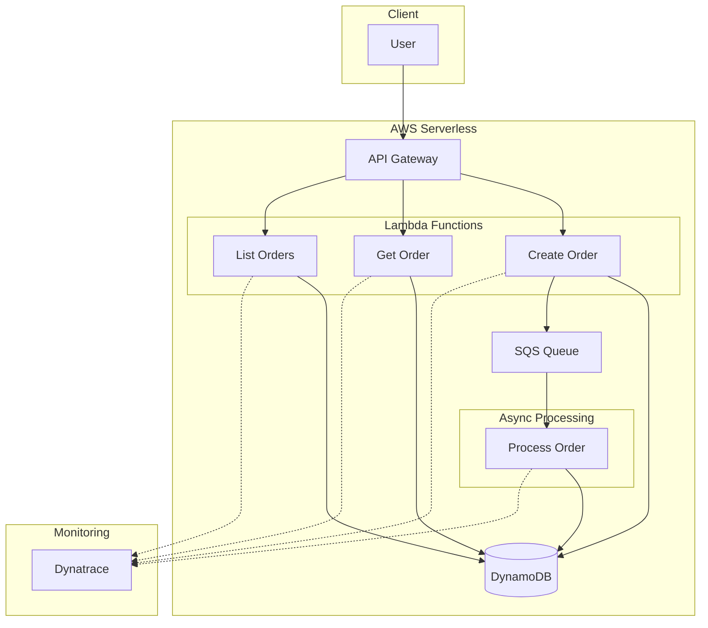

# 📦 Sample Serverless Application with Dynatrace

## 📋 Overview

This sample application demonstrates a complete AWS serverless setup with Dynatrace monitoring integration.

## 🏗️ Architecture



## 🚀 Deployment

### Prerequisites

```bash
# Install Serverless Framework
npm install -g serverless

# Configure AWS credentials
aws configure
```

### Deploy

```bash
# Set Dynatrace variables
export DT_TENANT=your-tenant-id
export DT_CONNECTION_BASE_URL=https://your-tenant.live.dynatrace.com
export DT_PAAS_TOKEN=dt0c01.XXX.YYY

# Deploy
serverless deploy --stage production
```

## 📁 Project Structure

```
sample-serverless-app/
├── README.md
├── serverless.yaml
├── package.json
└── src/
    ├── handlers/
    │   ├── createOrder.js
    │   ├── getOrder.js
    │   ├── listOrders.js
    │   └── processOrder.js
    └── lib/
        ├── dynamodb.js
        └── metrics.js
```

## 🔧 Configuration

The application includes:

1. **Dynatrace Lambda Layer** - Automatic instrumentation
2. **Custom Metrics** - Business KPIs
3. **Distributed Tracing** - End-to-end visibility
4. **Structured Logging** - Log correlation

## 📊 Metrics Collected

| Metric | Description |
|--------|-------------|
| `custom.orders.created` | Orders created count |
| `custom.orders.value` | Order value in USD |
| `custom.orders.processing_time` | Processing duration |

## 🔗 API Endpoints

| Method | Endpoint | Description |
|--------|----------|-------------|
| POST | /orders | Create new order |
| GET | /orders/{id} | Get order by ID |
| GET | /orders | List all orders |

## 🧪 Testing

```bash
# Create order
curl -X POST https://xxx.execute-api.us-east-1.amazonaws.com/production/orders \
  -H "Content-Type: application/json" \
  -d '{"customerId": "123", "items": [{"productId": "456", "quantity": 2}]}'

# Get order
curl https://xxx.execute-api.us-east-1.amazonaws.com/production/orders/order-id

# List orders
curl https://xxx.execute-api.us-east-1.amazonaws.com/production/orders
```

## 📈 Viewing in Dynatrace

1. Navigate to **Services** to see Lambda functions
2. Check **Distributed Traces** for request flows
3. View **Dashboards** for metrics visualization
4. Monitor **Problems** for automatic alerts

