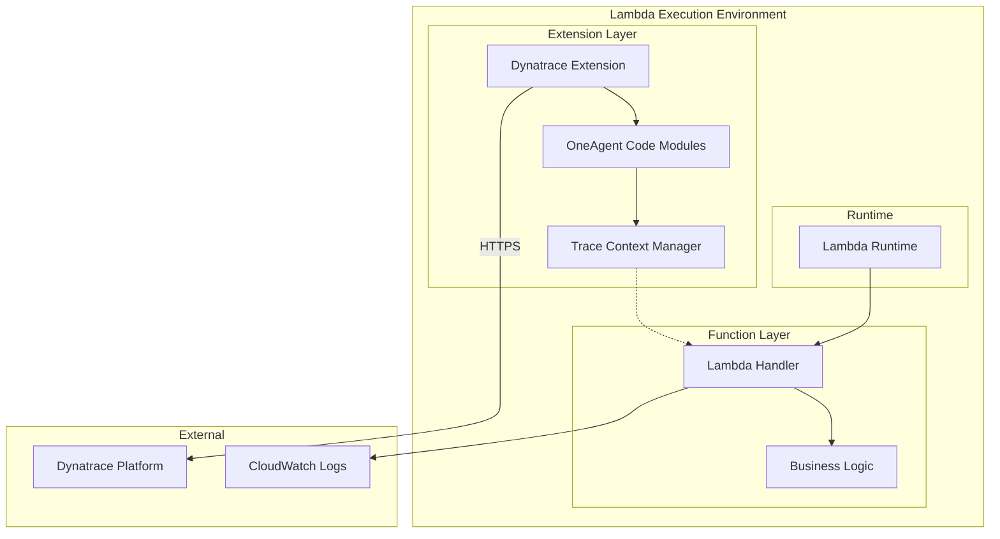

# 🔌 Dynatrace Lambda Extension

## 📋 Overview

The Dynatrace Lambda Extension provides automatic instrumentation for AWS Lambda functions, enabling distributed tracing, metrics collection, and log forwarding to Dynatrace.

## 🏗️ Architecture



## 📦 Layer ARNs by Region

| Region | Layer ARN |
|--------|-----------|
| us-east-1 | `arn:aws:lambda:us-east-1:725887861453:layer:Dynatrace_OneAgent:1` |
| us-east-2 | `arn:aws:lambda:us-east-2:725887861453:layer:Dynatrace_OneAgent:1` |
| us-west-1 | `arn:aws:lambda:us-west-1:725887861453:layer:Dynatrace_OneAgent:1` |
| us-west-2 | `arn:aws:lambda:us-west-2:725887861453:layer:Dynatrace_OneAgent:1` |
| eu-west-1 | `arn:aws:lambda:eu-west-1:725887861453:layer:Dynatrace_OneAgent:1` |
| eu-west-2 | `arn:aws:lambda:eu-west-2:725887861453:layer:Dynatrace_OneAgent:1` |
| eu-central-1 | `arn:aws:lambda:eu-central-1:725887861453:layer:Dynatrace_OneAgent:1` |
| ap-southeast-1 | `arn:aws:lambda:ap-southeast-1:725887861453:layer:Dynatrace_OneAgent:1` |
| ap-southeast-2 | `arn:aws:lambda:ap-southeast-2:725887861453:layer:Dynatrace_OneAgent:1` |
| ap-northeast-1 | `arn:aws:lambda:ap-northeast-1:725887861453:layer:Dynatrace_OneAgent:1` |

> **Note**: Check [Dynatrace documentation](https://www.dynatrace.com/support/help/setup-and-configuration/setup-on-container-platforms/aws/deploy-oneagent-as-lambda-extension) for the latest layer versions.

## 🔧 Configuration

### Required Environment Variables

```bash
# Dynatrace tenant identification
DT_TENANT="your-tenant-id"           # e.g., abc12345
DT_CLUSTER_ID="-1"                    # -1 for SaaS

# Connection settings
DT_CONNECTION_BASE_URL="https://your-tenant.live.dynatrace.com"
DT_CONNECTION_AUTH_TOKEN="dt0c01.XXX.YYY"  # PaaS token

# Enable extension wrapper
AWS_LAMBDA_EXEC_WRAPPER="/opt/dynatrace"
```

### Optional Environment Variables

```bash
# OpenTelemetry integration
DT_OPEN_TELEMETRY_ENABLE_INTEGRATION="true"

# Logging level
DT_LOGLEVELCON="warning"  # debug, info, warning, error

# Custom properties (for filtering/grouping)
DT_CUSTOM_PROP="team=platform service=orders environment=production"

# Custom tags
DT_TAGS="production critical tier1"

# Secrets Manager integration
DT_CONNECTION_AUTH_TOKEN="sm://dynatrace/production/credentials:paas_token"
```

## 📝 Deployment Examples

### AWS CLI

```bash
#!/bin/bash
# deploy-extension.sh

FUNCTION_NAME="my-function"
REGION="us-east-1"
DT_LAYER_VERSION="1"

# Add Dynatrace layer
aws lambda update-function-configuration \
  --function-name ${FUNCTION_NAME} \
  --layers "arn:aws:lambda:${REGION}:725887861453:layer:Dynatrace_OneAgent:${DT_LAYER_VERSION}" \
  --environment "Variables={
    DT_TENANT=${DT_TENANT},
    DT_CLUSTER_ID=-1,
    DT_CONNECTION_BASE_URL=${DT_CONNECTION_BASE_URL},
    DT_CONNECTION_AUTH_TOKEN=${DT_CONNECTION_AUTH_TOKEN},
    AWS_LAMBDA_EXEC_WRAPPER=/opt/dynatrace,
    DT_OPEN_TELEMETRY_ENABLE_INTEGRATION=true
  }"
```

### Terraform

```hcl
resource "aws_lambda_function" "monitored_function" {
  function_name = "my-monitored-function"
  runtime       = "python3.11"
  handler       = "handler.main"
  role          = aws_iam_role.lambda_role.arn
  filename      = "function.zip"
  
  # Add Dynatrace layer
  layers = [
    "arn:aws:lambda:${var.aws_region}:725887861453:layer:Dynatrace_OneAgent:1"
  ]
  
  environment {
    variables = {
      DT_TENANT                           = var.dynatrace_tenant_id
      DT_CLUSTER_ID                       = "-1"
      DT_CONNECTION_BASE_URL              = var.dynatrace_tenant_url
      DT_CONNECTION_AUTH_TOKEN            = var.dynatrace_paas_token
      AWS_LAMBDA_EXEC_WRAPPER             = "/opt/dynatrace"
      DT_OPEN_TELEMETRY_ENABLE_INTEGRATION = "true"
    }
  }
}
```

### Serverless Framework

```yaml
# serverless.yml
service: my-service

provider:
  name: aws
  runtime: python3.11
  region: us-east-1

custom:
  dynatrace:
    layerArn: arn:aws:lambda:${self:provider.region}:725887861453:layer:Dynatrace_OneAgent:1

functions:
  hello:
    handler: handler.hello
    layers:
      - ${self:custom.dynatrace.layerArn}
    environment:
      DT_TENANT: ${env:DT_TENANT}
      DT_CLUSTER_ID: "-1"
      DT_CONNECTION_BASE_URL: ${env:DT_CONNECTION_BASE_URL}
      DT_CONNECTION_AUTH_TOKEN: ${env:DT_CONNECTION_AUTH_TOKEN}
      AWS_LAMBDA_EXEC_WRAPPER: /opt/dynatrace
```

### AWS SAM

```yaml
# template.yaml
AWSTemplateFormatVersion: '2010-09-09'
Transform: AWS::Serverless-2016-10-31

Parameters:
  DynatraceTenantId:
    Type: String
  DynatraceTenantUrl:
    Type: String

Globals:
  Function:
    Runtime: python3.11
    Timeout: 30
    Layers:
      - !Sub arn:aws:lambda:${AWS::Region}:725887861453:layer:Dynatrace_OneAgent:1
    Environment:
      Variables:
        DT_TENANT: !Ref DynatraceTenantId
        DT_CLUSTER_ID: "-1"
        DT_CONNECTION_BASE_URL: !Ref DynatraceTenantUrl
        AWS_LAMBDA_EXEC_WRAPPER: /opt/dynatrace

Resources:
  MyFunction:
    Type: AWS::Serverless::Function
    Properties:
      Handler: app.handler
      CodeUri: src/
```

### AWS CDK (TypeScript)

```typescript
import * as cdk from 'aws-cdk-lib';
import * as lambda from 'aws-cdk-lib/aws-lambda';

export class LambdaStack extends cdk.Stack {
  constructor(scope: cdk.App, id: string, props?: cdk.StackProps) {
    super(scope, id, props);

    const dynatraceLayer = lambda.LayerVersion.fromLayerVersionArn(
      this,
      'DynatraceLayer',
      `arn:aws:lambda:${this.region}:725887861453:layer:Dynatrace_OneAgent:1`
    );

    const monitoredFunction = new lambda.Function(this, 'MonitoredFunction', {
      runtime: lambda.Runtime.PYTHON_3_11,
      handler: 'handler.main',
      code: lambda.Code.fromAsset('lambda'),
      layers: [dynatraceLayer],
      environment: {
        DT_TENANT: process.env.DT_TENANT!,
        DT_CLUSTER_ID: '-1',
        DT_CONNECTION_BASE_URL: process.env.DT_CONNECTION_BASE_URL!,
        DT_CONNECTION_AUTH_TOKEN: process.env.DT_CONNECTION_AUTH_TOKEN!,
        AWS_LAMBDA_EXEC_WRAPPER: '/opt/dynatrace',
      },
    });
  }
}
```

## 🎯 Supported Runtimes

| Runtime | Support Level | Notes |
|---------|--------------|-------|
| Python 3.8-3.12 | ✅ Full | Automatic instrumentation |
| Node.js 14-20 | ✅ Full | Automatic instrumentation |
| Java 8, 11, 17, 21 | ✅ Full | Automatic instrumentation |
| .NET 6, 8 | ✅ Full | Automatic instrumentation |
| Go 1.x | ⚠️ Manual | Requires SDK integration |
| Ruby | ⚠️ Manual | Requires SDK integration |
| Custom Runtime | ⚠️ Manual | Requires SDK integration |

## 📊 Metrics Collected

The extension automatically collects:

| Metric | Description |
|--------|-------------|
| Invocations | Number of function invocations |
| Duration | Execution time |
| Cold Starts | Cold start occurrences |
| Errors | Error count and types |
| Memory Used | Actual memory consumption |
| Init Duration | Initialization time |
| Billed Duration | AWS billed duration |

## 🔗 Trace Context Propagation

The extension automatically:

1. Extracts trace context from incoming requests
2. Propagates context to downstream calls
3. Links with API Gateway, SQS, SNS, etc.

### Manual Context Propagation

For custom HTTP calls:

```python
import requests

def handler(event, context):
    # Get trace headers from incoming request
    headers = event.get('headers', {})
    
    # Forward Dynatrace and W3C trace headers
    trace_headers = {
        'traceparent': headers.get('traceparent'),
        'tracestate': headers.get('tracestate'),
        'x-dynatrace': headers.get('x-dynatrace')
    }
    
    # Make downstream call with trace context
    response = requests.post(
        'https://downstream-service.example.com/api',
        headers={k: v for k, v in trace_headers.items() if v},
        json={'data': 'value'}
    )
    
    return {'statusCode': 200}
```

## 📈 Performance Impact

| Aspect | Impact |
|--------|--------|
| Cold Start Overhead | +30-50ms |
| Warm Invocation | +1-5ms |
| Memory Overhead | +25-35MB |
| Package Size | +15MB (layer) |

## 🔧 Troubleshooting

### Extension Not Loading

Check CloudWatch Logs:
```bash
aws logs filter-log-events \
  --log-group-name "/aws/lambda/your-function" \
  --filter-pattern "dynatrace"
```

### Common Issues

1. **Missing AWS_LAMBDA_EXEC_WRAPPER**
   - Ensure `AWS_LAMBDA_EXEC_WRAPPER=/opt/dynatrace` is set

2. **Invalid Token**
   - Verify PaaS token has correct permissions
   - Check token hasn't expired

3. **VPC Connectivity**
   - Ensure Lambda can reach Dynatrace endpoint
   - Check NAT Gateway or VPC endpoint

4. **Timeout Issues**
   - Increase function timeout (add ~500ms for cold start)
   - Increase memory allocation

## 📚 Resources

- [Dynatrace Lambda Documentation](https://www.dynatrace.com/support/help/setup-and-configuration/setup-on-container-platforms/aws/deploy-oneagent-as-lambda-extension)
- [AWS Lambda Extensions](https://docs.aws.amazon.com/lambda/latest/dg/runtimes-extensions-api.html)
- [OpenTelemetry Lambda](https://opentelemetry.io/docs/instrumentation/python/automatic/lambda/)

